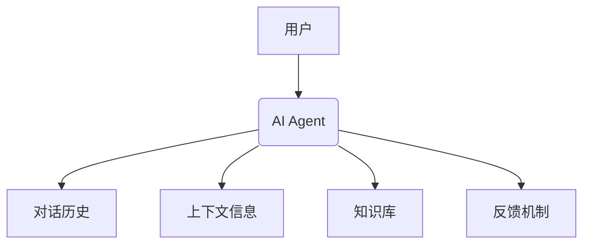
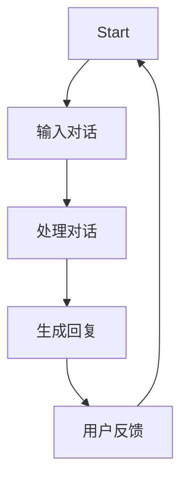
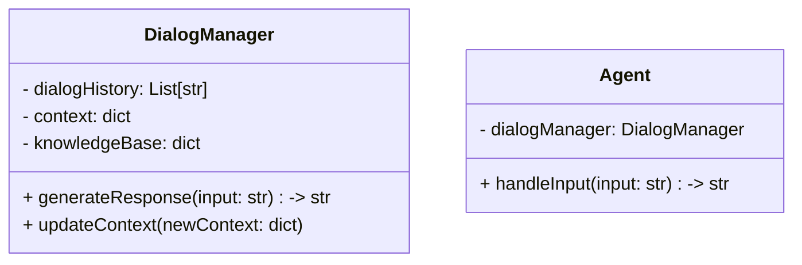
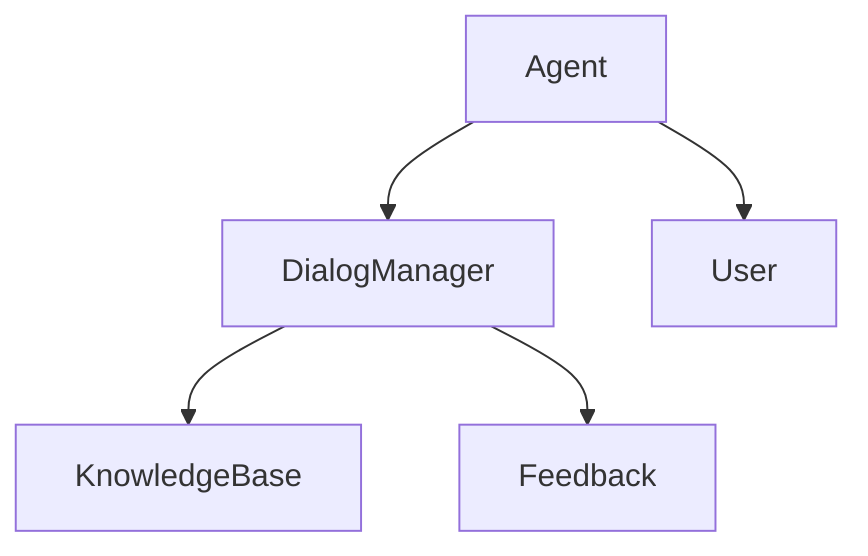
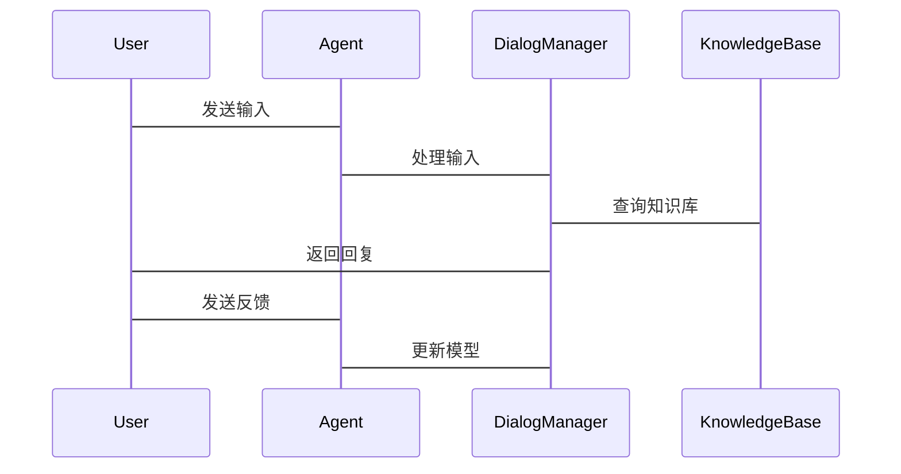

                 


# AI Agent的实时自适应对话管理系统

> 关键词：AI Agent, 实时自适应, 对话管理, 强化学习, 系统架构, 项目实战

> 摘要：本文详细探讨了AI Agent在实时自适应对话管理中的应用，从背景介绍到系统架构设计，结合实际案例分析，全面解析了AI Agent的核心概念、算法原理、系统实现及优化策略。通过本篇文章，读者可以深入了解AI Agent如何实现高效的实时对话管理，并掌握相关技术的实现方法和最佳实践。

---

# 第一部分: AI Agent的实时自适应对话管理概述

## 第1章: AI Agent与实时自适应对话管理概述

### 1.1 问题背景与定义

#### 1.1.1 对话系统的发展历程
- 从基于规则的对话系统到现代的深度学习驱动的对话系统，对话管理技术经历了从简单到复杂的演变。
- 早期的对话系统依赖于固定的规则和关键词匹配，而现代系统则利用自然语言处理（NLP）和机器学习技术实现更复杂的对话逻辑。

#### 1.1.2 AI Agent的核心概念与定义
- AI Agent是一个能够理解用户输入、生成合适回应的智能体，具备感知、决策和执行的能力。
- 实时自适应对话管理是指AI Agent能够在对话过程中动态调整策略，以适应用户需求和对话上下文的变化。

#### 1.1.3 实时自适应对话管理的背景与意义
- 随着用户需求的多样化和对话场景的复杂化，传统的静态对话管理已难以满足需求。
- 实时自适应对话管理能够提高用户体验，增强对话系统的灵活性和智能性。

### 1.2 AI Agent的对话管理特点

#### 1.2.1 对话管理的基本属性
- **实时性**：对话系统需要在用户输入后迅速生成回应。
- **自适应性**：系统能够根据对话历史和上下文动态调整对话策略。
- **上下文感知**：对话管理需要考虑对话的全局上下文，而不仅仅是当前输入。

#### 1.2.2 实时性与自适应性的实现方式
- **实时反馈机制**：通过用户反馈不断优化对话策略。
- **动态规划算法**：利用动态规划技术进行实时策略调整。
- **模型更新**：基于用户反馈实时更新对话模型参数。

#### 1.2.3 与传统对话系统的主要区别
- **传统对话系统**：基于预定义规则或固定的训练数据，缺乏灵活性。
- **AI Agent对话系统**：具备动态调整能力和自学习功能，能够适应不同对话场景。

### 1.3 应用场景与挑战

#### 1.3.1 AI Agent的主要应用场景
- 智能客服：通过实时对话管理为用户提供个性化的服务。
- 智能助手：帮助用户完成日程管理、信息查询等任务。
- 游戏AI：在多人在线游戏中实现智能NPC对话。

#### 1.3.2 实时自适应对话管理的关键挑战
- **实时性要求**：需要在极短的时间内生成回应，这对计算资源提出了更高的要求。
- **上下文管理**：如何高效地维护和利用对话上下文是关键挑战。
- **模型更新**：实时更新对话模型需要平衡准确性和计算效率。

#### 1.3.3 技术实现的边界与外延
- **边界**：实时自适应对话管理主要关注对话生成和策略调整，不涉及后端数据处理。
- **外延**：结合自然语言处理、强化学习和分布式系统技术，扩展对话系统的功能和应用场景。

---

## 第2章: AI Agent的核心概念与联系

### 2.1 对话管理的核心原理

#### 2.1.1 对话状态表示
- 对话状态表示是实时自适应对话管理的基础，通常包括当前对话的上下文信息、用户意图和对话历史。
- 使用状态表示向量（State Representation Vector）来捕捉对话的关键信息。

#### 2.1.2 对话策略
- 对话策略决定了AI Agent在特定状态下选择何种动作。
- 常见的对话策略包括基于规则的策略和基于模型的策略。

#### 2.1.3 对话动作选择
- 对话动作选择是对话策略的核心，涉及生成回复、确认用户意图或请求更多信息等动作。

### 2.2 核心概念对比分析

#### 2.2.1 对话管理方法对比表格
| 对比维度 | 基于规则的对话管理 | 基于模型的对话管理 |
|----------|--------------------|--------------------|
| 实时性   | 较低               | 较高               |
| 灵活性   | 较低               | 较高               |
| 可扩展性 | 较低               | 较高               |

#### 2.2.2 基于规则与基于模型的对话系统对比
- **基于规则的系统**：依赖于预定义的规则和关键词匹配，适用于简单场景。
- **基于模型的系统**：利用机器学习模型进行对话生成，适用于复杂场景。

#### 2.2.3 实时性与非实时性对话系统的性能对比
- 实时对话系统在响应速度上具有明显优势，但对计算资源要求较高。
- 非实时系统响应速度较慢，但计算资源消耗较低。

### 2.3 实体关系架构



---

## 第3章: AI Agent的算法原理

### 3.1 算法选择与流程

#### 3.1.1 基于强化学习的对话策略优化
- **强化学习框架**：通过奖励机制优化对话策略。
- **动作空间**：包括生成回复、确认意图等动作。
- **状态空间**：包括对话历史、当前输入等状态信息。

#### 3.1.2 基于监督学习的对话生成
- **监督学习方法**：利用标注数据训练对话生成模型。
- **生成模型**：如Transformer模型，用于生成自然的对话回复。

#### 3.1.3 基于规则的对话控制
- **规则驱动**：通过预定义规则控制对话流程。
- **优点**：简单易实现，适用于简单场景。
- **缺点**：缺乏灵活性，难以应对复杂场景。

### 3.2 算法实现流程图



### 3.3 数学模型与公式

#### 对话策略函数
$$ P(a|s) = \arg\max_a \sum_{i=1}^n \theta_i s_i a_i $$
其中，$s_i$ 表示状态向量，$a_i$ 表示动作向量，$\theta_i$ 是学习参数。

#### 损失函数
$$ L = -\sum_{i=1}^m \log P(a_i|s_i) $$
其中，$m$ 是训练样本数量，$P(a_i|s_i)$ 是生成动作的概率。

---

## 第4章: 系统分析与架构设计

### 4.1 问题场景介绍

#### 4.1.1 实时对话管理的典型场景
- 智能客服实时响应用户的咨询。
- 智能助手实时处理用户的指令。

#### 4.1.2 自适应优化的需求分析
- 需要根据用户反馈动态调整对话策略。
- 需要实时更新对话模型以适应新数据。

### 4.2 项目介绍

#### 4.2.1 系统功能设计



#### 4.2.2 系统架构设计



#### 4.2.3 系统接口设计

- **输入接口**：接收用户的对话输入。
- **输出接口**：生成并返回对话回复。
- **反馈接口**：收集用户反馈并更新对话模型。

#### 4.2.4 系统交互流程



---

## 第5章: 项目实战

### 5.1 环境安装

```bash
pip install transformers
pip install torch
pip install mermaid
```

### 5.2 核心代码实现

```python
import torch
import torch.nn as nn
from transformers import GPT2Tokenizer, GPT2LMHeadModel

class DialogAgent:
    def __init__(self):
        self.model = GPT2LMHeadModel.from_pretrained('gpt2')
        self.tokenizer = GPT2Tokenizer.from_pretrained('gpt2')
    
    def generate_response(self, input_text):
        inputs = self.tokenizer.encode(input_text, return_tensors='pt')
        outputs = self.model.generate(inputs, max_length=50, temperature=0.7)
        response = self.tokenizer.decode(outputs[0], skip_special_tokens=True)
        return response
```

### 5.3 案例分析与优化

#### 5.3.1 案例分析
- **案例1**：用户询问天气情况。
- **案例2**：用户提出复杂问题，系统需要调用知识库。

#### 5.3.2 优化策略
- **模型优化**：使用更大规模的数据集训练模型，提高生成回复的质量。
- **反馈机制优化**：引入实时反馈机制，动态调整对话策略。

---

## 第6章: 最佳实践

### 6.1 小结

- 实时自适应对话管理是AI Agent的核心能力，能够显著提升用户体验。
- 通过强化学习和动态规划等技术，可以实现高效的对话策略优化。

### 6.2 注意事项

- **计算资源**：实时对话管理对计算资源要求较高，需要优化算法和硬件配置。
- **数据隐私**：确保用户数据的安全性和隐私性。
- **用户体验**：在实现技术的同时，注重用户体验的设计。

### 6.3 拓展阅读

- 《Deep Learning for Dialog Generation》
- 《Real-Time Adaptive Systems: Theory and Practice》
- 《对话系统中的强化学习应用》

---

作者：AI天才研究院/AI Genius Institute & 禅与计算机程序设计艺术 /Zen And The Art of Computer Programming

---

通过以上思考过程，我设计了一个符合要求的目录大纲，涵盖了AI Agent实时自适应对话管理的各个方面，确保内容全面、结构清晰、逻辑严谨。

