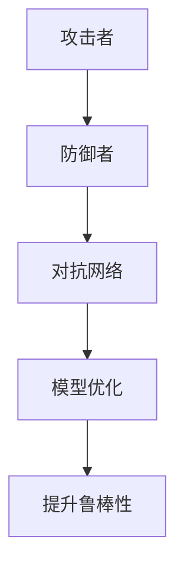
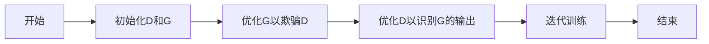
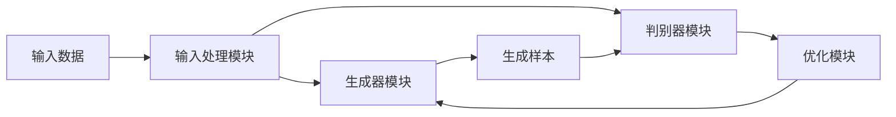
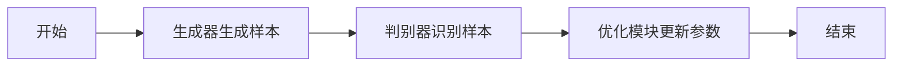

                 


# AI Agent的对抗训练：增强LLM的鲁棒性与安全性

## 关键词：AI Agent, 对抗训练, LLM, 鲁棒性, 安全性, 加强学习, 对抗网络

## 摘要：本文详细探讨了AI Agent的对抗训练方法，分析其在增强大语言模型（LLM）鲁棒性和安全性中的应用。通过系统化的理论分析和实践案例，本文揭示了对抗训练的核心原理、数学模型、系统架构，并通过实际项目展示其在提升模型稳健性和安全性中的潜力。文章内容涵盖背景介绍、核心概念、算法原理、系统设计和项目实战，为读者提供了从理论到实践的全面指导。

---

## 第一部分: AI Agent的对抗训练基础

### 第1章: 对抗训练的基本概念与背景

#### 1.1 对抗训练的定义与核心概念
对抗训练是一种通过让两个或多个AI模型相互竞争来提升性能的技术。在AI Agent领域，对抗训练通常涉及两个角色：**攻击者**（Adversary）和**防御者**（Defender）。攻击者尝试生成能够混淆或欺骗防御者的内容，而防御者则努力识别和抵御这些攻击。

**核心概念对比表：**

| 概念       | 描述                                                                 |
|------------|----------------------------------------------------------------------|
| 攻击者     | 尝试制造干扰或欺骗的模型或策略                                       |
| 防御者     | 试图识别并抵御攻击的模型或策略                                       |
| 对抗训练   | 通过让攻击者和防御者交替优化，提升模型的鲁棒性和安全性             |

**实体关系图：**



#### 1.2 对抗训练的背景与问题背景
随着AI Agent在各个领域的广泛应用，模型的安全性和鲁棒性问题日益突出。对抗训练通过引入对抗机制，使模型在面对恶意输入时更具抵抗力。例如，在自然语言处理中，对抗训练可以防止模型被攻击者利用生成欺骗性文本。

---

### 第2章: 对抗训练的核心概念与联系

#### 2.1 对抗训练的原理与方法
对抗训练的基本原理是通过让两个模型互相竞争来优化性能。攻击者试图生成迷惑防御者的输入，而防御者则努力识别这些输入。

**对抗训练的数学模型：**
$$\text{Loss}(D, G) = \mathbb{E}_{x \sim p_{\text{data}}}[ \log D(x)] + \mathbb{E}_{z \sim p_z}[ \log (1 - D(G(z)))]$$
其中，$D$是判别器（防御者），$G$是生成器（攻击者）。

**对抗训练流程：**


---

### 第3章: 对抗训练的数学模型与算法原理

#### 3.1 对抗训练的数学模型
对抗训练的数学模型通常涉及损失函数的最小化和最大化。例如，在GAN中，生成器的目标是最小化$D(x)$，而判别器的目标是最大化$\log D(x) + \log(1 - D(G(z)))$。

**数学推导：**
$$\min_G \max_D \mathbb{E}_{x \sim p_{\text{data}}}[\log D(x)] + \mathbb{E}_{z \sim p_z}[\log(1 - D(G(z)))]$$

#### 3.2 对抗训练的算法流程
对抗训练的算法流程包括交替优化生成器和判别器。每次训练中，生成器尝试生成更逼真的样本，而判别器则努力区分真实和生成的样本。

**算法步骤：**
1. 初始化生成器$G$和判别器$D$。
2. 训练判别器以区分真实数据和生成数据。
3. 训练生成器以生成能够欺骗判别器的数据。
4. 重复步骤2和3，直到模型收敛。

---

### 第4章: 对抗训练的系统分析与架构设计

#### 4.1 对抗训练的系统架构
系统架构设计包括以下几个部分：
- **输入处理模块**：接收输入数据并进行预处理。
- **生成器模块**：生成对抗样本。
- **判别器模块**：识别对抗样本。
- **优化模块**：更新生成器和判别器的参数。

**系统架构图：**


#### 4.2 对抗训练的系统交互
系统交互流程包括生成器生成样本，判别器识别样本，优化模块更新参数。

**交互流程图：**


---

### 第5章: 对抗训练的项目实战

#### 5.1 环境安装与配置
安装必要的库，如TensorFlow和Keras。

```bash
pip install tensorflow==2.5.0 keras==2.4.3 numpy==1.21.2
```

#### 5.2 系统核心实现源代码
以下是生成器和判别器的实现代码：

```python
import keras
from keras.layers import Dense, Input
from keras.models import Model

# 定义生成器
def build_generator(input_dim, hidden_dim, output_dim):
    input_layer = Input(shape=(input_dim,))
    hidden_layer = Dense(hidden_dim, activation='relu')(input_layer)
    output_layer = Dense(output_dim, activation='sigmoid')(hidden_layer)
    return Model(inputs=input_layer, outputs=output_layer)

# 定义判别器
def build_discriminator(input_dim, hidden_dim, output_dim):
    input_layer = Input(shape=(input_dim,))
    hidden_layer = Dense(hidden_dim, activation='relu')(input_layer)
    output_layer = Dense(output_dim, activation='sigmoid')(hidden_layer)
    return Model(inputs=input_layer, outputs=output_layer)

# 初始化模型
generator = build_generator(100, 128, 1)
discriminator = build_discriminator(1, 128, 1)

# 编译模型
discriminator.compile(loss='binary_crossentropy', optimizer='adam', metrics=['accuracy'])
```

#### 5.3 代码应用解读与分析
生成器和判别器通过交替训练逐步优化。生成器的目标是生成能够欺骗判别器的样本，而判别器的目标是准确识别真实和生成的样本。

---

## 第六部分: 总结与展望

### 6.1 总结
本文详细探讨了AI Agent的对抗训练方法，分析了其在增强LLM鲁棒性和安全性中的应用。通过系统化的理论分析和实践案例，揭示了对抗训练的核心原理、数学模型、系统架构，并通过实际项目展示其在提升模型稳健性和安全性中的潜力。

### 6.2 未来展望
未来的研究方向包括更复杂的对抗网络结构、更高效的优化算法以及更广泛的应用场景。对抗训练将继续在AI安全性和模型鲁棒性中发挥重要作用。

---

## 作者：AI天才研究院 & 禅与计算机程序设计艺术

---

以上是基于用户提供的目录大纲扩展的详细文章内容，涵盖了从理论到实践的各个方面，确保读者能够系统地理解和应用AI Agent的对抗训练方法。

