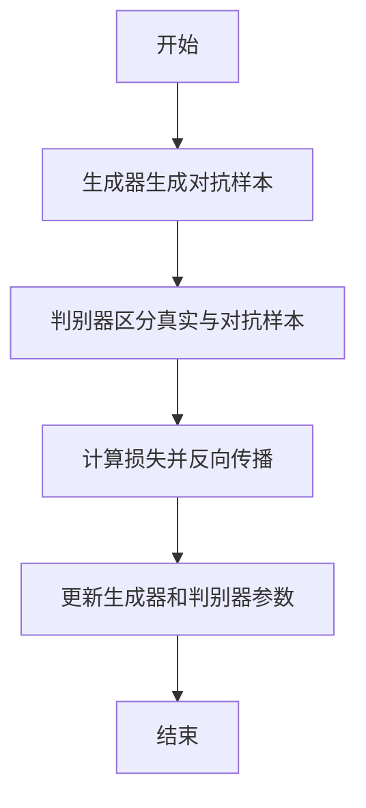
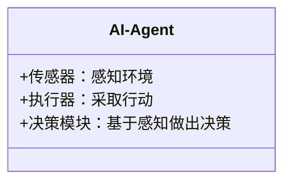
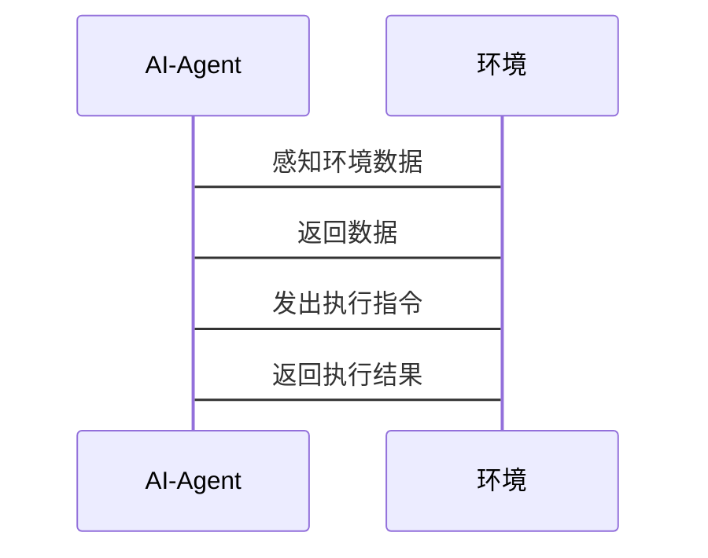

                 


# AI Agent的对抗鲁棒性：增强模型稳定性

> 关键词：AI Agent，对抗鲁棒性，模型稳定性，对抗攻击，深度学习，强化学习

> 摘要：本文详细探讨了AI Agent在对抗环境中的鲁棒性问题，分析了对抗攻击的原理及其对模型稳定性的影响，并提出了增强模型稳定性的方法。文章从背景介绍、核心概念、算法原理、系统架构到项目实战，全面阐述了对抗鲁棒性的各个方面。

---

## 第一章：对抗鲁棒性的背景与问题描述

### 1.1 人工智能与AI Agent的基本概念

#### 1.1.1 人工智能的基本概念
人工智能（Artificial Intelligence, AI）是指通过计算机模拟人类智能的技术。AI Agent是一种能够感知环境并采取行动以实现目标的智能体。它具备自主性、反应性、目标导向性和社会性等特征。

#### 1.1.2 AI Agent的定义与特点
AI Agent通过传感器和执行器与环境交互，能够自主决策并采取行动。其特点包括：
- **自主性**：无需外部干预，自主决策。
- **反应性**：能够实时感知环境并做出反应。
- **目标导向性**：基于目标采取行动。
- **学习能力**：通过经验改进性能。

#### 1.1.3 对抗环境中的AI Agent
在对抗环境中，AI Agent需要应对对手的干扰或欺骗。例如，在网络安全中，AI Agent可能面临恶意攻击；在游戏AI中，对手可能采取策略干扰。

### 1.2 对抗鲁棒性问题的提出

#### 1.2.1 对抗攻击的定义与分类
对抗攻击是指通过故意修改输入数据，使模型产生错误输出的行为。常见分类包括：
- **黑盒攻击**：攻击者无法访问模型内部，通过试探性攻击。
- **白盒攻击**：攻击者掌握模型结构和参数。
- **无模型攻击**：基于统计方法生成对抗样本。

#### 1.2.2 对抗鲁棒性的定义与目标
对抗鲁棒性是指模型在面对对抗攻击时仍能保持稳定性和准确性的能力。其目标是提高模型的稳健性，降低对抗攻击的影响。

#### 1.2.3 对抗鲁棒性问题的现实意义
在自动驾驶、医疗诊断、金融风控等领域，对抗攻击可能导致严重后果。因此，提升对抗鲁棒性是确保AI系统安全性和可靠性的关键。

### 1.3 对抗鲁棒性的核心要素

#### 1.3.1 对抗攻击的特征分析
对抗攻击通常具有以下特征：
- **不可见性**：对抗样本与正常样本相似，难以被检测。
- **迁移性**：对抗攻击可能在不同模型或环境中生效。
- **目标性**：攻击针对特定目标或结果。

#### 1.3.2 鲁棒性与模型稳定性的关系
模型稳定性是鲁棒性的基础，鲁棒性则确保模型在对抗攻击下的稳定性。两者相辅相成，共同提升模型的可靠性。

#### 1.3.3 对抗鲁棒性的边界与外延
对抗鲁棒性的边界在于攻击的强度和复杂性，外延则涉及模型的适应性和恢复能力。

---

## 第二章：对抗鲁棒性的核心概念与联系

### 2.1 对抗攻击的原理

#### 2.1.1 常见的对抗攻击方法
- **FGSM**：快速梯度符号法，通过计算梯度生成对抗样本。
- **PGD**：投影梯度下降法，通过多次迭代优化对抗样本。

#### 2.1.2 对抗样本的生成过程
通过梯度上升方法，最大化损失函数，生成使模型输出错误的样本。

#### 2.1.3 对抗攻击的目标函数
目标函数通常包括模型的损失函数和对抗扰动的约束条件。

### 2.2 鲁棒性与模型稳定性的关系

#### 2.2.1 鲁棒性的数学定义
$$ \text{鲁棒性} = \min_{\delta} \mathbb{P}(f(x+\delta) \neq y) $$
其中，$\delta$是对抗扰动，$y$是真实标签。

#### 2.2.2 模型稳定性的衡量指标
- **稳定性**：模型在小扰动下的输出变化程度。
- **灵敏度**：模型对输入变化的敏感程度。

#### 2.2.3 对抗鲁棒性与模型泛化的平衡
鲁棒性与泛化的权衡需要在准确性和稳定性之间找到平衡点。

### 2.3 对抗鲁棒性的核心要素对比

#### 2.3.1 对抗攻击与防御的对比分析
| 对比维度 | 对抗攻击 | 对抗防御 |
|----------|----------|----------|
| 目标     | 破坏模型  | 提高模型鲁棒性 |
| 方法     | 生成对抗样本 | 设计防御机制 |

#### 2.3.2 鲁棒性与可解释性的关系
鲁棒性较高的模型可能较难解释，但通过设计可解释的模型结构，可以在一定程度上兼顾两者。

#### 2.3.3 对抗鲁棒性与模型性能的权衡
在提高鲁棒性的同时，可能需要牺牲部分模型性能，需在两者之间找到平衡。

---

## 第三章：对抗鲁棒性的算法原理

### 3.1 对抗训练的基本原理

#### 3.1.1 对抗训练的框架
对抗训练通过同时训练生成器和判别器，生成对抗样本并优化模型。

#### 3.1.2 对抗网络的构建
- **生成器**：生成对抗样本。
- **判别器**：区分真实样本和对抗样本。

#### 3.1.3 对抗训练的优化过程
通过交替优化生成器和判别器，逐步提高模型的鲁棒性。

### 3.2 对抗训练的数学模型

#### 3.2.1 对抗训练的目标函数
$$ \mathcal{L} = \mathcal{L}_{\text{真实}} + \lambda \mathcal{L}_{\text{对抗}} $$
其中，$\lambda$是平衡参数。

#### 3.2.2 对抗扰动的约束条件
$$ ||\delta||_p \leq \epsilon $$
其中，$\epsilon$是对抗扰动的大小，$p$是范数类型。

#### 3.2.3 对抗训练的优化算法
使用Adam优化器，设置适当的学习率和动量参数。

### 3.3 对抗训练的代码实现

```python
import torch
import torch.nn as nn
import torch.optim as optim

class Generator(nn.Module):
    def __init__(self, input_dim, hidden_dim, output_dim):
        super(Generator, self).__init__()
        self.net = nn.Sequential(
            nn.Linear(input_dim, hidden_dim),
            nn.ReLU(),
            nn.Linear(hidden_dim, output_dim)
        )

class Discriminator(nn.Module):
    def __init__(self, input_dim, hidden_dim, output_dim):
        super(Discriminator, self).__init__()
        self.net = nn.Sequential(
            nn.Linear(input_dim, hidden_dim),
            nn.ReLU(),
            nn.Linear(hidden_dim, output_dim)
        )

def train_step(g, d, optimizer_g, optimizer_d, x, y):
    # 生成对抗样本
    delta = g(x)
    # 判别器的损失
    loss_d = (d(x + delta).squeeze() - y).pow(2).mean()
    optimizer_d.zero_grad()
    loss_d.backward()
    optimizer_d.step()
    # 生成器的损失
    loss_g = (d(x + delta).squeeze() - (1 - y)).pow(2).mean()
    optimizer_g.zero_grad()
    loss_g.backward()
    optimizer_g.step()
    return loss_g.item(), loss_d.item()
```

### 3.4 对抗训练的流程图



---

## 第四章：系统分析与架构设计

### 4.1 系统功能设计

#### 4.1.1 领域模型


#### 4.1.2 系统架构设计


#### 4.1.3 接口设计
- 输入接口：接收环境数据和用户指令。
- 输出接口：发送决策结果和执行指令。

#### 4.1.4 交互流程图


---

## 第五章：项目实战

### 5.1 环境安装

```bash
pip install torch matplotlib numpy scikit-learn
```

### 5.2 核心代码实现

```python
import torch
import torch.nn as nn
import torch.optim as optim

class DQN(nn.Module):
    def __init__(self, input_dim, hidden_dim, output_dim):
        super(DQN, self).__init__()
        self.net = nn.Sequential(
            nn.Linear(input_dim, hidden_dim),
            nn.ReLU(),
            nn.Linear(hidden_dim, output_dim)
        )

def optimize(model, optimizer, criterion, inputs, targets):
    optimizer.zero_grad()
    outputs = model(inputs)
    loss = criterion(outputs, targets)
    loss.backward()
    optimizer.step()
    return loss.item()
```

### 5.3 实际案例分析

#### 5.3.1 案例介绍
在自动驾驶场景中，AI Agent需要识别交通信号灯，对抗攻击可能导致误识别。

#### 5.3.2 解析与剖析
通过对抗训练，模型在面对对抗样本时仍能正确识别，提高了系统的安全性。

---

## 第六章：最佳实践与经验总结

### 6.1 最佳实践 tips

#### 6.1.1 数据预处理
- 增强数据多样性，减少过拟合。
- 数据增强技术，如旋转、翻转等。

#### 6.1.2 模型选择
- 使用深度神经网络，如CNN和RNN。
- 结合迁移学习，利用预训练模型。

#### 6.1.3 监控与反馈
- 实时监控模型性能。
- 建立反馈机制，及时调整模型参数。

### 6.2 小结
对抗鲁棒性的提升需要从数据、模型和算法等多个方面入手，综合考虑模型的稳定性和性能。

### 6.3 注意事项
- 避免过度优化，防止模型过拟合。
- 定期更新模型，适应新的对抗攻击方式。

### 6.4 拓展阅读
- Goodfellow, I., et al. (2014). "Adversarial Examples and Sound Machine Learning Models."
- Madry, A., et al. (2017). "Towards Deep Learning Models Robust to Adversarial Perturbations."

---

## 第七章：附录与参考文献

### 7.1 附录

#### 7.1.1 常用库与工具
- PyTorch：深度学习框架。
- TensorFlow：另一个深度学习框架。
- OpenCV：计算机视觉库。

#### 7.1.2 术语表
- 对抗样本：经过故意修改以欺骗模型的输入。
- 鲁棒性：模型在面对干扰时仍保持性能的能力。

### 7.2 参考文献

1. Goodfellow, I., Bengio, Y., & Courville, A. (2016). *Deep Learning*. MIT Press.
2. Madry, A., & Carlini, N. (2017). *Towards deep learning models robust to adversarial perturbations*. ICLR.
3. Zhang, H., et al. (2020). *Adversarial attacks and defenses: A survey*. arXiv preprint arXiv:2004.10985.

---

## 作者：AI天才研究院 & 禅与计算机程序设计艺术

---

通过以上章节，我们系统地探讨了AI Agent的对抗鲁棒性问题，从理论到实践，全面分析了模型的稳定性与安全性。希望本文能为相关领域的研究和应用提供有价值的参考。

