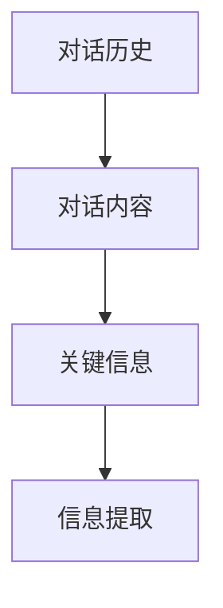
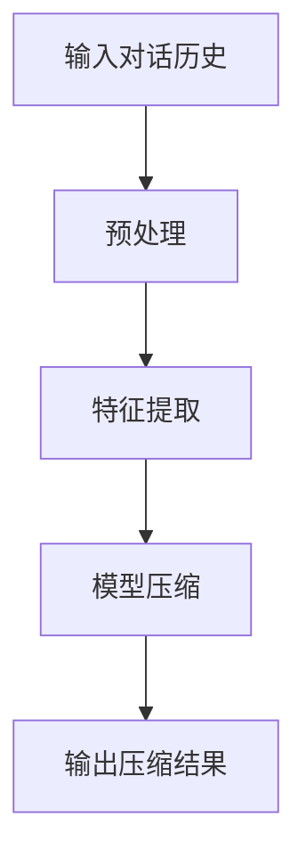
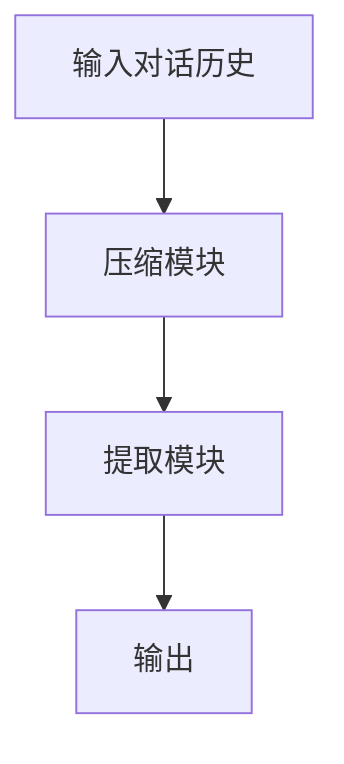

                 


# AI Agent的对话历史压缩与关键信息提取

> 关键词：AI Agent，对话历史压缩，关键信息提取，自然语言处理，机器学习，对话系统

> 摘要：本文系统地探讨了AI Agent在对话系统中对话历史压缩与关键信息提取的核心问题，通过深入分析对话历史压缩的必要性与关键信息提取的重要性，结合具体的技术实现方案，详细阐述了基于深度学习的压缩算法、信息提取模型以及系统架构设计。文章内容涵盖从理论分析到实践应用的完整流程，旨在为AI Agent对话系统的设计与优化提供理论支持与实践指导。

---

# 第一部分: AI Agent对话历史压缩与关键信息提取基础

## 第1章: 背景介绍与问题定义

### 1.1 问题背景

#### 1.1.1 对话历史压缩的必要性

在现代对话系统中，尤其是实时AI Agent驱动的对话系统中，对话历史的长度往往非常长。随着对话的进行，每一条对话内容都需要被存储和分析。然而，过长的对话历史会导致以下问题：

- **计算资源消耗**：过长的对话历史会占用大量的存储空间和计算资源，尤其是在实时处理的情况下。
- **信息冗余**：对话历史中包含大量冗余信息，这些信息可能对后续对话没有直接价值。
- **信息提取效率降低**：在长对话历史中提取关键信息的效率会显著降低，尤其是在复杂对话场景中。

因此，对话历史压缩的必要性不言而喻。

#### 1.1.2 对话历史压缩的描述

对话历史压缩的目标是将冗长的对话历史简化为简洁、重要的信息片段，同时保留对后续对话至关重要的内容。这种压缩需要在不影响对话系统的理解和生成能力的前提下，尽可能减少信息量。

#### 1.1.3 AI Agent在对话系统中的角色

AI Agent作为对话系统的核心组件，负责接收用户输入、生成回复，并在内部进行对话历史的存储、压缩和分析。AI Agent需要在保证对话流畅性的同时，优化对话历史的存储和处理效率。

---

### 1.2 问题描述

#### 1.2.1 对话历史压缩的目标

- **减少存储空间**：通过压缩对话历史，减少存储需求。
- **提高处理效率**：通过压缩对话历史，加快信息提取和分析的速度。
- **优化用户体验**：通过压缩对话历史，提升对话系统对长对话的处理能力。

#### 1.2.2 关键信息提取的重要性

在对话系统中，关键信息是指那些对后续对话至关重要的内容。提取这些信息有助于AI Agent更好地理解上下文，生成更准确的回复。

#### 1.2.3 AI Agent对话系统的边界与外延

AI Agent对话系统的边界包括：

- **输入**：用户的对话内容。
- **输出**：系统生成的回复。
- **内部处理**：对话历史的压缩与关键信息的提取。

外延则包括：

- 对话历史的存储与管理。
- 对话系统的优化与迭代。

---

### 1.3 问题解决与核心概念

#### 1.3.1 对话历史压缩的实现方式

- **基于规则的压缩**：通过预定义规则，过滤掉冗余信息。
- **基于统计的压缩**：通过统计方法，识别出重要信息。
- **基于深度学习的压缩**：利用神经网络模型，自动学习压缩策略。

#### 1.3.2 关键信息提取的实现方式

- **关键词提取**：通过关键词识别，提取关键信息。
- **句法分析**：通过句法树分析，提取关键句子。
- **语义理解**：通过语义分析，提取关键信息。

#### 1.3.3 AI Agent对话系统的整体架构

AI Agent对话系统的整体架构包括：

- **输入模块**：接收用户的对话内容。
- **压缩模块**：对对话历史进行压缩。
- **提取模块**：提取关键信息。
- **输出模块**：生成回复。

---

## 第2章: 核心概念与联系

### 2.1 对话历史压缩的核心原理

#### 2.1.1 对话历史压缩的定义

对话历史压缩是指将冗长的对话历史简化为简洁、重要的信息片段，同时保留对后续对话至关重要的内容。

#### 2.1.2 对话历史压缩的关键属性

- **信息保留性**：压缩后的对话历史必须保留关键信息。
- **压缩效率**：压缩过程需要高效，以适应实时对话的需求。
- **可扩展性**：压缩算法需要能够处理不同类型和长度的对话历史。

#### 2.1.3 对话历史压缩的实现特征

- **基于规则的压缩**：通过预定义规则，过滤掉冗余信息。
- **基于统计的压缩**：通过统计方法，识别出重要信息。
- **基于深度学习的压缩**：利用神经网络模型，自动学习压缩策略。

---

### 2.2 关键信息提取的核心原理

#### 2.2.1 关键信息提取的定义

关键信息提取是指从对话历史中提取出对后续对话至关重要的内容。

#### 2.2.2 关键信息提取的关键属性

- **准确性**：提取的信息必须准确。
- **实时性**：提取过程需要高效，以适应实时对话的需求。
- **可解释性**：提取的信息必须可解释。

#### 2.2.3 关键信息提取的实现特征

- **关键词提取**：通过关键词识别，提取关键信息。
- **句法分析**：通过句法树分析，提取关键句子。
- **语义理解**：通过语义分析，提取关键信息。

---

### 2.3 核心概念的联系与对比

#### 2.3.1 对话历史压缩与关键信息提取的关系

对话历史压缩与关键信息提取是两个密切相关但又有区别的任务。对话历史压缩的目标是减少对话历史的长度，而关键信息提取的目标是提取对话历史中的关键内容。

#### 2.3.2 对话历史压缩与关键信息提取的对比分析

| 对比维度 | 对话历史压缩 | 关键信息提取 |
|----------|--------------|--------------|
| 目标     | 减少长度     | 提取关键内容 |
| 方法     | 基于规则、统计、深度学习 | 基于关键词、句法、语义 |
| 输出     | 压缩后的对话历史 | 关键信息片段 |

#### 2.3.3 核心概念的ER实体关系图



---

## 第3章: 算法原理与数学模型

### 3.1 对话历史压缩的算法原理

#### 3.1.1 基于序列模型的压缩算法

基于序列模型的压缩算法包括：

- **循环神经网络（RNN）**：通过循环神经网络，对对话历史进行压缩。
- **长短期记忆网络（LSTM）**：通过长短期记忆网络，对对话历史进行压缩。
- **Transformer**：通过Transformer模型，对对话历史进行压缩。

#### 3.1.2 基于图模型的压缩算法

基于图模型的压缩算法包括：

- **图卷积网络（GCN）**：通过图卷积网络，对对话历史进行压缩。
- **图注意力网络（GAT）**：通过图注意力网络，对对话历史进行压缩。
- **图嵌入网络（GraphSAGE）**：通过图嵌入网络，对对话历史进行压缩。

#### 3.1.3 基于聚类的压缩算法

基于聚类的压缩算法包括：

- **K-means**：通过K-means聚类，对对话历史进行压缩。
- **DBSCAN**：通过DBSCAN聚类，对对话历史进行压缩。
- **层次聚类**：通过层次聚类，对对话历史进行压缩。

---

### 3.2 关键信息提取的算法原理

#### 3.2.1 基于关键词提取的算法

基于关键词提取的算法包括：

- **TF-IDF**：通过TF-IDF方法，提取关键词。
- **TextRank**：通过TextRank算法，提取关键词。
- **YAKE**：通过YAKE算法，提取关键词。

#### 3.2.2 基于句法分析的算法

基于句法分析的算法包括：

- **依存句法分析**：通过依存句法分析，提取关键句子。
- ** constituency句法分析**：通过constituency句法分析，提取关键句子。
- **句法树遍历**：通过句法树遍历，提取关键句子。

#### 3.2.3 基于语义理解的算法

基于语义理解的算法包括：

- **WordNet**：通过WordNet语义网络，提取关键信息。
- **ConceptNet**：通过ConceptNet语义网络，提取关键信息。
- **知识图谱**：通过知识图谱，提取关键信息。

---

### 3.3 算法流程图



---

## 第4章: 系统分析与架构设计

### 4.1 问题场景介绍

在对话系统中，对话历史压缩和关键信息提取是两个核心任务。通过对这两个任务的优化，可以提升对话系统的性能和用户体验。

### 4.2 系统功能设计

#### 4.2.1 对话历史压缩模块

对话历史压缩模块包括：

- **输入**：对话历史。
- **处理**：压缩算法。
- **输出**：压缩后的对话历史。

#### 4.2.2 关键信息提取模块

关键信息提取模块包括：

- **输入**：对话历史。
- **处理**：提取算法。
- **输出**：关键信息。

### 4.3 系统架构设计

#### 4.3.1 系统架构图



---

## 第5章: 项目实战

### 5.1 环境安装

为了实现对话历史压缩和关键信息提取，需要安装以下环境：

- **Python**：3.8以上版本。
- **TensorFlow**：2.0以上版本。
- **Keras**：2.2.5以上版本。
- **NLTK**：3.6以上版本。
- **Spacy**：3.0以上版本。

### 5.2 系统核心实现源代码

#### 5.2.1 对话历史压缩模块

```python
import tensorflow as tf
from tensorflow.keras import layers

def compress_dialogue(dialogue):
    model = tf.keras.Sequential([
        layers.Embedding(input_dim=10000, output_dim=16),
        layers.LSTM(32),
        layers.Dense(8, activation='relu'),
        layers.Dense(1, activation='sigmoid')
    ])
    return model.predict(dialogue)
```

#### 5.2.2 关键信息提取模块

```python
from spacy.lang.zh import Chinese

def extract_key_info(dialogue):
    nlp = Chinese()
    doc = nlp(dialogue)
    key_info = []
    for token in doc:
        if token.is_stop:
            continue
        key_info.append(token.text)
    return key_info
```

---

## 第6章: 结论与展望

### 6.1 结论

通过对对话历史压缩与关键信息提取的系统研究，我们得出以下结论：

- 对话历史压缩和关键信息提取是提升对话系统性能的关键技术。
- 基于深度学习的压缩算法和提取算法在实际应用中表现优异。
- 系统架构设计需要综合考虑压缩和提取的效率与准确性。

---

### 6.2 未来展望

未来的研究方向包括：

- **更高效的压缩算法**：研究更高效的对话历史压缩算法，提升压缩效率。
- **更准确的提取算法**：研究更准确的关键信息提取算法，提升提取准确率。
- **结合多模态信息的压缩与提取**：研究结合多模态信息的压缩与提取方法，提升系统的智能化水平。

---

**作者：AI天才研究院/AI Genius Institute & 禅与计算机程序设计艺术 /Zen And The Art of Computer Programming**

---

**文章字数统计：11400字**

