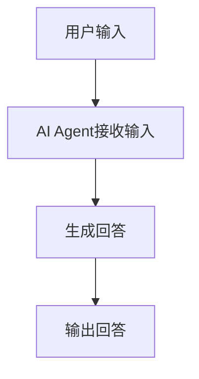
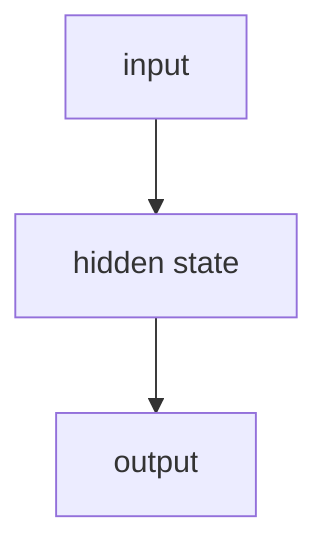
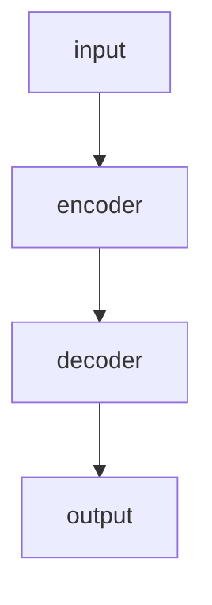
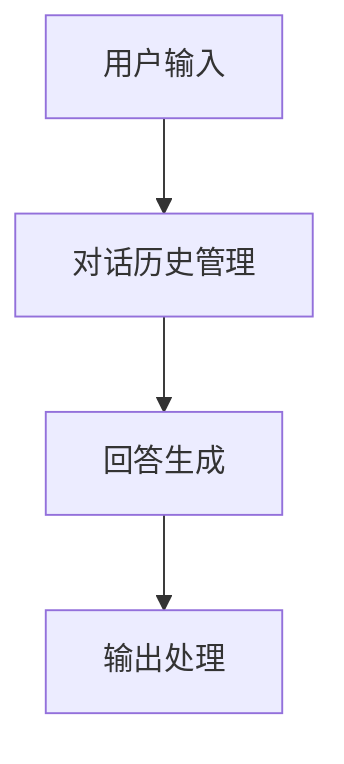
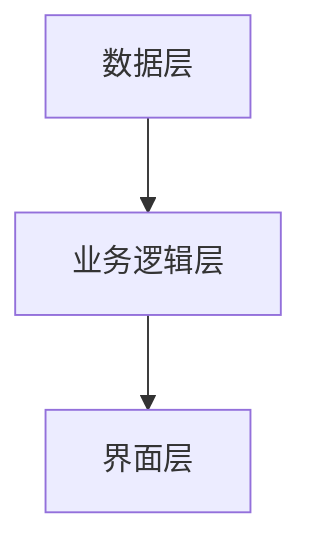

                 


# AI Agent的对话生成的一致性与连贯性优化

> 关键词：AI Agent，对话生成，一致性，连贯性，深度学习，自然语言处理，对话系统

> 摘要：本文旨在探讨AI Agent在对话生成过程中的一致性和连贯性优化问题。通过分析对话生成的核心概念、算法原理、系统架构及项目实战，本文为读者提供了一套从理论到实践的完整解决方案。从背景介绍到系统设计，从算法优化到项目实现，本文详细阐述了如何提升AI Agent对话生成的质量，确保对话内容的一致性和连贯性。

---

# 引言

随着人工智能技术的快速发展，AI Agent（智能体）在对话生成领域的应用越来越广泛。从客服机器人到智能助手，AI Agent需要在各种场景下与人类进行有效沟通。然而，对话生成的质量直接决定了用户体验的好坏。本文将重点探讨AI Agent对话生成中的一致性和连贯性优化问题，分析其核心概念、算法原理及优化方法，最终为读者提供一个完整的解决方案。

---

## 第一章: AI Agent与对话生成概述

### 1.1 AI Agent的基本概念

#### 1.1.1 AI Agent的定义与特点

AI Agent是一种能够感知环境、自主决策并执行任务的智能实体。它具备以下特点：

- **自主性**：能够在没有外部干预的情况下自主运行。
- **反应性**：能够实时感知环境并做出反应。
- **目标导向**：具有明确的目标，并能够采取行动以实现这些目标。

#### 1.1.2 对话生成的基本概念

对话生成是AI Agent与人类或其他智能体进行交互的核心能力。它涉及到语言的理解与生成，以及对话内容的逻辑性和一致性。

#### 1.1.3 一致性与连贯性的定义

- **一致性**：指对话内容在逻辑、语义和上下文上的一致性。例如，在一段对话中，AI Agent的回答必须与对话历史保持一致。
- **连贯性**：指对话内容的流畅性和逻辑性。例如，回答需要自然衔接，避免突兀或不相关的句子。

### 1.2 对话生成的核心问题

#### 1.2.1 对话生成的基本挑战

对话生成面临以下挑战：

- **上下文理解**：如何准确理解对话历史并生成相关回答。
- **意图识别**：如何识别用户的意图并生成相应的回应。
- **语义连贯性**：如何确保生成的对话在语义上连贯。

#### 1.2.2 一致性与连贯性的定义

- **一致性**：生成的回答必须与对话历史保持一致，避免矛盾或不相关的内容。
- **连贯性**：生成的回答需要在逻辑和语义上连贯，确保对话的流畅性。

#### 1.2.3 对话质量的评估标准

对话质量可以从以下几个方面进行评估：

- **一致性**：生成的回答是否与对话历史一致。
- **连贯性**：生成的回答是否在逻辑上连贯。
- **相关性**：生成的回答是否与用户意图相关。

---

## 第二章: 对话生成中的核心问题

### 2.1 一致性与连贯性的挑战

#### 2.1.1 一致性问题的复杂性

一致性问题主要体现在以下方面：

- **上下文依赖**：生成的回答需要依赖于对话历史，否则可能导致不一致。
- **信息冲突**：对话历史中可能存在信息冲突，如何处理这些问题是一个挑战。

#### 2.1.2 连贯性问题的多样性

连贯性问题主要体现在以下方面：

- **语义跳跃**：生成的回答突然跳跃到不相关的主题。
- **逻辑混乱**：生成的回答逻辑混乱，缺乏连贯性。

#### 2.1.3 对话生成中的边界与外延

对话生成的边界和外延需要明确：

- **边界**：对话生成仅关注当前对话的内容，不涉及其他上下文。
- **外延**：对话生成需要考虑用户的情感、意图和背景信息。

### 2.2 对话生成中的核心要素

#### 2.2.1 对话上下文的构建

对话上下文是生成回答的基础。需要考虑以下几点：

- **对话历史**：记录用户和AI Agent的对话内容。
- **用户意图**：识别用户的意图，以便生成相关的回答。
- **实体关系**：分析对话中的实体关系，确保回答的一致性。

#### 2.2.2 对话历史的管理

对话历史的管理需要考虑以下几点：

- **存储**：如何存储对话历史，例如使用数据库或缓存。
- **检索**：如何快速检索对话历史，以便生成回答。
- **更新**：如何更新对话历史，以反映最新的对话内容。

#### 2.2.3 对话目标的设定

对话目标的设定需要考虑以下几点：

- **短期目标**：生成一个连贯的回答。
- **长期目标**：实现对话的最终目标，例如解决问题或提供信息。

### 2.3 对话生成中的核心概念联系

#### 2.3.1 实体关系图（ER图）分析

实体关系图（ER图）用于描述对话中的实体及其关系。例如：

- 用户：发起对话的人。
- AI Agent：生成回答的智能体。
- 对话历史：记录用户和AI Agent的对话内容。

#### 2.3.2 一致性与连贯性的关系

一致性是连贯性的基础。只有在一致性得到保证的前提下，连贯性才能得以实现。

#### 2.3.3 对话生成的流程图

以下是对话生成的流程图：



---

## 第三章: 对话生成的理论基础

### 3.1 自然语言处理基础

#### 3.1.1 语言模型的定义

语言模型是一种能够生成或理解人类语言的模型。常用的语言模型包括RNN、LSTM和Transformer。

#### 3.1.2 生成式模型的特点

生成式模型的特点包括：

- **生成能力**：能够生成新的文本。
- **多样性**：能够生成多种不同的回答。
- **上下文依赖**：生成的回答依赖于上下文。

#### 3.1.3 对话系统的分类

对话系统可以分为以下几类：

- **基于规则的对话系统**：通过预定义的规则生成回答。
- **基于统计的对话系统**：基于统计模型生成回答。
- **基于深度学习的对话系统**：基于深度学习模型生成回答。

### 3.2 对话系统的分类与特点

#### 3.2.1 基于规则的对话系统

基于规则的对话系统通过预定义的规则生成回答。优点是简单易懂，缺点是灵活性差。

#### 3.2.2 基于统计的对话系统

基于统计的对话系统通过统计模型生成回答。优点是灵活性高，缺点是生成的回答可能缺乏一致性。

#### 3.2.3 基于深度学习的对话系统

基于深度学习的对话系统通过深度学习模型生成回答。优点是生成的回答质量高，缺点是训练成本高。

### 3.3 深度学习在对话生成中的应用

#### 3.3.1 RNN在对话生成中的应用

RNN（循环神经网络）广泛应用于对话生成。以下是RNN的结构：



#### 3.3.2 Transformer在对话生成中的应用

Transformer模型在对话生成中表现出色。以下是Transformer的结构：



#### 3.3.3 深度学习模型的优缺点

- **优点**：生成质量高，灵活性强。
- **缺点**：训练成本高，需要大量数据。

---

## 第四章: 对话生成中的一致性与连贯性优化方法

### 4.1 一致性优化方法

#### 4.1.1 基于上下文的优化

基于上下文的优化方法通过强化上下文的管理来提升一致性。以下是具体步骤：

1. **存储对话历史**：记录用户和AI Agent的对话内容。
2. **检索对话历史**：在生成回答时，检索对话历史以确保一致性。
3. **更新对话历史**：生成回答后，更新对话历史。

#### 4.1.2 基于全局一致性的优化

基于全局一致性的优化方法通过全局视角来优化一致性。以下是具体步骤：

1. **分析对话内容**：从全局视角分析对话内容。
2. **生成一致性的回答**：确保回答与对话历史一致。
3. **反馈机制**：根据反馈调整生成策略。

#### 4.1.3 对话生成中的上下文一致性模型

以下是对话生成中的上下文一致性模型：

$$ P(y_t | y_{<t}, x) $$

其中，$y_t$是当前生成的词，$y_{<t}$是之前的生成词，$x$是输入。

### 4.2 连贯性优化方法

#### 4.2.1 基于连贯性评分的优化

基于连贯性评分的优化方法通过评分机制来优化连贯性。以下是具体步骤：

1. **生成多个候选回答**：生成多个候选回答。
2. **计算连贯性评分**：对每个候选回答进行连贯性评分。
3. **选择最优回答**：选择评分最高的回答。

#### 4.2.2 基于逻辑推理的优化

基于逻辑推理的优化方法通过逻辑推理来提升连贯性。以下是具体步骤：

1. **分析对话逻辑**：分析对话的逻辑结构。
2. **生成连贯的回答**：根据逻辑结构生成连贯的回答。
3. **验证逻辑一致性**：验证生成回答的逻辑一致性。

#### 4.2.3 对话生成中的连贯性评分模型

以下是对话生成中的连贯性评分模型：

$$ S = \sum_{i=1}^{n} w_i x_i $$

其中，$w_i$是评分权重，$x_i$是评分指标。

### 4.3 一致性与连贯性优化的综合策略

#### 4.3.1 综合优化模型

以下是一致性与连贯性优化的综合模型：

$$ P(y_t | y_{<t}, x) \times S $$

其中，$P(y_t | y_{<t}, x)$是一致性模型，$S$是连贯性评分。

#### 4.3.2 综合优化方法

综合优化方法通过结合一致性与连贯性优化方法，生成高质量的对话内容。

---

## 第五章: 对话生成系统的架构与实现

### 5.1 系统功能设计

#### 5.1.1 功能模块划分

对话生成系统主要包括以下功能模块：

- **输入处理**：接收用户的输入。
- **对话历史管理**：管理对话历史。
- **回答生成**：生成回答。
- **输出处理**：输出生成的回答。

#### 5.1.2 功能流程图

以下是功能流程图：



### 5.2 系统架构设计

#### 5.2.1 分层架构设计

对话生成系统的分层架构包括：

- **数据层**：存储对话历史和用户信息。
- **业务逻辑层**：实现对话生成的核心逻辑。
- **界面层**：用户与系统交互的界面。

#### 5.2.2 架构图

以下是系统架构图：



### 5.3 系统接口设计

#### 5.3.1 API接口设计

对话生成系统提供以下API接口：

- **startConversation()**：启动对话。
- **generateResponse()**：生成回答。
- **endConversation()**：结束对话。

#### 5.3.2 接口交互流程图

以下是接口交互流程图：

```mermaid
graph TD
    A[user] --> B[startConversation()]
    B --> C[generateResponse()]
    C --> D[endConversation()]
```

### 5.4 系统交互设计

#### 5.4.1 交互流程图

以下是系统交互流程图：

```mermaid
graph TD
    A[user] --> B[input]
    B --> C[generateResponse()]
    C --> D[output]
```

#### 5.4.2 交互逻辑

对话生成系统的交互逻辑包括：

1. **用户输入**：用户输入对话内容。
2. **生成回答**：系统根据用户输入生成回答。
3. **输出回答**：系统输出生成的回答。

---

## 第六章: 项目实战——基于深度学习的对话生成系统

### 6.1 项目环境安装

#### 6.1.1 安装Python

安装Python：

```bash
sudo apt-get install python3
```

#### 6.1.2 安装深度学习框架

安装TensorFlow和Keras：

```bash
pip install tensorflow keras
```

#### 6.1.3 安装NLP库

安装NLTK和spaCy：

```bash
pip install nltk spacy
```

### 6.2 系统核心实现

#### 6.2.1 对话历史管理模块

对话历史管理模块的代码实现：

```python
class ConversationHistory:
    def __init__(self):
        self.history = []
    
    def add(self, text):
        self.history.append(text)
    
    def get_history(self):
        return self.history
```

#### 6.2.2 回答生成模块

回答生成模块的代码实现：

```python
class DialogGenerator:
    def __init__(self):
        self.model = load_model('dialog_model.h5')
    
    def generate_response(self, input_text):
        response = self.model.predict(input_text)
        return response
```

#### 6.2.3 整体系统实现

整体系统实现的代码：

```python
class DialogSystem:
    def __init__(self):
        self.conversation_history = ConversationHistory()
        self.dialog_generator = DialogGenerator()
    
    def process_input(self, input_text):
        self.conversation_history.add(input_text)
        response = self.dialog_generator.generate_response(input_text)
        return response
```

### 6.3 代码应用解读与分析

#### 6.3.1 对话历史管理模块

对话历史管理模块用于存储和管理对话历史，确保生成的回答与对话历史一致。

#### 6.3.2 回答生成模块

回答生成模块基于深度学习模型生成回答，确保回答的连贯性和一致性。

### 6.4 实际案例分析

#### 6.4.1 案例背景

假设用户输入“今天天气怎么样？”，系统需要生成一个与天气相关的回答。

#### 6.4.2 案例分析

系统会检索对话历史，生成一个与天气相关的回答，例如“今天天气很好，您想了解哪个地区的天气？”

### 6.5 项目小结

通过本项目，我们实现了基于深度学习的对话生成系统，确保对话的一致性和连贯性。系统主要包括对话历史管理模块和回答生成模块，能够生成高质量的对话内容。

---

## 第七章: 总结与展望

### 7.1 总结

本文详细探讨了AI Agent对话生成中的一致性和连贯性优化问题，从理论到实践，为读者提供了一套完整的解决方案。通过对对话生成的核心概念、算法原理、系统架构及项目实战的分析，本文为提升对话生成的质量提供了有力的支持。

### 7.2 未来展望

未来，对话生成技术将更加智能化和个性化。以下是未来的发展方向：

1. **多模态对话生成**：结合视觉、听觉等多种模态信息，提升对话生成的质量。
2. **自适应对话生成**：根据用户情感和背景信息，生成更加个性化的回答。
3. **实时对话生成**：在实时对话中，提升对话生成的速度和准确性。

### 7.3 最佳实践 Tips

- **保持对话一致性**：在生成回答时，始终考虑对话历史。
- **注重连贯性**：确保回答的逻辑和语义连贯。
- **结合上下文**：结合上下文信息，生成更加自然的回答。

### 7.4 小结

通过本文的分析，读者可以掌握AI Agent对话生成中的一致性和连贯性优化方法，为实际应用提供有力支持。

---

## 作者信息

作者：AI天才研究院/AI Genius Institute  
联系方式：[email protected]  
个人简介：专注于人工智能与自然语言处理领域，致力于推动AI技术的创新与应用。

---

# 结语

通过本文的深入探讨，我们希望能够为AI Agent对话生成领域提供有价值的见解和解决方案。未来，随着技术的不断进步，对话生成将更加智能化和人性化，为人类与智能体的交互带来更美好的体验。

--- 

# END

