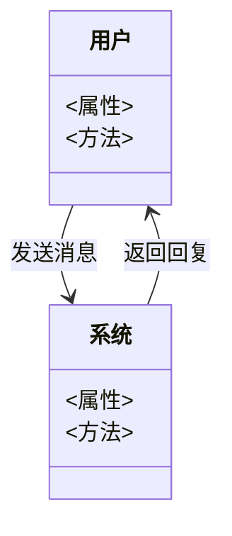
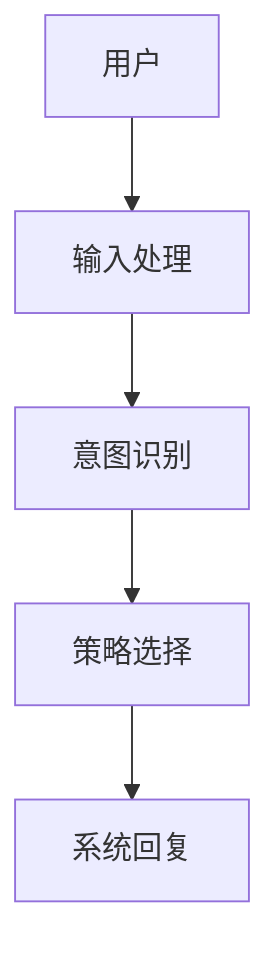
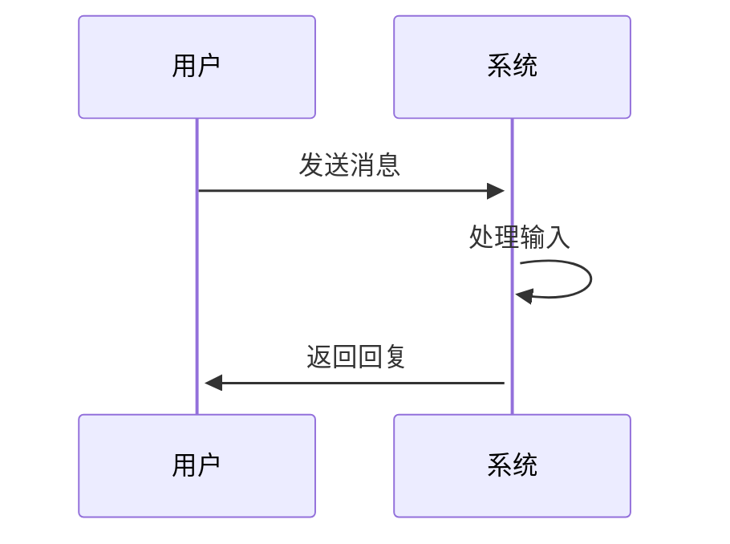

                 


# AI Agent的对话策略优化：提升交互质量和效率

> 关键词：AI Agent, 对话策略优化, 交互质量, 对话系统, 优化算法, NLP技术

> 摘要：本文详细探讨了AI Agent在对话系统中的策略优化方法，分析了提升交互质量和效率的关键技术，包括基于规则和模型的优化算法，以及系统架构设计。通过实际案例和代码实现，展示了如何优化对话策略，提高用户体验。

---

## 第一部分: AI Agent对话策略优化背景与基础

### 第1章: AI Agent与对话策略优化概述

#### 1.1 AI Agent的基本概念
##### 1.1.1 AI Agent的定义与特点
AI Agent（人工智能代理）是能够感知环境并采取行动以实现目标的智能实体。其特点包括自主性、反应性、目标导向和社交能力。

##### 1.1.2 对话系统的基本原理
对话系统通过自然语言处理技术，理解用户输入并生成相应回复。其流程包括语音识别、语义理解、意图识别和生成回复。

##### 1.1.3 对话策略优化的目标与意义
优化对话策略旨在提高交互质量，使系统更自然、高效地与用户交流。意义在于提升用户体验和系统效率。

#### 1.2 对话策略优化的背景与现状
##### 1.2.1 当前对话系统的主要挑战
包括意图识别错误、回复不连贯、上下文理解不足等问题。

##### 1.2.2 对话策略优化的必要性
优化策略可提升用户体验和系统性能，增强人机交互的自然性。

##### 1.2.3 行业内的研究与应用现状
当前研究集中在强化学习和混合模型，应用广泛，但仍有提升空间。

#### 1.3 对话策略优化的核心要素
##### 1.3.1 对话上下文的理解
上下文理解是优化的基础，涉及记忆和状态管理。

##### 1.3.2 用户意图的识别
准确识别意图是优化的关键，需结合语义分析和上下文信息。

##### 1.3.3 策略选择与执行
基于意图和上下文，选择最佳回复策略，并实时调整。

### 第2章: 对话策略优化的核心概念

#### 2.1 对话策略优化的定义与分类
##### 2.1.1 策略优化的基本定义
对话策略优化是调整系统行为以提升交互效果的过程。

##### 2.1.2 基于规则的策略优化
通过预定义规则匹配输入，生成回复。

##### 2.1.3 基于模型的策略优化
利用机器学习模型，学习优化策略。

#### 2.2 对话策略优化的关键属性对比
##### 2.2.1 不同策略优化方法的对比分析
基于规则的方法简单但灵活性差，基于模型的方法灵活但复杂。

##### 2.2.2 各种优化策略的优缺点
规则方法高效，模型方法更智能。

#### 2.3 对话策略优化的ER实体关系图
```mermaid
er
actor: 用户
agent: AI Agent
message: 对话消息
intent: 用户意图
response: 系统回复
rule: 优化规则
```

---

## 第二部分: 对话策略优化的核心概念与原理

### 第3章: 对话策略优化的算法原理

#### 3.1 基于规则的策略优化算法
##### 3.1.1 规则定义与匹配
定义规则，匹配输入以生成回复。

##### 3.1.2 规则优先级排序
处理冲突规则，确保策略最优。

##### 3.1.3 规则动态调整
根据反馈优化规则。

#### 3.2 基于模型的策略优化算法
##### 3.2.1 基于强化学习的策略优化
使用Q-learning算法，通过奖励机制优化策略。

##### 3.2.2 基于监督学习的策略优化
利用标注数据训练模型，预测最佳回复。

##### 3.2.3 混合模型的策略优化
结合规则和模型，提升优化效果。

#### 3.3 对话策略优化的数学模型
##### 3.3.1 基于马尔可夫决策过程的策略优化
状态、动作、奖励驱动优化。

##### 3.3.2 基于Q-learning的策略优化
通过状态转移和奖励优化策略。

---

## 第三部分: 对话策略优化的系统架构与实战

### 第4章: 对话策略优化的系统架构设计

#### 4.1 问题场景介绍
系统需要理解用户意图，选择最佳回复策略。

#### 4.2 项目介绍
设计一个优化的对话系统，提升交互质量。

#### 4.3 系统功能设计
##### 4.3.1 领域模型


##### 4.3.2 系统架构设计


#### 4.4 系统接口设计
##### 4.4.1 接口定义
REST API接口，处理输入和输出。

##### 4.4.2 交互流程
用户输入 → 输入处理 → 意图识别 → 策略选择 → 系统回复。

#### 4.5 系统交互设计
##### 4.5.1 交互流程图


### 第5章: 项目实战

#### 5.1 环境安装
安装Python、TensorFlow、Keras等工具。

#### 5.2 代码实现
##### 5.2.1 环境配置
安装必要的库和框架。

##### 5.2.2 核心实现
```python
class DialogueAgent:
    def __init__(self):
        self.rules = [...]  # 定义规则

    def optimize_strategy(self, input_text):
        # 优化策略逻辑
        pass
```

##### 5.2.3 功能实现
实现意图识别、策略选择和回复生成。

#### 5.3 案例分析
##### 5.3.1 实际案例
分析优化前后效果，展示提升。

##### 5.3.2 优化效果对比
通过数据分析，展示优化后的提升。

### 第6章: 最佳实践与总结

#### 6.1 最佳实践
##### 6.1.1 系统设计建议
模块化设计，便于维护和扩展。

##### 6.1.2 开发注意事项
关注数据质量和模型训练。

##### 6.1.3 系统优化技巧
动态调整规则和模型参数。

#### 6.2 小结
总结全文，强调优化的重要性。

#### 6.3 注意事项
避免过度优化，保持系统简洁高效。

#### 6.4 拓展阅读
推荐相关书籍和论文，供进一步学习。

---

## 作者：AI天才研究院/AI Genius Institute & 禅与计算机程序设计艺术 /Zen And The Art of Computer Programming

---

通过以上内容，读者可以全面了解AI Agent对话策略优化的各个方面，从理论到实践，逐步提升对话系统的交互质量和效率。

