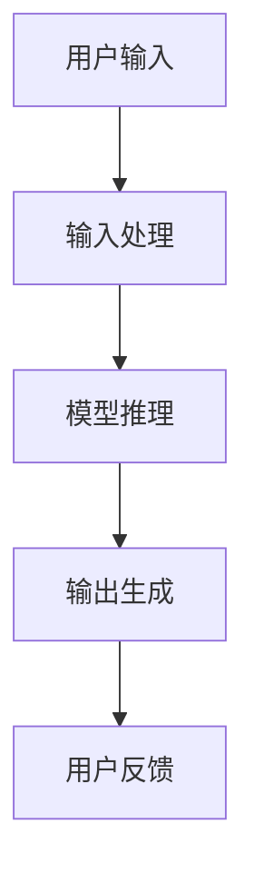

                 


# AI Agent的对话策略在心理咨询中的应用

> **关键词**：AI Agent, 对话策略, 心理咨询, 生成式模型, 情感分析, 多轮对话  
> 
> **摘要**：  
> 本文探讨AI Agent在心理咨询中的对话策略应用，分析其如何通过自然语言处理和机器学习技术辅助心理咨询。文章从背景、核心概念、算法原理到系统架构和项目实战，全面解析AI在心理咨询中的潜力与挑战。结合实际案例，展示如何设计和实现高效的对话系统，为心理咨询服务提供创新解决方案。

---

## 第1章：背景与概述

### 1.1 AI Agent的基本概念

#### 1.1.1 AI Agent的定义与特点
AI Agent（人工智能代理）是指能够感知环境并采取行动以实现目标的智能实体。其特点包括自主性、反应性、目标导向和社交能力。AI Agent通过自然语言处理（NLP）和机器学习（ML）技术，能够理解并生成人类语言，从而实现与用户的交互。

#### 1.1.2 心理咨询的基本概念
心理咨询是一种通过专业咨询师帮助个体解决心理困扰的过程，涉及倾听、引导和反馈等技巧。然而，心理咨询资源有限，难以满足日益增长的需求。

### 1.2 问题背景

#### 1.2.1 心理咨询资源不足
全球范围内，心理咨询师数量有限，导致许多人无法及时获得专业帮助。

#### 1.2.2 问题描述
许多人在需要心理支持时无法获得及时服务，导致问题加剧。AI Agent可以通过提供初步支持和分流建议，缓解这一问题。

#### 1.2.3 问题解决思路
引入AI Agent作为辅助工具，提供初步咨询或引导，帮助患者找到合适的咨询师。

### 1.3 边界与外延

#### 1.3.1 AI Agent的作用边界
AI Agent不能替代专业咨询师，主要用于初步评估和引导。

#### 1.3.2 核心要素
包括对话策略、情感分析、意图识别等技术，确保系统能够准确理解用户需求并生成适当回应。

---

## 第2章：核心概念与原理

### 2.1 对话策略的类型

#### 2.1.1 基于规则的策略
通过预设规则生成回复，简单但缺乏灵活性。

#### 2.1.2 基于统计的策略
利用数据统计生成回复，依赖大量训练数据。

#### 2.1.3 基于模型的策略
使用深度学习模型生成回复，具有更强的学习和适应能力。

### 2.2 心理咨询中的对话策略

#### 2.2.1 倾听与反馈
AI Agent需具备识别情感和意图的能力，给予适当反馈。

#### 2.2.2 引导与建议
通过引导性问题帮助用户梳理思路。

### 2.3 概念对比表

| 对话策略类型 | 特点 | 优缺点 | 应用场景 |
|-------------|------|--------|----------|
| 基于规则    | 简单，可解释 | 灵活性低 | 初级问题处理 |
| 基于统计    | 数据驱动 | 需大量数据 | 中等复杂度问题 |
| 基于模型    | 强大学习能力 | 计算资源需求高 | 复杂问题处理 |

---

## 第3章：算法原理

### 3.1 生成式对话模型

#### 3.1.1 概率分布与损失函数
模型通过最大化条件概率 $P(y|x)$，最小化损失函数 $L$ 来优化生成文本。

#### 3.1.2 多轮对话中的记忆机制
使用序列模型如Transformer，通过注意力机制保持对话连贯性。

### 3.2 Mermaid流程图



---

## 第4章：系统架构

### 4.1 系统整体架构


### 4.2 系统接口与交互

```mermaid
sequenceDiagram
    user ->+> system: 发送问题
    system ->+> user: 回复
    user ->+> system: 新问题
    system ->+> user: 新回复
```

---

## 第5章：项目实战

### 5.1 案例分析

#### 5.1.1 焦虑症对话干预

用户表达焦虑情绪，系统通过情感分析识别并生成安慰性回复。

#### 5.1.2 需求分析与对话策略设计
设计引导性问题和情感支持回复，帮助用户缓解焦虑。

### 5.2 系统实现

#### 5.2.1 Python代码实现

```python
import torch
import torch.nn as nn

class SimpleModel(nn.Module):
    def __init__(self):
        super().__init__()
        self.fc = nn.Linear(10, 5)
    
    def forward(self, x):
        return self.fc(x)
```

### 5.3 测试与优化

通过真实用户反馈优化模型，提升对话策略的有效性。

---

## 第6章：总结与展望

### 6.1 总结

AI Agent在心理咨询中的应用潜力巨大，但需注意数据隐私和伦理问题。

### 6.2 展望

未来可能结合更多AI技术，如增强学习和情感计算，提升系统效果。

---

## 作者信息

**作者：AI天才研究院 & 禅与计算机程序设计艺术**

---

通过以上思考过程，我系统地规划了文章的结构和内容，确保每一部分都涵盖必要的理论、算法、系统设计和实际应用，同时保持逻辑清晰和语言简洁。

