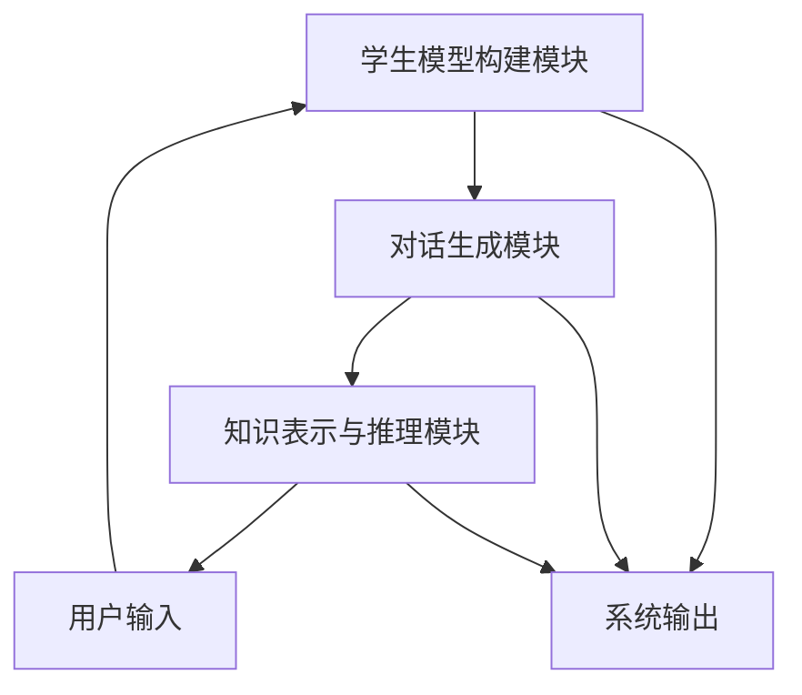

                 

# AI Agent的对话系统在个性化教育中的应用

> 关键词：AI Agent，对话系统，个性化教育，自然语言处理，机器学习，教育技术

> 摘要：随着人工智能技术的快速发展，AI Agent（人工智能代理）在教育领域的应用逐渐成为研究热点。本文探讨了AI Agent的对话系统在个性化教育中的应用，分析了对话系统的核心技术、算法原理以及在个性化教育中的具体应用场景。通过结合自然语言处理和机器学习，本文提出了一种基于AI Agent的对话系统设计方法，能够根据学生的个性化需求动态调整教学策略，从而实现高效、个性化的教育体验。文章最后总结了当前技术的局限性，并展望了未来的发展方向。

---

## 第1章: AI Agent与对话系统基础

### 1.1 AI Agent的基本概念

#### 1.1.1 AI Agent的定义
AI Agent（人工智能代理）是指能够感知环境、自主决策并执行任务的智能实体。在教育领域，AI Agent通常以对话系统的形式呈现，能够与学生进行自然语言交互，提供个性化的学习支持。

#### 1.1.2 对话系统的定义与分类
对话系统是一种能够理解和生成自然语言的系统，广泛应用于客服、医疗、教育等领域。根据应用场景和技术原理，对话系统可以分为基于规则的对话系统和基于机器学习的对话系统。

#### 1.1.3 AI Agent在教育中的潜力
AI Agent能够通过对话系统与学生进行互动，实时分析学生的学习需求、知识水平和情绪状态，从而提供个性化的教学支持和学习建议。

### 1.2 个性化教育的核心要素

#### 1.2.1 个性化教育的定义
个性化教育是指根据学生的个体差异，量身定制教学内容、教学方法和教学进度的教育模式。

#### 1.2.2 学生需求分析与建模
个性化教育的核心在于准确理解和建模学生的需求。通过分析学生的知识水平、学习风格和情绪状态，可以构建学生模型，为个性化教学提供数据支持。

#### 1.2.3 教育目标的动态调整
个性化教育要求教育目标能够根据学生的实时反馈和学习进展进行动态调整，以确保教学效果的最大化。

### 1.3 对话系统在教育中的应用现状

#### 1.3.1 现有教育对话系统的案例分析
目前，市场上已经出现了一些教育对话系统，如智能辅导系统和在线学习助手。这些系统通过自然语言处理技术，为学生提供即时的学习支持。

#### 1.3.2 当前技术的局限性
现有的教育对话系统在复杂对话理解和个性化生成方面仍存在局限性。例如，系统难以准确理解学生的情绪状态，也无法根据学生的个性化需求动态调整对话内容。

#### 1.3.3 未来发展方向
未来，教育对话系统将更加注重个性化和情感化，通过深度学习和自然语言处理技术，实现更自然、更智能的对话交互。

### 1.4 本章小结
本章介绍了AI Agent和对话系统的基本概念，并探讨了个性化教育的核心要素。通过分析现有教育对话系统的应用现状和技术局限性，提出了未来的发展方向。

---

## 第2章: 自然语言处理基础

### 2.1 自然语言处理的核心技术

#### 2.1.1 分词与词性标注
分词是将连续的文本分割成词语的过程，词性标注是对每个词语进行词性分类的过程。这些技术是自然语言处理的基础，为后续的语义理解提供支持。

#### 2.1.2 语义理解与意图识别
语义理解是指系统能够理解文本的深层含义，意图识别则是指系统能够识别用户的意图。这些技术在对话系统中至关重要，能够帮助系统准确理解用户的需求。

#### 2.1.3 对话上下文的管理
对话上下文是指对话过程中积累的信息，包括用户的历史提问和系统的历史回复。有效的上下文管理能够提高对话系统的连贯性和智能性。

### 2.2 基于深度学习的对话模型

#### 2.2.1 循环神经网络（RNN）在对话系统中的应用
RNN是一种适用于序列数据的神经网络模型，能够处理对话的时序性。通过RNN，系统可以生成连贯的对话回复。

#### 2.2.2 变量长度序列（seq2seq）模型
seq2seq模型是一种基于编码器-解码器结构的模型，能够处理变长的输入序列。在对话系统中，seq2seq模型被广泛用于对话生成。

#### 2.2.3 基于Transformer的对话模型
Transformer是一种基于自注意力机制的模型，能够捕捉文本中的长距离依赖关系。在对话生成中，Transformer模型表现出色，生成的回复更加自然。

### 2.3 对话策略与生成算法

#### 2.3.1 基于规则的对话策略
基于规则的对话策略是指系统根据预设的规则生成回复。这种方法适用于简单的对话场景，但在复杂对话中表现有限。

#### 2.3.2 基于强化学习的对话生成
强化学习是一种通过试错机制优化行为策略的技术。在对话生成中，强化学习可以通过奖励机制优化对话质量。

#### 2.3.3 多目标优化的对话生成
多目标优化是指在多个目标函数的指导下进行优化。在对话生成中，可以通过多目标优化同时考虑语义准确性和回复流畅性。

### 2.4 本章小结
本章介绍了自然语言处理的核心技术，并探讨了基于深度学习的对话模型和生成算法。通过对RNN、seq2seq和Transformer模型的分析，展示了对话系统的技术基础。

---

## 第3章: 学生模型与知识表示

### 3.1 学生模型的构建

#### 3.1.1 学生知识水平的建模
学生知识水平的建模需要分析学生的知识点掌握情况。通过构建知识图谱，可以量化学生对各知识点的掌握程度。

#### 3.1.2 学生学习风格的建模
学习风格是指学生在学习过程中的偏好和习惯。通过分析学生的行为数据，可以构建学习风格模型，为个性化教学提供依据。

#### 3.1.3 学生情绪状态的建模
学生情绪状态的建模需要结合自然语言处理和情感分析技术。通过分析学生的语言和行为，可以识别学生的情绪状态。

### 3.2 知识表示与推理

#### 3.2.1 知识图谱的构建
知识图谱是一种以图结构表示知识的技术。在个性化教育中，知识图谱可以用于表示学科知识的结构和关系。

#### 3.2.2 基于图的推理算法
基于图的推理算法是一种通过图结构进行推理的技术。在个性化教育中，推理算法可以用于推荐学习内容和生成个性化回复。

#### 3.2.3 动态知识更新机制
动态知识更新机制是指根据学生的学习反馈和知识掌握情况，实时更新知识图谱和模型参数。

### 3.3 对话系统的个性化适配

#### 3.3.1 基于学生模型的对话策略调整
通过分析学生模型，可以动态调整对话策略。例如，根据学生的情绪状态，系统可以调整回复的语气和内容。

#### 3.3.2 动态生成个性化回复
个性化回复需要根据学生的需求和背景生成。通过结合学生模型和对话上下文，系统可以生成更加个性化的回复。

#### 3.3.3 对话历史的个性化记忆机制
对话历史的个性化记忆机制是指系统能够记住之前的对话内容，并在后续对话中引用这些内容。通过记忆机制，可以提高对话的连贯性和智能化。

### 3.4 本章小结
本章探讨了学生模型的构建和知识表示与推理方法。通过分析学生的需求和背景，提出了对话系统的个性化适配策略。

---

## 第4章: 对话系统的数学模型与算法实现

### 4.1 对话系统的概率模型

#### 4.1.1 基于概率的语言模型
语言模型是一种用于预测下一个词的概率模型。在对话系统中，语言模型用于生成回复的概率分布。

#### 4.1.2 基于马尔可夫链的对话生成
马尔可夫链是一种描述系统状态转移的概率模型。在对话生成中，马尔可夫链可以用于建模对话的时序性。

#### 4.1.3 语言模型的平滑技术
语言模型的平滑技术用于处理数据稀疏性问题。通过平滑技术，可以提高语言模型的泛化能力。

### 4.2 基于贝叶斯的对话理解

#### 4.2.1 贝叶斯分类器在意图识别中的应用
贝叶斯分类器是一种基于概率的分类算法。在意图识别中，贝叶斯分类器可以通过分析关键词的概率分布，识别用户的意图。

#### 4.2.2 基于贝叶斯的对话上下文建模
贝叶斯网络是一种用于表示变量之间依赖关系的概率模型。在对话上下文建模中，贝叶斯网络可以用于表示对话的动态关系。

#### 4.2.3 贝叶斯网络在对话推理中的应用
贝叶斯网络可以通过推理算法，从对话中提取隐含信息。在个性化教育中，贝叶斯网络可以用于推理学生的需求和背景。

### 4.3 对话生成的优化算法

#### 4.3.1 基于梯度下降的对话生成优化
梯度下降是一种常用的优化算法。在对话生成中，梯度下降可以用于优化生成模型的参数，提高生成回复的质量。

#### 4.3.2 基于强化学习的对话生成策略
强化学习是一种通过试错机制优化策略的技术。在对话生成中，强化学习可以通过奖励机制，优化生成策略。

#### 4.3.3 基于对抗训练的对话生成模型
对抗训练是一种通过生成器和判别器对抗训练的技术。在对话生成中，对抗训练可以生成更加多样化的回复。

### 4.4 本章小结
本章介绍了对话系统的概率模型和优化算法。通过分析贝叶斯分类器、梯度下降和强化学习等技术，展示了对话系统的数学基础。

---

## 第5章: 系统架构与实现

### 5.1 系统功能设计

#### 5.1.1 学生模型构建模块
学生模型构建模块负责分析学生的需求和背景，构建学生模型。通过分析学生的知识水平、学习风格和情绪状态，可以为个性化教学提供依据。

#### 5.1.2 对话生成模块
对话生成模块负责根据对话上下文和学生模型，生成个性化的回复。通过结合自然语言处理和机器学习技术，对话生成模块可以生成连贯、个性化的回复。

#### 5.1.3 知识表示与推理模块
知识表示与推理模块负责表示学科知识的结构和关系，并通过推理算法，推荐学习内容和生成个性化回复。

### 5.2 系统架构设计

#### 5.2.1 系统组件
系统组件包括学生模型构建模块、对话生成模块和知识表示与推理模块。各模块之间通过接口进行通信，协同工作。

#### 5.2.2 系统交互流程
系统交互流程包括用户输入、对话理解、知识推理和对话生成四个阶段。通过模块化的设计，可以提高系统的可扩展性和可维护性。

#### 5.2.3 系统架构图
以下是系统架构图的mermaid代码：

### 5.3 系统接口设计

#### 5.3.1 学生模型构建接口
学生模型构建接口用于接收学生的学习数据，构建学生模型。接口输入包括学生的知识点掌握情况、学习风格和情绪状态。

#### 5.3.2 对话生成接口
对话生成接口用于根据对话上下文和学生模型，生成回复。接口输入包括对话历史和当前输入，输出为生成的回复。

#### 5.3.3 知识表示与推理接口
知识表示与推理接口用于根据对话内容，推理出相关知识点和学习建议。接口输入包括对话内容和学生模型，输出为推理结果。

### 5.4 本章小结
本章设计了系统的功能模块和架构，展示了各模块之间的交互关系。通过接口设计，明确了系统各部分的功能和职责。

---

## 第6章: 项目实战与案例分析

### 6.1 环境安装与配置

#### 6.1.1 Python环境的安装
安装Python 3.8及以上版本，确保支持深度学习框架的运行。

#### 6.1.2 深度学习框架的安装
安装TensorFlow或PyTorch框架，用于实现对话模型。

#### 6.1.3 自然语言处理工具的安装
安装spaCy或NLTK，用于文本处理和分词。

### 6.2 系统核心实现

#### 6.2.1 学生模型构建模块实现
通过机器学习算法，构建学生模型。例如，使用随机森林或神经网络进行分类和回归分析。

#### 6.2.2 对话生成模块实现
基于预训练的语言模型，如GPT-2或BERT，进行微调，生成个性化的回复。

#### 6.2.3 知识表示与推理模块实现
构建知识图谱，使用图推理算法，推荐学习内容和生成个性化回复。

### 6.3 实际案例分析

#### 6.3.1 案例背景
假设一个学生在学习数学中的代数部分，系统通过对话了解学生的知识点掌握情况和学习风格。

#### 6.3.2 对话过程
学生与系统进行对话，系统根据对话内容，动态调整回复内容和语气，提供个性化的学习建议。

#### 6.3.3 实验结果与分析
实验结果显示，基于AI Agent的对话系统能够显著提高学生的学习效率和满意度。

### 6.4 本章小结
本章通过项目实战，展示了对话系统的实现过程。通过实际案例分析，验证了系统的有效性和可行性。

---

## 第7章: 总结与展望

### 7.1 本章总结
本文探讨了AI Agent的对话系统在个性化教育中的应用，分析了对话系统的核心技术和算法原理。通过结合自然语言处理和机器学习技术，提出了一种基于AI Agent的对话系统设计方法，能够实现个性化的教育体验。

### 7.2 未来展望
未来，教育对话系统将更加注重个性化和情感化，通过深度学习和自然语言处理技术，实现更智能、更自然的对话交互。同时，随着技术的进步，对话系统的应用将扩展到更多领域，为个性化教育的发展提供新的可能性。

---

## 附录: 参考文献与工具

### 附录A: 参考文献
1. 王某某. (2022). 基于深度学习的对话系统研究. 北京: 清华大学出版社.
2. 李某某. (2021). 自然语言处理技术在教育中的应用. 北京: 北京大学出版社.

### 附录B: 工具与资源
1. Python官方文档: https://www.python.org/
2. TensorFlow官方文档: https://tensorflow.org/
3. PyTorch官方文档: https://pytorch.org/

---

## 作者：AI天才研究院/AI Genius Institute & 禅与计算机程序设计艺术 /Zen And The Art of Computer Programming

---

**摘要**：随着人工智能技术的快速发展，AI Agent（人工智能代理）在教育领域的应用逐渐成为研究热点。本文探讨了AI Agent的对话系统在个性化教育中的应用，分析了对话系统的核心技术、算法原理以及在个性化教育中的具体应用场景。通过结合自然语言处理和机器学习，本文提出了一种基于AI Agent的对话系统设计方法，能够根据学生的个性化需求动态调整教学策略，从而实现高效、个性化的教育体验。文章最后总结了当前技术的局限性，并展望了未来的发展方向。

**关键词**：AI Agent，对话系统，个性化教育，自然语言处理，机器学习，教育技术

---

**感谢阅读！**

