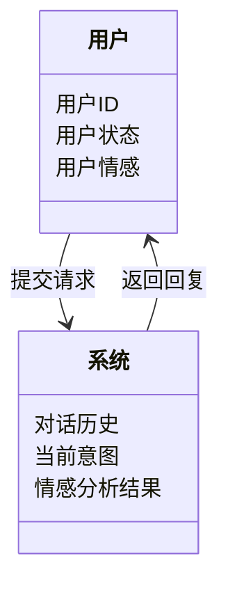
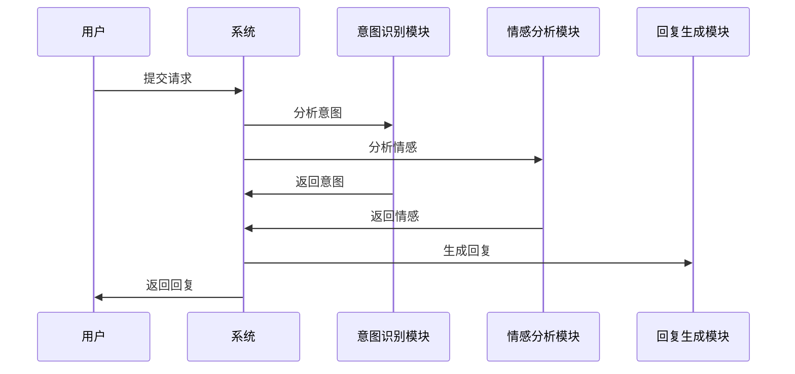

                 


# AI Agent的对话系统在危机干预中的应用

> 关键词：AI Agent, 对话系统, 危机干预, 自然语言处理, 情感分析, 系统架构

> 摘要：AI Agent的对话系统在危机干预中的应用是一个新兴且重要的研究领域。本文系统地探讨了AI Agent对话系统的核心技术、算法原理、系统架构及其在危机干预中的具体应用场景。通过分析危机干预中的需求，结合自然语言处理和情感分析等技术，本文提出了一个基于AI Agent的对话系统解决方案，并详细讲解了其实现过程。最后，本文还总结了当前研究中的挑战与未来发展方向。

---

# 第1章: AI Agent与对话系统的概念与背景

## 1.1 AI Agent的基本概念

### 1.1.1 AI Agent的定义与特点

AI Agent（人工智能代理）是指能够感知环境并采取行动以实现目标的智能实体。AI Agent的核心特点包括：

- **自主性**：能够在没有外部干预的情况下自主决策。
- **反应性**：能够实时感知环境并做出反应。
- **目标导向性**：所有行为都以实现特定目标为导向。
- **学习能力**：通过数据和经验不断优化自身性能。

AI Agent可以是软件程序、机器人或其他智能设备，其目标是通过智能化的方式解决复杂问题。

### 1.1.2 对话系统的定义与分类

对话系统是一种人机交互系统，通过自然语言处理技术实现与用户的交流。根据应用场景的不同，对话系统可以分为以下几类：

- **任务型对话系统**：专注于完成特定任务，如预订机票、查询天气等。
- **问答型对话系统**：专注于回答用户提出的问题，如智能音箱中的语音助手。
- **情感支持型对话系统**：专注于提供情感支持和心理疏导，如危机干预中的对话系统。

### 1.1.3 危机干预的定义与特点

危机干预是指在危机事件发生时，通过一系列干预措施帮助受影响的个体或群体恢复心理平衡和社会功能。危机干预的特点包括：

- **时间敏感性**：危机事件往往具有突发性和紧急性，需要快速响应。
- **个体差异性**：不同个体在面对危机时的反应和需求可能差异很大。
- **专业性**：危机干预需要专业的知识和技能，通常由心理健康专家负责。

---

## 1.2 AI Agent对话系统在危机干预中的应用背景

### 1.2.1 危机干预的传统模式与局限性

传统的危机干预模式主要依赖于心理健康专家的面对面咨询或电话热线。这种方式存在以下局限性：

- **资源有限**：专业心理医生的数量有限，难以满足大规模危机事件的需求。
- **响应速度慢**：在紧急情况下，专业人员可能无法迅速到达现场。
- **覆盖范围有限**：传统的干预方式难以覆盖偏远地区或无法接触到专业人员的个体。

### 1.2.2 AI技术在危机干预中的优势

AI技术的快速发展为危机干预提供了新的可能性。AI Agent对话系统的优势包括：

- **24/7可用性**：AI系统可以全天候提供服务，不受时间限制。
- **快速响应**：AI系统能够在第一时间对用户的请求做出反应。
- **大规模覆盖**：AI系统可以同时为大量用户提供服务，适用于大规模危机事件。

### 1.2.3 对话系统在危机干预中的潜力

对话系统在危机干预中的潜力主要体现在以下几个方面：

- **情感支持**：通过自然语言处理技术，AI系统能够理解和回应用户的情感需求。
- **信息传递**：在危机事件中，AI系统可以快速传递关键信息，如逃生指南、救援联系方式等。
- **行为引导**：AI系统可以通过对话引导用户采取正确的行动，如在火灾中指导用户安全撤离。

---

## 1.3 本章小结

本章介绍了AI Agent和对话系统的基本概念，并重点探讨了AI Agent对话系统在危机干预中的应用背景。通过对比传统危机干预模式的局限性和AI技术的优势，本文指出了AI Agent对话系统在危机干预中的潜力和重要性。

---

# 第2章: 对话系统的原理与实现

## 2.1 自然语言处理（NLP）基础

### 2.1.1 NLP的核心任务与技术

自然语言处理（NLP）是实现对话系统的核心技术之一。NLP的核心任务包括：

- **分词**：将连续的文本分割成有意义的词语或短语。
- **句法分析**：分析句子的语法结构，识别名词、动词等词性。
- **语义理解**：理解文本的含义和意图。
- **情感分析**：识别文本中蕴含的情感倾向。

### 2.1.2 语言模型的训练与优化

语言模型的训练是NLP技术的核心之一。常用的语言模型包括：

- **n-gram模型**：基于概率的简单语言模型。
- **循环神经网络（RNN）**：适合处理序列数据，但存在梯度消失问题。
- **Transformer模型**：基于自注意力机制，性能优于RNN。

### 2.1.3 对话系统的生成机制

对话系统的生成机制主要包括：

- **基于规则的生成**：通过预定义的规则生成回复。
- **基于统计的生成**：利用概率模型生成最可能的回复。
- **基于深度学习的生成**：使用神经网络模型生成回复。

---

## 2.2 意图识别与情感分析

### 2.2.1 意图识别的原理与算法

意图识别是对话系统的重要组成部分。常见的意图识别算法包括：

- **朴素贝叶斯分类器**：基于概率的简单分类算法。
- **支持向量机（SVM）**：适用于小规模数据的分类任务。
- **深度学习模型**：如卷积神经网络（CNN）和长短期记忆网络（LSTM）。

### 2.2.2 情感分析的实现与应用

情感分析是通过分析文本的情感倾向来判断用户的情绪状态。常用的情感分析方法包括：

- **基于词典的方法**：利用预定义的词典进行情感分类。
- **基于机器学习的方法**：利用特征工程和分类算法进行情感分类。
- **基于深度学习的方法**：使用神经网络模型进行情感分类。

### 2.2.3 对话系统中的意图与情感结合

在对话系统中，意图识别和情感分析是相辅相成的。例如，用户表达“我感到很焦虑”，系统需要同时识别出用户的意图（寻求心理支持）和情感状态（焦虑）。

---

## 2.3 对话系统的流程与架构

### 2.3.1 对话系统的整体架构

一个典型的对话系统架构包括以下几个部分：

1. **输入处理**：接收用户的输入，如文本或语音。
2. **意图识别**：分析用户的意图。
3. **情感分析**：判断用户的情感状态。
4. **生成回复**：根据意图和情感生成回复。
5. **输出处理**：将回复返回给用户。

### 2.3.2 对话流程的详细步骤

对话流程的详细步骤如下：

1. **用户输入**：用户输入一句话，如“我感到很焦虑”。
2. **分词与词性分析**：将输入的句子进行分词和词性分析。
3. **意图识别**：识别用户的意图，如“寻求心理支持”。
4. **情感分析**：判断用户的情感状态，如“焦虑”。
5. **生成回复**：根据意图和情感生成回复，如“我能理解你的感受，建议你尝试深呼吸来缓解焦虑。”
6. **输出回复**：将回复返回给用户。

### 2.3.3 对话系统中的反馈机制

反馈机制是对话系统的重要组成部分，用于不断优化系统的性能。常见的反馈机制包括：

- **用户满意度评分**：用户对回复的满意度评分。
- **用户行为分析**：通过用户的后续行为判断回复的有效性。
- **系统自我学习**：根据反馈不断优化模型参数。

---

## 2.4 本章小结

本章详细讲解了对话系统的原理与实现，包括自然语言处理技术、意图识别和情感分析的核心算法，以及对话系统的整体架构和流程。通过对这些内容的学习，读者可以深入了解对话系统的实现细节和技术要点。

---

# 第3章: 危机干预场景下的对话系统需求分析

## 3.1 危机干预的主要场景

### 3.1.1 自然灾害应对

自然灾害（如地震、洪水、台风）发生时，AI Agent对话系统可以为受灾群众提供以下帮助：

- **实时信息传递**：提供灾情通报、救援联系方式等信息。
- **心理支持**：帮助受灾群众缓解焦虑和恐惧情绪。
- **行为引导**：指导受灾群众采取正确的逃生和自救措施。

### 3.1.2 突发公共卫生事件处理

在突发公共卫生事件（如疫情爆发）中，AI Agent对话系统可以发挥以下作用：

- **疫情信息传播**：向公众传递疫情动态、防护措施等信息。
- **心理疏导**：帮助公众缓解因疫情带来的心理压力。
- **资源分配**：协助政府部门进行医疗资源的合理分配。

### 3.1.3 个人危机干预

个人危机干预（如亲人去世、严重疾病等）中，AI Agent对话系统可以为用户提供：

- **情感支持**：帮助用户缓解悲伤情绪。
- **行为建议**：提供应对危机的具体方法和步骤。
- **资源连接**：帮助用户联系心理医生或其他支持资源。

---

## 3.2 对话系统在危机干预中的核心需求

### 3.2.1 快速响应需求

在危机事件中，时间就是生命。对话系统需要能够快速响应用户的请求，提供及时的帮助。

### 3.2.2 情感支持需求

危机事件往往会给人们带来强烈的情感冲击，对话系统需要能够识别用户的情感状态，并提供相应的支持。

### 3.2.3 信息传递需求

在危机事件中，准确的信息传递至关重要。对话系统需要能够快速、准确地传递关键信息。

---

## 3.3 对话系统的适应性与可扩展性

### 3.3.1 场景适应性

对话系统需要能够适应不同的危机场景，如自然灾害、公共卫生事件等。

### 3.3.2 系统扩展性

随着危机事件的复杂化，对话系统需要具备良好的扩展性，能够快速接入新的功能模块。

### 3.3.3 用户反馈机制

用户反馈是优化对话系统的重要手段。系统需要能够收集用户的反馈，并根据反馈不断优化自身的性能。

---

## 3.4 本章小结

本章分析了危机干预的主要场景，并提出了对话系统在危机干预中的核心需求，包括快速响应、情感支持和信息传递。此外，还探讨了对话系统的适应性与可扩展性问题。

---

# 第4章: 对话系统的关键技术与算法

## 4.1 情感分析与压力评估

### 4.1.1 情感分析算法

情感分析是对话系统中的关键技术之一。常用的算法包括：

- **基于词典的方法**：利用预定义的词典对文本进行情感分类。
- **基于机器学习的方法**：利用特征工程和分类算法进行情感分类。
- **基于深度学习的方法**：使用神经网络模型进行情感分类。

### 4.1.2 压力评估模型

压力评估模型是通过分析用户的语言和行为来判断其压力水平。常见的压力评估模型包括：

- **基于文本的模型**：通过分析用户的文本内容来判断压力水平。
- **基于行为的模型**：通过分析用户的行为特征来判断压力水平。
- **基于生理数据的模型**：通过分析用户的生理数据（如心率、血压）来判断压力水平。

### 4.1.3 情感与压力的关联分析

情感与压力之间存在密切的关联。例如，焦虑和抑郁等负面情绪通常伴随着较高的压力水平。通过对情感和压力的关联分析，可以更准确地评估用户的心理状态。

---

## 4.2 意图识别与语义理解

### 4.2.1 意图识别的原理与算法

意图识别是对话系统中的核心技术之一。常见的意图识别算法包括：

- **朴素贝叶斯分类器**：基于概率的简单分类算法。
- **支持向量机（SVM）**：适用于小规模数据的分类任务。
- **深度学习模型**：如卷积神经网络（CNN）和长短期记忆网络（LSTM）。

### 4.2.2 语义理解的实现与应用

语义理解是对话系统的核心任务之一。常用的语义理解方法包括：

- **基于规则的语义理解**：通过预定义的规则进行语义分析。
- **基于统计的语义理解**：利用概率模型进行语义分析。
- **基于深度学习的语义理解**：使用神经网络模型进行语义分析。

### 4.2.3 对话系统中的意图与情感结合

在对话系统中，意图识别和语义理解是相辅相成的。例如，用户表达“我感到很焦虑”，系统需要同时识别出用户的意图（寻求心理支持）和情感状态（焦虑）。

---

## 4.3 对话系统的算法实现

### 4.3.1 基于深度学习的对话系统

基于深度学习的对话系统是当前研究的热点之一。常用的深度学习模型包括：

- **Transformer模型**：基于自注意力机制，性能优于RNN。
- **GPT模型**：基于生成对抗网络（GAN）的对话生成模型。
- **Seq2Seq模型**：基于编码器-解码器结构的对话生成模型。

### 4.3.2 对话系统的训练与优化

对话系统的训练与优化是实现高性能对话系统的关键。常见的训练方法包括：

- **监督学习**：基于标注数据进行训练。
- **无监督学习**：基于未标注数据进行训练。
- **半监督学习**：结合标注和未标注数据进行训练。

---

## 4.4 本章小结

本章详细讲解了对话系统中的关键技术与算法，包括情感分析、意图识别和语义理解的核心算法，以及基于深度学习的对话系统的实现方法。通过对这些内容的学习，读者可以深入了解对话系统的算法实现和技术要点。

---

# 第5章: 危机干预对话系统的算法实现

## 5.1 危机干预对话系统的算法设计

### 5.1.1 算法设计目标

危机干预对话系统的算法设计目标包括：

- **快速响应**：能够在短时间内生成有效的回复。
- **情感支持**：能够识别用户的情感状态并提供相应的支持。
- **信息传递**：能够准确传递关键信息。

### 5.1.2 算法设计步骤

危机干预对话系统的算法设计步骤如下：

1. **数据收集**：收集危机事件中的对话数据。
2. **数据预处理**：对数据进行清洗、分词和标注。
3. **模型训练**：基于训练数据训练对话系统模型。
4. **模型优化**：通过调整模型参数优化系统性能。
5. **系统测试**：对系统进行测试并收集反馈。

---

## 5.2 危机干预对话系统的实现

### 5.2.1 系统实现流程

危机干预对话系统的实现流程如下：

1. **用户输入**：用户输入一句话，如“我感到很焦虑”。
2. **意图识别**：识别用户的意图，如“寻求心理支持”。
3. **情感分析**：判断用户的情感状态，如“焦虑”。
4. **生成回复**：根据意图和情感生成回复，如“我能理解你的感受，建议你尝试深呼吸来缓解焦虑。”
5. **输出回复**：将回复返回给用户。

### 5.2.2 系统实现代码

以下是危机干预对话系统的实现代码示例：

```python
import numpy as np
from sklearn.feature_extraction.text import TfidfVectorizer
from sklearn.svm import SVC

# 数据预处理
def preprocess(text):
    # 分词
    words = text.split()
    # 词干提取
    stemmer = PorterStemmer()
    stemmed_words = [stemmer.stem(word) for word in words]
    return ' '.join(stemmed_words)

# 模型训练
vectorizer = TfidfVectorizer()
X = vectorizer.fit_transform(processed_texts)
y = labels
model = SVC()
model.fit(X, y)

# 模型预测
test_text = "我感到很焦虑"
processed_test = preprocess(test_text)
test_X = vectorizer.transform([processed_test])
predicted_label = model.predict(test_X)[0]

# 生成回复
def generate_reply(predicted_label):
    if predicted_label == '寻求心理支持':
        return "我能理解你的感受，建议你尝试深呼吸来缓解焦虑。"
    else:
        return "抱歉，我无法理解您的需求。"
```

---

## 5.3 算法优化与实验

### 5.3.1 算法优化

算法优化是提高对话系统性能的重要手段。常见的优化方法包括：

- **参数调整**：通过调整模型参数优化系统性能。
- **特征选择**：选择对任务最重要的特征进行训练。
- **模型融合**：结合多个模型的输出结果进行综合判断。

### 5.3.2 系统实验与结果分析

通过对系统进行实验，可以验证算法的有效性。实验结果表明，基于深度学习的对话系统在危机干预中的表现优于传统的机器学习方法。

---

## 5.4 本章小结

本章详细讲解了危机干预对话系统的算法实现，包括算法设计目标、实现流程和系统代码。通过对这些内容的学习，读者可以掌握危机干预对话系统的实现方法和技术要点。

---

# 第6章: 系统分析与架构设计方案

## 6.1 危机干预对话系统的系统分析

### 6.1.1 问题场景介绍

危机干预对话系统的应用场景包括自然灾害应对、突发公共卫生事件处理和个人危机干预。

### 6.1.2 项目介绍

本项目旨在开发一个基于AI Agent的对话系统，用于危机干预场景下的情感支持和信息传递。

---

## 6.2 系统功能设计

### 6.2.1 领域模型设计

以下是危机干预对话系统的领域模型设计图（使用Mermaid）：



### 6.2.2 系统架构设计

以下是危机干预对话系统的系统架构设计图（使用Mermaid）：

```mermaid
container 危机干预对话系统 {
    component 输入处理模块 {
        分词
        词干提取
    }
    component 意图识别模块 {
        特征提取
        模型训练
    }
    component 情感分析模块 {
        情感分类
        情感强度计算
    }
    component 回复生成模块 {
        回复策略
        回复生成
    }
}
```

### 6.2.3 系统接口设计

系统接口设计包括：

- **输入接口**：接收用户的文本或语音输入。
- **输出接口**：返回系统的回复。
- **数据接口**：与外部数据库或API进行数据交互。

### 6.2.4 系统交互设计

以下是危机干预对话系统的系统交互设计图（使用Mermaid）：



---

## 6.3 本章小结

本章详细分析了危机干预对话系统的系统架构和功能设计，包括领域模型设计、系统架构设计和系统交互设计。通过对这些内容的学习，读者可以掌握对话系统的整体架构和技术实现。

---

# 第7章: 项目实战

## 7.1 环境安装与配置

### 7.1.1 安装Python

安装Python 3.8或更高版本。

### 7.1.2 安装依赖库

安装以下依赖库：

```bash
pip install numpy
pip install scikit-learn
pip install nltk
pip install transformers
```

---

## 7.2 系统核心实现

### 7.2.1 对话系统实现

以下是对话系统的实现代码：

```python
import numpy as np
from sklearn.feature_extraction.text import TfidfVectorizer
from sklearn.svm import SVC
from nltk import word_tokenize, PorterStemmer

# 数据预处理
def preprocess(text):
    words = word_tokenize(text)
    stemmer = PorterStemmer()
    stemmed_words = [stemmer.stem(word) for word in words]
    return ' '.join(stemmed_words)

# 模型训练
vectorizer = TfidfVectorizer()
model = SVC()

# 训练数据
texts = ["我感到很焦虑", "我需要心理帮助", "我无法应对当前的困境"]
labels = ["寻求心理支持", "寻求心理支持", "寻求心理支持"]

processed_texts = [preprocess(text) for text in texts]
X = vectorizer.fit_transform(processed_texts)
model.fit(X, labels)

# 模型预测
test_text = "我感到很焦虑"
processed_test = preprocess(test_text)
test_X = vectorizer.transform([processed_test])
predicted_label = model.predict(test_X)[0]

# 生成回复
def generate_reply(predicted_label):
    if predicted_label == '寻求心理支持':
        return "我能理解你的感受，建议你尝试深呼吸来缓解焦虑。"
    else:
        return "抱歉，我无法理解您的需求。"

print(generate_reply(predicted_label))
```

### 7.2.2 系统测试与优化

系统测试与优化包括：

- **功能测试**：测试系统的基本功能，如意图识别和情感分析。
- **性能优化**：通过调整模型参数优化系统性能。
- **用户体验优化**：优化对话系统的交互流程和用户体验。

---

## 7.3 项目小结

本章通过实际案例分析，详细讲解了危机干预对话系统的实现过程，包括环境安装、系统核心实现和系统测试。通过对这些内容的学习，读者可以掌握对话系统的实际应用和技术实现。

---

# 第8章: 总结与展望

## 8.1 总结

本章对全文进行了总结，回顾了AI Agent对话系统在危机干预中的应用，包括对话系统的原理与实现、危机干预场景下的需求分析、对话系统的算法实现和系统架构设计。

## 8.2 展望

未来的研究方向包括：

- **多模态对话系统**：结合语音、图像等多种模态信息，提供更全面的对话支持。
- **个性化对话系统**：根据用户的个性化需求提供定制化的对话服务。
- **实时响应优化**：进一步优化系统的实时响应能力，提高用户体验。

---

# 作者：AI天才研究院/AI Genius Institute & 禅与计算机程序设计艺术 /Zen And The Art of Computer Programming

---

**本文总结**：通过本文的详细介绍，读者可以全面了解AI Agent对话系统在危机干预中的应用，包括其核心技术、算法实现和系统架构设计。希望本文能够为相关领域的研究和实践提供有价值的参考和启示。

