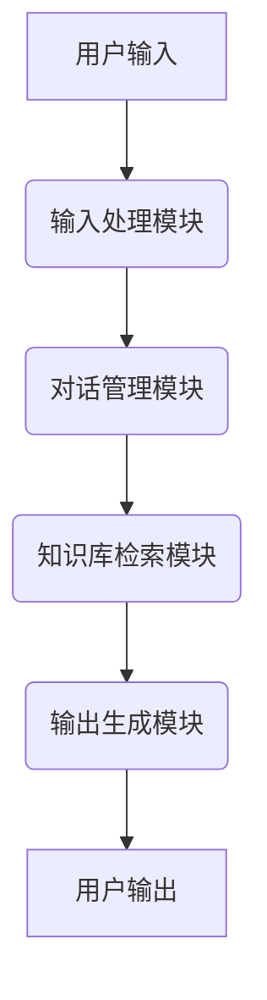

                 

# AI Agent的对话系统在智能客服中的进阶应用

**关键词：AI Agent，对话系统，智能客服，自然语言处理，深度学习，预训练语言模型**

**摘要：**  
本文深入探讨了AI Agent对话系统在智能客服中的进阶应用，从基本概念到核心原理，再到系统架构和实际案例，详细分析了其在智能客服中的价值和挑战。文章结合理论与实践，通过具体的算法原理、系统设计和案例分析，为读者提供了全面的视角，帮助理解并掌握AI Agent对话系统在智能客服中的应用。

---

## 第一章: AI Agent与对话系统概述

### 1.1 AI Agent的基本概念

#### 1.1.1 AI Agent的定义与特点
AI Agent（人工智能代理）是一种能够感知环境并采取行动以实现目标的智能实体。其特点包括：
- **自主性**：能够在没有外部干预的情况下独立运行。
- **反应性**：能够实时感知环境并做出反应。
- **主动性**：能够主动采取行动以实现目标。
- **社会性**：能够与其他Agent或人类进行交互。

#### 1.1.2 对话系统的定义与分类
对话系统是一种能够与人类进行自然语言交流的智能系统，主要分为以下几类：
- **基于规则的对话系统**：通过预定义的规则和关键词进行匹配。
- **统计对话系统**：基于大量的对话数据进行模式匹配。
- **深度学习对话系统**：利用神经网络模型生成对话内容。

#### 1.1.3 AI Agent在对话系统中的作用
AI Agent作为对话系统的核心，负责接收用户输入、理解意图、生成响应并执行相关操作。

---

### 1.2 智能客服的背景与需求

#### 1.2.1 智能客服的发展历程
智能客服从最初的简单关键词匹配，逐步发展到基于深度学习的自然语言处理技术。

#### 1.2.2 当前智能客服的主要挑战
- **理解能力不足**：难以准确理解用户的复杂需求。
- **对话流畅性差**：对话过程生硬，缺乏自然性。
- **知识更新缓慢**：难以及时更新产品信息。

#### 1.2.3 对话系统在智能客服中的价值
- **提升用户体验**：提供24/7的实时服务。
- **降低运营成本**：减少人工客服的需求。
- **提高服务效率**：快速响应用户需求。

---

### 1.3 本章小结
本章介绍了AI Agent和对话系统的基本概念，并分析了智能客服的发展背景和当前挑战，最后探讨了对话系统在智能客服中的价值。

---

## 第二章: 对话系统的核心原理

### 2.1 自然语言处理基础

#### 2.1.1 语言模型的原理
语言模型通过概率分布预测下一个词的概率，常用模型包括n-gram和Transformer模型。

#### 2.1.2 分词、句法分析与语义理解
- **分词**：将连续的文本分割成词语或短语。
- **句法分析**：分析句子的语法结构。
- **语义理解**：理解文本的深层含义。

#### 2.1.3 对话系统中的上下文管理
上下文管理负责维护对话的历史信息，确保对话的连贯性。

---

### 2.2 机器学习与深度学习在对话系统中的应用

#### 2.2.1 基于规则的对话系统
通过预定义的规则进行简单的对话匹配，适用于特定场景。

#### 2.2.2 基于统计模型的对话系统
利用统计学习方法，基于大量对话数据进行模式匹配。

#### 2.2.3 基于深度学习的对话系统
采用神经网络模型（如Transformer）生成对话内容，具有更强的语义理解和生成能力。

---

### 2.3 对话系统的训练与优化

#### 2.3.1 数据标注与预处理
对对话数据进行标注和清洗，确保数据质量。

#### 2.3.2 模型训练策略
- **监督学习**：基于标注数据进行训练。
- **无监督学习**：利用未标注数据进行自适应学习。

#### 2.3.3 对话系统评估指标
- **BLEU**：基于翻译的评估指标。
- **ROUGE**：基于文本摘要的评估指标。
- **人类评估**：通过人工评价对话的自然性和流畅性。

---

### 2.4 本章小结
本章从自然语言处理基础出发，分析了机器学习与深度学习在对话系统中的应用，并探讨了对话系统的训练与优化策略。

---

## 第三章: AI Agent对话系统的系统架构

### 3.1 系统模块划分

#### 3.1.1 用户输入处理模块
负责接收用户的输入并进行预处理。

#### 3.1.2 对话管理模块
负责维护对话上下文并生成响应。

#### 3.1.3 知识库与检索模块
基于知识库进行信息检索和验证。

#### 3.1.4 输出生成模块
生成最终的对话输出并返回给用户。

---

### 3.2 系统接口设计

#### 3.2.1 输入接口规范
定义用户输入的格式和处理方式。

#### 3.2.2 输出接口规范
定义系统输出的格式和返回方式。

#### 3.2.3 对外服务接口设计
设计API接口供其他系统调用。

---

### 3.3 系统架构图（Mermaid）

---

### 3.4 本章小结
本章详细分析了AI Agent对话系统的模块划分和接口设计，并通过Mermaid图展示了系统的整体架构。

---

## 第四章: 自然语言处理模型的实现

### 4.1 预训练语言模型在对话系统中的应用

#### 4.1.1 Transformer模型原理
Transformer模型通过自注意力机制和前馈网络实现高效的文本处理。

#### 4.1.2 预训练任务设计
- **Masked Language Model**：遮蔽语言模型。
- **Next Sentence Prediction**：下一句预测。

#### 4.1.3 微调任务
在特定任务上对预训练模型进行微调，提升任务相关性。

---

### 4.2 对话系统的训练与优化

#### 4.2.1 数据增强技术
通过数据增强技术扩展训练数据，提升模型的泛化能力。

#### 4.2.2 模型压缩与轻量化
通过模型压缩技术减少模型大小，提升运行效率。

---

### 4.3 本章小结
本章分析了预训练语言模型在对话系统中的应用，并探讨了训练与优化的策略。

---

## 第五章: 实际案例分析

### 5.1 智能客服中的对话系统应用

#### 5.1.1 电商客服中的对话系统
- **场景1**：用户咨询产品信息。
- **场景2**：用户反馈售后问题。

#### 5.1.2 金融客服中的对话系统
- **场景1**：用户查询账户信息。
- **场景2**：用户进行交易操作。

---

### 5.2 对话系统在智能客服中的效果评估

#### 5.2.1 效果评估指标
- **准确率**：系统回答正确的比例。
- **响应时间**：系统响应用户的时间。
- **用户满意度**：用户的主观评价。

---

### 5.3 本章小结
本章通过实际案例分析了对话系统在智能客服中的应用，并评估了其效果。

---

## 第六章: 系统优化与维护

### 6.1 性能优化策略

#### 6.1.1 模型优化
通过调整模型参数和优化算法提升模型性能。

#### 6.1.2 系统优化
通过优化系统架构和减少资源消耗提升系统性能。

---

### 6.2 用户体验提升

#### 6.2.1 对话流畅性优化
通过改进对话生成算法提升对话的自然性。

#### 6.2.2 多轮对话管理
通过维护对话上下文提升对话的连贯性。

---

### 6.3 安全与隐私保护

#### 6.3.1 数据安全
通过加密和访问控制保护用户数据。

#### 6.3.2 隐私保护
通过数据匿名化和最小化原则保护用户隐私。

---

### 6.4 本章小结
本章探讨了系统优化与维护的策略，包括性能优化、用户体验提升和安全隐私保护。

---

## 第七章: 总结与展望

### 7.1 全文总结
本文全面分析了AI Agent对话系统在智能客服中的应用，从基本原理到系统架构，再到实际案例，为读者提供了全面的视角。

### 7.2 未来展望
未来，随着技术的不断发展，AI Agent对话系统在智能客服中的应用将更加广泛，对话系统的能力也将不断提升。

---

**作者：AI天才研究院/AI Genius Institute & 禅与计算机程序设计艺术 /Zen And The Art of Computer Programming**

