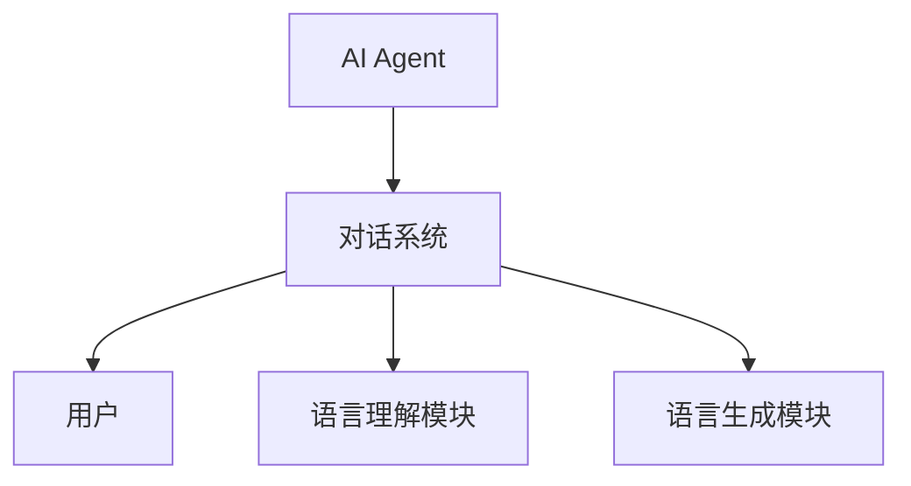
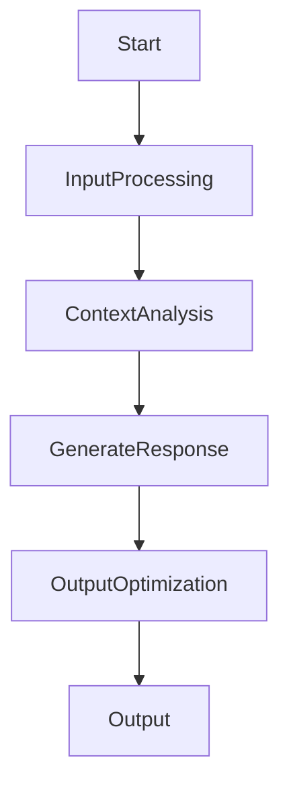
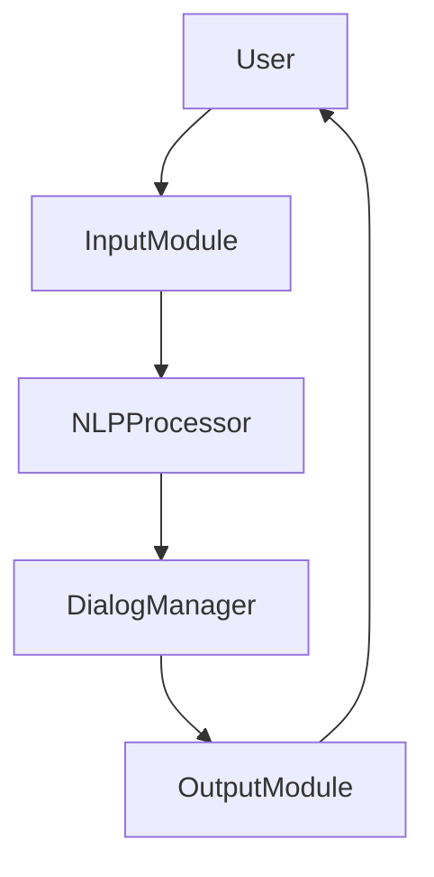
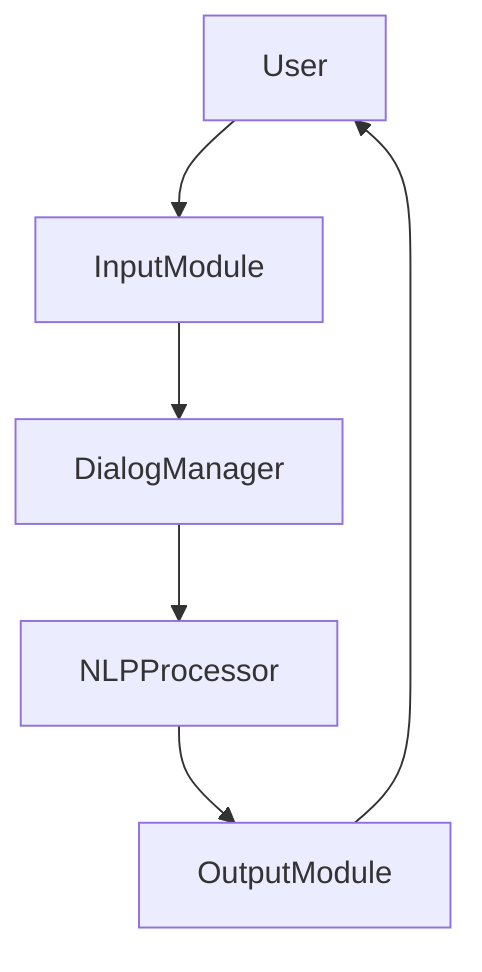

                 


# AI Agent的对话系统在跨代沟通中的应用

## 关键词：
AI Agent, 跨代沟通, 对話系统, 生成式模型, 系统架构

## 摘要：
本文探讨AI Agent在跨代沟通中的应用，重点分析对话系统的原理、算法和架构设计。通过实际案例和代码实现，展示AI Agent如何克服跨代沟通中的障碍，提升沟通效率和体验。

---

# 第1章: 跨代沟通的挑战与AI Agent的引入

## 1.1 跨代沟通的挑战

### 1.1.1 不同年龄段的沟通障碍
跨代沟通涉及不同年龄段的人群，如老年人、中年人和年轻人。由于成长背景、价值观和语言习惯的差异，沟通时常常出现误解。

### 1.1.2 跨代沟通中的文化差异
不同年龄段可能代表不同的文化背景，例如老年人可能更习惯传统沟通方式，而年轻人则倾向于使用数字工具。

### 1.1.3 跨代沟通中的技术鸿沟
技术鸿沟使得老年人难以理解和使用现代技术工具，导致沟通效率低下。

## 1.2 AI Agent在跨代沟通中的作用

### 1.2.1 AI Agent的定义与特点
AI Agent是一种智能代理，能够感知环境、理解需求并执行任务。其特点包括自主性、反应性、目标导向和学习能力。

### 1.2.2 AI Agent在跨代沟通中的优势
AI Agent能够通过自然语言处理技术，理解不同年龄段用户的语言习惯和需求，从而消除技术鸿沟。

### 1.2.3 跨代沟通中AI Agent的应用场景
- 老年人与子女的远程沟通
- 老年人使用智能设备的指导
- 不同年龄段之间的信息共享与协作

## 1.3 对話系统在跨代沟通中的重要性

### 1.3.1 对話系统的基本原理
对话系统通过自然语言处理技术，理解和生成人类语言，实现人与机器之间的交流。

### 1.3.2 对話系统在跨代沟通中的关键作用
对话系统能够帮助不同年龄段用户进行有效沟通，降低理解成本。

### 1.3.3 对話系统的分类与对比
- 基于规则的对话系统
- 基于统计的对话系统
- 基于深度学习的对话系统

## 1.4 本章小结
跨代沟通中的挑战主要体现在文化差异和技术创新鸿沟上。AI Agent通过对话系统能够有效克服这些障碍，提升沟通效率。

---

# 第2章: AI Agent对话系统的核心概念与联系

## 2.1 AI Agent的核心概念

### 2.1.1 AI Agent的定义
AI Agent是一种智能实体，能够感知环境、理解用户需求并执行相应任务。

### 2.1.2 AI Agent的分类
- 简单反射式Agent
- 基于模型的反射式Agent
- 目标驱动的Agent
- 学习驱动的Agent

### 2.1.3 AI Agent的关键属性
- 自主性
- 反应性
- 目标导向
- 学习能力

## 2.2 对話系统的核心概念

### 2.2.1 对話系统的定义
对话系统是一种人机交互系统，通过自然语言处理技术实现双向交流。

### 2.2.2 对話系统的组成部分
- 语言理解模块
- 语言生成模块
- 对話上下文管理模块

### 2.2.3 对話系统的实现原理
通过对输入文本的理解，生成符合语境的输出文本。

## 2.3 AI Agent与对话系统的联系

### 2.3.1 AI Agent在对话系统中的角色
AI Agent作为对话系统的核心，负责处理用户的输入并生成响应。

### 2.3.2 对話系统如何提升AI Agent的智能性
通过对话系统的交互，AI Agent能够不断学习和优化自身的对话能力。

### 2.3.3 AI Agent与对话系统的协同工作
AI Agent通过对话系统与用户交互，实现任务理解和执行。

## 2.4 核心概念对比表格

| 比较维度 | AI Agent | 对話系统 |
|----------|----------|----------|
| 核心功能 | 执行任务 | 生成对话 |
| 输入类型 | 多样化 | 文本/语音 |
| 输出形式 | 行为 | 文本/语音 |

## 2.5 ER实体关系图


## 2.6 本章小结
AI Agent与对话系统的结合，能够显著提升跨代沟通的效率和体验。

---

# 第3章: AI Agent对话系统的算法原理

## 3.1 生成式模型的原理

### 3.1.1 生成式模型的定义
生成式模型是一种通过学习数据分布生成新内容的模型。

### 3.1.2 常见的生成式模型算法
- Markov链
- 马尔可夫链蒙特卡洛方法
- Transformer模型

### 3.1.3 生成式模型的训练过程
通过大量数据训练模型，使其能够生成符合语境的文本。

## 3.2 对話系统的算法流程

### 3.2.1 对話系统的输入处理
接收用户的输入文本，进行语言理解和上下文分析。

### 3.2.2 对話系统的生成过程
基于生成式模型，生成符合语境的回应。

### 3.2.3 对話系统的输出优化
通过优化算法提升生成文本的质量。

## 3.3 算法流程图



## 3.4 算法实现代码

```python
def generate_response(input_text):
    # 语言理解模块
    context = analyze_context(input_text)
    # 语言生成模块
    response = generate_text(context)
    return response
```

## 3.5 数学模型与公式

### 3.5.1 生成式模型的数学公式
$$ P(y|x) = \text{模型生成概率} $$

### 3.5.2 对話系统的数学模型
$$ R = f(x) $$

## 3.6 本章小结
生成式模型是对话系统的核心，通过不断优化算法，能够提升对话的质量和自然度。

---

# 第4章: AI Agent对话系统的系统分析与架构设计

## 4.1 问题场景介绍

### 4.1.1 跨代沟通的具体问题
老年人与年轻人之间的沟通障碍。

### 4.1.2 AI Agent对话系统的应用场景
家庭沟通辅助、智能设备操作指导。

## 4.2 系统功能设计

### 4.2.1 系统的功能模块划分
- 用户输入模块
- 语言理解模块
- 语言生成模块
- 上下文管理模块

## 4.3 系统架构设计

### 4.3.1 系统架构图


### 4.3.2 系统组件说明
- 用户输入模块：接收用户输入
- NLPProcessor：处理自然语言
- DialogManager：管理对话流程
- OutputModule：生成输出文本

## 4.4 系统接口设计

### 4.4.1 用户接口
- 文本输入接口
- 语音输入接口

### 4.4.2 系统接口
- 输入处理接口
- 输出生成接口

## 4.5 系统交互流程图



## 4.6 本章小结
系统架构设计是实现AI Agent对话系统的关键，合理的架构能够提升系统的稳定性和扩展性。

---

# 第5章: AI Agent对话系统的项目实战

## 5.1 环境安装

### 5.1.1 安装Python
```bash
python --version
pip install --upgrade pip
```

### 5.1.2 安装依赖库
```bash
pip install transformers
pip install numpy
```

## 5.2 系统核心实现

### 5.2.1 语言理解模块
```python
def analyze_context(input_text):
    # 实现语言理解逻辑
    pass
```

### 5.2.2 语言生成模块
```python
def generate_text(context):
    # 实现语言生成逻辑
    pass
```

## 5.3 代码实现解读
通过语言理解模块，分析用户的输入文本，生成符合语境的回应。

## 5.4 案例分析
- 案例1：老年人与AI Agent的对话
- 案例2：跨代团队协作

## 5.5 项目小结
通过实际项目实现，验证了AI Agent对话系统在跨代沟通中的有效性。

---

# 第6章: 最佳实践与总结

## 6.1 最佳实践

### 6.1.1 系统优化建议
- 定期更新模型
- 提升算法效率

### 6.1.2 使用注意事项
- 保护用户隐私
- 提供多语言支持

## 6.2 小结
本文详细探讨了AI Agent对话系统在跨代沟通中的应用，通过理论分析和实际案例，展示了其在解决跨代沟通问题中的巨大潜力。

## 6.3 注意事项
- 确保系统的可解释性
- 提升系统的容错能力

## 6.4 拓展阅读
- 自然语言处理技术的发展
- 对話系统在其他领域的应用

---

# 作者：AI天才研究院 & 禅与计算机程序设计艺术

---

通过以上内容，我们详细分析了AI Agent对话系统在跨代沟通中的应用，从理论到实践，为读者提供了全面的技术解读。

