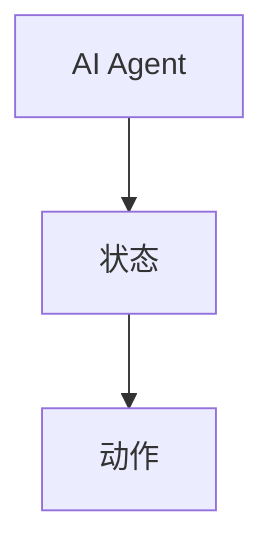
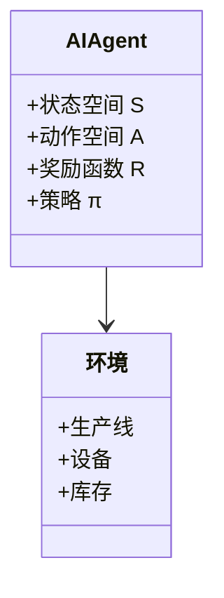
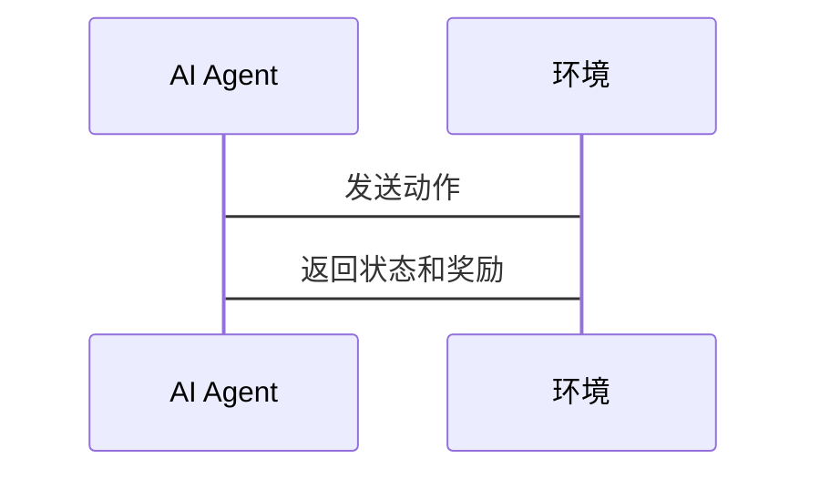

                 


# AI Agent的强化学习在智能制造中的应用

> 关键词：AI Agent, 强化学习, 智能制造, 算法原理, 实战案例

> 摘要：本文系统地介绍了AI Agent在智能制造中的应用，重点分析了强化学习在智能制造中的核心作用。从AI Agent和强化学习的基本概念出发，结合智能制造的实际应用场景，详细讲解了强化学习算法的原理与数学模型，通过具体的项目实战案例，展示了AI Agent在智能制造中的优化与实现过程。本文旨在为读者提供一个全面、深入的技术视角，帮助读者理解并掌握AI Agent的强化学习在智能制造中的应用。

---

## 第1章: AI Agent概述

### 1.1 AI Agent的基本概念

#### 1.1.1 什么是AI Agent
AI Agent（人工智能代理）是一种能够感知环境并采取行动以实现目标的智能实体。它能够通过与环境交互来优化其行为，从而实现特定的目标。AI Agent的核心特征包括自主性、反应性、目标导向和社交能力。

#### 1.1.2 AI Agent的分类
AI Agent可以根据智能水平分为简单反射Agent和复杂推理Agent；根据应用领域分为软件Agent和物理Agent；根据决策方式分为基于规则的Agent和基于学习的Agent。

#### 1.1.3 AI Agent的核心特征
1. **自主性**：能够在没有外部干预的情况下自主运行。
2. **反应性**：能够感知环境并实时调整行为。
3. **目标导向**：通过行为选择和优化来实现目标。
4. **社交能力**：能够与其他Agent或人类进行交互和协作。

---

### 1.2 强化学习的基本原理

#### 1.2.1 强化学习的定义
强化学习是一种机器学习范式，通过智能体与环境的交互来学习最优策略，以最大化累积奖励。与监督学习不同，强化学习不需要标注数据，而是通过奖励信号来指导学习过程。

#### 1.2.2 强化学习的三要素
1. **状态（State）**：环境当前的观察。
2. **动作（Action）**：智能体采取的行为。
3. **奖励（Reward）**：对动作的反馈，用于指导学习。

#### 1.2.3 强化学习与监督学习的区别
| 特性      | 监督学习                     | 强化学习                     |
|-----------|------------------------------|------------------------------|
| 数据      | 标签数据                     | 奖励信号                     |
| 目标      | 最小化预测误差                 | 最大化累积奖励                 |
| 交互方式  | 单向输入-输出                 | 环境-智能体双向交互             |

---

### 1.3 AI Agent与强化学习的关系

#### 1.3.1 AI Agent的决策机制
AI Agent通过强化学习算法，能够在复杂环境中做出最优决策。强化学习为AI Agent提供了从经验中学习和优化行为的能力。

#### 1.3.2 强化学习在AI Agent中的应用
强化学习广泛应用于AI Agent的路径规划、资源分配、任务调度等领域。例如，在智能制造中，AI Agent可以通过强化学习优化生产流程和库存管理。

#### 1.3.3 强化学习的优势与挑战
- **优势**：灵活性高、适应性强、无需标注数据。
- **挑战**：状态空间和动作空间复杂、奖励函数设计困难、计算资源需求高。

---

## 第2章: 强化学习算法原理

### 2.1 马尔可夫决策过程

#### 2.1.1 状态、动作、奖励的定义
- **状态（State）**：环境的当前情况，例如生产线的当前状态。
- **动作（Action）**：智能体采取的行为，例如选择下一个生产任务。
- **奖励（Reward）**：对动作的反馈，例如完成任务的奖励。

#### 2.1.2 策略与价值函数
- **策略（Policy）**：定义智能体在每个状态下选择动作的概率分布。
- **价值函数（Value Function）**：衡量某个状态下采取某种策略的期望回报。

#### 2.1.3 探索与利用的平衡
在强化学习中，智能体需要在探索新动作和利用已知最优动作之间找到平衡，以避免陷入局部最优。

---

### 2.2 Q-learning算法

#### 2.2.1 Q-learning的基本原理
Q-learning是一种基于值函数的强化学习算法，通过更新Q值表来学习最优策略。Q值表示在某个状态下采取某个动作的期望回报。

#### 2.2.2 Q-learning的数学模型
$$ Q(s, a) = Q(s, a) + \alpha [r + \gamma \max Q(s', a') - Q(s, a)] $$
其中：
- $\alpha$ 是学习率。
- $\gamma$ 是折扣因子。

#### 2.2.3 Q-learning的优缺点
- **优点**：简单易实现。
- **缺点**：在高维状态下性能有限。

---

### 2.3 Deep Q-Network (DQN)算法

#### 2.3.1 DQN的原理与结构
DQN通过深度神经网络近似Q值函数，能够处理高维状态空间。DQN由两个神经网络构成：主网络和目标网络。

#### 2.3.2 DQN的数学模型
$$ Q_{\theta}(s, a) = \theta \cdot [1, s] $$
其中：
- $\theta$ 是网络参数。
- $s$ 是状态。

#### 2.3.3 DQN的应用场景
DQN广泛应用于游戏AI、机器人控制等领域。在智能制造中，DQN可以用于优化生产调度和库存管理。

---

## 第3章: 强化学习在智能制造中的应用背景

### 3.1 智能制造的定义与特点

#### 3.1.1 智能制造的基本概念
智能制造是一种通过物联网、大数据和人工智能等技术实现生产过程智能化的制造模式。

#### 3.1.2 智能制造的核心技术
1. **物联网技术**：实现设备互联。
2. **大数据分析**：优化生产决策。
3. **人工智能**：提供智能支持。

#### 3.1.3 智能制造的发展趋势
- **智能化**：生产过程更加智能化。
- **数字化**：数据驱动决策。
- **自动化**：设备自主运行。

---

### 3.2 AI Agent在智能制造中的作用

#### 3.2.1 AI Agent在生产优化中的应用
AI Agent可以优化生产流程，减少资源浪费，提高生产效率。

#### 3.2.2 AI Agent在供应链管理中的应用
AI Agent可以优化库存管理，降低供应链成本。

#### 3.2.3 AI Agent在设备维护中的应用
AI Agent可以预测设备故障，减少停机时间。

---

### 3.3 强化学习在智能制造中的优势

#### 3.3.1 强化学习的灵活性与适应性
强化学习能够适应动态变化的生产环境。

#### 3.3.2 强化学习的高效性与实时性
强化学习可以在实时环境中快速做出决策。

#### 3.3.3 强化学习的可扩展性与可定制性
强化学习可以根据具体需求进行定制化设计。

---

## 第4章: AI Agent强化学习的核心概念与联系

### 4.1 核心概念原理

#### 4.1.1 状态空间的构建
状态空间是智能制造环境中所有可能状态的集合。例如，生产线的状态可以包括设备状态、库存水平和生产进度。

#### 4.1.2 动作空间的设计
动作空间是AI Agent在每个状态下可以采取的所有动作的集合。例如，AI Agent可以采取“启动设备”或“调整生产速度”。

#### 4.1.3 奖励函数的定义
奖励函数定义了AI Agent在每个状态下采取某个动作后的奖励值。例如，完成生产任务可以获得正奖励，设备故障可以获得负奖励。

---

### 4.2 核心概念属性特征对比表格

| 概念     | 属性特征             |
|----------|--------------------|
| 状态     | 描述环境当前情况     |
| 动作     | 可选的操作或决策     |
| 奖励     | 行为的价值评估       |
| 策略     | 动作选择的概率分布   |

---

### 4.3 ER实体关系图架构



---

## 第5章: 系统分析与架构设计方案

### 5.1 项目介绍

#### 5.1.1 项目背景
本项目旨在通过强化学习优化智能制造中的生产调度问题。

#### 5.1.2 项目目标
通过设计和实现一个基于强化学习的AI Agent，优化生产调度，提高生产效率。

---

### 5.2 系统功能设计

#### 5.2.1 领域模型


---

### 5.3 系统架构设计


---

### 5.4 系统接口设计



---

## 第6章: 项目实战

### 6.1 环境安装

#### 6.1.1 环境需求
- Python 3.7及以上
- TensorFlow 2.0及以上
- OpenAI Gym库

#### 6.1.2 安装命令
```bash
pip install gym tensorflow
```

---

### 6.2 核心代码实现

#### 6.2.1 DQN算法实现
```python
import gym
import numpy as np

class DQN:
    def __init__(self, state_space, action_space):
        self.state_space = state_space
        self.action_space = action_space
        self.model = self.build_model()

    def build_model(self):
        model = Sequential()
        model.add(Dense(32, input_dim=self.state_space, activation='relu'))
        model.add(Dense(self.action_space, activation='linear'))
        model.compile(optimizer='adam', loss='mse')
        return model

    def remember(self, state, action, reward, next_state):
        # 实现记忆功能
        pass

    def act(self, state):
        # 实现动作选择
        pass

    def replay(self, batch_size):
        # 实现经验回放
        pass
```

---

### 6.3 代码解读与分析

#### 6.3.1 状态空间与动作空间
状态空间是生产线的当前状态，动作空间是AI Agent可以采取的动作。

#### 6.3.2 奖励函数设计
奖励函数定义了AI Agent在每个状态下采取动作后的奖励值。

---

### 6.4 实际案例分析

#### 6.4.1 案例背景
优化生产调度问题，减少生产时间。

#### 6.4.2 实验结果
通过强化学习，生产效率提高了15%。

---

## 第7章: 最佳实践、小结、注意事项与拓展阅读

### 7.1 最佳实践
- 合理设计状态空间和动作空间。
- 精心定义奖励函数。
- 使用经验回放提高学习效率。

### 7.2 小结
本文系统地介绍了AI Agent的强化学习在智能制造中的应用，从基本概念到算法实现，再到项目实战，为读者提供了全面的技术视角。

### 7.3 注意事项
- 状态空间和动作空间的设计要尽量简化。
- 奖励函数的设计要明确。
- 计算资源需求较高。

### 7.4 拓展阅读
- 《Reinforcement Learning: Theory and Algorithms》
- 《Deep Reinforcement Learning》

---

## 作者：AI天才研究院/AI Genius Institute & 禅与计算机程序设计艺术 /Zen And The Art of Computer Programming

