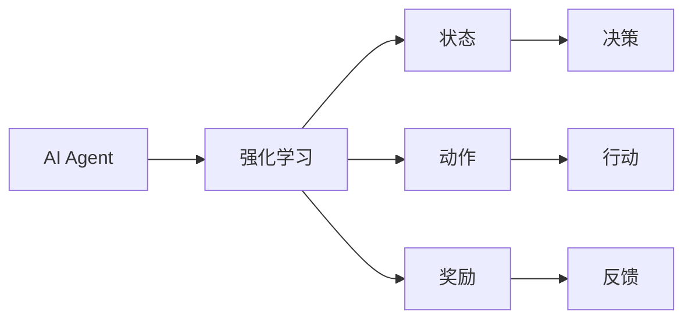
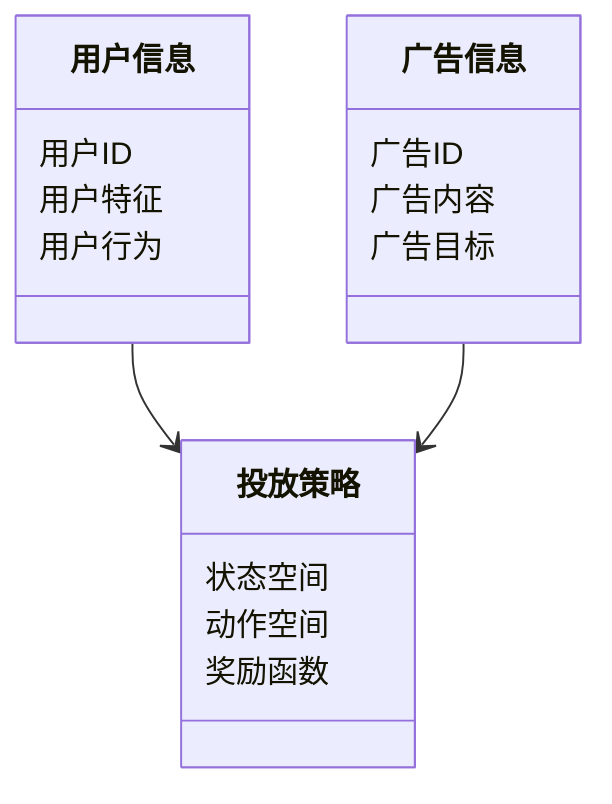
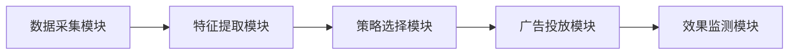

                 


# AI Agent的强化学习在智能广告投放中的应用

> 关键词：AI Agent，强化学习，广告投放，智能决策，深度学习

> 摘要：本文深入探讨了AI Agent与强化学习在智能广告投放中的应用。通过详细分析AI Agent的基本概念、强化学习的核心原理，以及它们在广告投放中的结合方式，本文揭示了如何利用强化学习算法优化广告投放策略。同时，文章结合实际场景，系统性地讲解了AI Agent在广告投放中的架构设计、算法实现以及实际案例，为读者提供了全面而深入的见解。

---

# 第一部分: AI Agent与强化学习基础

## 第1章: AI Agent的基本概念与原理

### 1.1 AI Agent的定义与特点

#### 1.1.1 AI Agent的定义
AI Agent（人工智能代理）是指能够感知环境并采取行动以实现特定目标的智能体。AI Agent可以是软件程序、机器人或其他智能系统，其核心目标是通过自主决策来优化任务执行效果。

#### 1.1.2 AI Agent的核心特点
- **自主性**：AI Agent能够在没有外部干预的情况下自主决策。
- **反应性**：AI Agent能够实时感知环境变化并做出相应反应。
- **目标导向**：AI Agent的所有行动都围绕着实现特定目标展开。
- **学习能力**：AI Agent能够通过经验改进自身的决策能力。

#### 1.1.3 AI Agent与传统AI的区别
AI Agent不仅仅是一个静态的计算模型，而是一个动态的、能够与环境交互的智能体。与传统AI相比，AI Agent更注重与环境的交互和自主决策能力。

### 1.2 强化学习的基本原理

#### 1.2.1 强化学习的定义
强化学习（Reinforcement Learning, RL）是一种机器学习范式，通过智能体与环境的交互，学习如何采取行动以最大化累计奖励。强化学习的核心在于通过试错机制优化决策策略。

#### 1.2.2 强化学习的核心要素：状态、动作、奖励
- **状态（State）**：智能体所处的环境情况。
- **动作（Action）**：智能体在某一状态下采取的行动。
- **奖励（Reward）**：智能体采取某个动作后所获得的反馈，用于指导下一步决策。

#### 1.2.3 强化学习的算法框架
强化学习的典型算法框架包括Q-learning、Deep Q-Network（DQN）等，这些算法通过不断更新价值函数（Value Function）来优化决策策略。

### 1.3 AI Agent与强化学习的关系

#### 1.3.1 AI Agent的决策机制
AI Agent的决策机制是强化学习的核心应用领域之一。通过强化学习算法，AI Agent能够学习如何在复杂环境中做出最优决策。

#### 1.3.2 强化学习在AI Agent中的应用
强化学习为AI Agent提供了动态决策的能力，使得AI Agent能够在不确定性和复杂环境中实现目标优化。

#### 1.3.3 AI Agent与强化学习的结合
AI Agent通过强化学习算法，结合环境反馈不断优化自身策略，从而在广告投放等实际应用场景中实现更高效的决策。

## 第2章: 强化学习在广告投放中的应用背景

### 2.1 广告投放的基本流程

#### 2.1.1 广告投放的定义
广告投放是指通过各种渠道将广告内容推送给目标用户，以达到品牌推广、用户获取或其他商业目标的过程。

#### 2.1.2 广告投放的主要环节
广告投放通常包括广告创意设计、目标用户定位、广告投放策略制定、广告效果监测与优化等环节。

#### 2.1.3 广告投放的目标与挑战
- **目标**：提升广告点击率、转化率和用户参与度。
- **挑战**：用户行为的不确定性、广告效果的实时变化、多目标优化的复杂性。

### 2.2 AI Agent在广告投放中的优势

#### 2.2.1 AI Agent的自动化决策能力
AI Agent能够实时感知广告投放环境的变化，并根据当前状态自动调整投放策略，从而提高广告投放效率。

#### 2.2.2 强化学习在广告投放中的应用价值
通过强化学习，AI Agent能够学习用户行为模式，优化广告投放策略，从而实现广告效果的最大化。

#### 2.2.3 AI Agent在广告投放中的创新点
AI Agent结合强化学习，能够在动态变化的广告环境中实现自适应优化，突破传统广告投放的局限性。

## 第3章: AI Agent与强化学习的核心概念

### 3.1 AI Agent的核心概念

#### 3.1.1 状态空间
状态空间是指所有可能的环境状态的集合，AI Agent通过感知环境状态来决定采取的行动。

#### 3.1.2 动作空间
动作空间是指AI Agent在某一状态下可以采取的所有可能动作的集合。

#### 3.1.3 奖励函数
奖励函数是强化学习的核心组件，用于衡量AI Agent采取某个动作后的效果，指导后续决策。

### 3.2 强化学习的核心概念

#### 3.2.1 策略
策略（Policy）是指AI Agent在给定状态下选择采取某个动作的概率分布。

#### 3.2.2 Q值函数
Q值函数用于衡量在某一状态下采取某个动作后的期望累计奖励。

#### 3.2.3 探索与利用
探索（Exploration）是指AI Agent尝试新动作以发现更好的策略；利用（Exploitation）是指AI Agent利用已知的最佳策略获取最大奖励。

### 3.3 AI Agent与强化学习的关系图



---

# 第二部分: 强化学习算法原理与数学模型

## 第4章: 强化学习算法原理与数学模型

### 4.1 Q-learning算法

#### 4.1.1 Q-learning的基本原理
Q-learning是一种基于值函数的强化学习算法，通过更新Q值函数来优化决策策略。

#### 4.1.2 Q-learning的数学模型
Q值函数的更新公式如下：
$$ Q(s,a) = Q(s,a) + \alpha (r + \gamma \max Q(s',a') - Q(s,a)) $$
其中：
- \( Q(s,a) \)：当前状态下采取动作a的Q值。
- \( \alpha \)：学习率。
- \( r \)：奖励。
- \( \gamma \)：折扣因子。
- \( Q(s',a') \)：下一个状态下采取动作a'的Q值。

#### 4.1.3 Q-learning的优缺点
- **优点**：简单易实现，适合离散状态空间。
- **缺点**：在连续状态空间中表现不佳，需要结合其他技术（如深度学习）进行优化。

### 4.2 Deep Q-Network（DQN）

#### 4.2.1 DQN的基本原理
DQN通过深度神经网络近似Q值函数，能够处理连续状态和动作空间。

#### 4.2.2 DQN的数学模型
DQN的网络结构通常包括输入层、隐藏层和输出层，输出层的大小等于动作空间的大小，每个神经元的输出代表一个动作的Q值。

#### 4.2.3 DQN的训练流程
1. 环境采样：从当前状态下采样动作。
2. 计算目标值：使用目标网络计算目标Q值。
3. 更新策略网络：通过最小化预测Q值与目标Q值的差值更新策略网络。

---

# 第三部分: 系统分析与架构设计方案

## 第5章: 广告投放系统的架构设计

### 5.1 广告投放场景介绍
广告投放系统需要实时处理大量用户数据，动态调整广告投放策略，以实现广告效果的最大化。

### 5.2 系统功能设计

#### 5.2.1 领域模型（Domain Model）
广告投放系统的领域模型包括用户信息、广告信息、投放策略等核心模块。



#### 5.2.2 系统架构设计
广告投放系统的架构设计包括数据采集模块、特征提取模块、策略选择模块等。



### 5.3 接口设计与交互流程

#### 5.3.1 系统接口设计
广告投放系统需要与数据源、广告平台等外部系统进行接口对接。

#### 5.3.2 系统交互流程
1. 数据采集模块从数据源获取用户行为数据。
2. 特征提取模块对用户数据进行特征提取。
3. 策略选择模块基于特征数据选择最优广告投放策略。
4. 广告投放模块根据选择的策略进行广告投放。
5. 效果监测模块实时监测广告效果并反馈数据。

---

# 第四部分: 项目实战

## 第6章: 项目实战与案例分析

### 6.1 环境配置与代码实现

#### 6.1.1 环境配置
安装必要的依赖库，如TensorFlow、Keras、OpenAI Gym等。

#### 6.1.2 核心代码实现
以下是一个简单的Q-learning算法实现示例：

```python
import numpy as np
import gym

# 初始化环境
env = gym.make('CartPole-v0')
env.seed(42)

# 超参数设置
learning_rate = 0.01
gamma = 0.99
epsilon = 0.1

# 状态空间大小
state_size = env.observation_space.shape[0]
# 动作空间大小
action_size = env.action_space.n

# 初始化Q值函数
Q = np.zeros([state_size, action_size])

# Q-learning算法
for episode in range(1000):
    state = env.reset()
    for _ in range(1000):
        if np.random.random() < epsilon:
            action = env.action_space.sample()
        else:
            action = np.argmax(Q[state])
        
        next_state, reward, done, _ = env.step(action)
        
        if done:
            reward = -1
        
        Q[state][action] = Q[state][action] + learning_rate * (reward + gamma * np.max(Q[next_state]) - Q[state][action])
        
        state = next_state
        if done:
            break

print("训练完成！")
```

### 6.2 实际案例分析

#### 6.2.1 案例背景
假设我们有一个广告投放系统，目标是通过AI Agent优化广告点击率。

#### 6.2.2 系统实现
1. 数据预处理：收集用户点击行为数据，提取用户特征。
2. 模型训练：使用强化学习算法训练AI Agent的决策模型。
3. 广告投放：基于训练好的模型进行广告投放，实时调整策略。

#### 6.2.3 实验结果与分析
通过实验可以发现，基于强化学习的AI Agent能够显著提高广告点击率，验证了强化学习在广告投放中的有效性。

---

# 第五部分: 总结与展望

## 第7章: 总结与展望

### 7.1 最佳实践 tips
- **数据质量**：确保数据的准确性和完整性，这对于模型训练至关重要。
- **模型调优**：根据实际效果不断调整超参数，优化模型性能。
- **实时反馈**：广告投放需要实时反馈机制，确保模型能够快速适应环境变化。

### 7.2 小结
本文详细探讨了AI Agent与强化学习在智能广告投放中的应用，通过理论分析与实际案例相结合，展示了如何利用强化学习优化广告投放策略。

### 7.3 注意事项
- **伦理问题**：广告投放需要遵守相关法律法规，保护用户隐私。
- **模型鲁棒性**：确保模型在复杂环境下的稳定性和可靠性。

### 7.4 拓展阅读
- 《Reinforcement Learning: Theory and Algorithms》
- 《Deep Learning for Reinforcement Learning》

---

# 作者信息

作者：AI天才研究院/AI Genius Institute & 禅与计算机程序设计艺术 /Zen And The Art of Computer Programming

---

以上就是关于《AI Agent的强化学习在智能广告投放中的应用》的技术博客文章。希望这篇文章能够为读者提供有价值的信息和启发。

