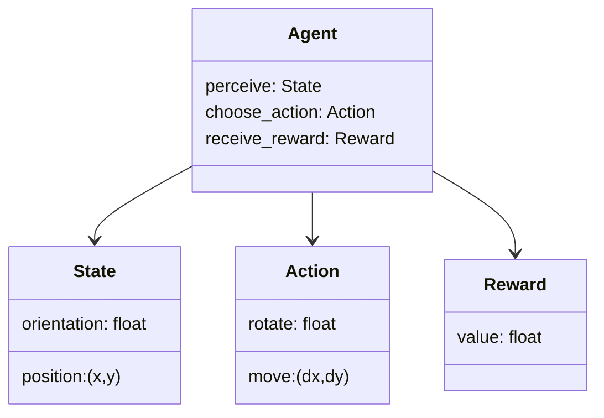
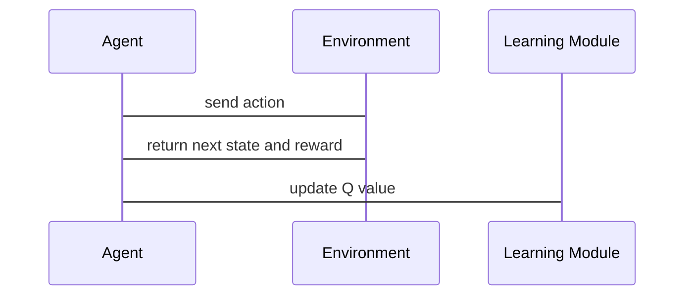

                 


# AI Agent的强化学习在智能控制中的应用

> 关键词：AI Agent，强化学习，智能控制，Q-learning，Deep Q-Networks，策略梯度，马尔可夫决策过程

> 摘要：本文详细探讨了AI Agent在智能控制中的应用，重点分析了强化学习的核心原理及其在智能控制中的实际应用。文章从AI Agent和强化学习的基本概念出发，逐步深入到强化学习的数学模型与算法原理，详细阐述了强化学习在智能控制中的具体应用案例，并结合实际项目，分析了系统设计与实现过程。通过本文的学习，读者可以全面理解AI Agent的强化学习在智能控制中的应用，掌握相关的算法原理与实现技巧。

---

# 第1章 AI Agent与强化学习概述

## 1.1 AI Agent的基本概念

### 1.1.1 AI Agent的定义

AI Agent（人工智能代理）是指能够感知环境并采取行动以实现目标的智能实体。AI Agent可以是软件程序、机器人或其他智能系统，其核心目标是通过与环境交互来优化自身行为。

### 1.1.2 AI Agent的核心特征

| 特征 | 描述 |
|------|------|
| 感知能力 | 能够感知环境状态并获取相关信息 |
| 决策能力 | 能够基于感知信息做出决策 |
| 行动能力 | 能够通过执行动作与环境交互 |
| 学习能力 | 能够通过经验优化自身行为 |

### 1.1.3 AI Agent的分类与应用场景

AI Agent可以根据智能水平分为简单反射型、基于模型的反应型、目标驱动型和实用驱动型。其应用场景包括自动驾驶、游戏AI、智能助手、机器人控制等。

---

## 1.2 强化学习的基本原理

### 1.2.1 强化学习的定义

强化学习（Reinforcement Learning, RL）是一种通过试错方法，学习最优策略以最大化累积奖励的机器学习范式。

### 1.2.2 强化学习的核心要素

| 要素 | 描述 |
|------|------|
| 状态空间 (State Space) | 环境的所有可能状态 |
| 动作空间 (Action Space) | Agent在每个状态下可执行的动作 |
| 奖励函数 (Reward Function) | 定义每个动作的即时奖励 |
| 策略 (Policy) | 定义在每个状态下选择动作的概率分布 |
| 值函数 (Value Function) | 衡量状态或动作-状态对的价值 |

### 1.2.3 强化学习与监督学习的区别

| 方面 | 监督学习 | 强化学习 |
|------|---------|----------|
| 数据来源 | 标签数据 | 环境反馈 |
| 反馈机制 | 确定性 | 延时性、不确定性 |
| 目标 | 最小化预测误差 | 最大化累积奖励 |

---

## 1.3 AI Agent与强化学习的结合

### 1.3.1 AI Agent在强化学习中的角色

AI Agent通过与环境交互，感知状态并选择动作以最大化累积奖励，从而实现目标。

### 1.3.2 强化学习在AI Agent控制中的应用

强化学习为AI Agent提供了自适应决策能力，能够动态优化其行为策略。

### 1.3.3 强化学习与智能控制的关联

智能控制需要动态优化控制策略，强化学习通过试错方法实现这一目标。

---

## 1.4 本章小结

本章介绍了AI Agent的基本概念及其在智能控制中的应用，分析了强化学习的核心原理，并探讨了AI Agent与强化学习的结合方式。

---

# 第2章 强化学习的数学模型与算法原理

## 2.1 强化学习的数学模型

### 2.1.1 状态空间与动作空间

状态空间是环境的所有可能状态的集合，动作空间是Agent在每个状态下可执行的动作的集合。

### 2.1.2 奖励函数与价值函数

奖励函数定义了每个动作的即时奖励，价值函数衡量了状态或动作-状态对的价值。

### 2.1.3 贝尔曼方程的数学表达

贝尔曼方程描述了最优价值函数的性质：

$$ V^*(s) = \max_{a} [ r(s,a) + \gamma V^*(s') ] $$

其中，$s$ 是当前状态，$a$ 是动作，$s'$ 是下一个状态，$\gamma$ 是折扣因子。

---

## 2.2 基础强化学习算法

### 2.2.1 Q-learning算法

Q-learning算法通过更新Q值表来学习最优策略：

$$ Q(s,a) = Q(s,a) + \alpha [ r + \gamma \max Q(s',a') - Q(s,a) ] $$

其中，$\alpha$ 是学习率。

### 2.2.2 Deep Q-Networks (DQN)算法

DQN算法使用深度神经网络近似Q值函数，通过经验回放和目标网络优化：

损失函数为：

$$ \mathcal{L} = \mathbb{E}[ (r + \gamma Q(s',a') - Q(s,a))^2 ] $$

### 2.2.3 策略梯度方法

策略梯度方法通过优化策略的参数来最大化累积奖励。

---

## 2.3 强化学习算法的数学推导

### 2.3.1 Q-learning的更新公式

Q-learning的更新公式为：

$$ Q(s,a) = Q(s,a) + \alpha [ r + \gamma \max Q(s',a') - Q(s,a) ] $$

### 2.3.2 DQN的网络结构与损失函数

DQN的损失函数为：

$$ \mathcal{L} = \mathbb{E}[ (r + \gamma Q(s',a') - Q(s,a))^2 ] $$

---

## 2.4 本章小结

本章详细推导了强化学习的数学模型与核心算法，包括Q-learning、DQN和策略梯度方法。

---

# 第3章 智能控制的基本原理

## 3.1 智能控制的定义与特点

### 3.1.1 智能控制的定义

智能控制是一种基于人工智能技术的控制方法，能够根据环境动态调整控制策略。

### 3.1.2 智能控制的核心特征

| 特征 | 描述 |
|------|------|
| 智能性 | 能够根据环境动态调整控制策略 |
| 自适应性 | 能够自适应环境变化 |
| 学习性 | 能够通过经验优化控制策略 |

### 3.1.3 智能控制与传统控制的区别

传统控制依赖于精确的数学模型，而智能控制通过学习优化控制策略。

---

## 3.2 强化学习在智能控制中的应用

### 3.2.1 强化学习在智能控制中的优势

强化学习能够处理动态环境和不确定性，适合应用于智能控制。

### 3.2.2 强化学习在智能控制中的挑战

数据需求大、计算复杂性高、奖励设计困难。

### 3.2.3 强化学习在智能控制中的典型应用

包括自动驾驶、智能机器人、游戏AI等领域。

---

## 3.3 本章小结

本章分析了智能控制的基本原理，探讨了强化学习在智能控制中的应用及其挑战。

---

# 第4章 AI Agent的强化学习算法

## 4.1 Q-learning算法的实现

### 4.1.1 Q-learning的基本流程

Q-learning的基本流程包括初始化Q值表、与环境交互、更新Q值表等步骤。

### 4.1.2 Q-learning的优缺点

优点：简单易实现；缺点：收敛速度慢，难以处理高维状态空间。

### 4.1.3 Q-learning的代码实现

```python
import numpy as np

class QLearning:
    def __init__(self, state_space_size, action_space_size, gamma=0.99, alpha=0.1):
        self.Q = np.zeros((state_space_size, action_space_size))
        self.gamma = gamma
        self.alpha = alpha

    def choose_action(self, state):
        return np.argmax(self.Q[state, :])

    def update(self, state, action, reward, next_state):
        self.Q[state, action] += self.alpha * (reward + self.gamma * np.max(self.Q[next_state, :]) - self.Q[state, action])
```

---

## 4.2 Deep Q-Networks (DQN)算法

### 4.2.1 DQN算法的基本原理

DQN算法使用深度神经网络近似Q值函数，通过经验回放和目标网络优化。

### 4.2.2 DQN算法的优缺点

优点：能够处理高维状态空间；缺点：需要大量计算资源。

### 4.2.3 DQN算法的代码实现

```python
import torch
import torch.nn as nn
import torch.optim as optim

class DQN:
    def __init__(self, state_space_size, action_space_size, hidden_size=64, gamma=0.99, alpha=0.001):
        self.net = nn.Sequential(
            nn.Linear(state_space_size, hidden_size),
            nn.ReLU(),
            nn.Linear(hidden_size, action_space_size)
        )
        self.target_net = nn.Sequential(
            nn.Linear(state_space_size, hidden_size),
            nn.ReLU(),
            nn.Linear(hidden_size, action_space_size)
        )
        self.gamma = gamma
        self.alpha = alpha
        self.optimizer = optim.Adam(self.net.parameters(), lr=alpha)

    def choose_action(self, state):
        with torch.no_grad():
            return torch.argmax(self.net(state)).item()

    def update(self, batch):
        states = torch.stack([x[0] for x in batch])
        actions = torch.stack([x[1] for x in batch])
        rewards = torch.stack([x[2] for x in batch])
        next_states = torch.stack([x[3] for x in batch])

        current_q = self.net(states).gather(1, actions)
        target_q = torch.max(self.target_net(next_states), 1)[0].detach()

        loss = torch.mean((rewards + self.gamma * target_q - current_q) ** 2)
        self.optimizer.zero_grad()
        loss.backward()
        self.optimizer.step()
```

---

## 4.3 策略梯度方法

### 4.3.1 策略梯度的基本原理

策略梯度方法通过优化策略的参数来最大化累积奖励。

### 4.3.2 策略梯度的优缺点

优点：直接优化策略；缺点：收敛速度慢。

### 4.3.3 策略梯度的代码实现

```python
import torch
import torch.nn as nn
import torch.optim as optim

class PolicyGradient:
    def __init__(self, state_space_size, action_space_size, hidden_size=64, gamma=0.99, alpha=0.001):
        self.net = nn.Sequential(
            nn.Linear(state_space_size, hidden_size),
            nn.ReLU(),
            nn.Linear(hidden_size, action_space_size)
        )
        self.gamma = gamma
        self.alpha = alpha
        self.optimizer = optim.Adam(self.net.parameters(), lr=alpha)

    def choose_action(self, state):
        with torch.no_grad():
            prob = torch.softmax(self.net(state), dim=0)
            return torch.multinomial(prob, 1).item()

    def update(self, batch):
        states = torch.stack([x[0] for x in batch])
        actions = torch.stack([x[1] for x in batch])
        rewards = torch.stack([x[2] for x in batch])

        log_probs = torch.log(torch.softmax(self.net(states), dim=0))
        loss = -torch.mean(log_probs[0][actions] * rewards)
        self.optimizer.zero_grad()
        loss.backward()
        self.optimizer.step()
```

---

## 4.4 本章小结

本章详细介绍了AI Agent的强化学习算法，包括Q-learning、DQN和策略梯度方法，并给出了代码实现。

---

# 第5章 系统分析与架构设计方案

## 5.1 问题场景介绍

本章以智能机器人导航问题为例，设计一个基于强化学习的控制方案。

---

## 5.2 系统功能设计

### 5.2.1 领域模型类图



---

### 5.2.2 系统架构设计


---

### 5.2.3 系统接口设计

系统接口包括感知接口、决策接口、执行接口和学习接口。

---

### 5.2.4 系统交互流程



---

## 5.3 本章小结

本章设计了智能控制系统的功能模块、架构和接口，并通过序列图展示了系统交互流程。

---

# 第6章 项目实战：智能机器人导航

## 6.1 环境安装

安装必要的库：

```bash
pip install gym numpy torch
```

---

## 6.2 核心实现

### 6.2.1 Q-learning实现

```python
import gym
import numpy as np

env = gym.make('CartPole-v0')
agent = QLearning(env.observation_space.shape[0], env.action_space.n)
```

---

### 6.2.2 DQN实现

```python
import torch
import torch.nn as nn
import torch.optim as optim
import gym

env = gym.make('CartPole-v0')
agent = DQN(env.observation_space.shape[0], env.action_space.n)
```

---

### 6.2.3 策略梯度实现

```python
import torch
import torch.nn as nn
import torch.optim as optim
import gym

env = gym.make('CartPole-v0')
agent = PolicyGradient(env.observation_space.shape[0], env.action_space.n)
```

---

## 6.3 代码实现与解读

### 6.3.1 Q-learning实现

```python
def train_q_learning(agent, env, episodes=1000):
    for episode in range(episodes):
        state = env.reset()
        total_reward = 0
        while True:
            action = agent.choose_action(state)
            next_state, reward, done, _ = env.step(action)
            agent.update(state, action, reward, next_state)
            total_reward += reward
            state = next_state
            if done:
                break
    return total_reward
```

---

## 6.4 实际案例分析

以CartPole环境为例，通过Q-learning、DQN和策略梯度方法进行训练，观察其学习效果。

---

## 6.5 本章小结

本章通过实际案例展示了AI Agent的强化学习在智能控制中的应用，并给出了代码实现和分析。

---

# 第7章 总结与展望

## 7.1 本章总结

本文详细探讨了AI Agent的强化学习在智能控制中的应用，从理论到实践，全面分析了相关算法与系统设计。

---

## 7.2 未来展望

未来的研究方向包括多智能体协作、复杂环境下的强化学习、实时优化算法等。

---

作者：AI天才研究院/AI Genius Institute & 禅与计算机程序设计艺术 /Zen And The Art of Computer Programming

