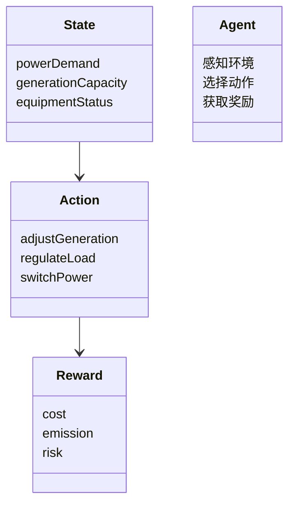
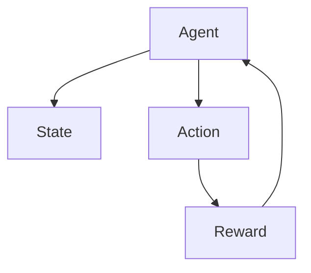
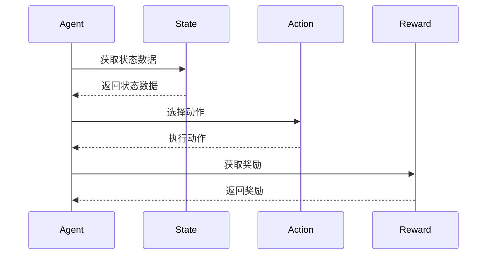

                 


---

# AI Agent的强化学习在智能电网管理中的应用

> 关键词：智能电网, AI Agent, 强化学习, 能源管理, 电力系统优化, 深度学习

> 摘要：本文深入探讨了AI Agent结合强化学习在智能电网管理中的应用。首先介绍了AI Agent和强化学习的基本概念，分析了智能电网管理的挑战。接着详细讲解了强化学习算法在电网调度和设备管理中的应用，通过实际案例展示了系统设计与实现。最后总结了当前成果并展望了未来发展方向。

---

## 第一部分: AI Agent与强化学习基础

### 第1章: AI Agent的基本概念与原理

#### 1.1 AI Agent的定义与特点

**1.1.1 AI Agent的定义**  
AI Agent（人工智能代理）是一种智能实体，能够感知环境、自主决策并执行任务。它通过传感器获取信息，利用知识库和推理机制处理信息，然后通过执行器与环境交互。AI Agent的核心目标是为用户提供智能化服务，提高效率和生活质量。

**1.1.2 AI Agent的核心特点**  
AI Agent具有以下几个关键特点：
1. **自主性**：能够在没有外部干预的情况下自主运行。
2. **反应性**：能够实时感知环境变化并做出响应。
3. **主动性**：主动采取行动以实现目标。
4. **社会性**：能够与其他AI Agent或人类进行协作与竞争。

**1.1.3 AI Agent与传统自动化的区别**  
AI Agent与传统自动化系统的主要区别在于其智能性和自主性。传统自动化系统通常基于固定的规则执行任务，而AI Agent能够学习、推理和自适应，能够在复杂环境中做出最优决策。

#### 1.2 强化学习的基本原理

**1.2.1 强化学习的定义**  
强化学习是一种机器学习方法，通过智能体与环境的交互，智能体通过试错方式学习策略，以最大化累计奖励。其核心是通过不断尝试和错误，找到最优的行为策略。

**1.2.2 强化学习的核心要素**  
强化学习系统主要包含以下几个核心要素：
1. **状态（State）**：环境在某一时刻的描述。
2. **动作（Action）**：智能体在给定状态下选择的行为。
3. **奖励（Reward）**：智能体执行动作后获得的反馈，用于评估动作的好坏。
4. **策略（Policy）**：智能体选择动作的概率分布，决定如何根据状态选择动作。
5. **值函数（Value Function）**：评估某状态下采取某动作后的预期累计奖励。

**1.2.3 强化学习与监督学习的区别**  
与监督学习不同，强化学习通过奖励信号指导智能体学习策略，而监督学习通过标记数据直接指导模型学习。强化学习更适用于动态环境中的决策问题，而监督学习更适合静态数据分类或回归任务。

### 第2章: 强化学习在智能电网中的应用背景

#### 2.1 智能电网的定义与特点

**2.1.1 智能电网的定义**  
智能电网是集成现代信息通信技术、计算机技术和电力系统技术的高度智能化电网，能够实时监测、分析和优化电力的生产、传输和消费。

**2.1.2 智能电网的核心功能**  
智能电网具有以下核心功能：
1. **智能监测**：实时监测电力系统的运行状态。
2. **智能分析**：利用数据分析和机器学习技术进行预测和优化。
3. **智能控制**：根据分析结果自动调整系统运行参数。
4. **智能决策**：基于实时数据做出最优决策。

**2.1.3 智能电网的发展趋势**  
随着能源互联网和物联网技术的发展，智能电网正朝着更加智能化、数字化和自动化的方向发展，AI技术在其中扮演越来越重要的角色。

#### 2.2 AI Agent在智能电网管理中的作用

**2.2.1 AI Agent在智能电网中的应用场景**  
AI Agent在智能电网中的应用主要体现在以下几个方面：
1. **电网调度**：优化电力资源分配，提高电网运行效率。
2. **设备管理**：实时监测设备状态，预测设备故障，优化设备维护计划。
3. **需求响应**：根据用户需求和电网状态，动态调整电力供应。
4. **能量管理**：优化能量存储和分配，提高可再生能源利用率。

**2.2.2 AI Agent在智能电网管理中的优势**  
AI Agent通过强化学习等技术，能够实现以下优势：
1. **自主决策**：无需人工干预，自动做出最优决策。
2. **动态适应**：能够根据环境变化实时调整策略。
3. **高效优化**：通过强化学习算法，实现资源的最优配置。

#### 2.3 AI Agent与智能电网的结合方式

**2.3.1 智能电网中的AI Agent架构**  
在智能电网中，AI Agent通常采用分布式架构，多个AI Agent协同工作，共同完成电网的监测、分析和控制任务。

**2.3.2 AI Agent与其他系统组件的交互**  
AI Agent通过与智能电网中的传感器、执行器、数据库等组件交互，实现数据的采集、处理、分析和控制。

### 第3章: 强化学习算法的基本原理

#### 3.1 强化学习的基本框架

**3.1.1 状态空间**  
状态空间是智能体可能遇到的所有状态的集合。在智能电网中，状态可能包括电力需求、设备状态、电网负荷等。

**3.1.2 行动空间**  
行动空间是智能体在给定状态下可以执行的所有动作的集合。在智能电网中，可能的动作包括调整发电量、调节负荷、切换电源等。

**3.1.3 奖励函数**  
奖励函数定义了智能体执行某个动作后获得的奖励。在智能电网中，奖励函数通常设计为反映电网运行效率、经济成本和环境影响的综合指标。

#### 3.2 Q-Learning算法

**3.2.1 Q-Learning的定义**  
Q-Learning是一种基于值函数的强化学习算法，通过学习状态-动作值函数（Q值）来优化决策策略。

**3.2.2 Q-Learning的算法流程**  
1. 初始化Q值表，所有Q(s,a)初始化为0。
2. 在给定状态下选择动作，执行动作并观察奖励。
3. 更新Q值表：Q(s,a) = Q(s,a) + α(r + γ * max Q(s',a'))，其中α是学习率，γ是折扣因子。
4. 重复上述步骤直到收敛。

**3.2.3 Q-Learning的数学模型**  
Q-Learning的数学模型可以表示为：
$$ Q(s,a) = Q(s,a) + \alpha \left[ r + \gamma \max_{a'} Q(s',a') - Q(s,a) \right] $$

#### 3.3 Deep Q-Networks (DQN)算法

**3.3.1 DQN的定义**  
DQN是一种结合深度学习和强化学习的算法，通过神经网络近似值函数，能够处理高维状态空间和动作空间。

**3.3.2 DQN的网络结构**  
DQN通常由两个神经网络构成：一个作为主网络，一个作为目标网络。主网络用于选择动作，目标网络用于评估动作的价值。

**3.3.3 DQN的训练流程**  
1. 环境中获取状态s，选择动作a，执行动作，观察新状态s'和奖励r。
2. 将(s,a,r,s')添加到经验回放池中。
3. 从经验回放池中随机抽取一批样本，训练神经网络。
4. 定期更新目标网络，使其接近主网络。

---

## 第二部分: 强化学习在智能电网管理中的应用

### 第4章: 强化学习在智能电网调度中的应用

#### 4.1 智能电网调度的定义与挑战

**4.1.1 智能电网调度的定义**  
智能电网调度是指利用先进的信息通信技术和智能算法，优化电力资源的分配和调度，确保电网安全、经济和高效运行。

**4.1.2 智能电网调度的核心挑战**  
智能电网调度面临以下主要挑战：
1. **多目标优化**：需要同时优化经济性、可靠性和环保性。
2. **动态变化**：电力需求和供应实时变化，需要快速响应。
3. **不确定性**：可再生能源的不稳定性增加了调度的难度。

#### 4.2 基于强化学习的电网调度算法

**4.2.1 算法框架**  
基于强化学习的电网调度算法通常包括以下步骤：
1. **状态表示**：将电网状态表示为一系列特征，如负荷需求、发电量、设备状态等。
2. **动作选择**：根据当前状态选择最优的调度动作。
3. **奖励机制**：设计奖励函数，根据调度结果给予奖励或惩罚。

**4.2.2 状态表示**  
在智能电网调度中，状态通常包括以下特征：
- **负荷需求**：不同区域的电力需求。
- **发电能力**：各发电厂的发电能力。
- **设备状态**：输电线路和设备的运行状态。
- **环境因素**：天气、电价等外部因素。

**4.2.3 动作选择**  
动作选择是基于当前状态选择最优的调度策略。在智能电网中，可能的动作包括：
- 调整发电量。
- 调节负荷。
- 切换电源。

**4.2.4 奖励机制**  
奖励机制设计是强化学习算法的核心部分。在智能电网调度中，奖励函数通常设计为：
$$ r = -\text{成本} - \lambda \times \text{排放} - \mu \times \text{风险} $$
其中，$\lambda$和$\mu$是惩罚系数，分别用于惩罚高排放和高风险的调度策略。

### 第5章: 强化学习在智能电网设备管理中的应用

#### 5.1 智能电网设备管理的定义与挑战

**5.1.1 智能电网设备管理的定义**  
智能电网设备管理是指利用AI技术和强化学习算法，优化电力设备的运行、维护和管理。

**5.1.2 智能电网设备管理的核心挑战**  
智能电网设备管理面临以下主要挑战：
1. **设备状态监测**：如何准确监测设备运行状态。
2. **故障预测**：如何准确预测设备故障并及时采取措施。
3. **维护优化**：如何优化设备维护计划，减少维护成本。

#### 5.2 基于强化学习的设备管理算法

**5.2.1 算法框架**  
基于强化学习的设备管理算法通常包括以下步骤：
1. **状态表示**：将设备状态表示为一系列特征，如温度、振动、电流等。
2. **动作选择**：根据当前状态选择最优的管理动作。
3. **奖励机制**：根据管理结果给予奖励或惩罚。

**5.2.2 状态表示**  
在智能电网设备管理中，状态通常包括以下特征：
- **设备参数**：温度、振动、电流等。
- **运行时间**：设备运行时间。
- **历史记录**：设备的历史故障和维修记录。

**5.2.3 动作选择**  
动作选择是基于当前状态选择最优的管理策略。在智能电网中，可能的动作包括：
- 维护设备。
- 更换部件。
- 调整运行参数。

**5.2.4 奖励机制**  
在智能电网设备管理中，奖励函数通常设计为：
$$ r = -\text{维护成本} - \lambda \times \text{故障率} - \mu \times \text{维修时间} $$
其中，$\lambda$和$\mu$是惩罚系数，分别用于惩罚高故障率和高维修时间。

---

## 第三部分: 系统设计与实现

### 第6章: 系统设计与架构设计方案

#### 6.1 问题场景介绍

智能电网管理系统需要实现对电力系统的实时监测、分析和控制，确保电网的安全、可靠和高效运行。该系统需要处理大量的实时数据，包括电力需求、发电量、设备状态等，并需要根据这些数据做出最优决策。

#### 6.2 项目介绍

本项目旨在开发一个基于AI Agent和强化学习的智能电网管理系统，能够实现以下功能：
1. 实时监测电力系统状态。
2. 自动优化电力调度。
3. 智能管理电力设备。

#### 6.3 系统功能设计

**领域模型（ER类图）**


**系统架构设计**


**系统接口设计**
- **输入接口**：接收电力系统的实时数据，包括负荷需求、发电量、设备状态等。
- **输出接口**：输出调度指令和管理策略，包括调整发电量、调节负荷、维护设备等。

**系统交互序列图**


### 6.3 系统实现

#### 6.3.1 环境安装

要运行本系统，需要以下环境：
1. **Python 3.8+**：用于编写代码。
2. **TensorFlow或Keras**：用于实现深度强化学习算法。
3. **NumPy**：用于数据处理和计算。
4. **Mermaid**：用于绘制图表。

#### 6.3.2 系统核心实现源代码

以下是一个简单的Q-Learning算法实现示例：
```python
import numpy as np

class QLearning:
    def __init__(self, state_size, action_size, learning_rate=0.1, gamma=0.9):
        self.state_size = state_size
        self.action_size = action_size
        self.lr = learning_rate
        self.gamma = gamma
        self.Q = np.zeros((state_size, action_size))
    
    def get_action(self, state):
        return np.argmax(self.Q[state, :])
    
    def update_Q(self, state, action, reward, next_state):
        target = reward + self.gamma * np.max(self.Q[next_state, :])
        self.Q[state, action] = self.Q[state, action] + self.lr * (target - self.Q[state, action])
```

#### 6.3.3 代码应用解读与分析

上述代码实现了一个简单的Q-Learning算法，包括动作选择和Q值更新。在智能电网调度中，可以将状态表示为电力需求、发电量等特征，动作表示为调整发电量、调节负荷等操作。

#### 6.3.4 实际案例分析

以下是一个简单的智能电网调度案例：
```python
# 初始化Q值表
state_size = 5
action_size = 3
agent = QLearning(state_size, action_size)

# 训练过程
for episode in range(100):
    state = np.random.randint(0, state_size)
    action = agent.get_action(state)
    next_state = np.random.randint(0, state_size)
    reward = calculate_reward(state, action, next_state)
    agent.update_Q(state, action, reward, next_state)
```

#### 6.3.5 项目小结

通过强化学习算法，我们可以实现智能电网的优化调度和设备管理，提高电网的运行效率和可靠性。

---

## 第四部分: 最佳实践与总结

### 7.1 最佳实践 tips

1. **数据质量**：确保输入数据的准确性和实时性，这对于强化学习算法的性能至关重要。
2. **算法选择**：根据具体应用场景选择合适的强化学习算法，如Q-Learning、DQN等。
3. **奖励机制设计**：合理设计奖励函数，确保算法能够优化目标。
4. **系统测试**：在实际应用中，需要进行充分的系统测试，确保算法的稳定性和可靠性。

### 7.2 小结

本文详细探讨了AI Agent结合强化学习在智能电网管理中的应用，从基本概念到算法实现，再到系统设计，全面分析了智能电网管理的挑战和解决方案。

### 7.3 注意事项

在实际应用中，需要注意以下几点：
1. **系统安全**：确保系统的安全性，防止黑客攻击。
2. **数据隐私**：保护用户数据隐私，遵守相关法律法规。
3. **系统维护**：定期维护和更新系统，确保其正常运行。

### 7.4 拓展阅读

1. **强化学习经典论文**：《Deep Reinforcement Learning with Double Q-learning》
2. **智能电网相关书籍**：《智能电网技术与应用》
3. **AI Agent相关论文**：《A Survey on AI Agent in Smart Grid Management》

---

## 作者：AI天才研究院 & 禅与计算机程序设计艺术

---

以上是《AI Agent的强化学习在智能电网管理中的应用》的技术博客文章，涵盖了从基础理论到系统实现的各个方面，内容详实，结构清晰，语言专业，适合技术读者深入阅读和理解。

