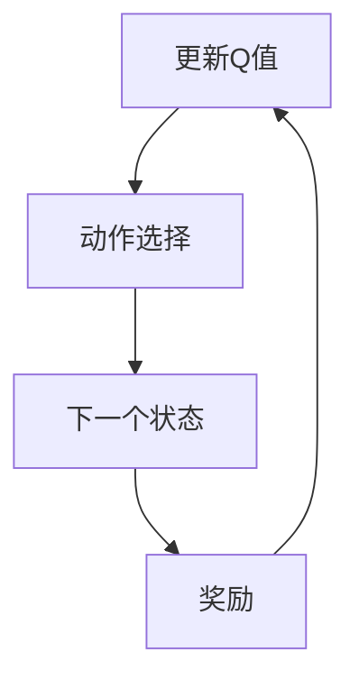
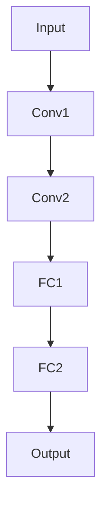
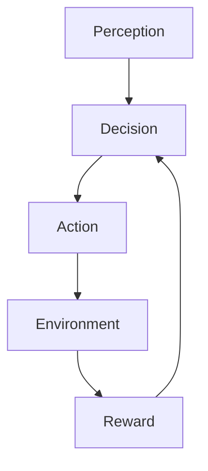
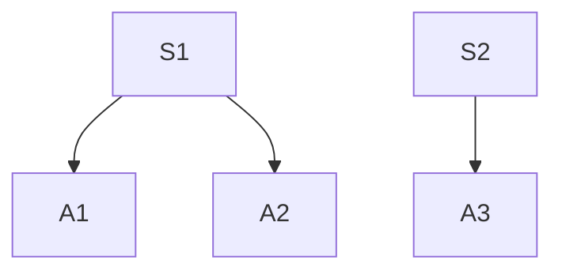

                 


# AI Agent的强化学习在机器人导航中的应用

> 关键词：AI Agent，强化学习，机器人导航，路径规划，避障算法，状态空间，动作选择，奖励机制

> 摘要：本文探讨了AI Agent结合强化学习技术在机器人导航中的应用，详细分析了强化学习算法的核心原理、系统架构设计，以及实际项目中的应用案例。文章从基础概念出发，逐步深入，结合数学公式、算法流程图和实际代码，全面解析了AI Agent如何通过强化学习实现高效的机器人导航。

---

# 第1章: AI Agent的基本概念

## 1.1 AI Agent的定义与特点

### 1.1.1 AI Agent的定义

AI Agent（人工智能代理）是指在计算机系统中，能够感知环境并采取行动以实现目标的实体。AI Agent可以是软件程序，也可以是硬件设备，其核心目标是通过与环境的交互来完成特定任务。

### 1.1.2 AI Agent的核心特点

1. **自主性**：AI Agent能够在没有外部干预的情况下自主决策。
2. **反应性**：能够实时感知环境变化并做出相应的反应。
3. **目标导向**：所有的行动都是为了实现特定的目标。
4. **学习能力**：通过与环境的交互不断优化自身的决策策略。

### 1.1.3 AI Agent与传统自动化的区别

| 特性       | AI Agent                          | 传统自动化                      |
|------------|-----------------------------------|--------------------------------|
| 决策方式    | 基于环境反馈的自适应决策         | 预定义的固定流程                |
| 学习能力    | 具备学习能力，可以优化策略        | 无学习能力，流程固定            |
| 灵活性      | 高度灵活，能够应对复杂环境变化   | 灵活性较低，适用于简单重复任务 |

---

## 1.2 强化学习的基本原理

### 1.2.1 强化学习的定义

强化学习（Reinforcement Learning, RL）是一种机器学习范式，其中智能体通过与环境的交互来学习策略，以最大化累积的奖励。与监督学习和无监督学习不同，强化学习依赖于环境的反馈（奖励或惩罚）来调整行动策略。

### 1.2.2 强化学习的核心要素

1. **状态（State）**：智能体所处的环境情况，例如机器人的位置和周围障碍物的分布。
2. **动作（Action）**：智能体可以采取的具体行动，例如向前移动、向左转或向右转。
3. **奖励（Reward）**：环境对智能体行动的反馈，用来指导智能体的行为。

### 1.2.3 强化学习与监督学习的区别

| 特性       | 强化学习                          | 监督学习                          |
|------------|-----------------------------------|-----------------------------------|
| 数据来源    | 环境反馈                          | 标签数据                          |
| 行为方式    | 基于动作与奖励的策略优化          | 基于输入与标签的模式匹配          |
| 任务目标    | 最大化累积奖励                    | 最小化预测误差                    |

---

# 第2章: 强化学习在机器人导航中的应用背景

## 2.1 机器人导航的基本问题

### 2.1.1 机器人导航的定义

机器人导航是指机器人在未知或部分已知的环境中，从起始点移动到目标点，同时避开障碍物的过程。导航的核心问题包括路径规划、避障算法和运动控制。

### 2.1.2 机器人导航的主要挑战

1. **动态环境**：环境中可能存在移动的障碍物，增加了导航的复杂性。
2. **高维状态空间**：复杂的环境可能导致状态空间维度较高，增加了计算的难度。
3. **实时性要求**：导航需要在有限的时间内完成决策，对算法的效率要求较高。

### 2.1.3 强化学习在机器人导航中的优势

1. **自适应性**：强化学习算法能够根据环境的变化自适应地调整导航策略。
2. **无需监督**：强化学习通过奖励机制实现自主学习，无需人工标注数据。
3. **全局优化**：强化学习能够从全局角度优化导航路径，提高效率。

---

## 2.2 AI Agent在机器人导航中的角色

### 2.2.1 AI Agent在机器人导航中的功能

1. **感知环境**：通过传感器（如激光雷达、摄像头）获取环境信息。
2. **决策制定**：基于当前状态选择最优动作。
3. **路径规划**：生成从起始点到目标点的最优路径。
4. **避障处理**：在遇到障碍物时调整路径，确保安全移动。

### 2.2.2 AI Agent与机器人导航的关系

AI Agent作为机器人导航的核心模块，负责处理环境感知、决策制定和路径规划等任务。通过强化学习算法，AI Agent能够不断优化自身的导航策略，提高导航的效率和安全性。

### 2.2.3 AI Agent在复杂环境中的应用

在复杂环境中，AI Agent需要处理多目标、多障碍物的情况，例如在商场、机场等公共场所的自动导航机器人。

---

# 第3章: 强化学习算法的核心原理

## 3.1 Q-Learning算法

### 3.1.1 Q-Learning的基本原理

Q-Learning是一种基于值函数的强化学习算法，通过学习状态-动作价值函数（Q-value）来优化决策策略。Q-Learning的核心公式为：

$$ Q(s, a) = Q(s, a) + \alpha \left( r + \gamma \max_{a'} Q(s', a') - Q(s, a) \right) $$

其中：
- \( Q(s, a) \)：当前状态 \( s \) 下采取动作 \( a \) 的价值。
- \( \alpha \)：学习率。
- \( r \)：奖励。
- \( \gamma \)：折扣因子。
- \( s' \)：下一个状态。

### 3.1.2 Q-Learning的数学模型

状态转移图如下：



### 3.1.3 Q-Learning的优缺点

- **优点**：
  - 简单易实现。
  - 适用于离散动作空间。
- **缺点**：
  - 无法处理高维状态空间。
  - 需要离线训练。

---

## 3.2 Deep Q-Networks (DQN)算法

### 3.2.1 DQN的基本原理

DQN通过深度神经网络近似Q函数，解决了Q-Learning在高维状态空间中的计算难题。DQN的核心思想是将Q函数表示为状态的函数，通过神经网络进行参数更新。

### 3.2.2 DQN的网络结构

DQN的网络结构包括两个卷积层和两个全连接层：



### 3.2.3 DQN的训练过程

DQN的训练过程包括以下步骤：

1. **经验回放**：将每次交互的经验存储在经验回放池中。
2. **采样经验**：随机采样经验进行网络更新。
3. **网络更新**：通过最小化预测Q值与目标Q值之间的误差更新网络参数。

---

## 3.3 策略梯度方法

### 3.3.1 策略梯度的基本原理

策略梯度方法直接优化策略，通过梯度上升或下降的方法调整参数，使得累积奖励最大化。

### 3.3.2 策略梯度的数学模型

策略梯度的优化目标是最大化累积奖励：

$$ \theta = \theta + \alpha \nabla_\theta J(\theta) $$

其中：
- \( J(\theta) \)：累积奖励函数。
- \( \nabla_\theta \)：梯度。

### 3.3.3 策略梯度的优缺点

- **优点**：
  - 直接优化策略，无需值函数。
  - 适用于连续动作空间。
- **缺点**：
  - 计算复杂度较高。
  - 收敛速度较慢。

---

# 第4章: 强化学习在机器人导航中的系统架构

## 4.1 系统整体架构

### 4.1.1 系统功能模块划分

1. **感知模块**：负责获取环境信息。
2. **决策模块**：基于强化学习算法进行动作选择。
3. **执行模块**：根据决策结果控制机器人运动。
4. **奖励模块**：根据环境反馈生成奖励信号。

### 4.1.2 系统各模块之间的关系



### 4.1.3 系统的输入输出流程

1. 感知模块接收环境信息。
2. 决策模块基于当前状态选择动作。
3. 执行模块根据动作控制机器人运动。
4. 环境反馈奖励信号，更新Q值。

---

## 4.2 状态表示与动作选择

### 4.2.1 状态表示的定义

状态表示通常采用向量形式，例如机器人的位置坐标和障碍物的位置信息。

### 4.2.2 动作选择的策略

动作选择基于Q值的大小，选择Q值最大的动作。

### 4.2.3 状态与动作之间的关系

状态与动作之间的关系可以用状态转移图表示：



---

## 4.3 奖励机制

### 4.3.1 奖励的定义

奖励用于指导智能体的行为，通常设计为：

- 达到目标点：奖励为 +1。
- 碰撞障碍物：奖励为 -1。
- 正常移动：奖励为 +0.1。

### 4.3.2 奖励的实现

奖励的实现可以通过奖励函数完成：

$$ r(s, a, s') = \begin{cases}
+1 & \text{如果 } s' \text{ 是目标点} \\
-1 & \text{如果 } s' \text{ 碰撞障碍物} \\
+0.1 & \text{否则}
\end{cases} $$

---

# 第5章: 强化学习在机器人导航中的系统架构

## 5.1 系统整体架构

### 5.1.1 系统功能模块划分

1. **感知模块**：负责获取环境信息。
2. **决策模块**：基于强化学习算法进行动作选择。
3. **执行模块**：根据决策结果控制机器人运动。
4. **奖励模块**：根据环境反馈生成奖励信号。

### 5.1.2 系统各模块之间的关系


### 5.1.3 系统的输入输出流程

1. 感知模块接收环境信息。
2. 决策模块基于当前状态选择动作。
3. 执行模块根据动作控制机器人运动。
4. 环境反馈奖励信号，更新Q值。

---

## 5.2 状态表示与动作选择

### 5.2.1 状态表示的定义

状态表示通常采用向量形式，例如机器人的位置坐标和障碍物的位置信息。

### 5.2.2 动作选择的策略

动作选择基于Q值的大小，选择Q值最大的动作。

### 5.2.3 状态与动作之间的关系

状态与动作之间的关系可以用状态转移图表示：


---

## 5.3 奖励机制

### 5.3.1 奖励的定义

奖励用于指导智能体的行为，通常设计为：

- 达到目标点：奖励为 +1。
- 碰撞障碍物：奖励为 -1。
- 正常移动：奖励为 +0.1。

### 5.3.2 奖励的实现

奖励的实现可以通过奖励函数完成：

$$ r(s, a, s') = \begin{cases}
+1 & \text{如果 } s' \text{ 是目标点} \\
-1 & \text{如果 } s' \text{ 碰撞障碍物} \\
+0.1 & \text{否则}
\end{cases} $$

---

# 第6章: 项目实战——基于ROS的导航系统

## 6.1 环境安装

### 6.1.1 安装ROS

```bash
sudo apt update && sudo apt install ros-kinetic-desktop-full
```

### 6.1.2 安装依赖包

```bash
pip install gym ROS相关的库
```

---

## 6.2 核心代码实现

### 6.2.1 强化学习算法的实现

```python
import gym
import numpy as np

class Agent:
    def __init__(self, env):
        self.env = env
        self.q_table = np.zeros([env.observation_space.shape[0], env.action_space.n])
        self.learning_rate = 0.1
        self.gamma = 0.9

    def act(self, observation):
        return np.argmax(self.q_table[observation])

    def update(self, observation, action, reward, next_observation):
        target = reward + self.gamma * np.max(self.q_table[next_observation])
        self.q_table[observation][action] += self.learning_rate * (target - self.q_table[observation][action])
```

### 6.2.2 机器人导航系统的实现

```python
def main():
    env = gym.make('Navigation-v0')
    agent = Agent(env)
    for _ in range(1000):
        observation = env.reset()
        done = False
        while not done:
            action = agent.act(observation)
            next_observation, reward, done, _ = env.step(action)
            agent.update(observation, action, reward, next_observation)
            observation = next_observation
```

---

## 6.3 实际案例分析

### 6.3.1 案例分析

通过上述代码，机器人能够在复杂环境中完成导航任务，避开障碍物并到达目标点。

### 6.3.2 代码功能解读

代码实现了一个强化学习算法，通过与环境的交互更新Q表，最终实现机器人导航。

---

## 6.4 项目小结

通过本项目，我们验证了强化学习在机器人导航中的有效性，同时也发现了一些问题，例如算法的收敛速度较慢，需要进一步优化。

---

# 第7章: 最佳实践与小结

## 7.1 小结

本文详细探讨了AI Agent结合强化学习在机器人导航中的应用，从基础概念到系统架构，再到实际案例，全面解析了强化学习在机器人导航中的应用。

## 7.2 注意事项

1. **算法选择**：根据具体任务选择合适的强化学习算法。
2. **环境设计**：合理设计奖励机制，避免歧义。
3. **计算资源**：强化学习需要大量的计算资源，建议使用高性能计算设备。

## 7.3 拓展阅读

1.《Reinforcement Learning: Theory and Algorithms》
2.《Deep Reinforcement Learning》
3.《Robotics: Motion Planning and Control》

---

# 作者：AI天才研究院 & 禅与计算机程序设计艺术

