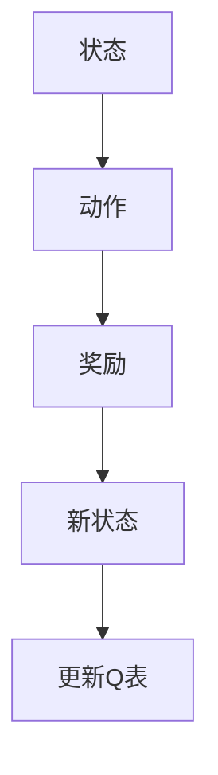
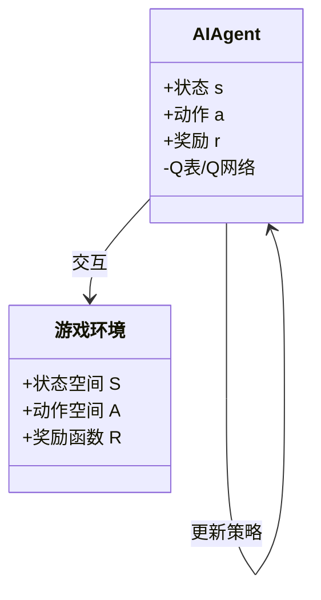
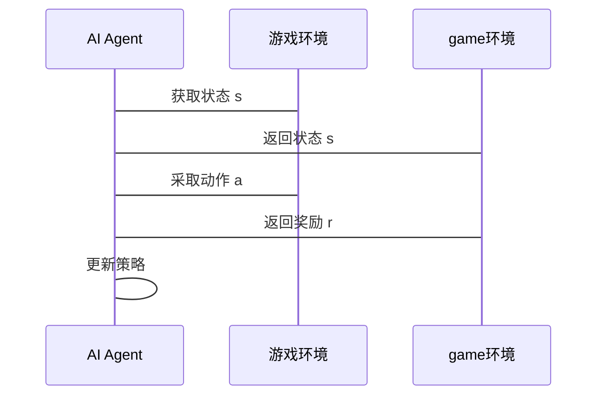

                 


# AI Agent的强化学习在游戏AI中的进阶应用

---

## 关键词：
AI Agent，强化学习，游戏AI，深度学习，算法设计，游戏开发

---

## 摘要：
本文深入探讨AI Agent在游戏AI中的强化学习应用，从基础概念到进阶算法，结合实际案例，全面分析强化学习在游戏AI中的实现原理、系统架构与优化策略。文章内容涵盖AI Agent的核心概念、强化学习的数学模型、主流算法（如DQN、PPO）的实现细节，以及在游戏系统中的应用设计。通过系统性地讲解和案例分析，帮助读者全面掌握AI Agent在游戏AI中的进阶应用技术。

---

## 目录

### 第1章：AI Agent与强化学习的背景介绍
1.1 AI Agent的核心概念  
1.2 强化学习的基本原理  
1.3 游戏AI中的强化学习应用背景  

### 第2章：AI Agent与强化学习的核心概念
2.1 AI Agent的定义与类型  
2.2 强化学习的核心要素与数学模型  
2.3 AI Agent与强化学习的对比分析  

### 第3章：强化学习算法原理
3.1 Q-learning算法的原理与实现  
3.2 DQN算法的数学模型与流程图  
3.3 PPO算法的优化策略与应用  

### 第4章：游戏AI系统设计
4.1 游戏AI的系统架构设计  
4.2 游戏AI的功能模块实现  
4.3 游戏AI的接口设计与交互流程  

### 第5章：强化学习在游戏AI中的系统实现
5.1 游戏环境的安装与配置  
5.2 强化学习算法的代码实现  
5.3 游戏AI的测试与优化  

### 第6章：强化学习在游戏AI中的实战案例
6.1 游戏AI的项目背景与目标  
6.2 游戏AI的实现步骤与代码分析  
6.3 游戏AI的测试与结果解读  

### 第7章：强化学习在游戏AI中的优化与扩展
7.1 强化学习算法的优化策略  
7.2 游戏AI的扩展功能设计  
7.3 强化学习在多智能体游戏中的应用  

### 第8章：总结与展望
8.1 本文的核心内容总结  
8.2 强化学习在游戏AI中的未来发展方向  
8.3 实践中的注意事项与建议  

---

## 正文

### 第1章：AI Agent与强化学习的背景介绍

#### 1.1 AI Agent的核心概念
AI Agent（智能体）是指能够感知环境并采取行动以实现目标的实体。在游戏AI中，AI Agent通常用于控制非玩家角色（NPC）的行为，使其能够自主决策和与玩家互动。

#### 1.2 强化学习的基本原理
强化学习是一种通过试错机制来学习最优策略的方法。智能体通过与环境交互，获得奖励或惩罚，从而逐步优化自己的行为策略。

#### 1.3 游戏AI中的强化学习应用背景
随着游戏复杂度的增加，传统的基于规则的AI方法已难以应对复杂的游戏场景。强化学习通过模拟试错过程，能够帮助AI Agent在动态环境中做出更智能的决策。

---

### 第2章：AI Agent与强化学习的核心概念

#### 2.1 AI Agent的定义与类型
AI Agent可以根据智能水平分为以下几类：
- **反应式AI Agent**：根据当前环境信息做出实时反应，如基于状态的决策。
- **认知式AI Agent**：具备复杂推理能力，能够规划和优化行为，如基于DQN的AI Agent。

#### 2.2 强化学习的核心要素与数学模型
强化学习的核心要素包括：
- **状态（State）**：环境当前的状况，如游戏中的角色位置和资源状态。
- **动作（Action）**：AI Agent在某一状态下采取的行为，如移动、攻击。
- **奖励（Reward）**：智能体在某一状态下采取动作后获得的反馈，用于指导学习方向。

#### 2.3 AI Agent与强化学习的对比分析
| 对比维度 | AI Agent | 强化学习 |
|----------|----------|----------|
| 核心目标 | 执行特定任务 | 学习最优策略 |
| 决策方式 | 基于规则或简单逻辑 | 基于试错和奖励机制 |
| 应用场景 | 游戏NPC控制、自动化系统 | 游戏AI、机器人控制 |

---

### 第3章：强化学习算法原理

#### 3.1 Q-learning算法的原理与实现
Q-learning是一种基于值函数的强化学习算法，通过更新Q表（Q-Table）来记录状态-动作对的最优值。



数学模型：
$$ Q(s, a) = Q(s, a) + \alpha (r + \gamma \max Q(s', a') - Q(s, a)) $$
其中，$\alpha$为学习率，$\gamma$为折扣因子。

---

#### 3.2 DQN算法的数学模型与流程图

DQN（Deep Q-Network）是一种结合深度学习的强化学习算法，通过神经网络近似Q值函数。

```mermaid
graph TD
    A[输入状态s] --> B[神经网络]
    B --> C[输出Q(s,a)]
    C --> D[选择动作a]
    D --> E[执行动作a]
    E --> F[接收奖励r]
    F --> G[更新神经网络参数]
```

数学模型：
$$ Q(s, a) = Q(s, a) + \alpha (r + \gamma \max Q(s', a') - Q(s, a)) $$

---

#### 3.3 PPO算法的优化策略与应用

PPO（Proximal Policy Optimization）是一种基于策略梯度的强化学习算法，适用于复杂的非线性问题。

数学模型：
$$ J(\theta) = \mathbb{E}[\min(\rho_t, \frac{1}{\epsilon}(1 - \rho_t))] $$
其中，$\rho_t$为策略变化率，$\epsilon$为约束参数。

---

### 第4章：游戏AI系统设计

#### 4.1 游戏AI的系统架构设计



#### 4.2 游戏AI的功能模块实现
- **感知模块**：获取游戏环境中的状态信息。
- **决策模块**：基于强化学习算法生成动作。
- **执行模块**：将动作应用于游戏环境。

#### 4.3 游戏AI的接口设计与交互流程



---

### 第5章：强化学习在游戏AI中的系统实现

#### 5.1 游戏环境的安装与配置
- 安装游戏引擎（如Unity或Unreal Engine）。
- 配置AI Agent的接口与游戏环境的交互。

#### 5.2 强化学习算法的代码实现
以下是一个简单的DQN算法代码示例：

```python
import numpy as np
import gym

env = gym.make('CartPole-v0')
env.seed(123)

class DQN:
    def __init__(self, state_space, action_space, lr=0.01, gamma=0.99):
        self.state_space = state_space
        self.action_space = action_space
        self.lr = lr
        self.gamma = gamma
        self.q_table = np.zeros((state_space, action_space))
    
    def act(self, state):
        return np.argmax(self.q_table[state])
    
    def learn(self, state, action, reward, next_state):
        target = reward + self.gamma * np.max(self.q_table[next_state])
        self.q_table[state][action] += self.lr * (target - self.q_table[state][action])

agent = DQN(env.observation_space.shape[0], env.action_space.n)
for episode in range(100):
    state = env.reset()
    total_reward = 0
    while True:
        action = agent.act(state)
        next_state, reward, done, _ = env.step(action)
        agent.learn(state, action, reward, next_state)
        total_reward += reward
        if done:
            break
        state = next_state
print("Training completed.")
```

#### 5.3 游戏AI的测试与优化
- 在游戏环境中测试AI Agent的表现。
- 根据测试结果优化算法参数和策略。

---

### 第6章：强化学习在游戏AI中的实战案例

#### 6.1 游戏AI的项目背景与目标
以设计一个智能NPC为例，目标是让NPC能够自主决策并与玩家互动。

#### 6.2 游戏AI的实现步骤与代码分析
- 安装游戏引擎并配置AI Agent接口。
- 实现强化学习算法（如DQN）并集成到游戏系统中。
- 进行测试和优化，确保NPC行为符合预期。

#### 6.3 游戏AI的测试与结果解读
通过测试评估AI Agent的表现，如NPC的行为是否合理、决策是否最优。

---

### 第7章：强化学习在游戏AI中的优化与扩展

#### 7.1 强化学习算法的优化策略
- 使用更深的神经网络结构。
- 引入经验回放机制（Experience Replay）以提高学习效率。

#### 7.2 游戏AI的扩展功能设计
- 实现多智能体协作与对抗。
- 集成强化学习与传统规则的混合策略。

#### 7.3 强化学习在多智能体游戏中的应用
- 在多人在线游戏中实现AI Agent的协作与竞争。

---

### 第8章：总结与展望

#### 8.1 本文的核心内容总结
本文系统地介绍了AI Agent与强化学习的基本概念，详细讲解了主流强化学习算法（如DQN、PPO）的原理与实现，并结合实际案例展示了强化学习在游戏AI中的应用。

#### 8.2 强化学习在游戏AI中的未来发展方向
- 更复杂的多智能体协作与对抗。
- 强化学习与生成式AI的结合。
- 更高效的强化学习算法设计。

#### 8.3 实践中的注意事项与建议
- 确保硬件资源充足以支持强化学习训练。
- 在实际应用中注意算法的收敛性和稳定性。

---

## 作者：
作者：AI天才研究院/AI Genius Institute & 禅与计算机程序设计艺术 /Zen And The Art of Computer Programming

