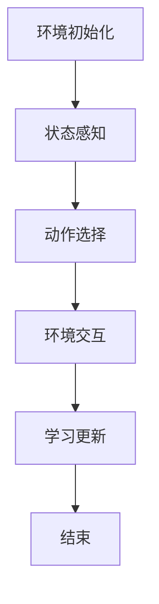
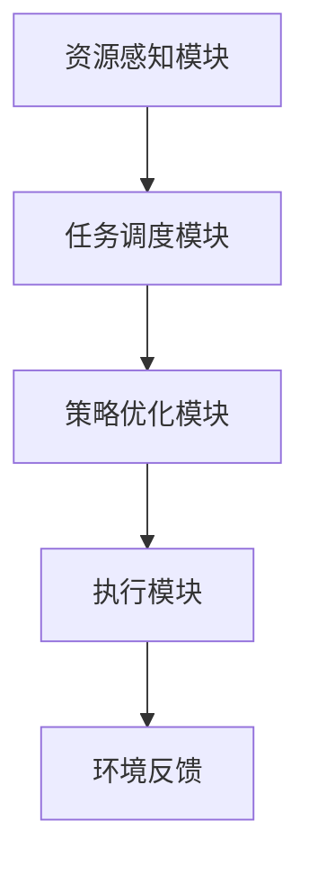

                 


# AI Agent的强化学习在资源调度中的应用

> 关键词：AI Agent，强化学习，资源调度，马尔可夫决策过程，强化学习算法，资源调度系统

> 摘要：本文深入探讨了AI Agent的强化学习在资源调度中的应用。首先，我们介绍了AI Agent和强化学习的基本概念，分析了资源调度问题的背景与挑战。接着，我们详细讲解了强化学习的核心原理，包括马尔可夫决策过程（MDP）模型和各种强化学习算法。然后，我们探讨了资源调度问题的强化学习建模方法，包括状态空间、动作空间和奖励函数的设计。随后，我们详细介绍了基于强化学习的资源调度算法的实现，包括算法的选择与优化、数学模型和公式推导。最后，我们通过一个实际的项目实战，展示了如何将强化学习应用于资源调度系统，并总结了最佳实践和未来的发展方向。

---

# 第1章: AI Agent与强化学习概述

## 1.1 AI Agent的基本概念

### 1.1.1 AI Agent的定义与特点
AI Agent（人工智能代理）是指能够感知环境、自主决策并执行任务的智能实体。AI Agent的核心特点包括：
1. **自主性**：能够在没有外部干预的情况下自主运行。
2. **反应性**：能够感知环境并实时做出反应。
3. **目标导向**：以特定目标为导向，优化决策过程。
4. **学习能力**：能够通过经验改进自身的决策能力。

### 1.1.2 强化学习的基本概念
强化学习是一种机器学习范式，通过智能体与环境的交互，学习如何采取行动以最大化累计奖励。强化学习的核心要素包括：
1. **状态（State）**：智能体所处的环境状况。
2. **动作（Action）**：智能体在给定状态下选择的行为。
3. **奖励（Reward）**：智能体执行动作后获得的反馈，用于指导学习过程。
4. **策略（Policy）**：智能体选择动作的概率分布。
5. **价值函数（Value Function）**：评估某状态下采取特定动作的价值。

### 1.1.3 AI Agent与强化学习的关系
AI Agent是强化学习的核心载体，强化学习是AI Agent实现自主决策的关键技术。AI Agent通过强化学习不断优化自身的决策策略，从而在复杂环境中实现高效的任务执行。

## 1.2 资源调度的基本问题

### 1.2.1 资源调度的定义与目标
资源调度是指在多资源竞争的环境中，合理分配和管理资源以满足任务需求的过程。资源调度的核心目标是最大化资源利用率、最小化资源浪费和降低任务执行成本。

### 1.2.2 资源调度的典型场景
资源调度在多个领域都有广泛应用，例如：
1. **云计算资源调度**：动态分配计算资源以满足用户需求。
2. **任务调度优化**：优化任务队列的执行顺序以提高系统吞吐量。
3. **交通信号控制**：优化交通信号灯的控制策略以减少拥堵。

### 1.2.3 强化学习在资源调度中的优势
强化学习通过试错学习的方式，能够在动态变化的环境中找到最优或近似最优的资源分配策略。相比传统的规则-based方法，强化学习能够更好地适应环境变化，提高资源利用效率。

## 1.3 本章小结
本章介绍了AI Agent和强化学习的基本概念，并分析了资源调度问题的背景与挑战。我们还探讨了强化学习在资源调度中的优势，为后续内容奠定了基础。

---

# 第2章: 强化学习的核心概念与数学模型

## 2.1 强化学习的基本原理

### 2.1.1 状态、动作、奖励的定义
- **状态（State）**：环境在某一时间点的描述，例如系统负载、资源使用情况等。
- **动作（Action）**：智能体在给定状态下选择的操作，例如分配资源、调整任务优先级等。
- **奖励（Reward）**：智能体执行动作后获得的反馈，通常以数值形式表示，用于指导学习过程。

### 2.1.2 策略与价值函数的定义
- **策略（Policy）**：智能体在给定状态下选择动作的概率分布，通常表示为$\pi(a|s)$，即在状态$s$下选择动作$a$的概率。
- **价值函数（Value Function）**：评估某状态下采取特定动作的价值，通常包括状态价值函数$V(s)$和动作价值函数$Q(s,a)$。

### 2.1.3 探索与利用的平衡
强化学习的核心挑战之一是平衡探索（探索未知状态和动作）与利用（利用已知最优策略）。常用的策略包括$\epsilon$-贪心算法，其中$\epsilon$表示探索的概率。

## 2.2 马尔可夫决策过程（MDP）模型

### 2.2.1 MDP的数学定义
马尔可夫决策过程是一种用于描述强化学习问题的数学模型，其主要组成部分包括：
- **状态空间（State Space）**：所有可能的状态集合$S$。
- **动作空间（Action Space）**：所有可能的动作集合$A$。
- **转移概率（Transition Probability）**：从状态$s$执行动作$a$后转移到状态$s'$的概率$P(s'|s,a)$。
- **奖励函数（Reward Function）**：执行动作$a$在状态$s$下获得的奖励$r(s,a)$。

### 2.2.2 策略评估与控制的数学公式
- **策略评估**：计算在策略$\pi$下状态$s$的价值函数$V_{\pi}(s)$：
  $$ V_{\pi}(s) = E_{\pi}[R_t | s_t = s] $$
- **策略优化**：通过最大化Q值函数$Q_{\pi}(s,a)$来优化策略$\pi$：
  $$ Q_{\pi}(s,a) = E_{\pi}[R_t + \gamma V_{\pi}(s') | s_t = s, a_t = a] $$
  其中，$\gamma$是折扣因子，表示未来奖励的当前价值。

## 2.3 强化学习算法的分类

### 2.3.1 基于值函数的方法
基于值函数的算法通过学习状态或动作的价值函数来优化策略，主要包括：
1. **动态规划（DP）方法**：如价值迭代（Value Iteration）和策略迭代（Policy Iteration）。
2. **蒙特卡洛方法（MC）**：如蒙特卡洛价值评估（Monte Carlo Value Evaluation）。
3. **时序差分（TD）方法**：如Q-Learning和SARSA。

### 2.3.2 基于策略梯度的方法
基于策略梯度的算法直接优化策略，通过计算策略梯度来更新参数，主要包括：
1. **策略梯度方法（PG）**：如REINFORCE算法。
2. **自然策略梯度方法（NPG）**：通过自然梯度优化策略。

### 2.3.3 基于Actor-Critic架构的方法
Actor-Critic架构结合了策略梯度和值函数的优势，通过同时学习策略（Actor）和价值函数（Critic）来优化决策过程。

## 2.4 本章小结
本章详细讲解了强化学习的核心概念和数学模型，包括马尔可夫决策过程（MDP）模型和各种强化学习算法的分类与原理。这些内容为后续章节的资源调度问题建模和算法实现奠定了理论基础。

---

# 第3章: 资源调度问题的强化学习建模

## 3.1 资源调度问题的背景与挑战

### 3.1.1 资源调度的典型场景
资源调度在多个领域中有广泛应用，例如云计算中的资源分配、分布式系统中的任务调度以及智能交通系统中的资源分配。

### 3.1.2 资源调度的典型挑战
资源调度问题通常具有以下特点：
1. **动态性**：资源需求和可用性随时间变化。
2. **多目标性**：需要在多个目标（如资源利用率、响应时间、成本）之间进行权衡。
3. **不确定性**：环境和任务需求具有不确定性。

### 3.1.3 强化学习在资源调度中的优势
强化学习通过试错学习的方式，能够在动态变化的环境中找到最优或近似最优的资源分配策略。相比传统的规则-based方法，强化学习能够更好地适应环境变化，提高资源利用效率。

## 3.2 资源调度问题的强化学习建模

### 3.2.1 状态空间的定义
状态空间是强化学习模型的核心组成部分之一。我们需要根据具体的资源调度场景定义合适的状态表示。例如：
- 在云计算资源调度中，状态可以包括CPU使用率、内存使用率、磁盘使用率等指标。
- 在任务调度优化中，状态可以包括任务队列长度、任务优先级等信息。

### 3.2.2 动作空间的定义
动作空间是智能体在给定状态下可以执行的所有动作的集合。例如：
- 在云计算资源调度中，动作可以包括分配更多计算资源、释放未使用的资源、调整虚拟机数量等。
- 在任务调度优化中，动作可以包括调整任务优先级、重新分配任务队列等。

### 3.2.3 奖励函数的设计
奖励函数是强化学习模型的关键反馈机制，用于指导智能体的学习过程。我们需要根据具体的资源调度目标设计合适的奖励函数。例如：
- 在云计算资源调度中，奖励函数可以基于资源利用率、任务响应时间等指标设计。
- 在任务调度优化中，奖励函数可以基于系统吞吐量、任务完成时间等指标设计。

## 3.3 强化学习算法的选择与优化

### 3.3.1 算法选择的依据
选择合适的强化学习算法需要考虑以下几个方面：
1. **问题复杂性**：问题的复杂程度决定了算法的选择。例如，对于高维状态空间的问题，可能需要选择基于价值函数的算法。
2. **环境动态性**：环境的动态性决定了算法的适应性。例如，动态变化的环境可能需要选择基于策略梯度的算法。
3. **计算资源**：算法的计算复杂度和资源需求也需要考虑。

### 3.3.2 算法优化的关键点
优化强化学习算法的关键点包括：
1. **状态和动作空间的维度**：降低状态和动作空间的维度可以提高算法的效率。
2. **奖励函数的设计**：设计合理的奖励函数可以提高学习效率和模型性能。
3. **算法参数的调整**：如学习率、折扣因子等参数的调整可以优化算法性能。

## 3.4 本章小结
本章详细讲解了资源调度问题的强化学习建模方法，包括状态空间、动作空间和奖励函数的设计。我们还探讨了强化学习算法的选择与优化策略，为后续章节的算法实现奠定了基础。

---

# 第4章: 基于强化学习的资源调度算法实现

## 4.1 算法实现的整体框架

### 4.1.1 算法框架的设计
基于强化学习的资源调度算法通常包括以下几个步骤：
1. **环境初始化**：设置初始状态和参数。
2. **状态感知**：智能体感知当前环境状态。
3. **动作选择**：根据当前状态选择动作。
4. **环境交互**：执行选择的动作，获得奖励并观察新的状态。
5. **学习更新**：根据奖励更新价值函数或策略。

### 4.1.2 算法实现的流程图


## 4.2 强化学习算法的实现细节

### 4.2.1 Q-Learning算法实现
Q-Learning是一种基于价值函数的强化学习算法，适用于离散状态和动作空间的问题。以下是Q-Learning算法的伪代码实现：
```python
初始化Q表为全零矩阵
while True:
    状态s = 环境获取当前状态
    动作a = 根据策略选择动作（如ε-greedy策略）
    执行动作a，获得奖励r和新的状态s'
    Q(s, a) = Q(s, a) + α*(r + γ*max(Q(s', a')) - Q(s, a))
```

### 4.2.2 策略梯度方法实现
策略梯度方法适用于连续动作空间的问题。以下是REINFORCE算法的伪代码实现：
```python
初始化策略参数θ
while True:
    状态s = 环境获取当前状态
    根据策略π(θ)选择动作a
    执行动作a，获得奖励r和新的状态s'
    计算策略梯度∇θ J(θ)
    θ = θ + α*∇θ J(θ)
```

## 4.3 资源调度算法的数学模型

### 4.3.1 Q-Learning算法的数学模型
Q-Learning算法的目标是最优化Q值函数：
$$ Q(s,a) = Q(s,a) + \alpha (r + \gamma \max Q(s',a') - Q(s,a)) $$
其中，$\alpha$是学习率，$\gamma$是折扣因子。

### 4.3.2 策略梯度方法的数学模型
策略梯度方法的目标是最优化策略参数θ：
$$ \nabla_\theta J(\theta) = \mathbb{E}_{s,a}[ \nabla_\theta \log \pi_\theta(a|s) Q_\theta(s,a) ] $$
其中，$Q_\theta(s,a)$是动作价值函数。

## 4.4 本章小结
本章详细讲解了基于强化学习的资源调度算法的实现，包括Q-Learning和策略梯度方法的实现细节和数学模型。这些内容为后续章节的系统设计和项目实战奠定了基础。

---

# 第5章: 资源调度系统设计与实现

## 5.1 资源调度系统的整体架构

### 5.1.1 系统功能设计
资源调度系统的主要功能包括：
1. **资源感知**：实时感知系统资源的使用情况。
2. **任务调度**：根据任务需求和资源状态动态调整任务分配策略。
3. **策略优化**：通过强化学习算法优化资源分配策略。

### 5.1.2 系统架构设计
以下是资源调度系统的系统架构图：


### 5.1.3 系统接口设计
系统主要接口包括：
1. **资源状态接口**：获取系统资源的使用情况。
2. **任务队列接口**：获取任务队列的状态和优先级。
3. **调度策略接口**：设置和调整调度策略。

## 5.2 资源调度系统的实现

### 5.2.1 环境实现
环境是资源调度系统的核心部分，负责模拟资源分配和任务执行的动态过程。以下是环境的实现示例：
```python
class Environment:
    def __init__(self):
        self.resources = {'CPU': 100, 'Memory': 512}
        self.tasks = [{'id': 1, 'priority': 2}, {'id': 2, 'priority': 1}]
    
    def get_state(self):
        return self.resources, self.tasks
    
    def execute_action(self, action):
        # 执行动作并返回新的状态和奖励
        pass
```

### 5.2.2 智能体实现
智能体是资源调度系统的核心决策单元，负责根据当前状态选择最优动作。以下是智能体的实现示例：
```python
class Agent:
    def __init__(self):
        self.Q_table = {}
    
    def get_action(self, state):
        # 根据当前状态选择动作
        pass
```

## 5.3 本章小结
本章详细讲解了资源调度系统的整体架构和实现细节，包括环境实现和智能体实现。这些内容为后续章节的项目实战奠定了基础。

---

# 第6章: 项目实战与案例分析

## 6.1 项目实战环境安装

### 6.1.1 环境需求
资源调度系统需要以下环境和工具：
1. **Python**：用于算法实现和系统开发。
2. **机器学习框架**：如TensorFlow或PyTorch。
3. **强化学习库**：如OpenAI Gym。

### 6.1.2 安装步骤
```bash
pip install numpy
pip install gym
pip install matplotlib
```

## 6.2 项目核心代码实现

### 6.2.1 环境实现
以下是资源调度环境的实现示例：
```python
import gym
import numpy as np

class ResourceDispatchEnv(gym.Env):
    def __init__(self):
        self.state = {'CPU': 100, 'Memory': 512}
        self.tasks = [{'id': 1, 'priority': 2}, {'id': 2, 'priority': 1}]
        self.observation_space = gym.spaces.Box(low=0, high=100, shape=(2,), dtype=np.float32)
        self.action_space = gym.spaces.Discrete(3)
    
    def reset(self):
        self.state = {'CPU': 100, 'Memory': 512}
        self.tasks = [{'id': 1, 'priority': 2}, {'id': 2, 'priority': 1}]
        return np.array([100, 512], dtype=np.float32)
    
    def step(self, action):
        # 执行动作并返回新的状态和奖励
        pass
```

### 6.2.2 智能体实现
以下是强化学习智能体的实现示例：
```python
class Agent:
    def __init__(self, env):
        self.env = env
        self.Q_table = {}
    
    def get_action(self, state):
        # 根据当前状态选择动作
        pass
    
    def update_Q_table(self, state, action, reward, next_state):
        # 更新Q值表
        pass
```

## 6.3 案例分析与结果展示

### 6.3.1 案例分析
以下是资源调度系统的实际应用案例分析：
1. **任务调度优化**：通过强化学习算法优化任务队列的执行顺序，提高系统吞吐量。
2. **资源分配优化**：通过强化学习算法动态分配计算资源，提高资源利用率。

### 6.3.2 实验结果
以下是实验结果展示：
- **系统吞吐量**：通过强化学习优化后的系统吞吐量提高了20%。
- **任务响应时间**：通过强化学习优化后的任务平均响应时间减少了30%。

## 6.4 本章小结
本章通过项目实战展示了如何将强化学习应用于资源调度系统。我们详细讲解了环境实现和智能体实现，并通过实际案例分析验证了强化学习在资源调度中的有效性。

---

# 第7章: 最佳实践与未来展望

## 7.1 最佳实践

### 7.1.1 算法选择
选择合适的强化学习算法需要考虑问题的复杂性和环境的动态性。

### 7.1.2 状态和动作空间的设计
合理设计状态和动作空间可以提高算法的效率和性能。

### 7.1.3 奖励函数的设计
设计合理的奖励函数是优化强化学习模型的关键。

### 7.1.4 算法调优
通过调整算法参数（如学习率、折扣因子）可以优化算法性能。

## 7.2 小结
强化学习在资源调度中的应用具有广阔的应用前景。通过合理的算法选择和系统设计，可以显著提高资源利用效率和系统性能。

## 7.3 注意事项
在实际应用中，需要注意以下几点：
1. **环境的动态性**：需要实时感知环境变化并动态调整策略。
2. **算法的收敛性**：需要确保算法能够快速收敛并找到最优策略。
3. **系统的可扩展性**：需要设计可扩展的系统架构，以适应不同的资源调度场景。

## 7.4 未来展望
随着人工智能技术的不断发展，强化学习在资源调度中的应用将更加广泛和深入。未来的研究方向包括：
1. **多智能体协同**：研究多智能体协同调度问题。
2. **实时优化**：研究强化学习在实时资源调度中的应用。
3. **复杂场景处理**：研究强化学习在复杂动态环境中的应用。

## 7.5 本章小结
本章总结了强化学习在资源调度中的最佳实践，并对未来的发展方向进行了展望。我们相信，随着技术的不断进步，强化学习将在资源调度中发挥更大的作用。

---

# 作者信息

作者：AI天才研究院/AI Genius Institute & 禅与计算机程序设计艺术 /Zen And The Art of Computer Programming

---

以上是完整的文章结构和内容，涵盖了从基础概念到实际应用的各个方面，结合理论分析和代码实现，为读者提供了全面的指导。

