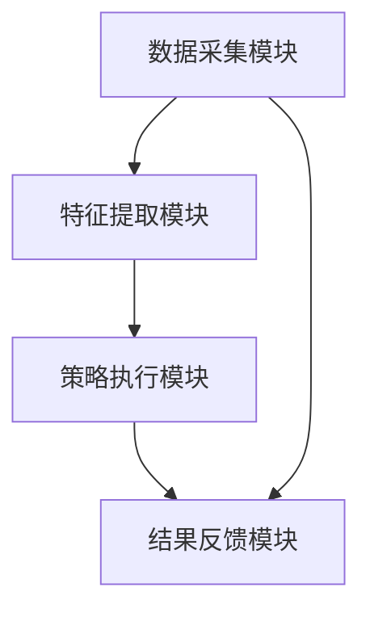

                 


# 第四部分: AI Agent的系统架构与设计

## 第4章: AI Agent在金融交易中的系统架构

### 4.1 金融交易场景的系统分析

#### 4.1.1 交易数据的采集与处理
在金融交易中，数据是AI Agent决策的基础。交易数据主要包括历史价格、成交量、市场情绪等。数据采集模块需要从多个来源获取数据，并进行清洗和预处理。

#### 4.1.2 交易策略的执行流程
交易策略的执行流程包括数据输入、状态识别、动作选择、订单执行和结果反馈。每个步骤都需要精确设计，以确保交易的高效性和准确性。

#### 4.1.3 系统的输入输出设计
输入包括市场数据、交易信号等，输出包括交易订单、交易结果等。输入输出设计需要与金融交易系统无缝对接。

#### 4.1.4 数据流与信息交互
在金融交易中，数据流需要在各个模块之间高效传递，确保AI Agent能够实时获取市场信息并做出决策。

#### 4.1.5 系统的性能要求
系统需要具备高实时性、高可靠性和高扩展性，以应对金融市场的高频交易和复杂环境。

### 4.2 AI Agent的系统架构设计

#### 4.2.1 系统模块划分
AI Agent的系统架构通常包括数据采集模块、特征提取模块、策略执行模块和结果反馈模块。每个模块都有其特定的功能和职责。

#### 4.2.2 模块之间的交互流程
数据采集模块负责获取市场数据，特征提取模块将数据转化为有用的特征，策略执行模块基于特征做出交易决策，结果反馈模块将交易结果反馈给系统以优化策略。

#### 4.2.3 数据流与信息交互
系统架构设计需要考虑数据流的高效传递和模块之间的信息交互，确保各个模块协同工作。

#### 4.2.4 系统的可扩展性设计
系统架构需要具备可扩展性，以便在金融市场环境变化时，能够快速适应和调整。

### 4.3 系统架构的Mermaid图



### 4.4 本章小结

---

# 第五部分: 强化学习算法实现与优化

## 第5章: 强化学习算法实现与优化

### 5.1 强化学习在金融交易中的应用

#### 5.1.1 强化学习的环境建模
在金融交易中，环境通常是一个动态变化的市场，需要考虑价格波动、市场情绪等因素。

#### 5.1.2 状态空间设计
状态空间需要包含足够的信息，以便AI Agent能够做出合理的决策。常见的状态包括价格、成交量、技术指标等。

#### 5.1.3 动作空间设计
动作空间包括买入、卖出、持有等操作，需要根据具体交易策略进行设计。

#### 5.1.4 奖励函数设计
奖励函数是强化学习的核心，设计合理的奖励函数能够引导AI Agent学习最优策略。

### 5.2 强化学习的数学模型

#### 5.2.1 Q-learning算法的数学模型
Q-learning算法通过Q值表来记录状态-动作对的期望奖励，公式如下：

$$ Q(s, a) = Q(s, a) + \alpha \left[ r + \gamma \max Q(s', a') - Q(s, a) \right] $$

其中：
- \( s \)：当前状态
- \( a \)：当前动作
- \( r \)：当前奖励
- \( s' \)：下一个状态
- \( \alpha \)：学习率
- \( \gamma \)：折扣因子

#### 5.2.2 Deep Q-learning算法的数学模型
Deep Q-learning算法通过深度神经网络来近似Q值函数，网络结构通常包括输入层、隐藏层和输出层。

### 5.3 强化学习的优化策略

#### 5.3.1 网络结构优化
选择合适的网络结构和参数，能够提高强化学习算法的性能。

#### 5.3.2 超参数优化
调整学习率、折扣因子等超参数，能够优化算法的收敛速度和性能。

#### 5.3.3 经验回放
通过经验回放，可以增加数据多样性，提高算法的泛化能力。

#### 5.3.4 策略网络优化
通过策略网络优化，可以提高AI Agent的决策能力。

### 5.4 本章小结

---

# 第六部分: 项目实战与案例分析

## 第6章: 项目实战与案例分析

### 6.1 项目背景与目标
本项目旨在设计一个基于强化学习的AI Agent，用于优化股票交易策略。

### 6.2 项目实施步骤

#### 6.2.1 环境配置
安装必要的Python库，如TensorFlow、Keras、Pandas等。

#### 6.2.2 数据采集与预处理
从金融数据源获取历史价格数据，并进行清洗和归一化处理。

#### 6.2.3 网络模型设计
设计一个深度神经网络模型，用于近似Q值函数。

#### 6.2.4 算法实现
实现Q-learning和Deep Q-learning算法，并进行训练。

#### 6.2.5 策略优化与回测
优化交易策略，并通过回测验证策略的有效性。

### 6.3 核心代码实现

#### 6.3.1 数据采集与预处理代码
```python
import pandas as pd
import numpy as np

# 从Yahoo Finance获取股票数据
data = pd.read_csv('stock_data.csv')
data = data[['Date', 'Adj Close']]
data = data.set_index('Date')
data = data.sort_index()
data = data.pct_change().dropna()
data = data.values
```

#### 6.3.2 神经网络模型代码
```python
import tensorflow as tf
from tensorflow.keras import layers

model = tf.keras.Sequential([
    layers.Dense(64, activation='relu', input_shape=(input_dim,)),
    layers.Dense(32, activation='relu'),
    layers.Dense(action_dim, activation='linear')
])
```

#### 6.3.3 强化学习算法代码
```python
import random
import numpy as np

class DQN:
    def __init__(self, state_dim, action_dim):
        self.state_dim = state_dim
        self.action_dim = action_dim
        self.gamma = 0.99
        self.epsilon = 1.0
        self.epsilon_min = 0.01
        self.epsilon_decay = 0.995
        self.batch_size = 64
        self.memory = []
    
    def remember(self, state, action, reward, next_state):
        self.memory.append((state, action, reward, next_state))
    
    def act(self, state):
        if random.random() < self.epsilon:
            return random.randint(0, self.action_dim - 1)
        state = np.array([state])
        Q = model.predict(state)
        return np.argmax(Q[0])
    
    def replay(self):
        if len(self.memory) < self.batch_size:
            return
        batch = random.sample(self.memory, self.batch_size)
        states = np.array([x[0] for x in batch])
        actions = np.array([x[1] for x in batch])
        rewards = np.array([x[2] for x in batch])
        next_states = np.array([x[3] for x in batch])
        
        Q = model.predict(states)
        next_Q = model.predict(next_states)
        targets = Q.copy()
        for i in range(self.batch_size):
            targets[i][actions[i]] = rewards[i] + self.gamma * np.max(next_Q[i])
        model.fit(states, targets, epochs=1, verbose=0)
        
        self.epsilon = max(self.epsilon * self.epsilon_decay, self.epsilon_min)
```

### 6.4 项目小结

---

# 第七部分: 总结与展望

## 第7章: 总结与展望

### 7.1 本章总结
本文详细介绍了AI Agent的强化学习在金融交易中的应用，从理论基础到算法实现，再到系统设计和项目实战，为读者提供了全面的指导。

### 7.2 应用挑战与未来展望
尽管强化学习在金融交易中展现出巨大潜力，但仍面临诸多挑战，如市场环境的复杂性、模型的可解释性等。未来，随着AI技术的不断发展，AI Agent在金融交易中的应用将更加广泛和深入。

### 7.3 本章小结

---

# 附录

## 附录A: 常用工具与库

- Python库：TensorFlow、Keras、Pandas、NumPy
- 数据源：Yahoo Finance、Quandl
- 开发环境：Jupyter Notebook、VS Code

## 附录B: 代码示例

```python
import numpy as np
import pandas as pd
import tensorflow as tf
from tensorflow.keras import layers

# 数据预处理
data = pd.read_csv('stock_data.csv')
data = data[['Date', 'Adj Close']]
data = data.set_index('Date')
data = data.pct_change().dropna()
data = data.values

# 神经网络模型设计
model = tf.keras.Sequential([
    layers.Dense(64, activation='relu', input_shape=(data.shape[1],)),
    layers.Dense(32, activation='relu'),
    layers.Dense(3, activation='linear')
])

# 网络编译
model.compile(optimizer='adam', loss='mse')

# 模型训练
model.fit(data, data, epochs=10, batch_size=32)
```

## 附录C: 参考文献

1. Mnih, V., et al. "Playing atari with deep reinforcement learning." arXiv preprint arXiv:1312.5602 (2013).
2. DeepMind. "Deep Q-networks." URL: https://deepmind.com/research/transformers
3. Sutton, R. S., and A. G. Barto. "Reinforcement learning: An introduction. Second edition." (2018).

---

# 结语

AI Agent的强化学习正在改变金融交易的方式，通过不断优化交易策略，提高交易效率和收益。随着技术的进步，AI Agent在金融领域的应用将更加广泛和深入。

---

作者：AI天才研究院/AI Genius Institute & 禅与计算机程序设计艺术 /Zen And The Art of Computer Programming

