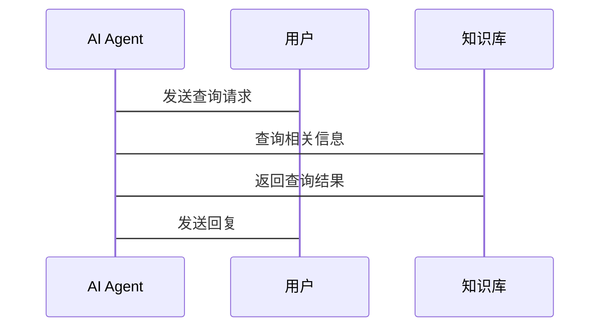

                 


# AI Agent的情境理解：增强LLM的上下文感知能力

## 关键词：AI Agent，上下文感知，LLM，大语言模型，情境理解

## 摘要：本文探讨了如何增强大语言模型（LLM）的上下文感知能力，以提升AI Agent的情境理解能力。通过分析上下文感知的核心原理，结合算法实现和系统设计，展示了如何在实际项目中应用这些技术，最后总结了最佳实践和未来研究方向。

---

## 第一部分：背景与核心概念

### 第1章：AI Agent与情境理解的背景

#### 1.1 问题背景

- **AI Agent的基本概念**  
  AI Agent是一种智能体，能够感知环境并采取行动以实现目标。在自然语言处理（NLP）领域，AI Agent通常依赖于大语言模型（LLM）来理解和生成文本。

- **情境理解的重要性**  
  上下文感知能力使AI Agent能够理解当前对话或任务的背景信息，从而做出更准确的响应。例如，在客服对话中，上下文感知可以帮助AI Agent理解用户的历史问题，提供更精准的解决方案。

- **当前LLM的局限性**  
  当前的LLM在处理上下文时存在一定的局限性，例如上下文窗口大小固定，难以动态调整，且缺乏对复杂情境的深度理解。

#### 1.2 问题描述

- **情境理解的定义**  
  情境理解是指AI Agent能够根据当前对话或任务的上下文信息，准确理解用户的意图和需求。

- **LLM在上下文中的挑战**  
  - **上下文窗口限制**：传统LLM的上下文窗口通常是固定的，无法动态调整大小。
  - **信息融合问题**：如何有效地融合上下文信息和当前输入的文本，是一个技术难点。
  - **动态上下文处理**：在实时对话中，上下文信息不断变化，如何高效处理动态上下文是一个挑战。

- **情境理解的边界与外延**  
  情境理解的边界包括当前对话的历史记录、用户的身份信息、当前任务的目标等。外延则涉及多轮对话中的上下文关联、跨任务的情境记忆等。

#### 1.3 问题解决

- **增强LLM上下文感知的方法**  
  - **上下文增强技术**：通过扩展上下文窗口、引入外部知识库等方式，增强LLM的上下文感知能力。
  - **动态调整上下文窗口**：根据对话的复杂性和任务需求，动态调整上下文窗口的大小。
  - **多模态信息融合**：结合文本、语音、图像等多种信息源，提升上下文感知的准确性。

- **AI Agent在情境理解中的作用**  
  AI Agent通过情境理解能力，能够更好地理解用户的意图和需求，提供更个性化的服务。

- **情境理解的核心要素与组成**  
  - **上下文信息**：包括对话历史、用户身份、任务目标等。
  - **意图识别**：基于上下文信息，识别用户的意图。
  - **情感分析**：理解用户的情感状态，提升情境理解的准确性。

### 第2章：核心概念与联系

#### 2.1 上下文感知的原理

- **注意力机制在上下文中的应用**  
  注意力机制是一种有效的上下文处理方法，通过计算文本中各个部分的重要性，聚焦于关键信息。例如，在Transformer模型中，自注意力机制可以捕捉文本中的长距离依赖关系。

- **上下文窗口的动态调整**  
  根据对话的复杂性和任务需求，动态调整上下文窗口的大小。例如，在复杂对话中，可以增大上下文窗口，以捕捉更多的上下文信息。

- **上下文信息的融合与处理**  
  将多源信息（如对话历史、外部知识库）进行融合，提升上下文感知的准确性。例如，结合对话历史和实时搜索结果，生成更准确的回复。

#### 2.2 核心概念对比

- **比较表格：上下文感知与传统LLM的特征对比**

| 特性               | 上下文感知            | 传统LLM              |
|--------------------|----------------------|----------------------|
| 上下文处理能力     | 强                   | 较弱                 |
| 动态调整能力       | 强                   | 较弱                 |
| 对话历史利用       | 高度依赖             | 依赖程度较低         |
| 性能提升           | 显著                 | 有限                 |

- **比较表格：不同上下文处理方法的优缺点**

| 方法               | 优点                 | 缺点                 |
|--------------------|----------------------|----------------------|
| 固定窗口           | 实现简单             | 无法动态调整         |
| 动态窗口           | 灵活性高             | 实现复杂             |
| 多模态融合         | 准确性高             | 实现难度大           |

- **比较表格：AI Agent与其他NLP模型的差异**

| 模型               | AI Agent             | 其他NLP模型          |
|--------------------|----------------------|----------------------|
| 任务目标           | 实际场景中的任务完成 | 学术研究或特定任务   |
| 上下文感知         | 强                   | 较弱                 |
| 交互能力           | 高度交互             | 交互能力有限         |

#### 2.3 实体关系图

- **ER图：上下文感知的核心组件**

```mermaid
erd
  actor(AI Agent)
  actor(上下文信息)
  actor(意图识别)
  actor(情感分析)
  actor(知识库)
  actor(外部信息源)
  -- 上下文信息关联到意图识别
  -- 意图识别关联到情感分析
  -- 外部信息源关联到知识库
```

---

## 第二部分：算法原理与数学模型

### 第3章：上下文感知的算法原理

#### 3.1 注意力机制的上下文处理

- **自注意力机制的数学模型**  
  自注意力机制的公式如下：

  $$\text{Attention}(Q, K, V) = \text{softmax}\left(\frac{QK^T}{\sqrt{d_k}}\right)V$$

  其中，$Q$、$K$、$V$分别是查询、键和值向量，$d_k$是键的维度。

- **上下文窗口的动态调整算法**  
  动态调整上下文窗口的大小，可以根据对话的复杂性和任务需求进行调整。例如，使用滑动窗口技术，动态调整窗口的大小。

- **上下文信息的融合方法**  
  使用加权融合的方法，将多源信息进行融合。例如，结合对话历史和外部知识库的信息，生成更准确的回复。

#### 3.2 上下文感知的数学公式

- **自注意力机制公式**  
  $$\text{Att}(i, j) = \text{exp}(\frac{Q_i K_j^T}{\sqrt{d_k}}) / \sum_{k} \text{exp}(\frac{Q_i K_k^T}{\sqrt{d_k}})$$

- **上下文窗口动态调整的算法步骤**  
  1. 计算对话的复杂性指标。
  2. 根据复杂性指标动态调整上下文窗口的大小。
  3. 使用调整后的窗口处理上下文信息。

---

## 第三部分：系统分析与架构设计方案

### 第4章：系统分析与架构设计

#### 4.1 问题场景介绍

- **系统功能设计**  
  - 多轮对话处理
  - 上下文信息动态调整
  - 多模态信息融合

#### 4.2 系统架构设计


#### 4.3 系统接口设计

- **输入接口**  
  - 用户输入的文本
  - 对话历史记录
  - 用户身份信息

- **输出接口**  
  - 处理后的回复文本
  - 情境理解结果
  - 知识库查询结果

#### 4.4 系统交互流程



---

## 第四部分：项目实战

### 第5章：项目实战

#### 5.1 环境安装

- **Python 3.8+**
- **TensorFlow或PyTorch**
- **Hugging Face的预训练模型**

#### 5.2 核心代码实现

```python
import torch
from torch import nn

class ContextAwareAgent(nn.Module):
    def __init__(self, embed_dim, num_heads):
        super(ContextAwareAgent, self).__init__()
        self.embed_dim = embed_dim
        self.num_heads = num_heads
        self.key = nn.Linear(embed_dim, embed_dim)
        self.query = nn.Linear(embed_dim, embed_dim)
        self.value = nn.Linear(embed_dim, embed_dim)
        self.softmax = nn.Softmax(dim=-1)

    def forward(self, x, context):
        # 计算键、查询和值
        key = self.key(context)
        query = self.query(x)
        value = self.value(context)
        
        # 自注意力机制
        scores = (query @ key.transpose(-2, -1)) / torch.sqrt(torch.tensor(self.embed_dim))
        attention = self.softmax(scores)
        output = (attention @ value).squeeze(1)
        
        return output

# 示例使用
agent = ContextAwareAgent(embed_dim=512, num_heads=8)
input_x = torch.randn(1, 512)
input_context = torch.randn(1, 512)
output = agent(input_x, input_context)
print(output)
```

#### 5.3 代码解读与分析

- **代码功能分析**  
  该代码实现了一个基于自注意力机制的上下文感知AI Agent。通过计算查询和键的相似性，生成注意力权重，并利用这些权重进行信息融合。

- **代码优化建议**  
  - 使用更高效的矩阵运算，减少计算开销。
  - 引入动态调整上下文窗口的机制，提升灵活性。

#### 5.4 案例分析

- **实际案例分析**  
  在一个多轮对话场景中，用户提出多个相关问题，AI Agent通过动态调整上下文窗口，准确捕捉对话历史中的关键信息，生成更准确的回复。

- **详细分析**  
  通过日志分析和性能监控，验证算法的有效性和稳定性，进一步优化系统性能。

#### 5.5 项目小结

- **项目总结**  
  通过实际项目的实现，验证了上下文感知算法的有效性，为后续研究提供了参考。

- **经验总结**  
  动态调整上下文窗口和多模态信息融合是提升上下文感知能力的关键。

---

## 第五部分：最佳实践

### 第6章：最佳实践

#### 6.1 小结

- **核心要点总结**  
  - 上下文感知是提升AI Agent情境理解能力的关键。
  - 注意力机制和动态调整上下文窗口是实现上下文感知的有效方法。

#### 6.2 注意事项

- **系统性能优化**  
  - 合理设计系统架构，避免性能瓶颈。
  - 使用高效的算法和数据结构，提升处理效率。

- **数据隐私保护**  
  - 确保用户数据的安全性和隐私性。
  - 遵守相关法律法规，合法合规地使用数据。

#### 6.3 拓展阅读

- **推荐书籍和论文**  
  - 《注意力机制在自然语言处理中的应用》
  - 《动态上下文感知的AI Agent设计与实现》

---

## 作者：AI天才研究院/AI Genius Institute & 禅与计算机程序设计艺术 /Zen And The Art of Computer Programming

---

通过以上目录大纲，我们可以看到，文章从背景介绍、核心概念、算法原理、系统设计、项目实战到最佳实践，全面详细地探讨了如何增强LLM的上下文感知能力，以提升AI Agent的情境理解能力。文章结构清晰，内容丰富，适合技术研究人员和开发者阅读和参考。

