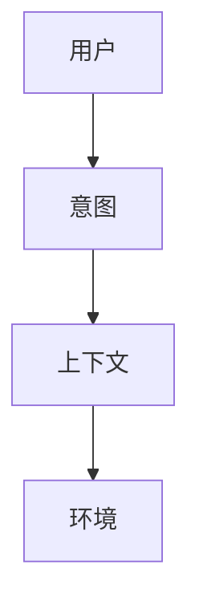
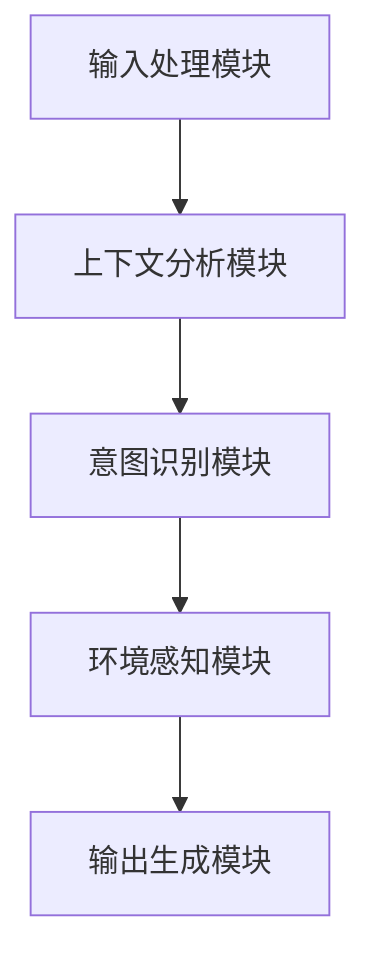

                 


# AI Agent的情境理解：超越单一对话的上下文把握

> 关键词：AI Agent, 情境理解, 上下文, 用户意图, 环境状态, 语义理解, 知识图谱

> 摘要：本文系统地探讨了AI Agent在情境理解中的核心原理与实践应用。从基本概念到算法原理，再到系统架构和项目实战，全面解析了如何实现超越单一对话的上下文把握，为AI Agent的开发与应用提供了理论支持和实践指导。

---

# 第一部分: AI Agent与情境理解概述

## 第1章: AI Agent与情境理解概述

### 1.1 AI Agent的基本概念

#### 1.1.1 AI Agent的定义
AI Agent（人工智能代理）是指能够感知环境、执行任务、与用户或系统交互的智能实体。它通过传感器获取信息，利用计算能力做出决策，并通过执行器采取行动。AI Agent可以是软件程序、机器人或其他智能系统。

#### 1.1.2 情境理解的定义与内涵
情境理解是指AI Agent在与用户交互过程中，能够准确识别用户的意图、理解上下文信息，并根据环境状态做出合理反应的能力。它超越了简单的关键词匹配，涉及多维度的信息处理和推理。

#### 1.1.3 AI Agent与情境理解的关系
情境理解是AI Agent实现智能化交互的核心能力。通过情境理解，AI Agent能够更好地满足用户需求，提供更个性化的服务。

---

### 1.2 情境理解的背景与问题背景

#### 1.2.1 当前AI技术的局限性
传统的NLP技术主要依赖关键词匹配和规则匹配，难以处理复杂的情境信息。AI Agent需要在动态环境中实时理解用户的意图，这需要更高级的算法支持。

#### 1.2.2 情境理解的重要性
在智能客服、智能助手等场景中，准确的情境理解可以显著提升用户体验，减少错误率，提高效率。

#### 1.2.3 情境理解的核心问题
情境理解的核心问题是如何从多源信息中提取有用的特征，构建合理的模型，并在动态环境中实时更新。

---

### 1.3 情境理解的核心要素

#### 1.3.1 上下文信息的收集与处理
上下文信息包括用户的历史交互记录、当前输入、环境数据等。这些信息需要被结构化处理，以便后续分析。

#### 1.3.2 用户意图的识别与推理
通过自然语言处理技术，AI Agent需要识别用户的显式和隐式意图，并进行推理。

#### 1.3.3 环境状态的感知与建模
AI Agent需要感知环境的状态，并通过建模技术将其转化为可计算的形式。

---

### 1.4 情境理解的应用场景

#### 1.4.1 智能对话系统
在智能对话系统中，情境理解能够帮助AI Agent更好地理解用户的意图，提供更自然的对话体验。

#### 1.4.2 智能推荐系统
通过情境理解，智能推荐系统可以为用户提供更精准的推荐结果。

#### 1.4.3 智能客服系统
在智能客服系统中，情境理解能够帮助AI Agent更好地理解用户的问题，提供更高效的解决方案。

---

## 第2章: 情境理解的核心概念与联系

### 2.1 情境理解的核心概念

#### 2.1.1 上下文信息的结构化表示
上下文信息需要被结构化，例如使用JSON格式表示用户的历史交互记录。

#### 2.1.2 用户意图的层次化分析
用户意图可以分为显式意图和隐式意图，需要通过层次化分析来识别。

#### 2.1.3 环境状态的动态建模
环境状态需要动态建模，例如使用时间序列模型来表示环境的变化。

---

### 2.2 核心概念的属性特征对比

| 概念       | 特征                     |
|------------|--------------------------|
| 上下文信息   | 时间性、关联性、多样性   |
| 用户意图     | 显式性、隐式性、动态性   |
| 环境状态     | 稳定性、动态性、复杂性   |

---

### 2.3 情境理解的ER实体关系图



---

## 第3章: 情境理解的算法原理

### 3.1 基于上下文的注意力机制

#### 3.1.1 注意力机制的基本原理
注意力机制通过计算输入文本中每个词的关注度，赋予重要词更高的权重，从而提高模型的准确性。

#### 3.1.2 上下文信息的注意力计算
上下文信息的注意力计算公式如下：

$$
\alpha_i = \frac{\exp(s_i)}{\sum_{j} \exp(s_j)}
$$

其中，$s_i$ 是第i个词的注意力得分。

---

### 3.2 基于知识图谱的语义理解

#### 3.2.1 知识图谱的构建与表示
知识图谱通过构建实体和关系的图结构，帮助模型理解语义。

#### 3.2.2 语义理解的算法流程
语义理解的算法流程如下：

1. 实体识别：识别文本中的实体。
2. 关系抽取：提取实体之间的关系。
3. 知识图谱表示：将实体和关系存储在知识图谱中。
4. 语义理解：基于知识图谱进行语义分析。

---

## 第4章: 情境理解的系统架构设计

### 4.1 系统功能设计

#### 4.1.1 系统功能模块
系统功能模块包括：输入处理模块、上下文分析模块、意图识别模块、环境感知模块和输出生成模块。

---

### 4.2 系统架构设计



---

## 第5章: 情境理解的项目实战

### 5.1 项目背景

#### 5.1.1 项目介绍
本项目旨在开发一个智能客服系统，实现对用户意图的精准识别和上下文的理解。

---

### 5.2 系统核心实现

#### 5.2.1 环境配置
需要安装以下工具和库：
- Python 3.8+
- PyTorch 1.9+
- Transformers库

---

#### 5.2.2 核心代码实现

```python
import torch
from transformers import AutoTokenizer, AutoModel

class ContextualUnderstanding:
    def __init__(self, model_name):
        self.tokenizer = AutoTokenizer.from_pretrained(model_name)
        self.model = AutoModel.from_pretrained(model_name)
        
    def process_input(self, input_text):
        # Tokenization
        inputs = self.tokenizer(input_text, return_tensors="pt")
        # Model inference
        outputs = self.model(**inputs)
        # Extract features
        features = outputs.last_hidden_state.squeeze()
        return features
```

---

## 第6章: 最佳实践与未来展望

### 6.1 最佳实践

#### 6.1.1 算法优化
建议使用预训练模型和迁移学习技术，提高模型的性能。

#### 6.1.2 系统优化
建议采用分布式架构和异步处理技术，提高系统的响应速度。

---

### 6.2 未来展望

随着深度学习和自然语言处理技术的不断进步，AI Agent的情境理解能力将更加智能化和个性化。

---

# 第七章: 总结与展望

## 7.1 总结

本文详细探讨了AI Agent在情境理解中的核心原理与实践应用，从基本概念到算法原理，再到系统架构和项目实战，全面解析了如何实现超越单一对话的上下文把握。

## 7.2 展望

未来，随着技术的进步，AI Agent的情境理解能力将更加智能化和个性化，为人类带来更高效、更便捷的交互体验。

---

# 作者：AI天才研究院/AI Genius Institute & 禅与计算机程序设计艺术 /Zen And The Art of Computer Programming

