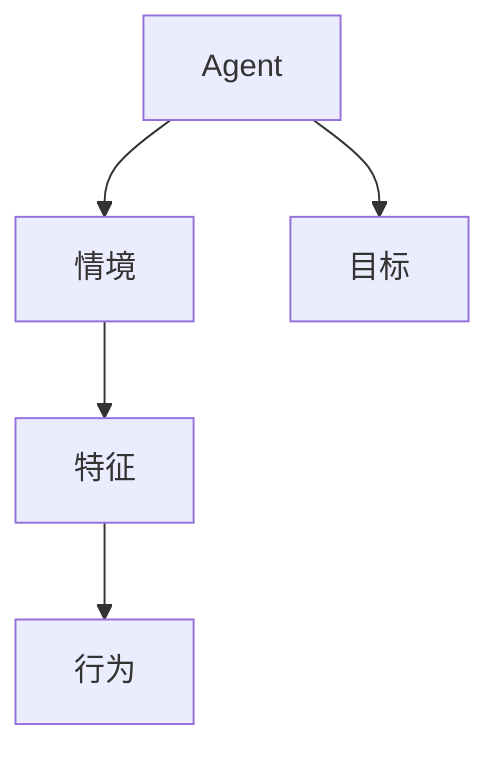
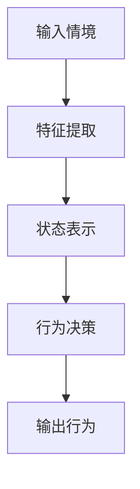
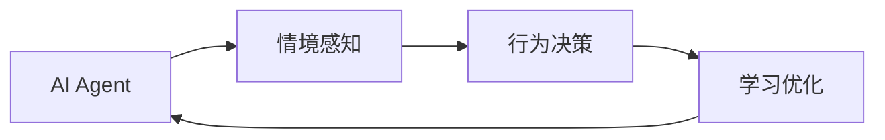
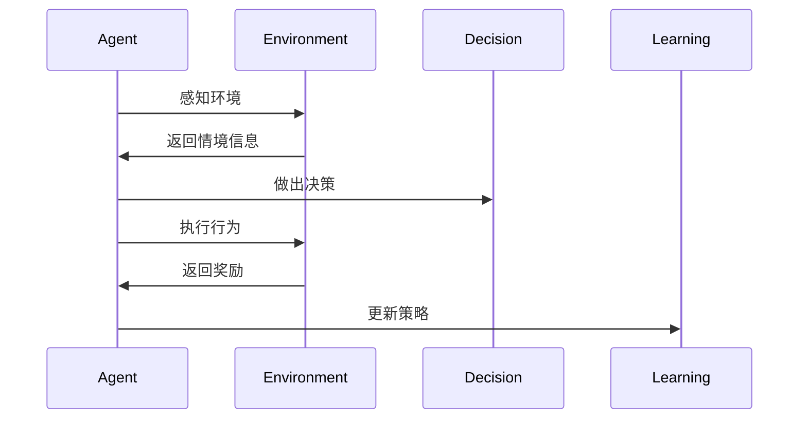

                 


# AI Agent的情境适应学习：提高在复杂环境中的表现

**关键词**：AI Agent，情境适应学习，复杂环境，动态适应，行为决策，数学模型

**摘要**：  
本文深入探讨了AI Agent在复杂环境中的情境适应学习机制，分析了其核心概念、算法原理、系统架构及实际应用。通过结合理论与实践，文章揭示了如何通过情境感知、动态适应和行为优化来提升AI Agent的性能，为相关领域的研究和应用提供了有价值的参考。

---

# 第1章: AI Agent与情境适应学习概述

## 1.1 AI Agent的基本概念

### 1.1.1 AI Agent的定义  
AI Agent（人工智能代理）是指能够感知环境、做出决策并执行动作的智能实体。它通过与环境交互，实现特定目标，具有自主性、反应性和目标导向性。

### 1.1.2 AI Agent的核心特点  
- **自主性**：能够在没有外部干预的情况下自主运行。  
- **反应性**：能够实时感知环境并做出反应。  
- **目标导向性**：所有行为都围绕实现特定目标展开。  

### 1.1.3 情境适应学习的背景与意义  
随着环境的复杂化，AI Agent需要能够快速适应变化，情境适应学习正是为此而生。它使AI Agent能够在动态环境中保持高效表现，适用于自动驾驶、智能助手、机器人等领域。

---

## 1.2 情境适应学习的定义与特点

### 1.2.1 情境适应学习的定义  
情境适应学习是指AI Agent通过感知和理解当前情境，动态调整自身行为以适应环境变化的过程。

### 1.2.2 情境适应学习的核心特点  
- **动态性**：能够实时感知和适应环境变化。  
- **灵活性**：能够根据情境调整行为策略。  
- **学习性**：通过经验不断优化行为表现。  

### 1.2.3 情境适应学习与传统学习方法的对比  
| **方法**       | **特点**                                   |  
|----------------|------------------------------------------|  
| 强化学习         | 基于奖励机制，适用于明确目标的环境。       |  
| 监督学习         | 需要大量标注数据，适用于静态任务。         |  
| 情境适应学习     | 动态适应环境，适用于复杂且变化的场景。      |  

---

## 1.3 AI Agent在复杂环境中的应用前景

### 1.3.1 AI Agent的潜在应用领域  
- 自动驾驶：实时感知路况并做出决策。  
- 智能助手：根据用户需求动态调整服务。  
- 机器人控制：在动态环境中完成复杂任务。  

### 1.3.2 复杂环境中的AI Agent优势  
- 能够处理不确定性，适应复杂环境。  
- 通过情境适应学习，提高任务成功率。  

### 1.3.3 情境适应学习在AI Agent中的重要性  
情境适应学习使AI Agent能够更好地理解环境，动态调整行为，从而在复杂环境中表现更佳。

---

## 1.4 本章小结  
本章介绍了AI Agent的基本概念及其在复杂环境中的应用前景，重点阐述了情境适应学习的定义、特点及其重要性，为后续章节的深入分析奠定了基础。

---

# 第2章: 情境适应学习的核心概念与联系

## 2.1 情境适应学习的原理

### 2.1.1 情境感知与理解  
AI Agent通过传感器或数据输入感知环境，并通过特征提取和知识表示理解情境。

### 2.1.2 动态适应机制  
AI Agent根据当前情境调整行为策略，动态优化动作选择。

### 2.1.3 行为决策模型  
AI Agent基于情境信息，结合目标函数，生成最优行为。

---

## 2.2 情境适应学习的关键要素

### 2.2.1 情境特征提取  
- 从环境中提取关键特征，例如颜色、形状、位置等。  

### 2.2.2 知识表示与推理  
- 使用符号逻辑或概率模型表示知识，并进行推理。  

### 2.2.3 行为优化策略  
- 基于强化学习或梯度下降方法优化行为策略。  

---

## 2.3 情境适应学习与相关技术的对比

### 2.3.1 与强化学习的对比  
| **技术**        | **特点**                                      |  
|------------------|---------------------------------------------|  
| 强化学习          | 基于奖励机制，适用于明确目标的环境。        |  
| 情境适应学习      | 基于情境感知，适用于动态变化的环境。         |  

### 2.3.2 与监督学习的对比  
| **技术**        | **特点**                                      |  
|------------------|---------------------------------------------|  
| 监督学习          | 需要标注数据，适用于静态任务。              |  
| 情境适应学习      | 动态调整行为，适用于复杂环境。               |  

### 2.3.3 与迁移学习的对比  
| **技术**        | **特点**                                      |  
|------------------|---------------------------------------------|  
| 迁移学习          | 利用已有知识，适用于新任务。                |  
| 情境适应学习      | 通过情境感知，动态调整行为策略。            |  

---

## 2.4 情境适应学习的ER实体关系图



---

## 2.5 本章小结  
本章深入分析了情境适应学习的核心原理，探讨了其与相关技术的区别与联系，并通过ER图展示了情境适应学习的实体关系，为后续章节的算法设计奠定了基础。

---

# 第3章: 情境适应学习的算法原理

## 3.1 情境适应学习的数学模型

### 3.1.1 情境表示模型  
$$ P(s) = \sum_{i=1}^{n} \theta_i s_i $$  

### 3.1.2 行为决策模型  
$$ Q(s, a) = \alpha Q(s, a) + (1-\alpha) r(s, a) $$  

### 3.1.3 损失函数  
$$ L = \sum_{i=1}^{m} (y_i - \hat{y}_i)^2 $$  

---

## 3.2 情境适应学习的算法流程



---

## 3.3 算法实现的Python代码示例

```python
def contextual_adaptation(agent, environment):
    while True:
        state = environment.observation()
        action = agent.decide_action(state)
        reward = environment.give_reward(action)
        agent.update_policy(state, action, reward)
```

---

## 3.4 本章小结  
本章详细讲解了情境适应学习的数学模型和算法流程，并通过Python代码示例展示了算法实现的关键步骤，为后续章节的系统设计提供了理论基础。

---

# 第4章: 系统分析与架构设计方案

## 4.1 问题场景介绍  
在复杂环境中，AI Agent需要实时感知环境并动态调整行为，以实现目标。

## 4.2 系统功能设计  
- 情境感知模块：负责环境数据的采集与特征提取。  
- 行为决策模块：基于情境信息生成最优行为。  
- 学习优化模块：通过经验不断优化行为策略。  

## 4.3 系统架构设计  



---

## 4.4 系统交互设计  



---

## 4.5 本章小结  
本章通过系统分析与架构设计，展示了AI Agent在复杂环境中的实现框架，为后续章节的项目实战奠定了基础。

---

# 第5章: 项目实战

## 5.1 环境安装与配置  
- 安装Python和相关库（如NumPy、TensorFlow）。  

## 5.2 系统核心实现  

```python
class Agent:
    def __init__(self):
        self.model = self.build_model()
    
    def build_model(self):
        # 构建模型
        pass
    
    def decide_action(self, state):
        # 根据状态决定动作
        pass
    
    def update_policy(self, state, action, reward):
        # 更新策略
        pass
```

---

## 5.3 代码应用解读与分析  
- 系统实现的核心部分包括模型构建、动作决策和策略优化。  

---

## 5.4 实际案例分析  
以自动驾驶为例，展示AI Agent如何通过情境适应学习在复杂交通环境中做出决策。

---

## 5.5 本章小结  
本章通过项目实战，展示了情境适应学习在实际应用中的实现过程，帮助读者更好地理解理论与实践的结合。

---

# 第6章: 最佳实践与总结

## 6.1 最佳实践 tips  
- 定期更新模型，保持学习能力。  
- 确保数据质量，避免过拟合。  

## 6.2 小结与展望  
本文系统地介绍了AI Agent的情境适应学习机制，分析了其算法原理和系统架构，并通过项目实战展示了其应用价值。未来的研究可以进一步探索更高效的算法和更广泛的应用场景。

---

# 作者：AI天才研究院/AI Genius Institute & 禅与计算机程序设计艺术 /Zen And The Art of Computer Programming

