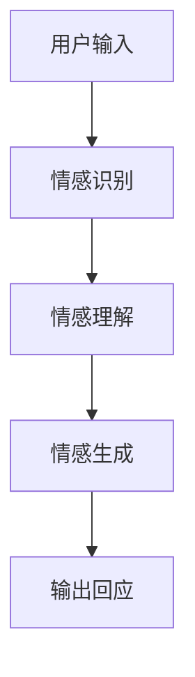
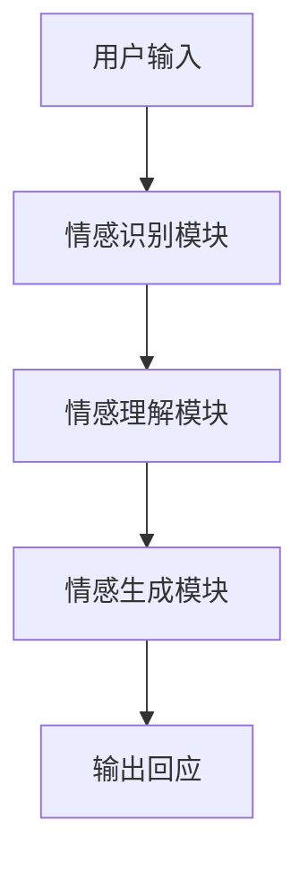

                 


# AI Agent的情感共情：提升LLM的人文关怀能力

## 关键词：AI Agent, 情感共情, LLM, 人文关怀, 情感计算, 机器学习, 自然语言处理

## 摘要：  
随着人工智能技术的飞速发展，AI Agent（智能体）在各个领域的应用越来越广泛。然而，当前的AI Agent在情感共情方面的能力仍有待提升，这限制了其在人机交互中的表现和用户体验。本文从情感共情的基本概念出发，结合AI Agent和LLM（大语言模型）的特点，详细探讨如何提升LLM的情感共情能力，从而增强AI Agent的人文关怀能力。文章通过理论分析、算法实现和实际案例，展示了情感共情在AI Agent中的重要性及其具体应用。

---

## 第一部分：AI Agent与情感共情的背景与基础

### 第1章：情感共情的基本概念与重要性

#### 1.1 情感共情的定义与内涵

情感共情（Empathetic Understanding）是指个体能够准确理解并感受他人的情感状态，并在此基础上做出适当的回应。在AI Agent的语境中，情感共情意味着系统能够识别用户的情感状态，并在交互中体现出对用户情感的理解和关怀。

- **情感共情的核心要素**：
  - **情感识别**：通过语言、语气、语调等方式识别用户的情感状态。
  - **情感理解**：基于识别的情感信息，分析用户的情感需求。
  - **情感回应**：生成符合情感需求的回应，增强用户体验。

#### 1.2 AI Agent的基本概念

AI Agent是一种智能体，能够感知环境、自主决策并执行任务。AI Agent可以分为以下几类：

- **反应式AI Agent**：基于当前输入做出实时反应，不依赖历史信息。
- **认知式AI Agent**：具有推理、规划和学习能力，能够处理复杂任务。
- **情感式AI Agent**：专门设计用于理解和回应情感信息的智能体。

#### 1.3 情感共情与AI Agent的结合

AI Agent与情感共情的结合能够显著提升人机交互的体验。以下是情感共情在AI Agent中的重要性：

- **提升用户体验**：情感共情使AI Agent能够更好地理解用户需求，提供更个性化的服务。
- **增强信任感**：通过情感共情，用户更容易信任AI Agent，从而增加交互的深度和频率。
- **扩展应用场景**：情感共情使AI Agent能够应用于教育、医疗、心理咨询等领域，提供更贴心的服务。

---

### 第2章：情感共情的理论基础

#### 2.1 情感计算与心理学基础

情感计算（Affective Computing）是研究如何通过计算技术来识别、理解和模拟人类情感的一门学科。以下是情感计算的核心理论：

- **情感心理学基础**：
  - 情感是由生理和心理因素共同作用的结果。
  - 情感可以通过面部表情、语调、语言等多种方式进行表达。

- **情感共情的计算模型**：
  - 基于特征的模型：通过预定义的情感特征（如情感词汇）来识别情感。
  - 基于深度学习的模型：利用神经网络提取情感特征，进行情感分类。

#### 2.2 情感共情的计算模型

情感共情的计算模型需要具备以下功能：

1. **情感识别**：通过文本、语音或图像识别用户的情感状态。
2. **情感理解**：分析情感背后的原因和需求。
3. **情感回应**：生成符合情感需求的回应。

---

### 第3章：情感共情的技术实现

#### 3.1 情感分析与情感生成

- **情感分析**：
  - 基于文本的情感分类任务。
  - 使用深度学习模型（如LSTM、Transformer）进行情感分类。

- **情感生成**：
  - 基于LLM的情感文本生成。
  - 使用生成式模型（如GPT）生成符合情感需求的文本。

#### 3.2 情感共情的算法实现

- **情感共情算法的流程图**：



- **情感共情算法的数学模型**：

$$ P(y|x) = \frac{P(y|x,z)}{P(z)} $$

其中，$P(z)$ 是先验概率，$P(y|x,z)$ 是在条件$z$下的条件概率。

---

## 第二部分：LLM的情感共情能力提升

### 第4章：LLM的情感共情能力现状与挑战

#### 4.1 当前LLM的情感共情能力

- **现状**：
  - LLM能够识别基本的情感类别（如正面、负面、中性）。
  - 在复杂情感场景下的表现仍有不足。

- **挑战**：
  - 情感识别的准确性不足。
  - 情感理解的深度不够。
  - 情感回应的个性化和自然性有待提升。

#### 4.2 提升LLM情感共情能力的关键技术

- **改进情感识别算法**：
  - 使用更先进的深度学习模型（如BERT、GPT-3）。
  - 增加情感特征的训练数据。

- **增强情感理解能力**：
  - 引入外部知识库（如情感词典、常识库）。
  - 通过对话历史信息提升情感理解的准确性。

---

## 第三部分：系统分析与架构设计

### 第5章：系统功能设计与架构

#### 5.1 问题场景介绍

- **目标**：设计一个具备情感共情能力的AI Agent系统。
- **用户需求**：用户希望与AI Agent进行情感化的对话，获得个性化的情感支持。

#### 5.2 系统功能设计

- **功能模块**：
  - **情感识别模块**：识别用户的情感状态。
  - **情感理解模块**：分析用户的情感需求。
  - **情感生成模块**：生成符合情感需求的回应。

#### 5.3 系统架构设计



---

## 第四部分：项目实战

### 第6章：环境安装与代码实现

#### 6.1 环境安装

- **安装Python**：确保安装了Python 3.8或更高版本。
- **安装依赖库**：安装`transformers`、`numpy`等库。

#### 6.2 核心代码实现

```python
from transformers import pipeline

# 情感识别
sentiment_pipeline = pipeline("sentiment-analysis")
result = sentiment_pipeline("I'm so happy to see you!")

# 情感生成
text_generator = pipeline("text-generation")
response = text_generator("I'm sorry to hear that you're feeling down.")
```

---

## 第五部分：总结与展望

### 第7章：总结与展望

#### 7.1 总结

本文详细探讨了AI Agent的情感共情能力提升方法，通过理论分析和实际案例，展示了如何通过改进算法和系统架构设计，提升LLM的情感共情能力，从而增强AI Agent的人文关怀能力。

#### 7.2 展望

未来，情感共情能力的提升将更加依赖于多模态技术的发展。通过结合视觉、语音等多种模态信息，AI Agent的情感共情能力将进一步增强，为人机交互带来更深远的影响。

---

## 作者：AI天才研究院/AI Genius Institute & 禅与计算机程序设计艺术 /Zen And The Art of Computer Programming

