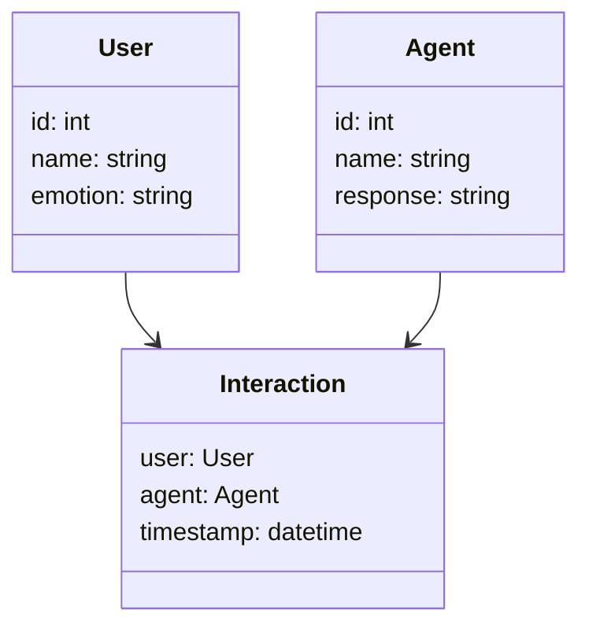
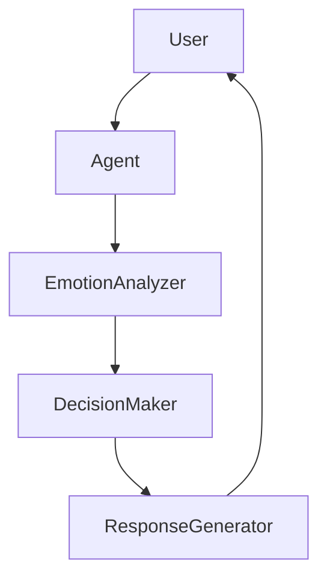
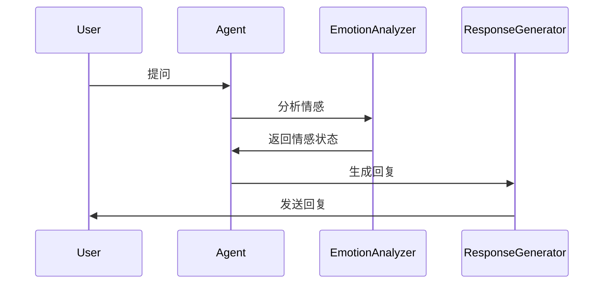

                 


# AI Agent的情感智能：利用LLM实现情感计算

> 关键词：AI Agent，情感智能，LLM，情感计算，自然语言处理，机器学习，深度学习

> 摘要：本文探讨了AI Agent中情感智能的实现，重点介绍了如何利用大语言模型（LLM）进行情感计算。通过分析情感计算的核心概念、算法原理和系统设计，结合实际项目案例，展示了如何将情感智能应用于AI Agent中，提升其交互能力和用户体验。

---

# 第1章: AI Agent与情感智能概述

## 1.1 AI Agent的基本概念

### 1.1.1 AI Agent的定义
AI Agent（人工智能代理）是一种智能实体，能够感知环境并采取行动以实现目标。它可以是一个软件程序或硬件设备，具备自主决策和问题解决能力。

### 1.1.2 AI Agent的核心特征
- **自主性**：能够在没有外部干预的情况下运行。
- **反应性**：能够根据环境变化调整行为。
- **目标导向**：所有行动都以实现特定目标为导向。
- **学习能力**：能够通过经验改进性能。

### 1.1.3 AI Agent的应用场景
- **智能家居**：控制家庭设备，提供个性化服务。
- **自动驾驶**：处理复杂的交通环境，做出决策。
- **虚拟助手**：如Siri、Alexa，提供语音交互服务。

## 1.2 情感智能的基本概念

### 1.2.1 情感智能的定义
情感智能（Emotional Intelligence，EI）是指个体识别、理解、管理自己和他人情感的能力。在AI中，情感智能使系统能够理解并响应用户的情感状态。

### 1.2.2 情感智能的核心要素
- **情感识别**：识别输入中的情感倾向。
- **情感理解**：理解情感背后的意义。
- **情感回应**：生成符合情感状态的响应。

### 1.2.3 情感智能的应用价值
- 提高用户体验，使交互更自然。
- 增强AI Agent的社交能力，使其能够更好地与人类互动。

## 1.3 AI Agent与情感智能的结合

### 1.3.1 AI Agent情感智能的必要性
AI Agent需要理解用户情感状态，以提供更个性化的服务。例如，在对话中识别用户的不满情绪，及时调整回应方式。

### 1.3.2 情感计算在AI Agent中的作用
情感计算使AI Agent能够处理情感信息，提升其在复杂场景中的决策能力。

### 1.3.3 未来发展趋势
随着技术进步，情感智能将成为AI Agent的核心功能，广泛应用于教育、医疗、娱乐等领域。

## 1.4 本章小结
本章介绍了AI Agent和情感智能的基本概念，并探讨了它们结合的意义和未来发展方向。

---

# 第2章: 情感计算的核心概念

## 2.1 情感计算的定义与特点

### 2.1.1 情感计算的定义
情感计算（Affective Computing）是通过计算方法分析、识别和处理情感信息的过程。

### 2.1.2 情感计算的核心特点
- **实时性**：快速处理情感信息。
- **准确性**：准确识别情感状态。
- **适应性**：根据不同场景调整计算方法。

### 2.1.3 情感计算与传统计算的区别
传统计算基于逻辑规则，而情感计算引入了情感因素，使系统更具人情味。

## 2.2 情感数据的处理

### 2.2.1 文本情感分析
- **文本预处理**：去除停用词、分词。
- **情感分类**：使用机器学习模型（如SVM、随机森林）或深度学习模型（如LSTM）进行分类。

### 2.2.2 声音情感识别
- **语音特征提取**：提取音调、语速、音量等特征。
- **情感分类**：通过声学模型识别情感。

### 2.2.3 图像情感分析
- **图像特征提取**：提取颜色、纹理等特征。
- **情感分类**：使用CNN等深度学习模型进行分类。

## 2.3 情感计算的关键技术

### 2.3.1 自然语言处理
- **情感分析**：识别文本的情感倾向。
- **情感强度分析**：量化情感强度。

### 2.3.2 机器学习
- **监督学习**：使用标注数据训练模型。
- **无监督学习**：从无标签数据中学习情感特征。

### 2.3.3 深度学习
- **循环神经网络（RNN）**：处理序列数据。
- **卷积神经网络（CNN）**：提取局部特征。

## 2.4 本章小结
本章详细介绍了情感计算的核心概念，包括数据处理技术和关键技术。

---

# 第3章: 大语言模型（LLM）在情感计算中的应用

## 3.1 大语言模型的基本原理

### 3.1.1 LLM的定义
大语言模型是基于大量数据训练的深度学习模型，具备强大的文本生成和理解能力。

### 3.1.2 LLM的核心技术
- **Transformer架构**：采用自注意力机制。
- **预训练-微调模式**：先预训练，再在特定任务上微调。

### 3.1.3 LLM的优势与局限性
- **优势**：处理复杂任务能力强，可扩展性好。
- **局限性**：训练成本高，可能产生错误或偏见。

## 3.2 LLM在情感计算中的应用

### 3.2.1 情感分类
- **任务目标**：将文本分类为正面、负面或中性。
- **实现方法**：使用预训练的LLM进行微调。

### 3.2.2 情感强度分析
- **任务目标**：量化情感强度，如从0到1评分。
- **实现方法**：在LLM的基础上增加情感强度预测层。

### 3.2.3 情感推理
- **任务目标**：理解情感背后的原因。
- **实现方法**：使用LLM生成解释性文本。

## 3.3 LLM在AI Agent中的具体应用

### 3.3.1 情感驱动的对话系统
- **实现方式**：根据用户情感调整对话策略。
- **案例**：虚拟助手识别用户情绪并调整回应语气。

### 3.3.2 情感智能的决策支持
- **实现方式**：结合情感信息进行多因素决策。
- **案例**：智能客服根据用户情绪推荐解决方案。

### 3.3.3 情感反馈的优化
- **实现方式**：收集用户情感反馈，优化系统表现。
- **案例**：游戏AI根据玩家情绪调整游戏难度。

## 3.4 本章小结
本章探讨了LLM在情感计算中的应用，展示了其在AI Agent中的巨大潜力。

---

# 第4章: 情感计算的算法原理

## 4.1 情感计算的基本算法

### 4.1.1 基于特征的分类算法
- **流程**：提取特征 → 训练分类器 → 进行分类。
- **算法**：如SVM、随机森林。

### 4.1.2 深度学习算法
- **流程**：输入数据 → 经过神经网络 → 输出结果。
- **算法**：如CNN、RNN。

### 4.1.3 混合算法
- **流程**：结合特征工程和深度学习。
- **优势**：利用两者优点，提升性能。

## 4.2 情感计算的算法实现

### 4.2.1 情感分类算法实现
- **代码示例**：
  ```python
  from sklearn.svm import SVC
  from sklearn.feature_extraction.text import TfidfVectorizer

  vectorizer = TfidfVectorizer()
  X = vectorizer.fit_transform(corpus)
  y = [labels]

  model = SVC()
  model.fit(X, y)
  ```

### 4.2.2 情感强度分析算法实现
- **代码示例**：
  ```python
  import tensorflow as tf
  from tensorflow.keras import layers

  model = tf.keras.Sequential()
  model.add(layers.Dense(64, activation='relu'))
  model.add(layers.Dense(1, activation='sigmoid'))
  model.compile(optimizer='adam', loss='binary_crossentropy')
  model.fit(X_train, y_train, epochs=10)
  ```

## 4.3 情感计算的数学模型

### 4.3.1 朴素贝叶斯分类
$$ P(y|x) = \frac{P(x|y)P(y)}{P(x)} $$

### 4.3.2 支持向量机
$$ \text{目标函数}：\min \frac{1}{2}||\theta||^2 + C \sum_{i=1}^n \xi_i $$
$$ \text{约束条件}：y_i(\theta x_i + b) \geq 1 - \xi_i, \xi_i \geq 0 $$

## 4.4 本章小结
本章详细讲解了情感计算的算法原理，包括特征分类和深度学习方法。

---

# 第5章: 系统分析与架构设计

## 5.1 问题场景介绍

### 5.1.1 项目背景
开发一个基于AI Agent的客服系统，提升用户体验。

### 5.1.2 项目目标
实现情感智能，提高客户满意度。

## 5.2 系统功能设计

### 5.2.1 领域模型设计


### 5.2.2 系统架构设计


## 5.3 系统接口设计

### 5.3.1 用户输入接口
- **输入**：文本或语音。
- **输出**：识别后的情感状态。

### 5.3.2 情感分析接口
- **输入**：用户输入。
- **输出**：情感标签和强度。

## 5.4 系统交互设计

### 5.4.1 交互流程


## 5.5 本章小结
本章详细设计了情感智能系统的架构和交互流程。

---

# 第6章: 项目实战

## 6.1 环境配置

### 6.1.1 安装依赖
```bash
pip install numpy scikit-learn tensorflow
```

## 6.2 核心实现

### 6.2.1 情感分类器实现
```python
from sklearn.feature_extraction.text import TfidfVectorizer
from sklearn.svm import SVC

vectorizer = TfidfVectorizer()
model = SVC()
model.fit(vectorizer.fit_transform(train_texts), train_labels)
```

### 6.2.2 情感强度预测器实现
```python
import tensorflow as tf
from tensorflow.keras import layers

model = tf.keras.Sequential([
    layers.Dense(64, activation='relu'),
    layers.Dense(1, activation='sigmoid')
])
model.compile(optimizer='adam', loss='binary_crossentropy')
model.fit(x_train, y_train, epochs=10)
```

## 6.3 案例分析

### 6.3.1 情感分类案例
- **输入**：用户评论“这个产品很好用”。
- **输出**：情感标签为正面。

### 6.3.2 情感强度案例
- **输入**：用户评论“这个产品非常不好用”。
- **输出**：情感强度为0.9。

## 6.4 本章小结
本章通过实际项目案例，展示了情感计算技术的实现过程。

---

# 第7章: 总结与展望

## 7.1 本章总结
本文详细探讨了AI Agent中的情感智能，介绍了情感计算的核心概念、算法原理和系统设计，并通过项目案例展示了其实现过程。

## 7.2 未来展望
随着技术进步，情感智能将在更多领域得到应用，AI Agent将具备更强的情感理解能力。

## 7.3 最佳实践tips
- 选择合适的模型和算法，根据具体场景进行调整。
- 处理情感数据时，注意数据质量和多样性。
- 在实际应用中，结合业务需求优化系统。

## 7.4 本章小结
未来，情感智能将成为AI Agent的核心功能，推动人机交互的进一步发展。

---

# 作者

作者：AI天才研究院/AI Genius Institute & 禅与计算机程序设计艺术 /Zen And The Art of Computer Programming

