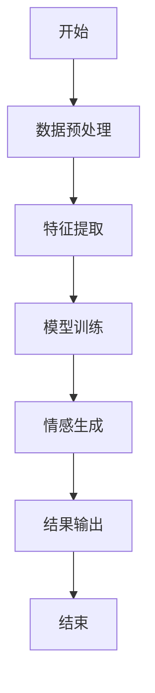
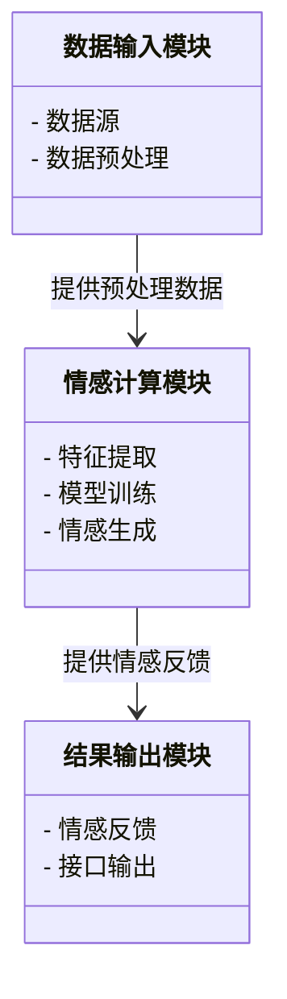
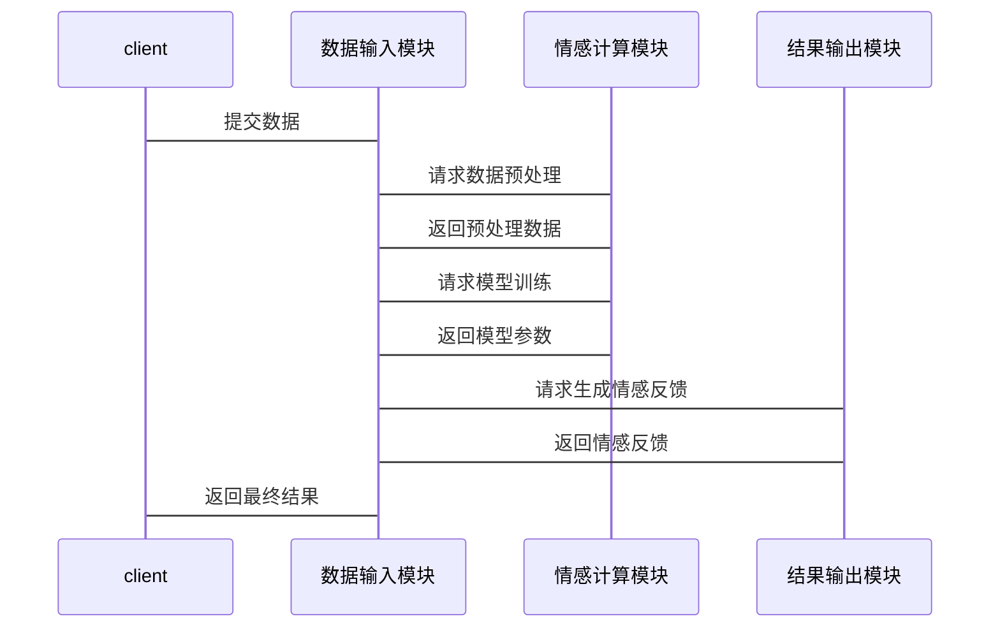

                 


# AI Agent的情感计算与表达模块

## 关键词：AI Agent, 情感计算, 情感表达, 深度学习, 情感生成

## 摘要：  
本文深入探讨了AI Agent中的情感计算与表达模块，从核心概念、算法原理到系统设计与实际应用进行了全面分析。通过详细的技术细节和实际案例，揭示了情感计算在AI Agent中的重要作用及其实现方法。

---

# 第1章: AI Agent与情感计算的背景介绍

## 1.1 情感计算的基本概念

### 1.1.1 情感计算的定义  
情感计算（Affective Computing）是研究计算机系统如何识别、理解和模拟人类情感的一门交叉学科。它旨在通过技术手段捕捉、分析和表达情感，使计算机能够与人类进行更自然的交互。

### 1.1.2 情感计算的核心要素  
- **情感识别**：通过输入数据（如文本、语音、面部表情）分析用户的情感状态。  
- **情感理解**：将情感状态转化为计算机可处理的信息。  
- **情感表达**：通过文本、语音或视觉形式将情感反馈给用户。  

### 1.1.3 情感计算的应用场景  
- **人机交互**：提升用户体验，例如智能音箱、虚拟助手。  
- **教育技术**：根据学生情感状态调整教学策略。  
- **医疗健康**：通过情感分析辅助诊断和治疗。  

## 1.2 AI Agent与情感计算的关系

### 1.2.1 AI Agent的基本概念  
AI Agent是一种智能实体，能够感知环境、自主决策并执行任务。它需要与人类进行有效交互，情感计算为其提供了情感理解与表达的能力。  

### 1.2.2 情感计算在AI Agent中的作用  
- **增强交互性**：使AI Agent能够理解用户情感，提供更个性化的服务。  
- **提升用户体验**：通过情感反馈建立更自然的互动。  
- **复杂任务处理**：在需要情感判断的任务中（如客服、心理咨询）发挥重要作用。  

### 1.2.3 情感计算与AI Agent的结合  
AI Agent通过情感计算模块，能够实时分析用户情感状态，并根据结果调整其行为策略。例如，在对话中识别用户的焦虑情绪，AI Agent可以主动提供情感支持。

## 1.3 情感计算的背景与发展趋势

### 1.3.1 情感计算的发展历程  
情感计算的研究始于20世纪90年代，随着机器学习和自然语言处理技术的进步，近年来取得了显著进展。  

### 1.3.2 当前情感计算的研究热点  
- 基于深度学习的情感分析模型。  
- 多模态情感计算（结合文本、语音、面部表情等多种信息）。  
- 情感生成与表达的创新技术。  

### 1.3.3 情感计算的未来趋势  
- 更高精度的情感识别技术。  
- 更自然的情感表达方式（如拟人化交互）。  
- 多模态情感计算在更多领域的应用。  

## 1.4 本章小结  
本章介绍了情感计算的基本概念、核心要素及其在AI Agent中的作用，并展望了其发展趋势。

---

# 第2章: 情感计算的核心原理

## 2.1 情感计算的原理概述

### 2.1.1 情感计算的基本原理  
情感计算通过分析输入数据，提取情感特征，建立情感模型，并生成相应的情感表达。  

### 2.1.2 情感计算的核心算法  
- **文本情感分析**：基于词袋模型、词嵌入（如Word2Vec）等技术。  
- **语音情感分析**：通过语音特征（如音调、语速）进行情感分类。  
- **图像情感分析**：基于计算机视觉技术分析面部表情。  

### 2.1.3 情感计算的实现流程  
1. 数据采集：获取文本、语音或图像数据。  
2. 特征提取：提取情感相关的特征向量。  
3. 模型训练：训练情感分类或生成模型。  
4. 情感表达：根据模型输出生成情感反馈。  

## 2.2 情感计算的关键特征对比

### 2.2.1 情感计算的特征分析  
- **文本特征**：词语、句法结构、情感词汇。  
- **语音特征**：音调、语速、停顿。  
- **图像特征**：面部表情、眼神、微表情。  

### 2.2.2 情感计算与其他计算模式的对比  
| **计算模式** | **输入类型** | **输出类型** | **应用场景** |
|--------------|---------------|--------------|--------------|
| 文本分析 | 文本 | 情感类别 | 情感分析 |
| 语音分析 | 语音 | 情感类别 | 情感识别 |
| 图像分析 | 图像 | 情感类别 | 情感识别 |

### 2.2.3 情感计算的优缺点分析  
- **优点**：能够提升人机交互的自然性和智能化。  
- **缺点**：情感数据的复杂性和多样性导致模型训练难度较大。  

## 2.3 情感计算的ER实体关系图

```mermaid
er
actor: 用户
action: 情感计算操作
object: 情感数据
```

## 2.4 本章小结  
本章详细介绍了情感计算的核心原理，包括基本原理、关键特征和优缺点分析。

---

# 第3章: 情感计算的核心算法

## 3.1 情感计算的模型训练

### 3.1.1 数据预处理  
- **文本清洗**：去除停用词、标点符号。  
- **特征提取**：使用TF-IDF或Word2Vec提取文本特征。  

### 3.1.2 模型选择  
- **传统模型**：SVM、随机森林。  
- **深度学习模型**：LSTM、Transformer（如BERT）。  

### 3.1.3 模型训练流程  
1. 数据预处理：清洗数据，提取特征。  
2. 模型选择：根据任务选择合适的算法。  
3. 模型训练：使用训练数据进行模型训练。  
4. 模型评估：通过准确率、召回率等指标评估模型性能。  

## 3.2 情感计算的特征提取

### 3.2.1 文本特征提取方法  
- **词袋模型**：统计词语出现频率。  
- **词嵌入**：使用Word2Vec将词语映射为向量。  

### 3.2.2 基于深度学习的特征提取  
- **CNN**：提取局部特征。  
- **RNN**：处理序列数据。  
- **Transformer**：全局注意力机制。  

### 3.2.3 特征选择与优化  
- **特征选择**：使用互信息、卡方检验筛选重要特征。  
- **特征优化**：通过正则化（如L1/L2）优化模型。  

## 3.3 情感计算的情感生成

### 3.3.1 情感生成的基本原理  
情感生成是根据模型预测结果，生成相应的文本、语音或图像反馈。  

### 3.3.2 基于生成对抗网络的情感生成  
- **生成器**：生成情感文本。  
- **判别器**：判断生成文本与真实文本的差异。  
- **对抗训练**：通过反复迭代优化生成器和判别器。  

### 3.3.3 情感生成的评估方法  
- **BLEU**：评估生成文本与真实文本的相似度。  
- **ROUGE**：评估生成文本的摘要质量。  

## 3.4 情感计算的算法流程图



## 3.5 本章小结  
本章详细讲解了情感计算的核心算法，包括模型训练、特征提取和情感生成的实现方法。

---

# 第4章: 情感计算模块的系统架构

## 4.1 系统功能模块划分

### 4.1.1 数据输入模块  
- 接收文本、语音或图像数据。  
- 数据格式转换与预处理。  

### 4.1.2 情感计算模块  
- 特征提取与模型训练。  
- 情感分类或生成。  

### 4.1.3 结果输出模块  
- 生成情感反馈（如文本、语音）。  
- 输出至用户界面或API接口。  

## 4.2 系统功能设计

### 4.2.1 领域模型（Mermaid类图）



### 4.2.2 系统架构设计（Mermaid架构图）


### 4.2.3 系统接口设计  
- **输入接口**：接收用户输入（文本、语音、图像）。  
- **输出接口**：返回情感反馈（文本、语音、图像）。  

### 4.2.4 系统交互流程（Mermaid序列图）



## 4.3 本章小结  
本章详细分析了情感计算模块的系统架构，包括功能模块划分、系统设计和接口设计。

---

# 第5章: 项目实战——情感计算模块的实现

## 5.1 环境安装

### 5.1.1 安装Python环境  
```bash
python --version
pip install numpy pandas scikit-learn transformers
```

### 5.1.2 安装依赖库  
```bash
pip install numpy
pip install scikit-learn
pip install transformers
```

## 5.2 系统核心实现源代码

### 5.2.1 数据预处理代码  
```python
import pandas as pd

def preprocess_data(data):
    # 假设data是一个DataFrame，包含'text'和'label'两列
    # 去除停用词
    stop_words = set(stopwords.words('english'))
    data['text'] = data['text'].apply(lambda x: ' '.join([word for word in x.split() if word.lower() not in stop_words]))
    return data
```

### 5.2.2 情感分类模型代码  
```python
from sklearn.svm import SVC
from sklearn.metrics import accuracy_score

def train_emotion_classifier(X_train, y_train):
    # 训练SVM模型
    clf = SVC()
    clf.fit(X_train, y_train)
    return clf

def evaluate_model(clf, X_test, y_test):
    y_pred = clf.predict(X_test)
    print("准确率:", accuracy_score(y_test, y_pred))
```

### 5.2.3 情感生成代码  
```python
from transformers import pipeline

# 初始化情感生成器
text_generator = pipeline('text-generation')

def generate_emotion_response(emotion):
    # 根据情感生成回复
    response = text_generator(f"I feel {emotion}, can you help me?", max_length=50, num_return_sequences=1)
    return response[0]['generated_text']
```

## 5.3 代码应用解读与分析

### 5.3.1 数据预处理代码解读  
上述代码使用了NLTK库中的停用词列表，去除了文本中的停用词，提升了特征提取的准确性。

### 5.3.2 情感分类模型解读  
SVM模型被用于情感分类，训练完成后可以通过测试数据评估模型性能。

### 5.3.3 情感生成代码解读  
使用Transformers库中的生成模型，根据输入的情感生成相应的文本反馈。

## 5.4 实际案例分析

### 5.4.1 情感分类案例  
假设输入文本为“我感到非常生气”，模型预测结果为“生气”。

### 5.4.2 情感生成案例  
输入情感为“高兴”，生成回复为“我很高兴你能理解我。”

## 5.5 项目小结  
本章通过实际案例展示了情感计算模块的实现过程，包括数据预处理、模型训练和情感生成。

---

# 第6章: 情感计算的未来展望与最佳实践

## 6.1 情感计算的未来发展方向

### 6.1.1 多模态情感计算  
结合文本、语音和图像等多种信息，提升情感识别的准确率。  

### 6.1.2 情感生成的创新技术  
开发更自然的情感生成方法，使AI Agent的交互更加人性化。  

### 6.1.3 情感计算的伦理问题  
关注情感数据的隐私保护和伦理问题，确保技术的合理使用。  

## 6.2 情感计算的最佳实践

### 6.2.1 数据质量管理  
确保数据的多样性和代表性，避免过拟合。  

### 6.2.2 模型优化技巧  
使用深度学习模型（如BERT）提升情感分析的精度。  

### 6.2.3 系统设计建议  
在系统设计中充分考虑可扩展性和可维护性。  

## 6.3 本章小结  
本章展望了情感计算的未来发展方向，并提出了实际应用中的最佳实践建议。

---

# 作者：AI天才研究院/AI Genius Institute & 禅与计算机程序设计艺术 /Zen And The Art of Computer Programming

