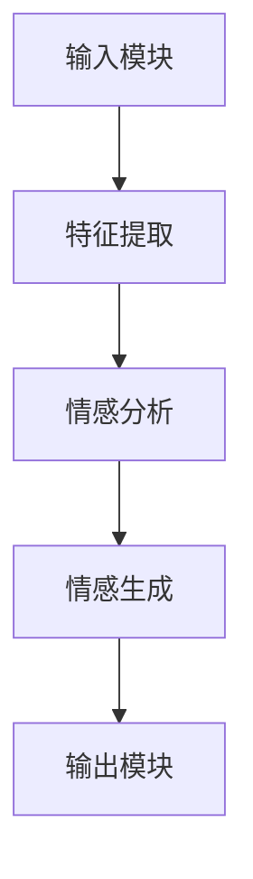

                 


# AI Agent的情感计算：识别、理解和生成情感反应

## 关键词：AI Agent、情感计算、情感识别、情感理解、情感生成

## 摘要：  
情感计算（Affective Computing）是人工智能领域的重要分支，致力于研究如何识别、理解和模拟人类情感。本文将详细探讨AI Agent在情感计算中的应用，包括情感识别、理解与生成的关键技术。通过分析情感计算的背景、算法原理和系统架构，本文将为读者提供全面的视角，了解如何构建具备情感认知能力的智能系统。

---

## 第一部分: AI Agent情感计算的背景与基础

### 第1章: 情感计算的背景与核心概念

#### 1.1 情感计算的基本概念
- **情感计算的定义**：情感计算是指通过计算机技术识别、理解、分析和模拟人类情感的过程。  
- **核心要素**：情感数据（如表情、语气、语调）、情感特征（如情感强度、情感类别）和情感分析模型。  

#### 1.2 情感计算的核心概念与联系
- **情感计算的核心原理**：通过多模态数据（文本、语音、图像）提取情感特征，利用机器学习模型进行情感分类和理解。  
- **与相关领域的对比**：自然语言处理（NLP）侧重于语义分析，计算机视觉侧重于图像识别，而情感计算专注于情感分析。  

#### 1.3 情感计算的数学模型与公式
- **情感强度计算**：  
  $$ 情感强度 = \sum_{i=1}^{n} w_i \cdot f_i $$  
  其中，\( w_i \) 是特征 \( f_i \) 的权重，\( n \) 是特征总数。  
- **情感分类的常见算法**：支持向量机（SVM）、随机森林（Random Forest）、卷积神经网络（CNN）和长短期记忆网络（LSTM）。  

#### 1.4 情感计算的系统架构设计
- **系统组成模块**：输入模块、特征提取模块、情感分析模块、情感生成模块和输出模块。  
- **系统交互流程**：  
  ```mermaid
  sequenceDiagram
  participant 用户
  participant 情感计算系统
  用户->>系统: 提供情感数据
  系统->>用户: 返回情感分析结果
  ```

---

### 第2章: 情感识别的算法与实现

#### 2.1 情感识别的基本方法
- **基于文本的情感识别**：利用词袋模型（Bag of Words）或词嵌入（Word2Vec）提取文本特征，结合情感词典（如SentiWordNet）进行情感分类。  
  ```python
  # 示例代码：基于词袋模型的情感分类
  from sklearn.feature_extraction.text import CountVectorizer
  from sklearn.svm import SVC

  vectorizer = CountVectorizer()
  X = vectorizer.fit_transform(texts)
  clf = SVC()
  clf.fit(X, labels)
  ```

- **基于语音的情感识别**：通过分析语音特征（如音调、语速、停顿）提取情感特征，利用机器学习模型进行情感分类。  
- **基于图像的情感识别**：使用计算机视觉技术（如OpenCV）提取面部表情特征，结合深度学习模型（如CNN）进行情感分类。  

---

## 第二部分: AI Agent的情感理解与分析

### 第3章: 情感分析的高级方法

#### 3.1 情感分析的深度学习模型
- **循环神经网络（RNN）**：适用于处理序列数据，如文本和语音。  
- ** transformers模型（如BERT）**：通过预训练的语义理解模型进行情感分析。  

#### 3.2 跨模态情感分析
- **多模态数据融合**：将文本、语音和图像等多种模态的数据进行融合，提高情感分析的准确率。  
- **跨模态情感分析的实现**：使用多任务学习框架，在不同模态之间共享特征表示。  

#### 3.3 情感记忆与推理
- **情感记忆**：通过记忆网络（Memory Network）记录上下文信息，增强情感推理能力。  
- **情感推理**：基于情感记忆，推理出情感之间的关系和逻辑。  

---

### 第4章: 情感生成与回应

#### 4.1 情感生成的基本方法
- **基于规则的生成**：根据预先定义的规则生成情感回应。  
- **基于生成模型的生成**：使用生成对抗网络（GAN）或变体自编码器（VAE）生成情感化的文本或语音。  

#### 4.2 情感回应的实现
- **文本生成**：利用GPT-3等大语言模型生成情感化的回复。  
- **语音合成**：通过Tacotron等语音合成模型生成情感化的语音。  
- **表情生成**：通过生成模型模拟面部表情，实现情感化的视觉回应。  

---

## 第三部分: 系统架构与设计

### 第5章: 情感计算系统的架构设计

#### 5.1 系统功能设计
- **数据采集模块**：收集多模态情感数据（如文本、语音、图像）。  
- **特征提取模块**：提取情感特征（如情感强度、情感类别）。  
- **情感分析模块**：利用机器学习模型进行情感分类。  
- **情感生成模块**：根据情感分析结果生成情感化的回应。  

#### 5.2 系统架构图


#### 5.3 系统优化与可扩展性
- **数据预处理**：清洗和标注情感数据，提高模型训练效率。  
- **模型优化**：通过超参数调优和模型压缩技术优化模型性能。  

---

## 第四部分: 应用案例与挑战

### 第6章: 情感计算的应用案例

#### 6.1 客服领域的应用
- **情感识别**：识别客户情绪，提供个性化的服务。  
- **情感生成**：根据客户情绪生成合适的回应。  

#### 6.2 教育领域的应用
- **情感识别**：识别学生情绪，提供个性化教学策略。  
- **情感生成**：根据学生情绪生成鼓励性的话语。  

### 第7章: 情感计算的挑战与未来方向

#### 7.1 当前技术的挑战
- **数据多样性**：情感数据的多样性不足，影响模型的泛化能力。  
- **模型解释性**：情感计算模型的可解释性较低，难以满足实际应用需求。  
- **跨文化适应性**：情感表达在不同文化中有差异，模型需要具备跨文化适应性。  

#### 7.2 未来研究方向
- **实时性与轻量化**：研究实时情感计算和轻量化模型。  
- **情感计算的伦理问题**：探讨情感计算在隐私和伦理方面的挑战。  

---

## 作者：AI天才研究院/AI Genius Institute & 禅与计算机程序设计艺术 /Zen And The Art of Computer Programming

