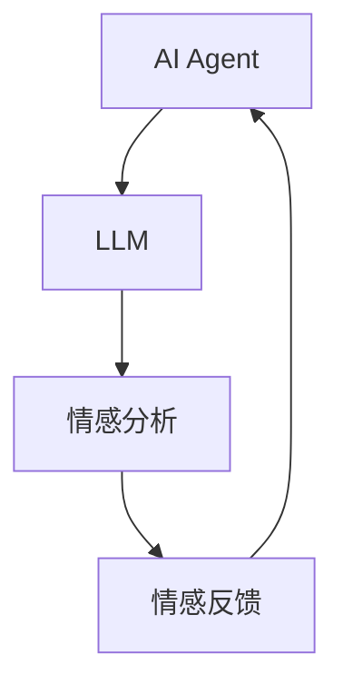
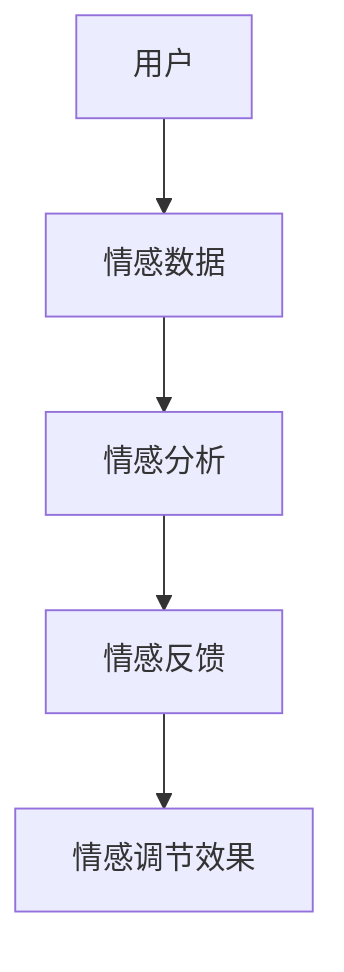
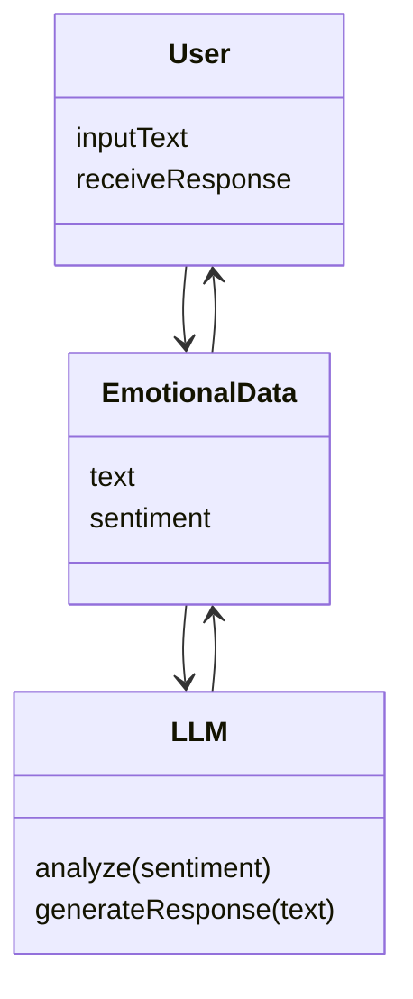
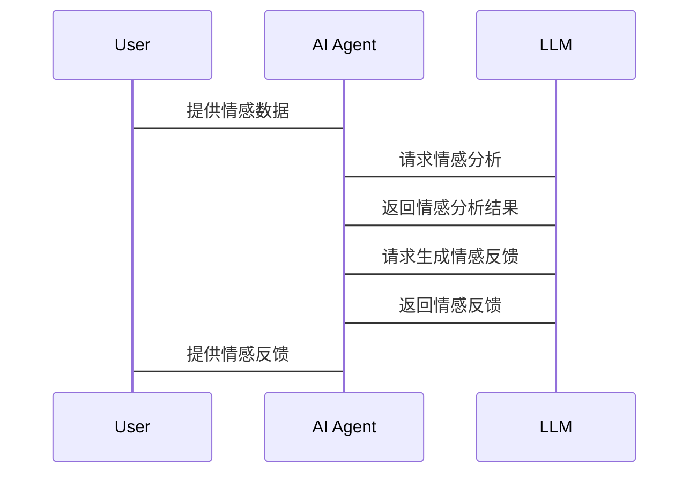

                 


# AI Agent的情感调节：利用LLM进行情绪管理

> 关键词：AI Agent, 情感调节, LLM, 情绪管理, 自然语言处理, 人工智能, 情感计算

> 摘要：  
> 本文探讨了利用大型语言模型（LLM）进行AI Agent的情感调节，重点分析了情感调节的核心概念、算法原理、系统架构设计以及实际应用。通过详细的技术分析和案例研究，本文揭示了如何将LLM应用于AI Agent的情感管理，从而提升人机交互的自然性和智能性。文章内容涵盖从基础概念到实际应用的全链条，为相关领域的研究和实践提供了深入的指导。

---

# 第一部分: AI Agent与情感调节的背景介绍

## 第1章: AI Agent与情感调节的背景

### 1.1 问题背景与描述

#### 1.1.1 情感调节的定义与重要性
- **情感调节**：指个体或系统对自身或他人情感状态的识别、分析和调节的过程，旨在优化情感体验。
- **重要性**：情感调节在人机交互、心理健康支持、智能助手等领域具有重要意义，能够提升用户体验和系统的智能化水平。

#### 1.1.2 AI Agent在情感调节中的作用
- **AI Agent**：一种能够感知环境、执行任务并进行交互的智能体，具备情感调节能力的AI Agent能够更好地理解用户需求并提供个性化的服务。
- **作用**：通过情感调节，AI Agent可以更自然地与用户互动，提高用户满意度和信任感。

#### 1.1.3 当前情感调节技术的局限性
- **技术局限性**：现有情感调节技术多基于规则或浅层学习，难以处理复杂的情感场景。
- **用户需求多样性**：不同用户的情感调节需求差异较大，现有技术难以满足个性化需求。

### 1.2 问题解决与边界

#### 1.2.1 利用LLM进行情感调节的解决方案
- **LLM的优势**：大型语言模型具有强大的语义理解和生成能力，能够处理复杂的情感场景。
- **解决方案**：通过LLM对用户情感状态进行实时分析和生成适当的反馈，实现情感调节。

#### 1.2.2 情感调节的边界与外延
- **边界**：情感调节的范围不包括情感疾病的治疗，主要集中在情绪管理和情感支持。
- **外延**：情感调节技术可以应用于教育、医疗、客服等领域，提升用户体验。

#### 1.2.3 核心概念与要素分析
- **核心概念**：情感识别、情感分析、情感生成。
- **要素分析**：情感数据、情感模型、情感反馈。

### 1.3 核心概念与联系

#### 1.3.1 AI Agent与LLM的关系
- **协同关系**：AI Agent作为载体，利用LLM的情感分析和生成能力，实现情感调节功能。

#### 1.3.2 情感调节的核心要素
- **情感识别**：通过文本、语音、面部表情等多模态数据识别用户情感状态。
- **情感分析**：对用户情感进行分类和评估，判断情感强度和类型。
- **情感反馈**：根据情感分析结果，生成适当的反馈以调节用户情感。

#### 1.3.3 情感调节与人机交互的联系
- **联系**：情感调节是人机交互的重要组成部分，能够提升交互的自然性和智能性。

---

## 第2章: AI Agent与LLM的核心原理

### 2.1 AI Agent的基本原理

#### 2.1.1 AI Agent的定义与分类
- **定义**：AI Agent是一种智能体，能够感知环境、执行任务并进行交互。
- **分类**：基于智能水平可分为简单AI Agent和复杂AI Agent。

#### 2.1.2 AI Agent的核心功能与属性
- **核心功能**：感知、决策、执行、交互。
- **属性特征**：智能性、适应性、自主性、协作性。

#### 2.1.3 AI Agent与人类情感的交互机制
- **交互机制**：通过自然语言处理技术，AI Agent能够理解用户情感并生成适当的情感反馈。

### 2.2 LLM的基本原理

#### 2.2.1 大型语言模型的定义与特点
- **定义**：LLM是一种基于深度学习的自然语言处理模型，具有强大的语义理解和生成能力。
- **特点**：参数量大、训练数据丰富、模型复杂度高。

#### 2.2.2 LLM在情感分析中的应用
- **情感分析**：利用LLM对文本进行情感分类，识别用户情感倾向。
- **情感强度分析**：通过LLM生成情感强度评分。

#### 2.2.3 LLM的训练与优化方法
- **训练方法**：基于监督学习，使用大规模标注数据进行训练。
- **优化方法**：通过微调（fine-tuning）技术，优化模型在特定任务上的性能。

### 2.3 AI Agent与LLM的关系分析

#### 2.3.1 AI Agent与LLM的协同工作模式
- **协同模式**：AI Agent作为用户界面，LLM作为后端处理引擎，共同完成情感调节任务。

#### 2.3.2 情感调节中的信息流与数据流
- **信息流**：用户输入情感信息，AI Agent将其传递给LLM进行处理，LLM生成反馈后返回给用户。
- **数据流**：情感数据、情感分析结果、情感反馈。

#### 2.3.3 情感调节的系统架构图


---

## 第3章: 情感调节的核心要素与属性特征

### 3.1 情感调节的核心要素

#### 3.1.1 情感识别与分析
- **情感识别**：通过文本、语音、面部表情等多种模态数据识别用户情感。
- **情感分析**：对用户情感进行分类，如正面、负面、中性。

#### 3.1.2 情感预测与评估
- **情感预测**：基于历史数据预测用户未来的情感状态。
- **情感评估**：对情感调节的效果进行评估，如情感评分的变化。

#### 3.1.3 情感反馈与调节
- **情感反馈**：根据情感分析结果，生成适当的反馈以调节用户情感。
- **情感调节**：通过反馈优化用户情感状态。

### 3.2 情感调节的属性特征对比

#### 3.2.1 不同情感调节方法的对比分析
| 方法         | 优点                               | 缺点                               |
|--------------|------------------------------------|------------------------------------|
| 基于规则     | 实现简单，易于部署                 | 无法处理复杂情感场景               |
| 基于浅层学习 | 能处理部分情感场景                 | 模型表达能力有限                   |
| 基于深度学习 | 模型表达能力强，能处理复杂场景     | 训练成本高，需要大量数据           |

#### 3.2.2 基于LLM的情感调节方法的优缺点
- **优点**：LLM具有强大的语义理解和生成能力，能够处理复杂的情感场景。
- **缺点**：训练成本高，需要大量数据支持。

#### 3.2.3 情感调节的性能指标与评估标准
- **性能指标**：准确率、召回率、F1值。
- **评估标准**：情感调节效果的评分、用户满意度。

### 3.3 情感调节的ER实体关系图

#### 3.3.1 实体关系图的构建


#### 3.3.2 实体关系图的分析与解释
- **用户**：情感调节的主体。
- **情感数据**：用户输入的情感数据。
- **情感分析**：对情感数据的处理过程。
- **情感反馈**：情感分析的结果。
- **情感调节效果**：情感反馈对用户情感的影响。

#### 3.3.3 实体关系图的应用场景
- **应用场景**：在教育、医疗、客服等领域，利用情感调节技术提升用户体验。

---

## 第4章: 情感调节算法的原理与实现

### 4.1 情感调节算法的原理

#### 4.1.1 情感调节算法的定义与分类
- **定义**：情感调节算法是一种用于分析和调节用户情感状态的算法。
- **分类**：基于规则的情感调节算法、基于浅层学习的情感调节算法、基于深度学习的情感调节算法。

#### 4.1.2 LLM在情感调节中的作用
- **情感分析**：LLM对用户情感进行分类和评估。
- **情感生成**：LLM生成情感反馈以调节用户情感。

#### 4.1.3 情感调节算法的数学模型
- **模型**：基于深度学习的模型，如Transformer架构。
- **公式**：$$ P(y|x) = \text{softmax}(Wx + b) $$，其中$$ x $$是输入，$$ y $$是输出。

### 4.2 情感调节算法的实现

#### 4.2.1 情感调节算法的实现步骤
1. **输入情感数据**：用户输入文本或语音数据。
2. **情感分析**：使用LLM对情感数据进行分类。
3. **情感生成**：根据情感分析结果，生成情感反馈。
4. **输出情感反馈**：将情感反馈返回给用户。

#### 4.2.2 情感调节算法的数学模型与代码实现
- **数学模型**：$$ y = f(x) $$，其中$$ f $$是深度学习模型。
- **代码实现**：以下是一个简单的Python代码示例：
  ```python
  def emotional_regulation(input_text):
      # 情感分析
      analysis = model.predict(input_text)
      # 情感生成
      response = generate_response(analysis)
      return response
  ```

### 4.3 情感调节算法的优化与改进

#### 4.3.1 情感调节算法的优化方法
- **微调模型**：在特定任务上对LLM进行微调，优化情感调节效果。
- **多模态输入**：结合文本、语音、面部表情等多种模态数据，提升情感调节的准确性。

#### 4.3.2 情感调节算法的改进方向
- **实时性**：提升情感调节算法的实时性，减少响应时间。
- **个性化**：针对不同用户的情感需求，提供个性化的调节方案。

---

## 第5章: 系统分析与架构设计方案

### 5.1 问题场景介绍

#### 5.1.1 问题场景的定义与描述
- **问题场景**：用户与AI Agent进行交互，AI Agent需要实时分析用户情感并生成适当的情感反馈。

#### 5.1.2 问题场景的分析与建模
- **分析**：用户输入情感数据，AI Agent通过LLM进行情感分析和生成情感反馈。
- **建模**：使用领域模型对问题场景进行建模。

### 5.2 系统功能设计

#### 5.2.1 系统功能模块
- **情感数据输入模块**：用户输入情感数据。
- **情感分析模块**：对情感数据进行分类和评估。
- **情感生成模块**：根据情感分析结果生成情感反馈。
- **情感反馈输出模块**：将情感反馈返回给用户。

#### 5.2.2 系统功能的领域模型


### 5.3 系统架构设计

#### 5.3.1 系统架构的整体设计
- **整体架构**：AI Agent作为用户界面，LLM作为后端处理引擎，共同完成情感调节任务。

#### 5.3.2 系统架构的详细设计


#### 5.3.3 系统架构的交互序列图


### 5.4 系统接口设计

#### 5.4.1 系统接口的定义与设计
- **输入接口**：用户输入情感数据。
- **输出接口**：系统输出情感反馈。

#### 5.4.2 系统接口的交互流程
1. 用户输入情感数据。
2. AI Agent接收情感数据并传递给LLM。
3. LLM对情感数据进行分析并生成情感反馈。
4. AI Agent接收情感反馈并传递给用户。

---

## 第6章: 项目实战

### 6.1 环境安装与配置

#### 6.1.1 环境要求
- **Python**：3.8+
- **库依赖**：需要安装TensorFlow、Keras、Hugging Face库等。

#### 6.1.2 环境配置
- 安装必要的Python库：
  ```bash
  pip install tensorflow keras huggingface-pytorch transformers
  ```

### 6.2 系统核心实现

#### 6.2.1 情感分析模块实现
- **代码实现**：
  ```python
  from transformers import pipeline

  sentiment_analyzer = pipeline("sentiment-analysis")
  def analyze_sentiment(text):
      return sentiment_analyzer(text)
  ```

#### 6.2.2 情感生成模块实现
- **代码实现**：
  ```python
  from transformers import pipeline

  text_generator = pipeline("text-generation")
  def generate_response(prompt):
      return text_generator(prompt, max_length=50)
  ```

### 6.3 案例分析与实现解读

#### 6.3.1 案例分析
- **案例背景**：用户输入一段带有负面情感的文本，AI Agent需要生成积极的情感反馈。

#### 6.3.2 案例实现
- **情感分析**：
  ```python
  input_text = "我今天心情很不好，工作压力太大了。"
  result = analyze_sentiment(input_text)
  print(result)  # 输出情感分析结果
  ```
- **情感生成**：
  ```python
  prompt = "用户感到压力很大，请给予积极的反馈。"
  response = generate_response(prompt)
  print(response)  # 输出情感反馈
  ```

### 6.4 项目小结

#### 6.4.1 实战总结
- **总结**：通过实战项目，验证了基于LLM的情感调节技术的有效性。

#### 6.4.2 实战经验与教训
- **经验**：LLM在情感调节中的应用潜力巨大。
- **教训**：情感调节技术的实现需要结合实际应用场景，进行针对性优化。

---

## 第7章: 最佳实践与未来展望

### 7.1 最佳实践

#### 7.1.1 小结
- **小结**：本文详细探讨了利用LLM进行AI Agent情感调节的技术实现。

#### 7.1.2 注意事项
- **注意事项**：在实际应用中，需要注意情感数据的隐私保护和模型的实时性。

#### 7.1.3 拓展阅读
- **拓展阅读**：推荐阅读相关领域的书籍和论文，深入学习情感计算和自然语言处理技术。

### 7.2 未来展望

#### 7.2.1 情感调节技术的未来发展方向
- **多模态情感调节**：结合文本、语音、面部表情等多种模态数据，提升情感调节的准确性和智能化水平。
- **个性化情感调节**：根据用户的情感需求，提供个性化的调节方案。
- **实时情感调节**：提升情感调节算法的实时性，减少响应时间。

#### 7.2.2 情感调节技术的创新与突破
- **创新**：探索新型情感调节算法，如基于强化学习的情感调节模型。
- **突破**：突破现有技术的局限性，实现更智能、更自然的情感调节。

---

## 附录

### 附录A: 术语表

| 术语         | 定义                                      |
|--------------|-----------------------------------------|
| AI Agent     | 人工智能代理，能够感知环境、执行任务并进行交互的智能体。 |
| LLM          | 大型语言模型，基于深度学习的自然语言处理模型。         |
| 情感调节     | 对用户情感状态进行识别、分析和调节的过程。             |

### 附录B: 参考文献

1. Goodfellow, I., Bengio, Y., & Courville, A. (2016). *Deep Learning*. MIT Press.
2. Peters, M., & Wood, F. (2017). *BERT: Pre-training of deep bidirectional transformers for language understanding*. arXiv preprint arXiv:1810.0469.
3. Vaswani, A., et al. (2017). *Attention is all you need*. arXiv preprint arXiv:1706.03798.

---

作者：AI天才研究院/AI Genius Institute & 禅与计算机程序设计艺术 /Zen And The Art of Computer Programming

