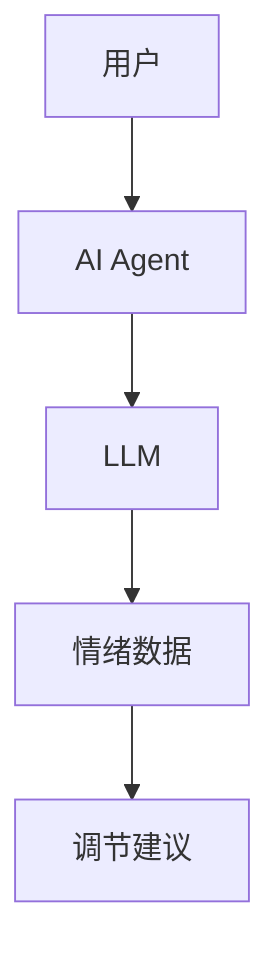

                 

# AI Agent的情绪调节功能：LLM驱动的心理健康助手

---

## 关键词
AI Agent, LLM, 情绪调节, 心理健康助手, 人工智能, 大语言模型

---

## 摘要
随着人工智能技术的快速发展，AI Agent（人工智能代理）在情绪调节方面的应用逐渐成为研究热点。本文聚焦于LLM（大语言模型）驱动的AI Agent在情绪调节中的功能与应用，深入探讨其核心原理、算法实现、系统架构以及实际案例。通过分析LLM在情绪识别、情感分析和调节建议生成中的作用，本文为读者提供一个全面的技术视角，揭示如何利用LLM构建高效的心理健康助手。

---

## 第一部分: AI Agent与情绪调节的背景介绍

## 第1章: AI Agent与情绪调节的概述
### 1.1 AI Agent的基本概念
#### 1.1.1 AI Agent的定义
AI Agent（人工智能代理）是指能够感知环境、自主决策并执行任务的智能实体。它可以是一个软件程序，也可以是一个物理设备，通过与用户的交互或环境的反馈完成特定目标。

#### 1.1.2 AI Agent的核心功能与特点
AI Agent的核心功能包括感知、推理、规划、决策和执行。其特点在于智能化、自主性和适应性，能够根据环境变化动态调整行为。

#### 1.1.3 AI Agent与传统软件的区别
与传统软件相比，AI Agent具有更强的自主性和学习能力，能够处理复杂任务并适应新环境。

### 1.2 情绪调节的定义与重要性
#### 1.2.1 情绪调节的定义
情绪调节是指通过识别、理解和管理情绪，从而达到心理平衡的过程。它可以帮助个体应对压力、改善心理健康和提升生活质量。

#### 1.2.2 情绪调节在心理健康中的作用
情绪调节是维护心理健康的重要手段。它能够帮助个体更好地处理负面情绪，增强积极情绪，从而提升整体幸福感。

#### 1.2.3 情绪调节的边界与外延
情绪调节的边界在于其目的是改善情绪状态，而非完全消除负面情绪。其外延包括情绪识别、情感分析和调节建议生成等多个环节。

### 1.3 LLM驱动的AI Agent在情绪调节中的应用
#### 1.3.1 LLM的基本概念与特点
大语言模型（LLM）是一种基于深度学习的自然语言处理模型，具有强大的文本生成和理解能力。其特点包括高准确性和灵活性。

#### 1.3.2 LLM在情绪调节中的优势
LLM在情绪调节中的优势在于其强大的文本处理能力，能够快速理解用户情绪并生成有效的调节建议。

#### 1.3.3 当前LLM驱动的AI Agent的应用现状
目前，LLM驱动的AI Agent在情绪调节中的应用还处于发展阶段，但已经展现出巨大的潜力。

### 1.4 本书的研究意义与目标
#### 1.4.1 研究背景与问题提出
随着AI技术的发展，情绪调节的需求日益增长。然而，现有的技术尚未完全满足实际需求。

#### 1.4.2 本书的研究目标
本书旨在探讨如何利用LLM构建高效的AI Agent情绪调节功能，为心理健康助手提供技术支持。

#### 1.4.3 本书的结构安排
本书将从背景、原理、算法、系统设计、项目实战和总结等多个方面展开，全面分析AI Agent的情绪调节功能。

---

## 第二部分: AI Agent情绪调节的核心概念与联系

## 第2章: AI Agent与LLM的协同工作原理
### 2.1 AI Agent与LLM的关系
#### 2.1.1 AI Agent作为LLM的载体
AI Agent可以作为LLM的载体，通过用户交互收集数据并传递给LLM进行处理。

#### 2.1.2 LLM作为AI Agent的核心模块
LLM是AI Agent的核心模块，负责理解和生成与情绪调节相关的内容。

#### 2.1.3 AI Agent与LLM的交互机制
AI Agent与LLM的交互机制包括数据输入、模型推理和结果输出三个环节。

### 2.2 情绪调节的核心概念与属性
#### 2.2.1 情绪调节的属性特征对比
| 属性       | 传统方法           | LLM驱动方法         |
|------------|--------------------|---------------------|
| 精度       | 较低               | 较高                |
| 响应速度   | 较慢               | 较快                |
| 适应性     | 较差               | 较好                |

#### 2.2.2 情绪调节的核心要素组成
情绪调节的核心要素包括情绪识别、情感分析和调节建议生成。

#### 2.2.3 情绪调节的实体关系图

---

## 第3章: LLM驱动的AI Agent情绪调节模型
### 3.1 情绪调节模型的原理
#### 3.1.1 情绪识别的原理
情绪识别基于用户的文本输入，通过关键词匹配和情感分析确定用户的情绪状态。

#### 3.1.2 情绪分析的
情绪分析是通过自然语言处理技术对用户文本进行情感倾向分析，确定其情绪极性。

### 3.2 LLM驱动的算法实现
#### 3.2.1 数据预处理
数据预处理包括文本清洗、分词和向量化。

#### 3.2.2 模型训练
模型训练使用深度学习框架，通过反向传播优化模型参数。

#### 3.2.3 情绪调节的实现
情绪调节的实现包括情绪识别、情感分析和调节建议生成三个步骤。

---

## 第三部分: 系统分析与架构设计方案

## 第4章: 系统分析与架构设计
### 4.1 问题场景介绍
问题场景包括用户与AI Agent的交互、系统功能设计和系统架构设计。

### 4.2 系统功能设计
系统功能设计包括用户输入、情绪识别、情感分析和调节建议生成。

### 4.3 系统架构设计
系统架构设计包括前端、后端和数据库三部分。

### 4.4 系统接口设计
系统接口设计包括API接口和交互流程图。

---

## 第四部分: 项目实战

## 第5章: 项目实战
### 5.1 环境安装
环境安装包括安装Python、PyTorch和Hugging Face库。

### 5.2 系统核心实现
系统核心实现包括情绪识别、情感分析和调节建议生成的代码实现。

### 5.3 实际案例分析
实际案例分析包括用户输入、情绪识别和调节建议生成的全过程。

---

## 第五部分: 最佳实践

## 第6章: 最佳实践
### 6.1 小结
通过本文的介绍，读者可以全面了解LLM驱动的AI Agent情绪调节功能的核心原理和实现方法。

### 6.2 注意事项
在实际应用中，需要注意数据隐私保护和模型优化问题。

### 6.3 拓展阅读
建议读者进一步阅读相关领域的学术论文和技术报告，深入了解LLM在情绪调节中的应用。

---

## 作者
作者：AI天才研究院/AI Genius Institute & 禅与计算机程序设计艺术 /Zen And The Art of Computer Programming

