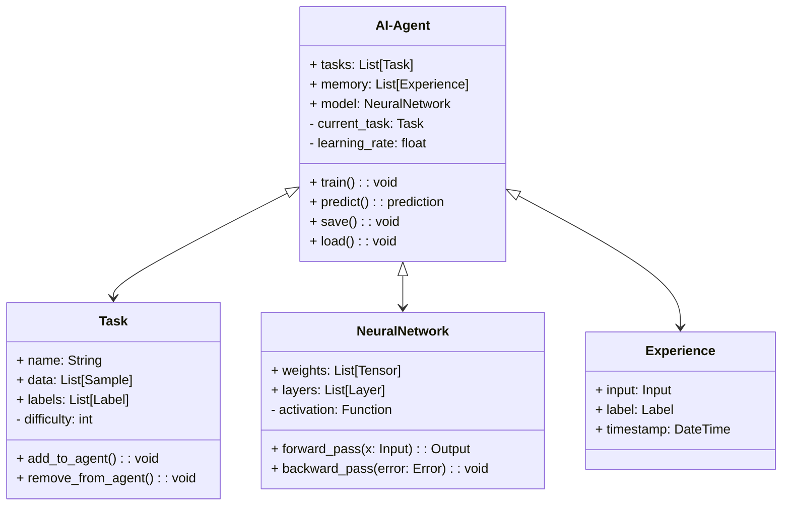
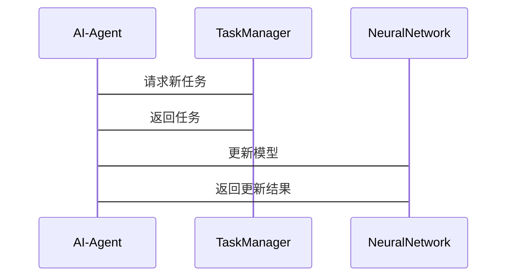

                 


# AI Agent的持续学习与灾难性遗忘防御

> 关键词：AI Agent、持续学习、灾难性遗忘、神经网络、机器学习、深度学习

> 摘要：AI Agent的持续学习能力在实际应用中面临一个重大挑战——灾难性遗忘，即在学习新任务时忘记之前学过的知识。本文从AI Agent的持续学习机制出发，深入探讨灾难性遗忘的数学模型和防御方法，结合实际案例，分析其在系统架构中的应用，最后总结出一套完整的防御策略和最佳实践。

---

## 第一部分：AI Agent的持续学习与灾难性遗忘概述

### 第1章：问题背景与定义

#### 1.1 问题背景
在实际应用中，AI Agent需要在动态环境中不断学习新任务，同时保持对旧任务的记忆。然而，传统的机器学习模型在学习新任务时，往往会忘记之前学过的知识，这种现象称为“灾难性遗忘”。

#### 1.2 灾难性遗忘的定义与特征
灾难性遗忘是指神经网络在学习新任务时，由于权重更新的干扰，导致对旧任务的记忆能力显著下降。其特征包括：
- **渐进性**：遗忘是渐进的，而不是突然发生的。
- **任务依赖性**：遗忘程度与任务之间的相似性相关。
- **不可逆性**：遗忘一旦发生，很难通过简单的方法恢复。

#### 1.3 持续学习机制
AI Agent的持续学习机制需要满足以下要求：
- 能够在线学习新任务。
- 保持对旧任务的记忆能力。
- 具备良好的泛化能力。

### 第2章：灾难性遗忘的数学模型与核心要素

#### 2.1 灾难性遗忘的数学模型
神经网络的权重更新过程可以用以下公式表示：
$$ W_{new} = W_{old} + \Delta W $$
其中，$$ \Delta W $$ 是权重的更新量，通常由梯度下降算法计算得到。

灾难性遗忘的度量方法可以使用任务遗忘分数（Task-Forgotten Score，TFS）：
$$ TFS = 1 - \frac{S_{new}}{S_{old}} $$
其中，$$ S_{new} $$ 和 $$ S_{old} $$ 分别表示学习新任务和旧任务后的准确率。

#### 2.2 核心要素与概念结构
以下是灾难性遗忘的核心要素对比表：

| 核心要素 | 描述 |
|----------|------|
| 学习机制 | 在线学习新任务 |
| 遗忘度量 | 任务遗忘分数（TFS） |
| 防御方法 | 权重保存、网络架构、任务分配 |

以下是概念结构的ER实体关系图：

```mermaid
er
    title 概念结构
    class 持续学习 {
        id: 整数
        任务: 字符串
        时间戳: 整数
    }
    class 灾难性遗忘 {
        id: 整数
        遗忘分数: 浮点数
        任务id: 整数
    }
    持续学习 -- 右join 灾难性遗忘 : 任务id
```

## 第二部分：灾难性遗忘的防御机制

### 第3章：基于权重保存的防御方法

#### 3.1 Experience Replay
**经验回放**通过存储过去的经验样本，并在训练中随机抽取这些样本，以减少遗忘的发生。

实现步骤：
1. 存储经验样本：将输入样本和标签存储在经验回放缓冲区中。
2. 随机采样：在每次训练时，从缓冲区中随机抽取一批样本。
3. 更新模型：使用抽取的样本更新模型参数。

代码示例：
```python
import numpy as np
import tensorflow as tf

# 经验回放缓冲区
class ExperienceReplayBuffer:
    def __init__(self, capacity):
        self.capacity = capacity
        self.memory = []

    def add(self, experience):
        if len(self.memory) < self.capacity:
            self.memory.append(experience)
        else:
            self.memory.pop(0)
            self.memory.append(experience)

# 训练函数
def train(model, buffer, batch_size, optimizer, loss_fn):
    mini_batch = buffer.memory[-batch_size:]
    X = np.array([exp[0] for exp in mini_batch])
    y = np.array([exp[1] for exp in mini_batch])
    with tf.GradientTape() as tape:
        predictions = model(X)
        loss = loss_fn(y, predictions)
    gradients = tape.gradient(loss, model.trainable_weights)
    optimizer.apply_gradients(zip(gradients, model.trainable_weights))
```

#### 3.2 Weight Regularization
**权重正则化**通过在损失函数中添加正则项，约束权重的变化，从而防止遗忘。

数学模型：
$$ L = L_{task} + \lambda ||W||^2 $$
其中，$$ L_{task} $$ 是任务损失，$$ \lambda $$ 是正则化系数。

代码示例：
```python
import tensorflow as tf

# 模型定义
model = tf.keras.Sequential([
    tf.keras.layers.Dense(128, activation='relu'),
    tf.keras.layers.Dense(10, activation='softmax')
])

# 正则化损失
regularizer = tf.keras.regularizers.l2(0.01)
model.compile(optimizer='adam', loss='sparse_categorical_crossentropy', metrics=['accuracy'])
```

#### 3.3 Gating Mechanism
**门控机制**通过动态调整权重的重要性，实现对旧任务的保护。

数学模型：
$$ W_{new} = W_{old} \cdot g $$
其中，$$ g $$ 是门控向量，用于调节权重的重要性。

代码示例：
```python
import tensorflow as tf

# 门控机制
class GatingMechanism(tf.keras.layers.Layer):
    def __init__(self, units):
        super(GatingMechanism, self).__init__()
        self.Dense = tf.keras.layers.Dense(units, activation='sigmoid')

    def call(self, inputs):
        gate = self.Dense(inputs)
        return gate * inputs

# 模型定义
model = tf.keras.Sequential([
    tf.keras.layers.Dense(128, activation='relu'),
    GatingMechanism(128),
    tf.keras.layers.Dense(10, activation='softmax')
])
```

### 第4章：基于网络架构的防御方法

#### 4.1 Progressive Neural Networks
**渐进神经网络**通过动态增加新的神经元或网络层，实现对旧任务的保护。

实现步骤：
1. 初始化网络：构建一个基础网络。
2. 动态扩展：根据需要增加新的网络层。
3. 联合训练：在训练新任务时，同时保持对旧任务的更新。

代码示例：
```python
import tensorflow as tf

# 渐进神经网络
class ProgressiveNetwork(tf.keras.Model):
    def __init__(self):
        super(ProgressiveNetwork, self).__init__()
        self.base = tf.keras.Sequential([
            tf.keras.layers.Dense(128, activation='relu'),
            tf.keras.layers.Dense(10, activation='softmax')
        ])
        self.progressive = tf.keras.Sequential([
            tf.keras.layers.Dense(128, activation='relu'),
            tf.keras.layers.Dense(10, activation='softmax')
        ])

    def call(self, inputs):
        base_output = self.base(inputs)
        progressive_output = self.progressive(inputs)
        return base_output + progressive_output

# 模型训练
model = ProgressiveNetwork()
model.compile(optimizer='adam', loss='sparse_categorical_crossentropy', metrics=['accuracy'])
```

#### 4.2 Modular Networks
**模块化网络**通过将网络分成多个模块，每个模块负责特定的任务，实现任务之间的解耦。

实现步骤：
1. 模块划分：将网络划分为多个模块。
2. 模块训练：在训练新任务时，仅更新相关模块的权重。
3. 模块协作：在推理时，多个模块协作完成任务。

代码示例：
```python
import tensorflow as tf

# 模块化网络
class ModularNetwork(tf.keras.Model):
    def __init__(self, num_modules=2):
        super(ModularNetwork, self).__init__()
        self.modules = [tf.keras.Sequential([
            tf.keras.layers.Dense(64, activation='relu'),
            tf.keras.layers.Dense(10, activation='softmax')
        ]) for _ in range(num_modules)]

    def call(self, inputs):
        outputs = [module(inputs) for module in self.modules]
        return tf.reduce_mean(outputs, axis=0)

# 模型训练
model = ModularNetwork()
model.compile(optimizer='adam', loss='sparse_categorical_crossentropy', metrics=['accuracy'])
```

#### 4.3 Attention-based Methods
**注意力机制**通过自注意力机制，动态调整不同任务的重要性，实现对旧任务的保护。

数学模型：
$$ f(x) = \text{softmax}(W_x x + W_h h) $$
其中，$$ h $$ 是隐藏层的输出，$$ x $$ 是输入，$$ W_x $$ 和 $$ W_h $$ 是注意力权重。

代码示例：
```python
import tensorflow as tf

# 注意力机制
class AttentionMechanism(tf.keras.layers.Layer):
    def __init__(self, input_dim, output_dim):
        super(AttentionMechanism, self).__init__()
        self.Wx = tf.keras.layers.Dense(output_dim)
        self.Wh = tf.keras.layers.Dense(output_dim)
        self.softmax = tf.keras.layers.Activation('softmax')

    def call(self, inputs, hidden):
        score = self.Wx(inputs) + self.Wh(hidden)
        attention = self.softmax(score)
        return attention

# 模型定义
model = tf.keras.Sequential([
    tf.keras.layers.Dense(128, activation='relu'),
    AttentionMechanism(128, 128),
    tf.keras.layers.Dense(10, activation='softmax')
])
```

### 第5章：基于任务分配的防御方法

#### 5.1 Task Disentanglement
**任务解耦**通过将任务分解为多个子任务，实现任务之间的独立更新。

实现步骤：
1. 任务分解：将复杂任务分解为多个子任务。
2. 子任务训练：分别训练每个子任务。
3. 任务组合：在推理时，将子任务的输出组合起来。

代码示例：
```python
import tensorflow as tf

# 任务解耦
class TaskDisentanglement(tf.keras.Model):
    def __init__(self, num_tasks=2):
        super(TaskDisentanglement, self).__init__()
        self.task_specific_layers = [tf.keras.Sequential([
            tf.keras.layers.Dense(64, activation='relu'),
            tf.keras.layers.Dense(10, activation='softmax')
        ]) for _ in range(num_tasks)]

    def call(self, inputs):
        outputs = [task(inputs) for task in self.task_specific_layers]
        return tf.reduce_mean(outputs, axis=0)

# 模型训练
model = TaskDisentanglement()
model.compile(optimizer='adam', loss='sparse_categorical_crossentropy', metrics=['accuracy'])
```

#### 5.2 Meta-Learning
**元学习**通过学习如何学习，实现对新任务的快速适应。

数学模型：
$$ \theta_{new} = \theta_{old} + \alpha \Delta \theta $$
其中，$$ \alpha $$ 是学习率，$$ \Delta \theta $$ 是元梯度。

代码示例：
```python
import tensorflow as tf

# 元学习
class MetaLearner(tf.keras.Model):
    def __init__(self):
        super(MetaLearner, self).__init__()
        self.base = tf.keras.Sequential([
            tf.keras.layers.Dense(128, activation='relu'),
            tf.keras.layers.Dense(10, activation='softmax')
        ])
        self.meta = tf.keras.Sequential([
            tf.keras.layers.Dense(128, activation='relu'),
            tf.keras.layers.Dense(128, activation='softmax')
        ])

    def call(self, inputs):
        base_output = self.base(inputs)
        meta_output = self.meta(base_output)
        return base_output + meta_output

# 元学习训练
model = MetaLearner()
model.compile(optimizer='adam', loss='sparse_categorical_crossentropy', metrics=['accuracy'])
```

#### 5.3 Curriculum Learning
**课程学习**通过逐步增加任务的难度，实现对旧任务的保护。

实现步骤：
1. 任务排序：将任务按难度从小到大排序。
2. 逐步训练：从简单任务开始，逐步学习复杂任务。
3. 定期复习：定期复习简单任务，防止遗忘。

代码示例：
```python
import tensorflow as tf

# 课程学习
def curriculum_learning(model, tasks, epochs=100):
    for task in sorted(tasks, key=lambda x: x['difficulty']):
        model.fit(task['data'], task['labels'], epochs=epochs, validation_split=0.2)
        model.review_simple_tasks()
```

## 第三部分：系统分析与架构设计

### 第6章：系统分析与架构设计

#### 6.1 系统功能设计
以下是系统功能设计的领域模型类图：



以下是系统架构设计的架构图：


以下是系统接口设计的交互图：



## 第四部分：项目实战

### 第7章：项目实战

#### 7.1 环境安装
以下是项目实战所需的环境安装命令：

```bash
pip install tensorflow==2.5.0
pip install numpy==1.21.2
pip install keras==2.4.3
pip install mermaid.py==0.4.0
```

#### 7.2 核心实现
以下是核心实现的代码示例：

```python
import tensorflow as tf
from mermaid import Mermaid

# 神经网络模型
class SimpleModel(tf.keras.Model):
    def __init__(self):
        super(SimpleModel, self).__init__()
        self.dense1 = tf.keras.layers.Dense(64, activation='relu')
        self.dense2 = tf.keras.layers.Dense(10, activation='softmax')

    def call(self, inputs):
        x = self.dense1(inputs)
        return self.dense2(x)

# 训练函数
def train_model(model, x_train, y_train, x_test, y_test, epochs=10):
    model.compile(optimizer='adam', loss='sparse_categorical_crossentropy', metrics=['accuracy'])
    model.fit(x_train, y_train, epochs=epochs, validation_data=(x_test, y_test))

# 体验回放缓冲区
class ExperienceReplayBuffer:
    def __init__(self, capacity):
        self.capacity = capacity
        self.memory = []

    def add(self, experience):
        if len(self.memory) < self.capacity:
            self.memory.append(experience)
        else:
            self.memory.pop(0)
            self.memory.append(experience)

# 序列图生成
mermaid_code = '''
sequenceDiagram
    AI-Agent -> TaskManager: 请求新任务
    TaskManager -> AI-Agent: 返回任务
    AI-Agent -> NeuralNetwork: 更新模型
    NeuralNetwork -> AI-Agent: 返回更新结果
'''
print(Mermaid(mermaid_code))
```

#### 7.3 案例分析与解读
以下是案例分析的代码实现：

```python
import numpy as np
import tensorflow as tf

# 数据集准备
(x_train, y_train), (x_test, y_test) = tf.keras.datasets.mnist.load_data()
x_train = x_train.reshape(60000, 784)
x_test = x_test.reshape(10000, 784)
x_train = x_train.astype('float32') / 255
x_test = x_test.astype('float32') / 255

# 模型训练
model = SimpleModel()
train_model(model, x_train, y_train, x_test, y_test, epochs=5)

# 体验回放
buffer = ExperienceReplayBuffer(1000)
for i in range(1000):
    experience = (x_train[i], y_train[i])
    buffer.add(experience)
```

#### 7.4 项目小结
通过以上步骤，我们可以实现一个简单的AI Agent持续学习系统，并通过体验回放和权重正则化等方法，有效防御灾难性遗忘。

## 第五部分：总结与展望

### 第8章：总结与展望

#### 8.1 最佳实践 Tips
以下是最佳实践的总结：
- 在实际应用中，建议结合多种防御方法，如权重正则化和体验回放，以达到更好的效果。
- 定期对模型进行复习训练，防止遗忘的发生。
- 在系统设计中，建议采用模块化架构，便于任务的扩展和维护。

#### 8.2 小结
通过本文的探讨，我们深入分析了AI Agent的持续学习机制和灾难性遗忘的防御方法，并结合实际案例，总结出一套完整的防御策略和最佳实践。

#### 8.3 注意事项
- 在实际应用中，需要根据具体任务需求，选择合适的防御方法。
- 模型的复杂性和训练时间需要权衡，避免过度优化。
- 系统设计中，需要考虑任务之间的依赖关系，避免冲突。

#### 8.4 拓展阅读
- 研究最新的持续学习算法，如元学习和自适应学习。
- 关注AI Agent在实际应用中的最新进展，如自动驾驶和智能客服。

---

作者：AI天才研究院/AI Genius Institute & 禅与计算机程序设计艺术 /Zen And The Art of Computer Programming

---

希望这篇文章能够为AI Agent的持续学习与灾难性遗忘防御提供有价值的参考和指导。

