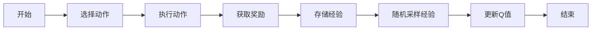
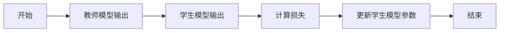
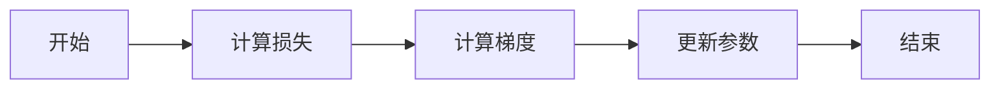
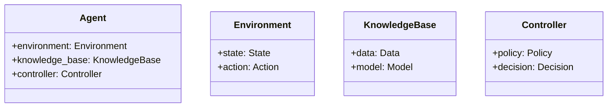
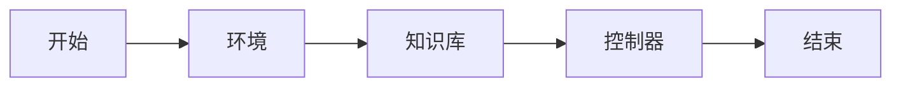
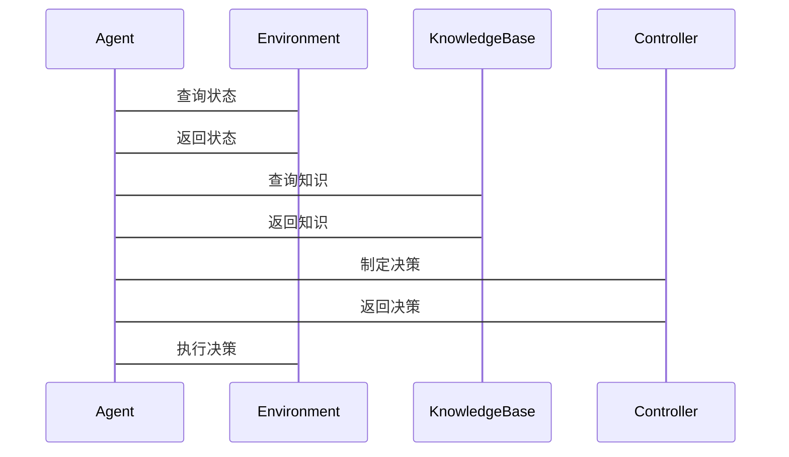

                 


# AI Agent的持续学习与知识更新策略

> 关键词：AI Agent, 持续学习, 知识更新, 强化学习, 知识图谱, 系统架构

> 摘要：本文探讨了AI Agent的持续学习与知识更新策略，从核心概念、算法原理、系统设计到项目实战，详细分析了如何构建支持持续学习的AI Agent系统，结合实际案例和代码实现，为读者提供系统化的知识体系和实践指导。

---

# 第一部分: AI Agent的持续学习与知识更新背景

## 第1章: AI Agent的基本概念与持续学习的重要性

### 1.1 AI Agent的基本概念

#### 1.1.1 AI Agent的定义
AI Agent（人工智能代理）是指能够感知环境、自主决策并执行任务的智能体。它可以是一个软件程序、机器人或其他智能系统，通过与环境交互，实现特定目标。

#### 1.1.2 AI Agent的核心特征
- **自主性**：能够在没有外部干预的情况下自主运行。
- **反应性**：能够实时感知环境并做出反应。
- **目标导向**：所有行为都围绕实现特定目标展开。
- **学习能力**：通过经验或数据不断优化自身性能。

#### 1.1.3 AI Agent的分类与应用场景
AI Agent可以根据功能、智能水平和应用场景进行分类：
- **按功能分**：分为监视型、控制型、交互型等。
- **按智能水平分**：分为反应式、认知式、情感式等。
- **按应用场景分**：如自动驾驶、智能助手、机器人等。

### 1.2 持续学习的背景与问题背景

#### 1.2.1 传统机器学习的局限性
传统机器学习模型通常需要在训练完成后固定权重，无法在动态环境中更新知识。当环境发生变化时，模型性能会显著下降。

#### 1.2.2 动态环境下的知识更新需求
在现实应用中，环境通常是动态变化的。例如，用户需求的变化、市场趋势的波动、任务目标的调整等，都需要AI Agent能够实时更新知识。

#### 1.2.3 持续学习的必要性与挑战
- **必要性**：持续学习是AI Agent在动态环境中保持高性能的核心能力。
- **挑战**：如何平衡新旧知识的学习，避免知识遗忘，同时提高学习效率。

### 1.3 持续学习的核心问题描述

#### 1.3.1 知识遗忘与更新的矛盾
当学习新知识时，旧知识可能被遗忘，导致模型性能下降。

#### 1.3.2 动态数据流的处理挑战
AI Agent需要处理实时动态数据流，这对计算效率和存储提出了更高的要求。

#### 1.3.3 持续学习的边界与外延
持续学习需要明确学习的边界，避免学习范围过大或过小，同时需要考虑学习的外部依赖。

### 1.4 本章小结
本章介绍了AI Agent的基本概念、核心特征和应用场景，并指出了持续学习的必要性和挑战。接下来将深入探讨持续学习的机制与方法。

---

# 第二部分: AI Agent的持续学习与知识更新核心概念

## 第2章: 持续学习的机制与方法

### 2.1 持续学习的基本原理

#### 2.1.1 经验重放机制
经验重放（Experience Replay）是一种常用的技术，通过存储历史经验，避免重复学习，提高学习效率。

#### 2.1.2 知识蒸馏技术
知识蒸馏（Knowledge Distillation）通过将复杂模型的知识迁移到简单模型中，实现轻量化和高效推理。

#### 2.1.3 动态权重调整策略
动态权重调整（Dynamic Weight Adjustment）通过实时调整模型参数，适应环境的变化。

### 2.2 知识表示与更新策略

#### 2.2.1 知识图谱的构建与更新
知识图谱是一种结构化的知识表示方式，通过节点和边表示实体和关系。

##### 知识图谱构建流程
1. 数据获取：从多种数据源获取数据。
2. 数据清洗：去除噪声数据。
3. 数据建模：将数据转化为知识图谱的结构。
4. 数据存储：将知识图谱存储在数据库中。
5. 数据更新：定期更新知识图谱。

##### 知识图谱更新流程
1. 数据获取：从新数据源获取数据。
2. 数据清洗：去除噪声数据。
3. 数据建模：将新数据转化为知识图谱的结构。
4. 数据合并：将新数据与原有知识图谱合并。
5. 数据存储：更新知识图谱。

#### 2.2.2 知识向量的表示方法
知识向量是一种低维的数值表示，常用的技术包括Word2Vec、GloVe等。

#### 2.2.3 知识更新的评估指标
评估指标包括准确率、召回率、F1分数等。

### 2.3 持续学习与强化学习的结合

#### 2.3.1 强化学习在持续学习中的应用
强化学习（Reinforcement Learning）通过奖励机制，引导AI Agent学习最优策略。

#### 2.3.2 策略优化与知识更新的关系
策略优化（Policy Optimization）是强化学习中的核心问题，与知识更新密切相关。

#### 2.3.3 深度强化学习的持续学习挑战
深度强化学习（Deep Reinforcement Learning）在持续学习中面临权重更新、梯度消失等问题。

---

# 第三部分: AI Agent的持续学习与知识更新算法原理

## 第3章: 持续学习的核心算法与数学模型

### 3.1 经验重放算法

#### 3.1.1 经验重放的基本原理
通过存储历史经验，避免重复学习，提高学习效率。

#### 3.1.2 经验重放的数学模型
$$ Q(s,a) = r + \gamma \max_{a'} Q(s',a') $$

#### 3.1.3 经验重放的实现流程


### 3.2 知识蒸馏技术

#### 3.2.1 知识蒸馏的基本原理
通过将复杂模型的知识迁移到简单模型中，实现轻量化和高效推理。

#### 3.2.2 知识蒸馏的数学模型
$$ P(y|x) = \argmax_y P(y|x) $$

#### 3.2.3 知识蒸馏的实现流程


### 3.3 动态权重调整策略

#### 3.3.1 动态权重调整的基本原理
通过实时调整模型参数，适应环境的变化。

#### 3.3.2 动态权重调整的数学模型
$$ \theta_{t+1} = \theta_t + \alpha \nabla L $$

#### 3.3.3 动态权重调整的实现流程


---

# 第四部分: AI Agent的持续学习与知识更新系统设计

## 第4章: 系统分析与架构设计

### 4.1 问题场景介绍
在动态环境中，AI Agent需要实时更新知识，以保持高性能。

### 4.2 系统功能设计

#### 4.2.1 领域模型类图


### 4.3 系统架构设计

#### 4.3.1 系统架构图


### 4.4 系统接口设计

#### 4.4.1 系统接口设计
- **输入接口**：接收环境反馈。
- **输出接口**：输出决策指令。

#### 4.4.2 系统交互流程


---

# 第五部分: AI Agent的持续学习与知识更新项目实战

## 第5章: 项目实战与案例分析

### 5.1 环境安装与配置

#### 5.1.1 环境依赖
- Python 3.8+
- PyTorch 1.9+
- transformers库
- matplotlib

### 5.2 核心实现源代码

#### 5.2.1 经验重放实现
```python
import torch
import torch.nn as nn
import torch.optim as optim

class DQN(nn.Module):
    def __init__(self, input_dim, output_dim):
        super(DQN, self).__init__()
        self.fc = nn.Linear(input_dim, 64)
        self.fc2 = nn.Linear(64, output_dim)
    
    def forward(self, x):
        x = torch.relu(self.fc(x))
        x = self.fc2(x)
        return x

def experience_replay(env, agent, optimizer, memory, batch_size):
    if len(memory) < batch_size:
        return
    
    minibatch = random.sample(memory, batch_size)
    states = torch.FloatTensor([transition[0] for transition in minibatch])
    actions = torch.LongTensor([transition[1] for transition in minibatch])
    rewards = torch.FloatTensor([transition[2] for transition in minibatch])
    next_states = torch.FloatTensor([transition[3] for transition in minibatch])
    
    current_q_values = agent(states).gather(1, actions)
    next_q_values = agent(next_states).max(1)[0].detach()
    
    target_q_values = rewards + gamma * next_q_values
    loss = criterion(current_q_values, target_q_values)
    
    optimizer.zero_grad()
    loss.backward()
    optimizer.step()
```

#### 5.2.2 知识蒸馏实现
```python
def knowledge_distillation(teacher_model, student_model, optimizer, criterion, batch_size):
    for batch in data_loader:
        teacher_output = teacher_model(batch)
        student_output = student_model(batch)
        
        teacher_probs = F.softmax(teacher_output, dim=1)
        student_probs = F.softmax(student_output, dim=1)
        
        loss = criterion(student_probs, teacher_probs)
        optimizer.zero_grad()
        loss.backward()
        optimizer.step()
```

### 5.3 实际案例分析

#### 5.3.1 智能客服案例
- **背景**：智能客服需要实时更新知识库，以应对用户的问题。
- **实现**：使用知识图谱表示产品信息，通过经验重放优化客服决策。

#### 5.3.2 自动驾驶案例
- **背景**：自动驾驶需要实时更新环境模型，以应对动态交通。
- **实现**：通过深度强化学习和知识蒸馏，优化自动驾驶决策。

### 5.4 项目小结
本章通过具体案例展示了AI Agent持续学习与知识更新的实际应用，并提供了代码实现。接下来将总结持续学习的意义，并展望未来的发展方向。

---

# 第六部分: AI Agent的持续学习与知识更新总结

## 第6章: 总结与展望

### 6.1 本章总结
本文详细探讨了AI Agent的持续学习与知识更新策略，从核心概念、算法原理到系统设计和项目实战，为读者提供了系统化的知识体系和实践指导。

### 6.2 未来展望
- **算法优化**：探索更高效的持续学习算法。
- **系统架构**：设计更高效的AI Agent系统架构。
- **应用拓展**：探索AI Agent在更多领域的应用。

### 6.3 最佳实践Tips
- **持续学习是关键**：AI Agent需要不断更新知识，以适应动态环境。
- **结合强化学习**：通过强化学习优化决策策略。
- **合理使用知识图谱**：通过知识图谱提高知识表示和更新效率。

### 6.4 小结
AI Agent的持续学习与知识更新是未来人工智能发展的核心方向，随着技术的不断进步，AI Agent将在更多领域发挥重要作用。

---

# 作者：AI天才研究院/AI Genius Institute & 禅与计算机程序设计艺术 /Zen And The Art of Computer Programming

---

以上是《AI Agent的持续学习与知识更新策略》的技术博客文章的完整内容，希望对您有所帮助。

