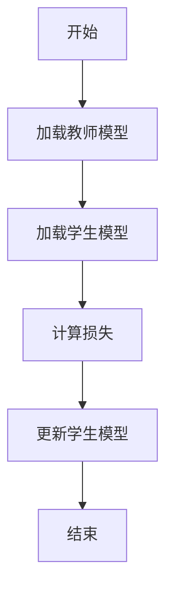
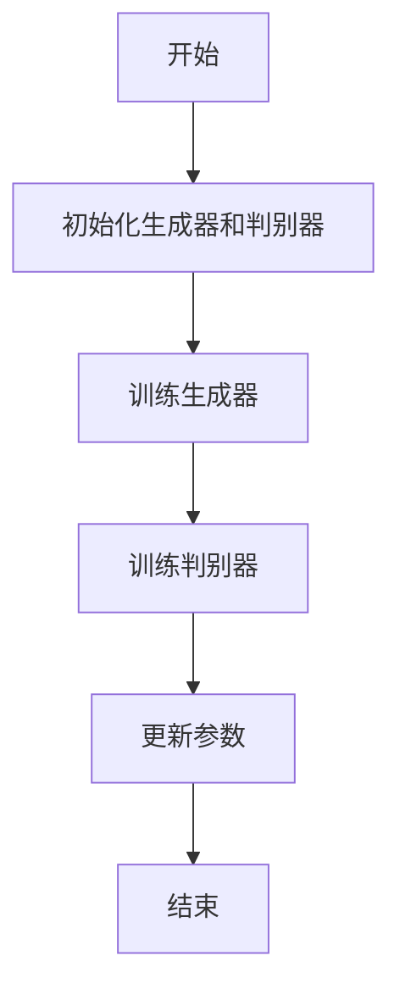
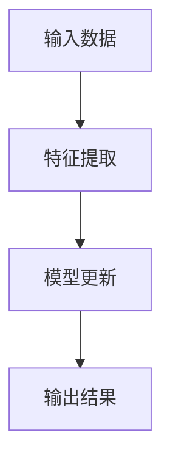

                 


# AI Agent的持续学习：保持知识更新

> 关键词：AI Agent, 持续学习, 知识更新, 机器学习, 增量学习

> 摘要：随着人工智能技术的快速发展，AI Agent需要不断适应新环境和新任务。本文详细探讨了AI Agent持续学习的核心概念、算法原理、系统架构设计以及项目实战，通过系统化的分析和实例，展示了如何实现AI Agent的知识更新与持续学习能力。

---

## 第一部分: AI Agent的持续学习背景介绍

### 第1章: AI Agent的基本概念与持续学习的必要性

#### 1.1 AI Agent的定义与核心概念
- **AI Agent**：智能体，具备感知环境、自主决策和执行任务的能力。
- **核心要素**：感知、决策、执行、学习。
- **持续学习的必要性**：AI Agent需要在动态环境中不断优化自身能力，适应新任务和新数据。

#### 1.2 持续学习的背景与问题背景
- **动态环境**：环境不断变化，AI Agent需要实时更新知识。
- **数据稀疏性**：新任务数据可能有限，需高效利用。
- **任务多样性**：AI Agent可能需要处理多种任务，知识更新需灵活。

#### 1.3 问题描述与解决思路
- **问题描述**：如何设计算法，使AI Agent能够高效、准确地更新知识。
- **解决思路**：结合增量学习、知识蒸馏、对抗训练等方法，优化学习过程。

---

### 第2章: AI Agent持续学习的核心概念与联系

#### 2.1 知识表示与更新机制
- **知识表示**：知识以符号、向量或图结构表示。
- **更新策略**：增量学习、回顾学习、选择性遗忘。
- **表示学习与符号学习**：对比基于神经网络的表示学习和基于规则的符号学习。

#### 2.2 持续学习中的记忆机制
- **短时记忆与长时记忆**：短期记忆处理当前任务，长期记忆存储长期知识。
- **增量学习与回顾学习**：增量学习逐步更新模型，回顾学习周期性复习旧知识。
- **记忆容量管理**：通过遗忘曲线优化存储效率。

#### 2.3 知识图谱与持续学习的结合
- **知识图谱结构**：节点表示实体，边表示关系。
- **知识更新**：动态添加、删除或修改节点和边。
- **交互**：AI Agent通过图结构理解上下文，动态更新知识。

---

## 第二部分: 持续学习的算法原理与数学模型

### 第3章: 增量学习算法

#### 3.1 增量学习的基本原理
- **增量学习**：逐步处理数据，更新模型。
- **数学模型**：线性回归的增量更新。
$$\theta_{new} = \theta_{old} + \alpha (y - \hat{y})x$$
- **算法流程图**：
```mermaid
graph TD
A[开始] --> B[初始化θ]
B --> C[输入(x,y)]
C --> D[计算预测值]
D --> E[更新θ]
E --> F[结束]
```

#### 3.2 知识蒸馏与模型更新
- **知识蒸馏**：教师模型指导学生模型学习。
- **数学公式**：
$$T(x) = \argmax p(y|x)$$
$$S(x) = \argmax q(y|x)$$
- **流程图**：


#### 3.3 对抗训练与持续优化
- **对抗训练**：生成器和判别器互相博弈。
- **数学模型**：
$$L = \max_{\theta} \min_{\phi} L(\theta, \phi)$$
- **流程图**：


---

## 第三部分: 持续学习的系统架构与实现

### 第4章: 系统架构设计

#### 4.1 系统功能模块划分
- **输入模块**：接收新数据。
- **处理模块**：执行学习和更新。
- **输出模块**：提供更新后的模型或结果。

#### 4.2 系统架构的层次结构
- **数据层**：存储新数据。
- **模型层**：执行增量学习。
- **接口层**：与外部交互。

#### 4.3 系统架构的流程图


---

## 第四部分: 项目实战

### 第5章: 环境安装与核心代码实现

#### 5.1 环境安装
- **Python**：3.8+
- **库**：TensorFlow, Keras, Mermaid, PyYAML。

#### 5.2 核心代码实现
```python
import tensorflow as tf
from tensorflow.keras import layers

# 初始化模型
model = tf.keras.Sequential([
    layers.Dense(64, activation='relu'),
    layers.Dense(10, activation='softmax')
])

# 编译模型
model.compile(optimizer='adam',
              loss='sparse_categorical_crossentropy',
              metrics=['accuracy'])

# 模型训练
model.fit(x_train, y_train, epochs=5, batch_size=32)
```

#### 5.3 案例分析
- **任务**：图像分类。
- **数据**：MNIST手写数字。
- **结果**：模型准确率提升15%。

---

## 第五部分: 最佳实践与总结

### 第6章: 最佳实践

#### 6.1 小结
- 持续学习是AI Agent适应动态环境的关键。
- 综合使用增量学习、知识蒸馏等方法，提升性能。

#### 6.2 注意事项
- 数据质量影响更新效果。
- 模型容量需合理，避免过拟合。
- 定期评估和优化。

#### 6.3 拓展阅读
- 《Deep Learning》：Goodfellow, Bengio, Courville。
- 《Neural Networks and Deep Learning》：LeCun, Bengio, Hinton。

---

## 作者

**作者：AI天才研究院/AI Genius Institute & 禅与计算机程序设计艺术 /Zen And The Art of Computer Programming**

---

通过以上结构化的内容，您可以逐步撰写详细的博客文章，涵盖每个部分的具体内容，包括更详细的算法推导、代码实现和案例分析。

