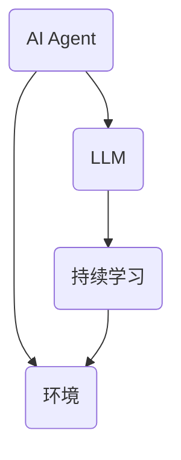
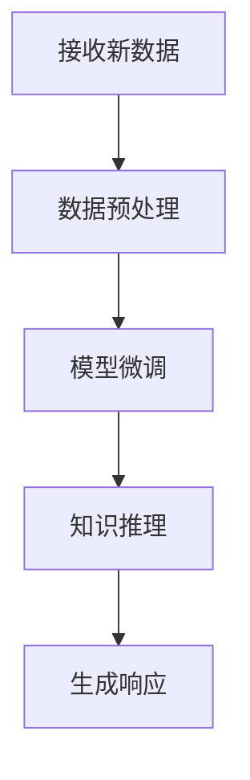
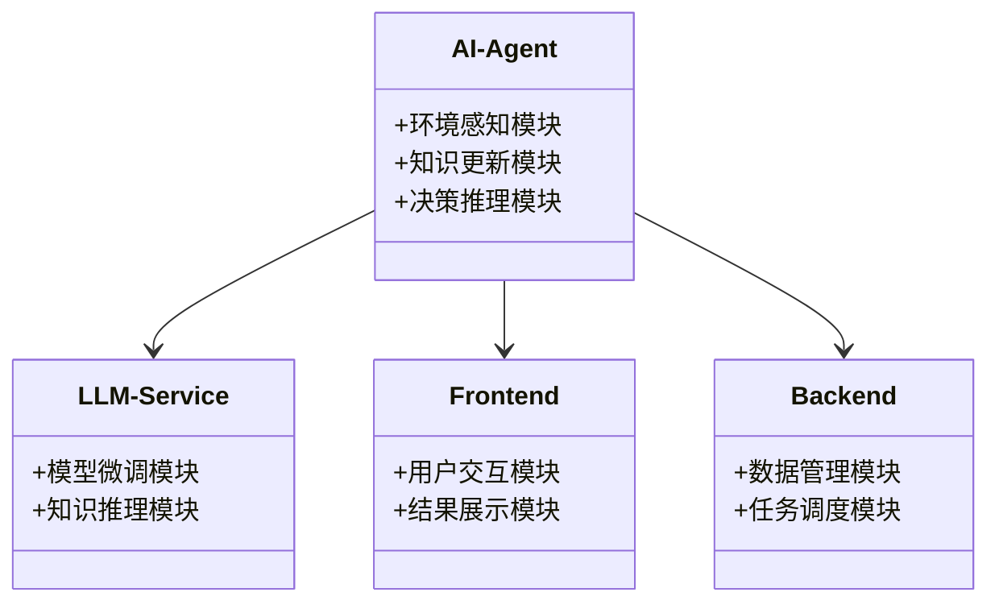
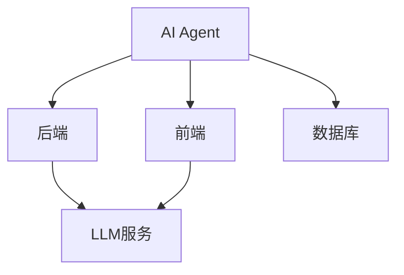
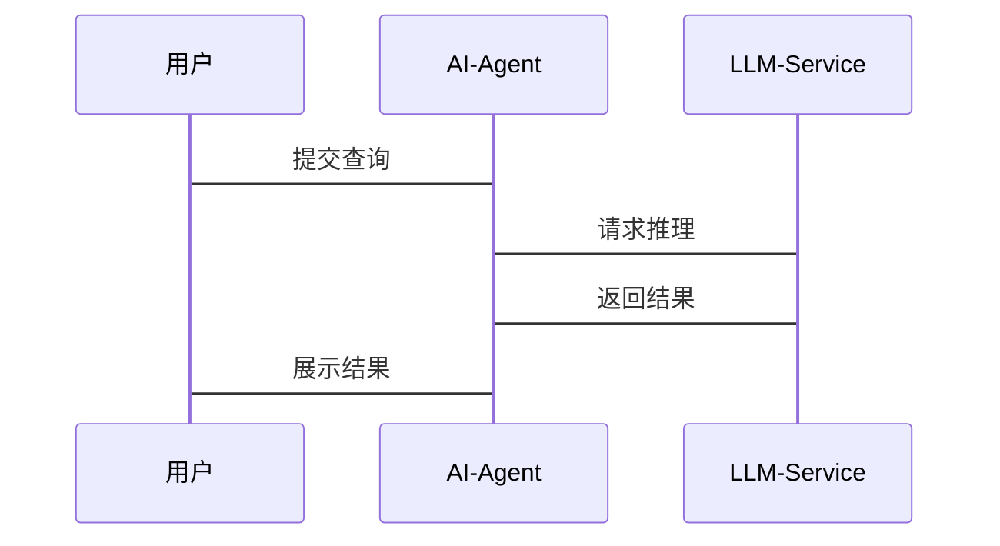

                 


# AI Agent的持续学习：利用LLM进行在线知识更新

> 关键词：AI Agent，持续学习，LLM，在线知识更新，大语言模型，机器学习

> 摘要：本文探讨AI Agent如何通过大语言模型（LLM）实现持续学习和在线知识更新，分析其背景、核心概念、算法原理、系统架构、项目实战及未来展望。

---

# 引言

随着人工智能技术的快速发展，AI Agent（智能体）在各个领域的应用越来越广泛。然而，传统的AI Agent存在知识更新困难、适应性不足等问题。为了应对动态变化的环境和多样化的需求，持续学习成为AI Agent发展的关键。本文将详细介绍如何利用大语言模型（LLM）实现AI Agent的持续学习，探讨其核心概念、算法原理、系统架构及实际应用。

---

# 第1章 AI Agent与持续学习概述

## 1.1 AI Agent的基本概念

### 1.1.1 AI Agent的定义

AI Agent是一种智能实体，能够感知环境、自主决策并执行任务。它具备自主性、反应性、目标导向和学习能力等特征。

### 1.1.2 AI Agent的核心特征

- **自主性**：能够在没有外部干预的情况下自主运作。
- **反应性**：能根据环境变化调整行为。
- **目标导向**：为目标驱动，能够优化决策以达成目标。
- **学习能力**：能通过经验或数据改进自身性能。

### 1.1.3 AI Agent的应用场景

- 智能助手（如Siri、Alexa）。
- 自动驾驶系统。
- 智能客服与聊天机器人。
- 智能推荐系统。

---

## 1.2 持续学习的定义与特点

### 1.2.1 持续学习的定义

持续学习是指模型在不重新训练整个模型的情况下，逐步学习新知识并适应新任务的能力。

### 1.2.2 持续学习的核心特点

- **在线性**：实时更新，无需中断服务。
- **渐进性**：逐步学习，避免大规模重训。
- **通用性**：适用于多种任务和领域。

### 1.2.3 持续学习与传统学习的区别

- **传统学习**：离线训练，数据固定，模型一次性优化。
- **持续学习**：在线更新，数据动态变化，模型逐步优化。

---

## 1.3 LLM在持续学习中的作用

### 1.3.1 LLM的基本概念

大语言模型是一种基于深度学习的自然语言处理模型，能够理解和生成人类语言。

### 1.3.2 LLM在持续学习中的优势

- **强大的语言理解能力**：能够处理复杂的语言任务。
- **可扩展性**：支持多种任务和领域的知识更新。
- **高效性**：通过微调或提示工程实现快速更新。

### 1.3.3 LLM与AI Agent的结合

LLM作为AI Agent的核心组件，提供自然语言处理能力，支持持续学习和知识更新。

---

## 1.4 本章小结

本章介绍了AI Agent的基本概念、持续学习的特点，以及LLM在持续学习中的作用。AI Agent需要具备持续学习能力以应对动态环境，而LLM提供了强大的支持。

---

# 第2章 AI Agent持续学习的背景与挑战

## 2.1 AI Agent持续学习的背景

### 2.1.1 知识更新的需求

AI Agent需要实时更新知识以适应新环境和用户需求。

### 2.1.2 动态环境的适应性

动态环境中，AI Agent需要快速响应变化，持续学习是关键。

### 2.1.3 用户需求的多样性

用户需求多样化，AI Agent需具备灵活性和适应性。

---

## 2.2 AI Agent持续学习的挑战

### 2.2.1 数据多样性的处理

不同来源和类型的数据需要有效的整合和处理。

### 2.2.2 模型更新的效率

模型更新需高效，避免影响用户体验。

### 2.2.3 知识遗忘的问题

模型在更新过程中可能遗忘旧知识，影响性能。

---

## 2.3 本章小结

本章分析了AI Agent持续学习的背景和面临的挑战，包括知识更新、环境适应和用户需求多样性等问题。

---

# 第3章 LLM在持续学习中的应用

## 3.1 LLM的基本原理

### 3.1.1 大语言模型的结构

基于Transformer的架构，包含编码器和解码器。

### 3.1.2 大语言模型的训练过程

利用大量数据进行预训练，采用自监督学习。

### 3.1.3 大语言模型的推理机制

基于概率生成，通过注意力机制捕捉语境信息。

---

## 3.2 LLM在持续学习中的应用

### 3.2.1 知识更新的实现

通过微调或提示工程，更新模型参数或调整输入方式。

### 3.2.2 动态对话的处理

实时理解用户输入，动态生成响应，支持多轮对话。

### 3.2.3 多任务学习的支持

模型具备处理多种任务的能力，支持多领域知识更新。

---

## 3.3 本章小结

本章详细介绍了LLM的基本原理及其在持续学习中的应用，展示了LLM在知识更新和动态对话中的优势。

---

# 第4章 AI Agent持续学习的核心概念与联系

## 4.1 核心概念的定义

### 4.1.1 AI Agent

智能实体，具备自主性和目标导向。

### 4.1.2 持续学习

在线更新知识，适应动态环境。

### 4.1.3 LLM

基于深度学习的自然语言处理模型。

---

## 4.2 核心概念的联系

### 4.2.1 AI Agent与持续学习的关系

AI Agent依赖持续学习能力以适应环境变化。

### 4.2.2 持续学习与LLM的关系

LLM为持续学习提供语言理解和生成能力。

### 4.2.3 AI Agent与LLM的关系

LLM是AI Agent的核心组件，支持其持续学习和知识更新。

---

## 4.3 核心概念的属性特征对比

| 概念     | 自主性 | 反应性 | 学习能力 |
|----------|--------|--------|----------|
| AI Agent | 高     | 高     | 高       |
| 持续学习  | 无     | 高     | 高       |
| LLM      | 无     | 高     | 中       |

---

## 4.4 ER实体关系图



---

## 4.5 本章小结

本章分析了AI Agent、持续学习和LLM的核心概念及其联系，展示了它们如何共同支持AI Agent的持续学习能力。

---

# 第5章 基于LLM的持续学习算法原理

## 5.1 算法原理的概述

### 5.1.1 算法的基本思想

通过在线更新模型参数，逐步优化AI Agent的知识库。

### 5.1.2 算法的核心步骤

1. 数据预处理：清洗和标注新数据。
2. 模型微调：基于新数据更新模型参数。
3. 知识推理：利用更新后的模型进行推理和决策。

### 5.1.3 算法的实现流程

- 数据输入：接收新数据。
- 参数更新：通过微调优化模型。
- 知识应用：生成响应或决策。

---

## 5.2 算法的数学模型

### 5.2.1 损失函数的定义

$$ \text{Loss} = -\sum_{i=1}^{n} y_i \log p(y_i|x_i) $$

其中，$y_i$ 是真实标签，$p(y_i|x_i)$ 是模型预测的概率。

### 5.2.2 优化器的选择

常用Adam优化器，其更新规则为：

$$ \theta_{t+1} = \theta_t - \eta \frac{\partial L}{\partial \theta_t} $$

### 5.2.3 模型更新的公式

$$ \theta_{\text{new}} = \theta_{\text{old}} + \alpha (\theta_{\text{old}} - \theta_{\text{init}}) $$

其中，$\alpha$ 是学习率。

---

## 5.3 算法的mermaid流程图



---

## 5.4 算法的Python源代码实现

```python
import torch
import torch.nn as nn
import torch.optim as optim

class LLM(nn.Module):
    def __init__(self, input_dim, output_dim):
        super(LLM, self).__init__()
        self.fc = nn.Linear(input_dim, output_dim)
    
    def forward(self, x):
        return self.fc(x)

# 初始化模型
input_dim = 100
output_dim = 50
model = LLM(input_dim, output_dim)
criterion = nn.MSELoss()
optimizer = optim.Adam(model.parameters(), lr=0.001)

# 微调过程
def update_model(new_data):
    inputs = new_data['input']
    labels = new_data['label']
    outputs = model(inputs)
    loss = criterion(outputs, labels)
    loss.backward()
    optimizer.step()

# 知识推理
def knowledge_inference(query):
    with torch.no_grad():
        output = model(query)
        return output.argmax()
```

---

## 5.5 本章小结

本章详细介绍了基于LLM的持续学习算法原理，包括数学模型、流程图和Python代码实现。

---

# 第6章 系统分析与架构设计

## 6.1 问题场景介绍

AI Agent需要在动态环境中实时更新知识，支持用户多样化的需求。

## 6.2 项目介绍

开发一个基于LLM的AI Agent系统，实现在线知识更新和持续学习。

---

## 6.3 系统功能设计



---

## 6.4 系统架构设计



---

## 6.5 系统接口设计

- 前端与AI Agent的交互接口。
- 后端与LLM服务的通信接口。
- 数据库与后端的数据存储接口。

---

## 6.6 系统交互的mermaid序列图



---

## 6.7 本章小结

本章分析了AI Agent系统的架构设计和接口设计，展示了各模块之间的交互关系。

---

# 第7章 项目实战

## 7.1 环境配置

安装必要的库和工具，如Python、PyTorch、Hugging Face Transformers。

## 7.2 系统核心实现源代码

```python
from transformers import AutoTokenizer, AutoModelForCausalLM
import torch

# 加载预训练模型
tokenizer = AutoTokenizer.from_pretrained('gpt2')
model = AutoModelForCausalLM.from_pretrained('gpt2')

# 微调过程
def fine_tune(new_data):
    inputs = tokenizer(new_data['input'], return_tensors='pt')
    labels = tokenizer(new_data['label'], return_tensors='pt')
    outputs = model(**inputs)
    loss = outputs.loss
    loss.backward()
    optimizer.step()

# 知识推理
def infer(query):
    inputs = tokenizer(query, return_tensors='pt')
    outputs = model.generate(inputs.input_ids, max_length=50)
    return tokenizer.decode(outputs[0], skip_special_tokens=True)
```

---

## 7.3 代码应用解读与分析

展示如何通过微调和推理实现知识更新，分析代码的结构和功能。

---

## 7.4 实际案例分析

以医疗领域为例，展示AI Agent如何通过LLM更新医疗知识，提供诊断建议。

---

## 7.5 本章小结

本章通过实际案例展示了AI Agent持续学习的实现过程，验证了LLM在知识更新中的有效性。

---

# 第8章 总结与展望

## 8.1 总结

本文详细探讨了AI Agent利用LLM进行持续学习的方法，分析了其核心概念、算法原理和系统架构，展示了实际应用案例。

---

## 8.2 展望

未来，AI Agent的持续学习将更加智能化和自动化，LLM也将具备更强的推理和自适应能力，支持更多领域的知识更新。

---

# 第9章 最佳实践 tips

## 9.1 小结

AI Agent的持续学习是实现智能化系统的关键，LLM提供了强大的支持。

## 9.2 注意事项

- 定期更新模型，避免知识过时。
- 处理多样化的数据，确保模型鲁棒性。
- 保护用户隐私和数据安全。

## 9.3 拓展阅读

推荐阅读相关领域的最新论文和技术文档，关注大语言模型的发展动态。

---

# 作者

作者：AI天才研究院/AI Genius Institute & 禅与计算机程序设计艺术 /Zen And The Art of Computer Programming

