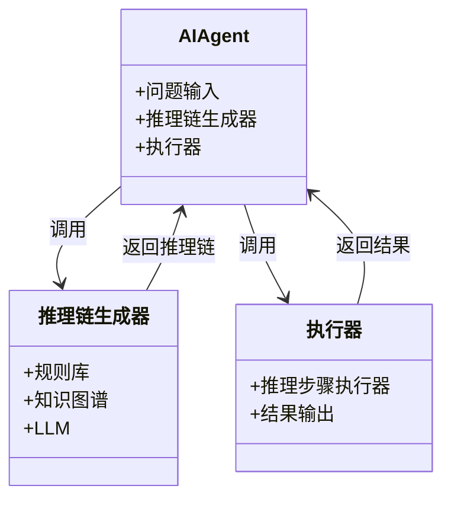
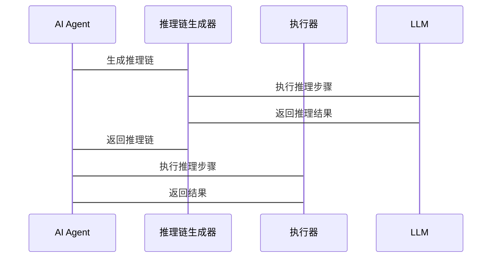

                 


# AI Agent的推理链生成：增强LLM的逐步思考能力

## 关键词：AI Agent, 推理链, LLM, 逐步思考, 生成式AI

## 摘要：AI Agent通过生成推理链来增强大语言模型的逐步思考能力，从而提升LLM在复杂任务中的表现。本文深入分析推理链的生成过程，结合算法原理、系统架构设计和项目实战，展示如何通过推理链优化LLM的推理能力。

---

# 第一部分: AI Agent与推理链的背景与核心概念

## 第1章: AI Agent与推理链的背景介绍

### 1.1 AI Agent的基本概念

#### 1.1.1 AI Agent的定义与分类

AI Agent（人工智能代理）是指能够感知环境、自主决策并执行任务的智能实体。根据功能和复杂度，AI Agent可以分为以下几类：

- **简单反射型Agent**：基于简单的规则做出反应，如自动回复机器人。
- **基于模型的反射型Agent**：利用内部状态和环境模型进行决策，如路径规划算法。
- **目标驱动型Agent**：根据明确的目标采取行动，如智能助手。
- **效用驱动型Agent**：通过最大化效用函数实现目标，如经济决策模型。

AI Agent的核心功能包括感知、推理、规划和执行。它能够处理复杂任务，如问题求解、规划调度和策略优化。

#### 1.1.2 AI Agent的核心功能与特点

AI Agent的核心功能包括：

1. **感知**：通过传感器或数据输入获取环境信息。
2. **推理**：利用知识库和推理算法对信息进行分析和推导。
3. **规划**：制定行动步骤以实现目标。
4. **执行**：根据规划执行具体操作。

AI Agent的特点包括自主性、反应性、目标导向和学习能力。自主性使其能够独立运行，反应性使其能够实时响应环境变化，目标导向使其专注于特定任务，学习能力则使其能够优化性能。

#### 1.1.3 AI Agent与传统LLM的区别

传统LLM（大语言模型）擅长文本生成和理解，但缺乏自主决策和目标导向的能力。AI Agent则具备更强的自主性和目标导向性，能够根据任务需求生成推理链，逐步解决问题。

### 1.2 推理链的基本概念

#### 1.2.1 推理链的定义与作用

推理链（Reasoning Chain）是AI Agent用于解决复杂问题的一系列推理步骤。它将问题分解为多个子问题，逐步推导出最终答案。推理链的作用包括提高推理的可解释性、增强系统的可靠性和提升问题解决的效率。

#### 1.2.2 推理链的结构与组成

推理链通常由以下部分组成：

- **输入**：问题或任务的初始条件。
- **推理步骤**：一系列逻辑推理或计算步骤。
- **输出**：最终结果或决策。

推理链的结构可以用树状图或线性序列表示，具体取决于问题的复杂性和AI Agent的设计。

#### 1.2.3 推理链的优缺点分析

推理链的优点包括可解释性高、易于调试和扩展性强。缺点则包括可能增加计算开销和需要复杂的推理规则设计。

### 1.3 AI Agent与推理链的关系

#### 1.3.1 AI Agent如何利用推理链增强思考能力

AI Agent通过生成推理链，将复杂问题分解为多个简单问题，逐步解决。例如，在自然语言理解任务中，AI Agent可以生成多个推理链，分别处理语义分析、上下文理解和意图识别。

#### 1.3.2 推理链在LLM中的应用价值

推理链可以提升LLM的逻辑推理能力，使其能够处理更复杂的任务。例如，在医疗诊断中，LLM可以生成多个推理链，分别分析症状、诊断可能的疾病并制定治疗方案。

#### 1.3.3 推理链与AI Agent的协同工作模式

AI Agent负责生成推理链，LLM负责执行推理。两者协同工作，AI Agent通过推理链引导LLM逐步解决问题，LLM则通过生成文本提供推理结果。

## 第2章: AI Agent推理链的核心概念与联系

### 2.1 AI Agent推理链的原理

#### 2.1.1 推理链的生成过程

AI Agent生成推理链的过程包括：

1. **问题分析**：理解任务需求并将其分解为多个子任务。
2. **推理链设计**：为每个子任务设计推理步骤。
3. **推理链执行**：根据推理链逐步解决问题。

#### 2.1.2 推理链的逻辑结构

推理链的逻辑结构可以用树状图表示。每个节点代表一个推理步骤，叶子节点代表最终结果。

#### 2.1.3 推理链的执行机制

推理链的执行机制包括：

1. **序列执行**：按顺序执行推理步骤。
2. **分支执行**：在某些情况下，推理链可以有分支，根据不同的情况采取不同的行动。

### 2.2 推理链与LLM的关系

#### 2.2.1 LLM在推理链生成中的作用

LLM用于生成推理链中的具体步骤，例如，LLM可以生成自然语言的推理规则或逻辑表达式。

#### 2.2.2 推理链如何增强LLM的思考能力

通过推理链，LLM可以逐步解决复杂问题，而不是一次性生成答案。这有助于提高LLM的推理能力和可解释性。

#### 2.2.3 推理链与LLM的协同优化

AI Agent生成推理链，LLM执行推理。两者协同优化，可以提升整体系统的性能。

### 2.3 推理链的实体关系图

#### 2.3.1 推理链的ER实体关系图

```mermaid
er
  entity: 推理链
  entity: 推理步骤
  entity: 输入
  entity: 输出
  relation: 包含（推理链 -> 推理步骤）
  relation: 由...组成（推理链 -> 输入）
  relation: 由...生成（推理链 -> 输出）
```

#### 2.3.2 推理链与AI Agent的交互关系

```mermaid
er
  entity: AI Agent
  entity: 推理链
  relation: 使用（AI Agent -> 推理链）
```

#### 2.3.3 推理链的节点与边的关系


## 第3章: 推理链生成的算法原理

### 3.1 推理链生成的算法概述

推理链生成的算法包括基于规则的推理、基于知识图谱的推理和基于LLM的推理。

### 3.2 基于规则的推理算法

#### 3.2.1 基于规则的推理原理

基于规则的推理算法依赖预定义的规则，例如，如果A则B，如果B则C。

#### 3.2.2 基于规则的推理实现

基于规则的推理可以表示为：

$$
A \rightarrow B, B \rightarrow C
$$

推理过程：

1. 验证A是否成立。
2. 根据规则，B成立。
3. 根据规则，C成立。

### 3.3 基于知识图谱的推理算法

#### 3.3.1 基于知识图谱的推理原理

基于知识图谱的推理利用知识图谱中的关系进行推理。例如，如果A与B相连，B与C相连，则A与C相连。

#### 3.3.2 基于知识图谱的推理实现

基于知识图谱的推理可以用以下公式表示：

$$
A \sim B, B \sim C \Rightarrow A \sim C
$$

### 3.4 基于LLM的推理算法

#### 3.4.1 基于LLM的推理原理

基于LLM的推理利用LLM生成自然语言的推理步骤，例如，使用GPT模型生成推理规则。

#### 3.4.2 基于LLM的推理实现

基于LLM的推理可以通过以下步骤实现：

1. 将问题输入LLM。
2. LLM生成推理规则。
3. 执行推理步骤。

### 3.5 推理链生成算法的对比分析

基于规则的推理和基于知识图谱的推理适合结构化数据，而基于LLM的推理适合非结构化数据。基于LLM的推理更具灵活性，但可能需要更多的计算资源。

## 第4章: 系统分析与架构设计方案

### 4.1 问题场景介绍

AI Agent需要生成推理链，解决复杂问题。例如，在医疗诊断中，AI Agent生成多个推理链，分别分析症状、诊断疾病并制定治疗方案。

### 4.2 系统功能设计

#### 4.2.1 领域模型设计



### 4.3 系统架构设计

#### 4.3.1 系统架构图

```mermaid
archi
    title 系统架构设计
    网络层 --> 应用层
    应用层 --> 推理链生成器
    推理链生成器 --> LLM
    推理链生成器 --> 知识图谱
    推理链生成器 --> 规则库
    推理链生成器 --> 执行器
    执行器 --> 输出层
```

### 4.4 系统接口设计

系统接口包括：

- **推理链生成接口**：用于生成推理链。
- **推理步骤执行接口**：用于执行推理步骤。
- **结果输出接口**：用于输出最终结果。

### 4.5 系统交互流程图



## 第5章: 项目实战

### 5.1 环境安装

需要安装以下工具：

- Python 3.8+
- LLM库（如Hugging Face的GPT模型）
- Mermaid图生成工具

### 5.2 系统核心实现

#### 5.2.1 推理链生成器实现

```python
class ReasoningChainGenerator:
    def __init__(self, llm, rules, knowledge_graph):
        self.llm = llm
        self.rules = rules
        self.knowledge_graph = knowledge_graph

    def generate_chain(self, input):
        # Step 1: 分解问题
        steps = []
        current = input
        while current != output:
            # Step 2: 生成推理步骤
            step = self.llm.generate(current)
            steps.append(step)
            current = step
        return steps
```

#### 5.2.2 推理步骤执行器实现

```python
class ReasoningStepExecutor:
    def execute_step(self, step):
        # Step 1: 执行推理步骤
        result = self.llm.predict(step)
        return result
```

### 5.3 代码应用解读与分析

推理链生成器负责生成推理步骤，推理步骤执行器负责执行这些步骤。LLM用于生成推理规则和执行推理。

### 5.4 实际案例分析

以医疗诊断为例，AI Agent生成多个推理链，分别分析症状、诊断疾病并制定治疗方案。通过推理链，AI Agent能够逐步解决问题。

### 5.5 项目小结

通过项目实战，我们了解了AI Agent推理链生成的具体实现过程，包括环境安装、代码编写和案例分析。

## 第6章: 最佳实践

### 6.1 小结

AI Agent通过生成推理链，增强LLM的逐步思考能力。推理链的生成过程包括问题分析、推理链设计和推理链执行。

### 6.2 注意事项

- 推理链的设计需要考虑系统的复杂性和可扩展性。
- 推理链的执行需要考虑计算资源和时间效率。

### 6.3 未来趋势

未来，AI Agent推理链生成将更加智能化和自动化。随着LLM和知识图谱技术的发展，推理链生成将更加高效和准确。

### 6.4 拓展阅读

建议阅读以下内容：

- 《Large Language Models: A Survey》
- 《Knowledge Graphs for NLP: A Survey》
- 《Reasoning in AI: A Comprehensive Survey》

---

# 作者：AI天才研究院/AI Genius Institute & 禅与计算机程序设计艺术 /Zen And The Art of Computer Programming

---

**Note:** 如需进一步了解，欢迎关注我的官方博客，或通过我的联系方式与我取得联系。

