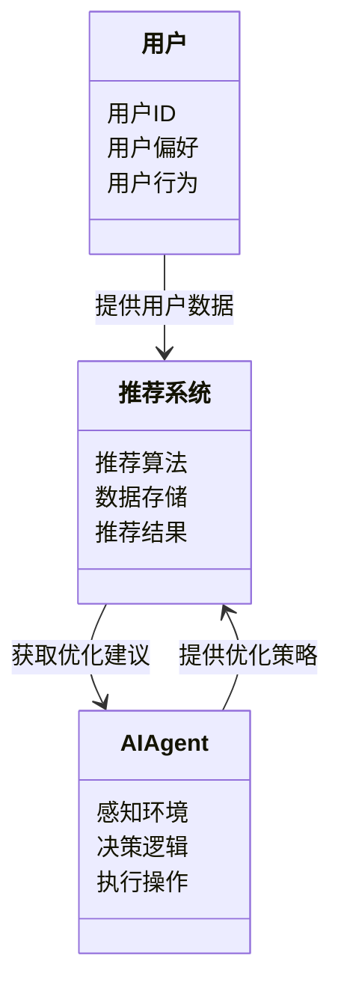

                 

# AI Agent的推荐系统：结合LLM的内容推荐

---

## 关键词：
AI Agent，推荐系统，LLM，大语言模型，协同过滤，内容推荐

---

## 摘要：
本文详细探讨了AI Agent在推荐系统中的应用，特别是结合大语言模型（LLM）进行内容推荐的创新方法。通过分析AI Agent与推荐系统的协同工作方式，结合算法原理和系统架构设计，本文为读者提供了一个全面的技术视角，展示了如何利用LLM提升推荐系统的准确性和个性化。文章还通过实际项目案例，详细讲解了推荐系统的实现过程，为读者提供了从理论到实践的完整指南。

---

## 第一部分：AI Agent与推荐系统的背景介绍

### 第1章：AI Agent与推荐系统概述

#### 1.1 AI Agent的基本概念
- **1.1.1 AI Agent的定义**  
  AI Agent（人工智能代理）是指能够感知环境、自主决策并执行任务的智能实体。它通过传感器获取信息，利用推理能力做出决策，并通过执行器与环境交互。

- **1.1.2 AI Agent的核心特征**  
  - 自主性：无需外部干预，自主完成任务。  
  - 反应性：能够实时感知环境变化并做出反应。  
  - 学习能力：通过数据和经验不断优化自身行为。  

- **1.1.3 AI Agent与传统推荐系统的区别**  
  AI Agent具有更强的自主性和学习能力，能够动态调整推荐策略，而传统推荐系统通常基于静态规则或模型。

#### 1.2 推荐系统的基本概念
- **1.2.1 推荐系统的定义**  
  推荐系统是一种根据用户行为、偏好和数据特征，向用户推荐相关内容或产品的技术。

- **1.2.2 推荐系统的分类**  
  - 基于协同过滤的推荐系统。  
  - 基于内容的推荐系统。  
  - 基于知识图谱的推荐系统。  

- **1.2.3 推荐系统的应用场景**  
  - 电商推荐。  
  - 电影、音乐推荐。  
  - 学术论文推荐。  

#### 1.3 AI Agent与推荐系统的结合
- **1.3.1 结合的背景与意义**  
  随着AI技术的发展，推荐系统需要更加智能化和个性化，而AI Agent的引入能够显著提升推荐系统的动态适应能力和用户体验。

- **1.3.2 结合的方式与特点**  
  - AI Agent作为推荐引擎的核心驱动。  
  - AI Agent与推荐系统的协同工作模式。  
  - AI Agent能够实时调整推荐策略。  

- **1.3.3 结合的应用前景**  
  - 在电商、社交媒体、教育等领域具有广泛应用潜力。  
  - 能够显著提升用户体验和系统效率。  

---

### 第2章：LLM在推荐系统中的应用

#### 2.1 大语言模型的基本概念
- **2.1.1 大语言模型的定义**  
  大语言模型（Large Language Model，LLM）是指基于大规模数据训练的深度学习模型，能够理解和生成人类语言。

- **2.1.2 大语言模型的核心特点**  
  - 强大的上下文理解能力。  
  - 能够进行生成式对话。  
  - 支持多种语言和领域。  

- **2.1.3 大语言模型与推荐系统的结合**  
  通过LLM生成内容描述、分析用户偏好，进而优化推荐结果。

#### 2.2 LLM在推荐系统中的优势
- **2.2.1 提高推荐的准确性**  
  LLM能够基于上下文生成更准确的内容描述，从而提升推荐的精准度。

- **2.2.2 增强推荐的个性化**  
  LLM可以根据用户的实时输入生成个性化推荐，满足用户多样化需求。

- **2.2.3 提升推荐的实时性**  
  LLM能够快速响应用户需求，提供实时推荐服务。

#### 2.3 LLM在推荐系统中的挑战
- **2.3.1 计算资源的需求**  
  LLM需要大量的计算资源，可能导致推荐系统的成本增加。

- **2.3.2 模型的可解释性**  
  LLM的黑箱特性使得推荐结果的解释性较差。

- **2.3.3 数据隐私的问题**  
  大规模数据的使用可能引发数据隐私问题。

---

## 第二部分：AI Agent与推荐系统的结合

### 第3章：AI Agent与推荐系统的协同工作

#### 3.1 AI Agent与推荐系统的协同机制
- **3.1.1 协同的基本原理**  
  AI Agent与推荐系统通过共享数据和协同决策，实现推荐结果的优化。

- **3.1.2 协同的具体实现**  
  - AI Agent实时获取用户行为数据。  
  - 推荐系统基于AI Agent提供的数据生成推荐结果。  
  - AI Agent根据推荐结果反馈优化推荐策略。  

- **3.1.3 协同的效果评估**  
  通过用户满意度、推荐准确率等指标评估协同效果。

#### 3.2 AI Agent在推荐系统中的角色
- **3.2.1 作为推荐引擎的角色**  
  AI Agent负责生成推荐候选，并评估推荐结果的质量。

- **3.2.2 作为用户代理的角色**  
  AI Agent代表用户与推荐系统交互，确保推荐结果符合用户需求。

- **3.2.3 作为内容代理的角色**  
  AI Agent负责内容的获取、分析和生成，为推荐系统提供高质量的内容描述。

#### 3.3 推荐系统的改进与优化
- **3.3.1 基于AI Agent的推荐算法**  
  结合AI Agent的动态调整能力，优化推荐算法的性能。

- **3.3.2 基于LLM的推荐优化**  
  利用LLM生成更精准的内容描述，提升推荐的个性化和准确性。

- **3.3.3 推荐系统的性能提升**  
  通过AI Agent与推荐系统的协同，显著提升推荐系统的响应速度和推荐质量。

---

## 第三部分：推荐系统的算法原理

### 第4章：协同过滤算法

#### 4.1 协同过滤的基本原理
- **4.1.1 基于用户的协同过滤**  
  基于用户相似性生成推荐结果。

- **4.1.2 基于物品的协同过滤**  
  基于物品相似性生成推荐结果。

- **4.1.3 混合协同过滤**  
  结合基于用户和基于物品的协同过滤方法，提升推荐效果。

#### 4.2 协同过滤的算法实现
- **4.2.1 算法步骤**  
  1. 计算用户或物品的相似度。  
  2. 生成推荐列表。  
  3. 对推荐结果进行排序和筛选。  

- **4.2.2 算法的数学模型**  
  $$\text{相似度} = \frac{\sum_{i=1}^{n} (x_i - \bar{x})(y_i - \bar{y})}{\sqrt{\sum_{i=1}^{n} (x_i - \bar{x})^2} \cdot \sqrt{\sum_{i=1}^{n} (y_i - \bar{y})^2}}$$

- **4.2.3 算法的优缺点**  
  - 优点：简单易实现，适合中小规模数据。  
  - 缺点：计算复杂度高，难以处理大规模数据。

---

### 第5章：基于内容的推荐算法

#### 5.1 基于内容的推荐原理
- **5.1.1 内容特征提取**  
  通过对内容的文本、图像等特征进行提取，生成推荐依据。

- **5.1.2 内容相似度计算**  
  基于内容特征计算相似度，生成推荐结果。

#### 5.2 基于内容的推荐实现
- **5.2.1 特征向量化**  
  使用词袋模型、TF-IDF等方法将内容转化为向量。

- **5.2.2 相似度计算**  
  使用余弦相似度、欧氏距离等方法计算内容相似度。

- **5.2.3 推荐结果生成**  
  根据相似度排序，生成推荐列表。

---

## 第四部分：系统架构设计

### 第6章：推荐系统的架构设计

#### 6.1 系统功能设计
- **6.1.1 领域模型设计**  
  使用Mermaid类图展示推荐系统的功能模块。

- **6.1.2 系统架构设计**  
  使用Mermaid架构图展示推荐系统的整体架构。

---

## 第五部分：项目实战

### 第7章：推荐系统的实现

#### 7.1 环境搭建
- **7.1.1 安装依赖**  
  - 安装Python和相关库（如numpy、scikit-learn、transformers）。  
  - 安装LLM框架（如Hugging Face Transformers）。  

#### 7.2 系统实现
- **7.2.1 数据预处理**  
  - 数据清洗。  
  - 特征提取。  

- **7.2.2 推荐算法实现**  
  - 协同过滤算法的代码实现。  
  - 基于内容的推荐算法的代码实现。  

#### 7.3 案例分析
- **7.3.1 案例背景**  
  以电影推荐为例，展示推荐系统的实现过程。

- **7.3.2 数据分析**  
  分析用户行为数据，生成推荐结果。

- **7.3.3 系统优化**  
  基于AI Agent优化推荐算法，提升推荐准确率。

---

## 第六部分：总结与展望

### 第8章：总结与展望

#### 8.1 总结
- 本文详细探讨了AI Agent在推荐系统中的应用，特别是结合LLM进行内容推荐的创新方法。通过理论分析和实际案例，展示了如何利用AI Agent和LLM提升推荐系统的准确性和个性化。

#### 8.2 展望
- 随着AI技术的不断发展，AI Agent与推荐系统的结合将更加紧密，推荐系统的智能化和个性化将不断提升。未来的研究方向包括模型的可解释性优化、计算资源的优化利用以及数据隐私保护。

---

## 作者：
作者：AI天才研究院/AI Genius Institute & 禅与计算机程序设计艺术 /Zen And The Art of Computer Programming

