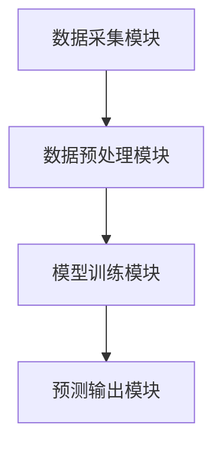

                 


# AI Agent的时序预测能力：理解和预测动态过程

> **关键词**：AI Agent、时序预测、动态过程、机器学习、时间序列分析、深度学习

> **摘要**：本文深入探讨了AI Agent在时序预测中的能力，分析了时序预测的核心概念、算法原理、系统架构设计以及实际应用案例。文章从基础概念出发，逐步解析了AI Agent如何通过机器学习和深度学习算法实现对动态过程的预测，并通过具体项目案例展示了时序预测的实际应用。最后，本文总结了时序预测的最佳实践和未来发展方向。

---

## 第一部分: AI Agent的时序预测能力概述

### 第1章: 时序预测的基本概念与应用

#### 1.1 时序预测的定义与背景

**1.1.1 时序预测的定义**

时序预测（Time Series Forecasting）是一种通过历史数据预测未来趋势的分析方法。时间序列数据是指在时间维度上按顺序排列的数据点，例如股票价格、天气数据、销售数据等。时序预测的核心目标是利用这些数据的内在规律，预测未来的值或趋势。

**1.1.2 时序预测的应用领域**

时序预测广泛应用于多个领域：

- **金融领域**：股票价格预测、汇率预测、风险管理。
- **天气预报**：温度、湿度、风速等气象数据的预测。
- **工业生产**：设备故障预测、生产效率优化。
- **医疗健康**：疾病趋势预测、患者流量预测。
- **交通系统**：交通流量预测、智能调度。

**1.1.3 AI Agent在时序预测中的作用**

AI Agent（智能体）是一种能够感知环境、自主决策并执行任务的智能系统。在时序预测中，AI Agent可以实时采集数据、分析趋势、预测结果，并根据预测结果做出决策或提供反馈。

---

#### 1.2 AI Agent的基本概念

**1.2.1 AI Agent的定义**

AI Agent是一种智能实体，能够通过感知环境信息、执行目标函数，并与外部交互来完成特定任务。AI Agent的核心特征包括自主性、反应性、目标导向性和社交能力。

**1.2.2 AI Agent的核心特征**

- **自主性**：AI Agent能够独立运行，无需人工干预。
- **反应性**：AI Agent能够实时感知环境变化并做出反应。
- **目标导向性**：AI Agent的行为以实现特定目标为导向。
- **社交能力**：AI Agent能够与其他系统或人类进行交互。

**1.2.3 AI Agent与传统算法的区别**

传统算法（如统计模型）通常需要人工设定规则或特征，而AI Agent能够通过机器学习算法自动从数据中学习规律，并动态调整预测模型。

---

#### 1.3 时序预测的核心问题

**1.3.1 动态过程的不确定性**

时序数据通常具有随机性、周期性和趋势性，这使得预测具有不确定性。

**1.3.2 数据的时序依赖性**

时序数据的值通常与前一时刻的值相关，这种依赖性是时序预测的核心挑战。

**1.3.3 模型的可解释性与鲁棒性**

复杂的时序预测模型（如深度学习模型）通常缺乏可解释性，且在面对异常数据时可能表现不稳定。

---

### 第2章: 时序预测的基本原理

#### 2.1 时间序列分析的基础知识

**2.1.1 时间序列的组成要素**

时间序列数据通常可以分解为以下几个部分：

- **趋势（Trend）**：长期向上的或向下的趋势。
- **周期性（Seasonality）**：数据在固定周期内重复的模式。
- **随机性（Noise）**：无规律的随机波动。

**2.1.2 时间序列的分解方法**

常见的分解方法包括：

- **加法模型**：将时间序列分解为趋势、周期性和随机性成分。
- **乘法模型**：假设各个成分之间是乘积关系。

**2.1.3 时间序列的平稳性检验**

平稳性（Stationarity）是时间序列分析的重要假设。检验平稳性常用的方法包括：

- **自相关函数（ACF）**：用于分析数据点与其滞后值之间的相关性。
- **单位根检验**（如ADF检验）：用于检验时间序列是否为平稳序列。

---

#### 2.2 常见的时间序列模型

**2.2.1 ARIMA模型**

ARIMA（Autoregressive Integrated Moving Average）模型是一种经典的时序预测模型，适用于非平稳时间序列。

**ARIMA模型的结构**：

$$ ARIMA(p, d, q) $$

其中：
- \( p \) 表示自回归阶数。
- \( d \) 表示差分阶数。
- \( q \) 表示移动平均阶数。

**2.2.2 状态空间模型**

状态空间模型（State Space Model）是一种基于状态变量的时序模型，常用于处理复杂动态系统。

**状态空间模型的组成部分**：

- **状态方程**：描述状态变量的动态变化。
- **观测方程**：描述观测变量与状态变量的关系。

**2.2.3 非线性时间序列模型**

非线性时间序列模型（如神经网络模型）能够处理复杂的非线性关系。

---

#### 2.3 AI Agent在时序预测中的优势

**2.3.1 自适应学习能力**

AI Agent能够通过机器学习算法自适应地更新模型参数，以适应数据的变化。

**2.3.2 多模态数据处理能力**

AI Agent可以同时处理多种类型的数据（如文本、图像、数值），从而提高预测的准确性。

**2.3.3 实时预测能力**

AI Agent能够实时采集数据并进行预测，适用于需要快速响应的场景。

---

## 第二部分: 时序预测的核心算法与实现

### 第4章: 常见时序预测算法原理

#### 4.1 ARIMA算法

**4.1.1 ARIMA算法的基本原理**

ARIMA模型通过自回归和移动平均的组合，对时间序列进行建模和预测。

**ARIMA模型的数学公式**：

$$
\phi(B) (1 - B)^d X_t = \theta(B) \epsilon_t
$$

其中：
- \( \phi(B) \) 表示自回归多项式。
- \( \theta(B) \) 表示移动平均多项式。
- \( d \) 表示差分阶数。

**4.1.2 ARIMA算法的优缺点**

- **优点**：简单易用，适合线性时间序列。
- **缺点**：对非线性数据表现较差。

**4.1.3 ARIMA算法的实现步骤**

1. 数据预处理：检查数据的平稳性，进行差分处理。
2. 参数选择：确定模型的阶数 \( p \) 和 \( q \)。
3. 模型训练：使用历史数据拟合模型。
4. 模型预测：基于训练好的模型进行未来值的预测。

---

#### 4.2 LSTM网络

**4.2.1 LSTM网络的基本结构**

LSTM（长短期记忆网络）是一种特殊的RNN（循环神经网络），能够有效处理长期依赖问题。

**LSTM网络的核心组件**：

- **记忆单元（Cell）**：用于存储长期信息。
- **遗忘门（Forget Gate）**：控制记忆单元的更新。
- **输入门（Input Gate）**：决定新信息的输入。
- **输出门（Output Gate）**：控制输出结果。

**4.2.2 LSTM网络的工作原理**

LSTM通过遗忘门丢弃不重要的信息，通过输入门吸收新的信息，并通过输出门决定输出结果。

**4.2.3 LSTM网络的优缺点**

- **优点**：适合处理复杂非线性关系，能够捕捉长期依赖。
- **缺点**：训练复杂度较高，需要大量计算资源。

---

#### 4.3 Transformer模型

**4.3.1 Transformer模型的基本结构**

Transformer模型是一种基于自注意力机制的深度学习模型，广泛应用于自然语言处理领域。

**4.3.2 Transformer模型的工作原理**

Transformer模型通过自注意力机制（Self-Attention）捕捉数据之间的全局关系。

**4.3.3 Transformer模型的优缺点**

- **优点**：能够捕捉全局关系，适合处理长序列数据。
- **缺点**：计算复杂度高，训练需要大量资源。

---

## 第三部分: 系统分析与架构设计

### 第5章: AI Agent时序预测系统的架构设计

#### 5.1 系统功能设计

**5.1.1 数据采集模块**

负责实时采集时间序列数据，例如股票价格、传感器数据等。

**5.1.2 数据预处理模块**

对采集的数据进行清洗、归一化等预处理操作。

**5.1.3 模型训练模块**

基于预处理后的数据，训练时序预测模型。

**5.1.4 预测输出模块**

根据训练好的模型，输出预测结果。

---

#### 5.2 系统架构设计

**5.2.1 系统架构图**



---

## 第四部分: 项目实战

### 第6章: 基于AI Agent的股票价格预测

#### 6.1 项目背景

股票价格预测是时序预测的经典应用之一。本文将通过股票价格数据，展示AI Agent如何实现时序预测。

---

#### 6.2 项目实现

**6.2.1 环境搭建**

安装必要的库：

```bash
pip install numpy pandas scikit-learn tensorflow
```

**6.2.2 数据获取**

使用Yahoo Finance API获取股票数据。

**6.2.3 特征工程**

对数据进行标准化、滑动窗口等处理。

**6.2.4 模型训练**

训练LSTM模型进行股票价格预测。

**6.2.5 模型评估**

使用均方误差（MSE）等指标评估模型性能。

---

## 第五部分: 最佳实践与总结

### 第7章: 最佳实践与总结

#### 7.1 项目总结

本文通过理论分析和项目实战，展示了AI Agent在时序预测中的强大能力。

#### 7.2 最佳实践

- 数据预处理是关键。
- 模型选择需要根据数据特性进行。
- 评估指标的选择要符合业务需求。

#### 7.3 小结

时序预测是一项具有挑战性的任务，但通过AI Agent的强大能力，我们可以更好地理解和预测动态过程。

---

**作者：AI天才研究院/AI Genius Institute & 禅与计算机程序设计艺术 /Zen And The Art of Computer Programming**

