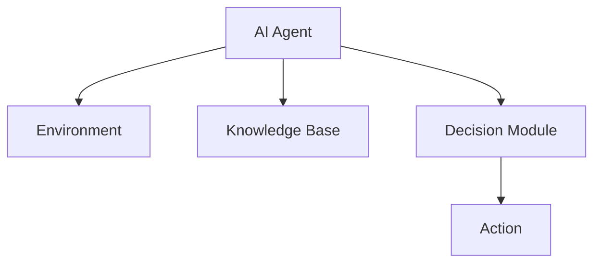
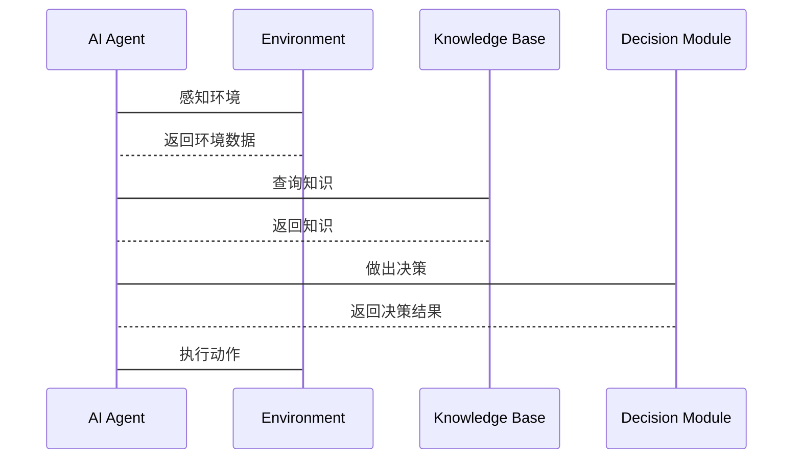

                 


# AI Agent的概念学习：从具体到抽象的认知过程

> 关键词：AI Agent, 人工智能, 知识表示, 行为决策, 状态感知, 算法模型, 系统架构

> 摘要：本文将从AI Agent的基本概念出发，逐步深入探讨其核心概念、算法原理、系统架构和实际应用。通过具体案例和数学模型的分析，帮助读者从具体到抽象地理解AI Agent的原理和应用场景。文章结合理论与实践，详细讲解了AI Agent在感知、决策、规划和学习等方面的关键技术，并通过项目实战和系统架构设计，为读者提供一个全面而深入的学习路径。

---

# 第一部分: AI Agent的基本概念与背景

## 第1章: AI Agent的概念与背景

### 1.1 什么是AI Agent

AI Agent（人工智能代理）是指能够感知环境、做出决策并采取行动以实现特定目标的智能实体。与传统AI不同，AI Agent具有更强的自主性和适应性，能够在动态复杂的环境中完成任务。

#### 1.1.1 AI Agent的定义

AI Agent是一个能够通过感知环境、自主决策并采取行动以实现目标的智能系统。它具备以下核心特征：

- **自主性**：AI Agent能够在没有外部干预的情况下独立运作。
- **反应性**：能够实时感知环境并做出反应。
- **目标导向**：所有行为都以实现特定目标为导向。

#### 1.1.2 AI Agent的核心特征

- **知识表示**：AI Agent需要表示和处理知识，以便做出合理决策。
- **行为决策**：基于感知信息和内部知识，选择最优行动方案。
- **状态感知**：通过传感器或其他信息源获取环境状态。

#### 1.1.3 AI Agent与传统AI的区别

- **传统AI**：依赖于预定义规则和静态知识，通常用于特定任务。
- **AI Agent**：具备自主性和适应性，能够在动态环境中解决问题。

---

## 第2章: AI Agent的核心概念与联系

### 2.1 AI Agent的核心概念原理

AI Agent的核心概念包括知识表示、行为决策和状态感知。

#### 2.1.1 知识表示

知识表示是AI Agent理解世界的基础。常用的表示方法包括：

- **谓词逻辑**：通过谓词和逻辑推理表示知识。
- **知识图谱**：通过图结构表示实体及其关系。

#### 2.1.2 行为决策

行为决策是AI Agent的核心功能，常用算法包括：

- **基于规则的决策**：通过预定义规则进行决策。
- **基于概率的决策**：通过概率模型进行决策。
- **强化学习**：通过奖励机制优化决策策略。

#### 2.1.3 状态感知

状态感知是AI Agent获取环境信息的关键步骤，常用技术包括：

- **传感器数据融合**：将多模态传感器数据融合，提高感知准确性。
- **视觉感知**：通过计算机视觉技术识别环境中的物体和场景。

### 2.2 核心概念属性特征对比表

| 概念         | 属性                         | 示例                         |
|--------------|------------------------------|------------------------------|
| 知识表示      | 表示方式、逻辑推理能力       | 谓词逻辑、知识图谱             |
| 行为决策      | 决策规则、优化目标           | 强化学习、贪心算法             |
| 状态感知      | 传感器类型、数据融合方法     | RGB-D传感器、卡尔曼滤波         |

### 2.3 ER实体关系图架构

```mermaid
erd
    entity AI-Agent {
        id
        knowledge
        decision
        action
    }
    entity Environment {
        state
        action_result
    }
    AI-Agent --> Environment: interacts with
    AI-Agent --> knowledge
    AI-Agent --> decision
    AI-Agent --> action
```

---

## 第3章: AI Agent的感知与决策算法

### 3.1 知识表示与推理算法

#### 3.1.1 知识图谱的构建

知识图谱是AI Agent理解世界的基础。通过从数据中提取实体及其关系，构建知识图谱。

#### 3.1.2 逻辑推理的数学模型

逻辑推理可以通过谓词逻辑和一阶逻辑表示。例如：

$$ \text{Person}(x) \land \text{Likes}(x, y) \rightarrow \text{Likes}(y, x) $$

表示如果$x$是一个人并且$x$喜欢$y$，那么$y$也喜欢$x$。

#### 3.1.3 推理算法的实现

常用推理算法包括：

- **前向 chaining**：从已知事实出发，逐步推导新结论。
- **反向 chaining**：从目标出发，寻找支持的事实。

### 3.2 行为决策算法

#### 3.2.1 基于规则的决策

基于规则的决策系统通过预定义规则进行决策。例如：

$$ \text{If temperature > 30 \ Then Fanspeed = high} $$

#### 3.2.2 基于概率的决策

基于概率的决策系统通过概率模型进行决策。例如，贝叶斯网络可以用来计算条件概率。

#### 3.2.3 强化学习的决策

强化学习通过奖励机制优化决策策略。例如：

$$ R = r_1 + r_2 + \dots + r_n $$

其中$R$是总奖励，$r_i$是每一步的奖励。

### 3.3 状态感知的算法

#### 3.3.1 多模态数据融合

通过融合多种传感器数据，提高感知准确性。例如，使用卡尔曼滤波融合激光雷达和摄像头数据。

#### 3.3.2 感知模型的构建

使用深度学习模型进行感知任务，例如使用卷积神经网络进行图像识别。

#### 3.3.3 感知算法的优化

通过优化算法参数和模型结构，提高感知精度。例如，使用迁移学习加速模型收敛。

---

## 第4章: AI Agent的数学模型与公式

### 4.1 知识表示的数学模型

知识表示可以通过图论和逻辑代数表示。例如，知识图谱可以用图结构表示：

$$ G = (V, E) $$

其中$V$是实体集合，$E$是关系集合。

### 4.2 行为决策的数学模型

行为决策可以通过概率论和优化理论表示。例如，强化学习的目标是最大化累积奖励：

$$ J(\theta) = \mathbb{E}[\sum_{t=0}^{\infty} \gamma^t R_t}] $$

其中$\gamma$是折扣因子，$R_t$是第$t$步的奖励。

### 4.3 状态感知的数学模型

状态感知可以通过信号处理和统计学习表示。例如，传感器数据可以通过线性回归模型表示：

$$ y = \beta_0 + \beta_1 x + \epsilon $$

其中$y$是目标变量，$x$是输入变量，$\epsilon$是误差项。

---

## 第5章: AI Agent的系统分析与架构设计

### 5.1 问题场景介绍

AI Agent的应用场景包括自动驾驶、智能助手、机器人控制等。以自动驾驶为例，AI Agent需要感知道路环境、决策驾驶行为并控制车辆。

### 5.2 系统功能设计

系统功能包括：

- **环境感知**：通过传感器获取环境信息。
- **知识表示**：构建车辆、道路和交通规则的知识图谱。
- **行为决策**：基于感知信息和知识图谱进行驾驶决策。
- **行动执行**：根据决策结果控制车辆动作。

### 5.3 系统架构设计



### 5.4 系统交互设计



---

## 第6章: AI Agent的项目实战

### 6.1 环境安装

安装必要的库和工具，例如Python、TensorFlow、OpenCV等。

### 6.2 系统核心实现

实现AI Agent的核心功能，例如知识表示、行为决策和状态感知。

### 6.3 代码实现与解读

以下是AI Agent的核心代码示例：

```python
class AI-Agent:
    def __init__(self):
        self.knowledge = {}
        self.decision_rules = []

    def perceive(self, data):
        # 处理感知数据
        pass

    def decide(self, state):
        # 基于知识和状态做出决策
        pass

    def act(self, action):
        # 执行动作
        pass
```

### 6.4 案例分析

以自动驾驶为例，AI Agent需要感知道路环境、决策驾驶行为并控制车辆动作。

---

## 第7章: 总结与展望

### 7.1 总结

本文从基本概念出发，逐步深入探讨了AI Agent的核心概念、算法原理、系统架构和实际应用。通过具体案例和数学模型的分析，帮助读者从具体到抽象地理解AI Agent的原理和应用场景。

### 7.2 展望

未来，随着AI技术的不断发展，AI Agent将在更多领域得到广泛应用。同时，如何提高AI Agent的自主性和智能性，仍然是研究的重要方向。

---

## 附录: 术语表与参考文献

### 术语表

- **AI Agent**：人工智能代理。
- **知识表示**：表示和处理知识的方法。
- **行为决策**：基于感知信息做出决策。

### 参考文献

- Russell, S., & Norvig, P. (2010). Artificial Intelligence: A Modern Approach.
- 李航. (2007). 机器学习.

---

作者：AI天才研究院/AI Genius Institute & 禅与计算机程序设计艺术 /Zen And The Art of Computer Programming

