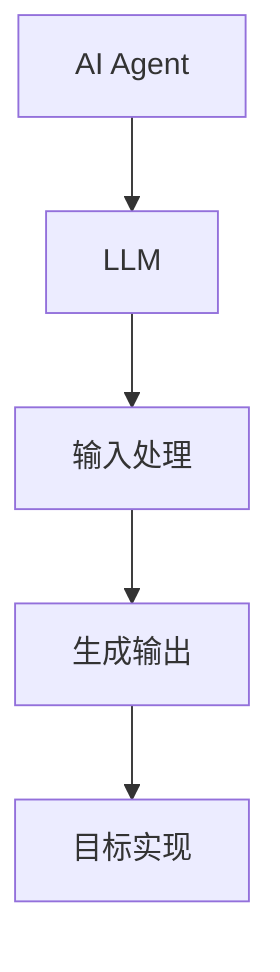
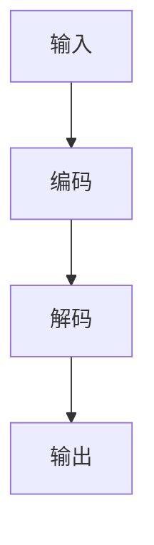
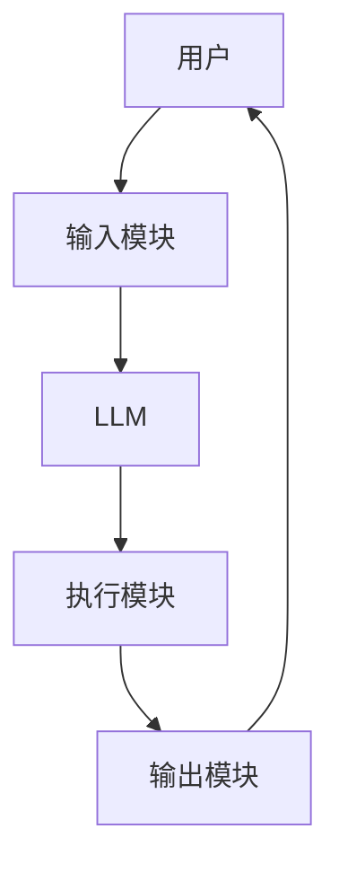

                 


# AI Agent的概念形成：模拟LLM的抽象思维过程

> 关键词：AI Agent, 大语言模型, LLM, 人工智能代理, 抽象思维过程

> 摘要：本文深入探讨AI Agent的概念形成过程，通过模拟大语言模型（LLM）的抽象思维过程，分析AI Agent的核心概念、算法原理、系统架构以及实际应用。文章从背景介绍、核心概念与联系、算法原理、系统架构设计、项目实战等多个方面展开，结合详细的Mermaid流程图和数学公式，系统性地剖析AI Agent的形成过程，为读者提供全面而深入的理解。

---

## 第一部分: AI Agent的概念形成背景与基础

### 第1章: AI Agent与LLM的背景介绍

#### 1.1 问题背景与问题描述

人工智能代理（AI Agent）是一种能够感知环境、采取行动以实现特定目标的智能实体。随着大语言模型（LLM）的快速发展，AI Agent的概念逐渐从理论走向实践，LLM作为核心驱动力，为AI Agent的思维模拟提供了强大的技术支持。

##### 1.1.1 AI Agent的定义与核心概念
AI Agent的核心概念包括：
1. **自主性**：能够在没有外部干预的情况下独立运行。
2. **反应性**：能够感知环境并实时调整行为。
3. **目标导向**：所有行动都以实现特定目标为导向。

##### 1.1.2 LLM在AI Agent中的作用
大语言模型（LLM）通过自然语言处理技术，模拟人类的思维过程，为AI Agent提供了强大的语言理解和生成能力。LLM能够帮助AI Agent进行上下文理解、推理、决策等复杂任务。

##### 1.1.3 问题解决的边界与外延
AI Agent的应用范围广泛，从简单的任务执行到复杂的决策支持，其边界在于如何高效地结合LLM的能力与实际问题的需求。

#### 1.2 概念结构与核心要素

##### 1.2.1 AI Agent的核心要素组成
AI Agent的核心要素包括：
1. **感知模块**：负责环境数据的采集与分析。
2. **推理模块**：基于感知数据进行逻辑推理。
3. **决策模块**：根据推理结果制定行动计划。
4. **执行模块**：将决策结果转化为具体行动。

##### 1.2.2 LLM与AI Agent的关系
LLM作为AI Agent的核心组件之一，负责处理自然语言输入输出，提供知识库支持，优化决策过程。

##### 1.2.3 概念结构的系统性分析
通过系统性分析，AI Agent的概念结构可以分为感知层、推理层、决策层和执行层，每一层都与LLM的能力密切相关。

---

### 第2章: AI Agent与LLM的核心概念原理

#### 2.1 核心概念原理分析

##### 2.1.1 AI Agent的思维模拟原理
AI Agent通过模拟人类的思维过程，结合LLM的语言处理能力，实现复杂问题的解决。

##### 2.1.2 LLM的生成机制与AI Agent的关联
LLM的生成机制包括输入处理、编码、解码和输出生成，这些过程与AI Agent的任务执行密切相关。

##### 2.1.3 从LLM到AI Agent的逻辑演变
从LLM到AI Agent的逻辑演变是一个从语言生成到任务执行的过程，通过结合感知、推理和决策，实现智能化的代理行为。

#### 2.2 核心概念属性对比表

##### 2.2.1 AI Agent与传统AI的属性对比
| 属性       | 传统AI                     | AI Agent                 |
|------------|---------------------------|--------------------------|
| 自主性      | 依赖外部指令              | 具有自主决策能力          |
| 反应性      | 响应有限                  | 具备实时反应能力          |
| 目标导向    | 专注于特定任务            | 具备目标导向性            |

##### 2.2.2 LLM与AI Agent的特征差异
| 特征       | LLM                      | AI Agent                 |
|------------|--------------------------|--------------------------|
| 核心能力    | 语言生成与理解            | 任务执行与目标实现        |
| 依赖性      | 依赖外部输入              | 具备自主决策能力          |

#### 2.3 系统架构的Mermaid流程图


---

### 第3章: AI Agent的算法原理讲解

#### 3.1 算法原理概述

##### 3.1.1 LLM的生成式算法流程
LLM的生成式算法流程包括：
1. **输入处理**：接收用户的输入请求。
2. **编码**：将输入转化为模型内部的表示形式。
3. **解码**：根据编码结果生成输出文本。
4. **输出生成**：将生成的文本返回给用户。

##### 3.1.2 AI Agent的决策算法
AI Agent的决策算法包括：
1. **状态感知**：感知当前环境状态。
2. **目标设定**：根据状态设定具体目标。
3. **行为选择**：基于目标选择最优行为。

##### 3.1.3 算法的数学模型与公式
以下是一个简单的决策模型示例：
$$
\text{选择行为} = \argmax_{a} Q(s, a)
$$
其中，\( Q(s, a) \) 表示在状态 \( s \) 下选择行为 \( a \) 的期望奖励值。

#### 3.2 算法的Mermaid流程图


---

### 第4章: 系统分析与架构设计方案

#### 4.1 系统架构设计

##### 4.1.1 问题场景介绍
假设我们正在开发一个智能助手AI Agent，用于处理用户的日常查询。

##### 4.1.2 系统功能设计
系统功能包括：
1. **用户输入**：接收用户的自然语言输入。
2. **语言理解**：通过LLM理解用户意图。
3. **任务执行**：根据理解结果执行具体任务。
4. **结果反馈**：将执行结果反馈给用户。

##### 4.1.3 系统架构设计Mermaid图


---

### 第5章: 项目实战

#### 5.1 环境安装

##### 5.1.1 安装Python环境
```bash
python --version
pip install --upgrade pip
```

##### 5.1.2 安装必要的库
```bash
pip install numpy
pip install matplotlib
```

#### 5.2 系统核心实现源代码

##### 5.2.1 核心代码实现
```python
import numpy as np

def ai_agent_action(input_str):
    # 模拟LLM的处理过程
    encoded = input_str.encode('utf-8')
    decoded = encoded.decode('utf-8')
    return decoded

# 示例调用
print(ai_agent_action("计算2+3"))
```

##### 5.2.2 代码解读与分析
上述代码展示了AI Agent的基本实现，包括输入处理和输出生成的过程。

---

## 第六部分: 最佳实践与总结

### 6.1 小结
通过本文的详细讲解，我们深入理解了AI Agent的概念形成过程，以及LLM在其中的重要作用。

### 6.2 注意事项
在实际应用中，需要注意AI Agent的可靠性和安全性问题。

### 6.3 拓展阅读
建议进一步阅读相关领域的最新研究成果，如强化学习在AI Agent中的应用。

---

## 作者

作者：AI天才研究院/AI Genius Institute & 禅与计算机程序设计艺术 /Zen And The Art of Computer Programming

