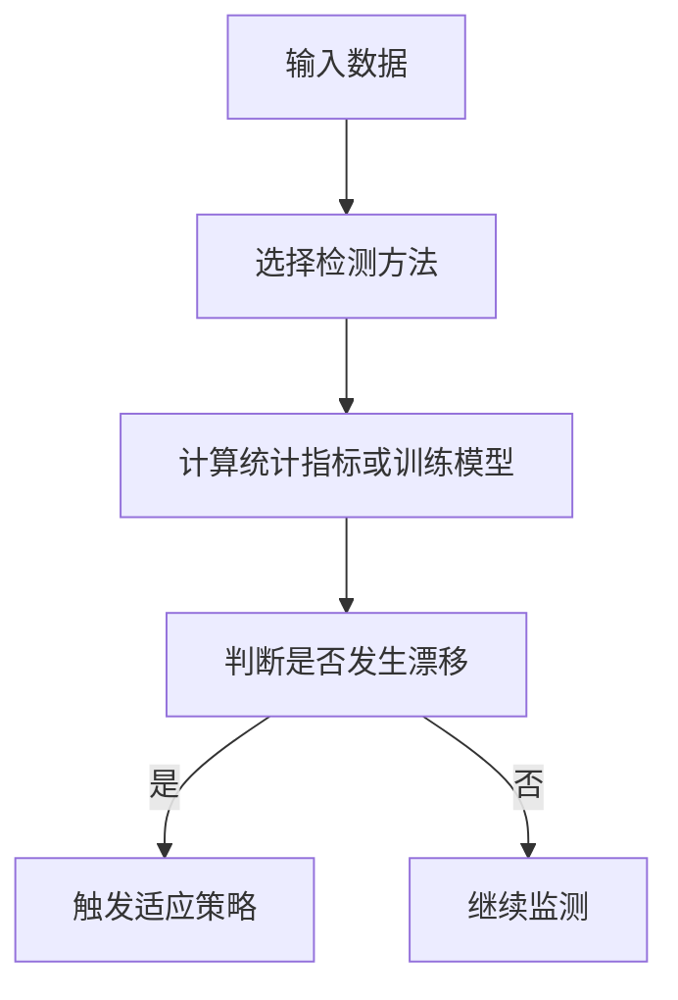
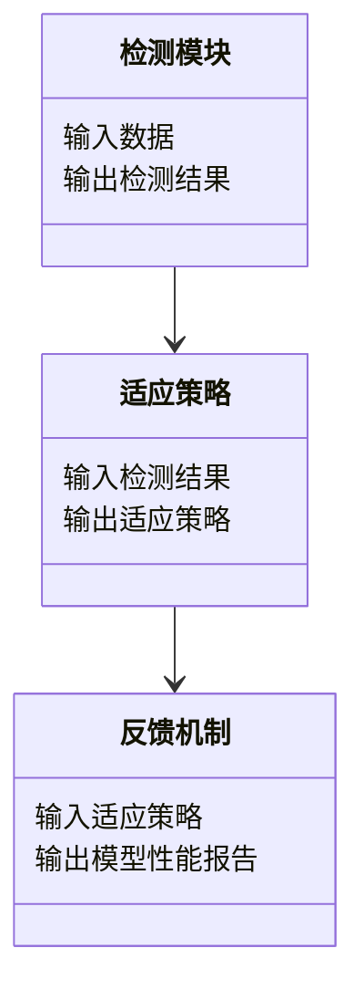
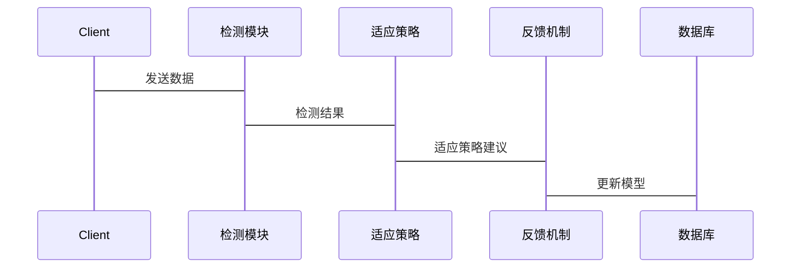

                 


# AI Agent的概念漂移检测与适应策略

## 关键词：
AI Agent, 概念漂移, 动态环境, 检测算法, 适应策略, 机器学习, 自适应系统

## 摘要：
本文详细探讨了AI Agent在动态环境中检测和适应概念漂移的核心策略。通过系统性分析概念漂移的类型、AI Agent的适应机制以及相关的算法原理，本文为构建 robust 和自适应的AI系统提供了理论支持和实践指导。结合实际应用场景，本文提出了基于统计和机器学习的检测方法，并设计了完整的系统架构和实现方案，帮助读者理解如何在复杂环境中保持AI系统的性能和可靠性。

---

# 第1章: 概念漂移检测与适应的背景介绍

## 1.1 问题背景与概念描述
### 1.1.1 机器学习模型的动态环境挑战
在现实应用中，数据分布往往会发生变化，例如用户行为模式的改变、市场趋势的波动等。这种变化可能导致机器学习模型的性能下降，甚至失效。AI Agent需要能够在动态环境中保持性能稳定。

### 1.1.2 概念漂移的定义与分类
概念漂移（Concept Drift）是指数据分布的变化导致模型预测目标发生变化的现象。它可以分为以下几种类型：
- **突然型漂移**：数据分布突然发生显著变化。
- **平滑型漂移**：数据分布逐渐变化，但变化趋势不明显。
- **噪声型漂移**：数据中噪声增加，掩盖了真实的变化趋势。
- **组合型漂移**：上述类型的混合，变化复杂且难以检测。

### 1.1.3 概念漂移对企业AI系统的潜在影响
- **模型失效**：概念漂移可能导致AI系统的预测能力下降甚至完全失效。
- **业务损失**：在实时决策系统中，模型失效可能导致经济损失或客户信任度下降。
- **维护成本增加**：频繁的手动模型更新会增加企业的维护成本。

## 1.2 问题描述与解决方法
### 1.2.1 概念漂移的典型场景分析
- 在推荐系统中，用户的偏好变化可能导致模型无法准确推荐内容。
- 在金融领域，市场波动可能导致风险评估模型失效。
- 在自然语言处理中，语言表达的变化可能导致分类模型性能下降。

### 1.2.2 检测与适应的必要性
- **检测**：及时发现数据分布的变化，避免模型性能下降。
- **适应**：通过模型更新、特征调整等方法，恢复模型性能。

### 1.2.3 解决方案的多样性与选择
- **主动检测**：定期检查数据分布的变化，主动触发模型更新。
- **被动检测**：当模型性能下降到一定程度时，触发检测和适应机制。
- **混合策略**：结合主动和被动检测，实现更高效的适应。

## 1.3 概念漂移的边界与外延
### 1.3.1 相关概念的对比分析
- **数据漂移（Data Drift）**：数据特征的变化，但目标不变。
- **目标漂移（Label Drift）**：标签的变化，影响模型的预测能力。
- **概念漂移**：数据和目标的变化，导致模型失效。

### 1.3.2 概念漂移与其他动态变化问题的区别
| 概念漂移 | 数据漂移 | 目标漂移 |
|---------|----------|----------|
| 数据和目标均变化 | 数据变化，目标不变 | 目标变化，数据不变 |

### 1.3.3 概念漂移的适用范围与限制
- 适用范围：适用于需要长期运行的机器学习模型。
- 限制：难以检测渐进型漂移，尤其是当漂移速度较慢时。

## 1.4 核心要素与组成结构
### 1.4.1 概念漂移的关键因素
- 数据特征的变化。
- 数据标签的变化。
- 数据分布的变化。

### 1.4.2 AI Agent的适应机制
- **检测模块**：实时或定期检测数据分布的变化。
- **反馈模块**：根据检测结果，触发适应策略。
- **调整模块**：通过模型更新、特征调整等方式，恢复模型性能。

### 1.4.3 组成结构的系统性分析
- **输入**：实时数据流或定期数据样本。
- **输出**：模型性能评估报告和适应策略建议。

---

# 第2章: 概念漂移与AI Agent的核心概念

## 2.1 概念漂移的类型与特征
### 2.1.1 突发型漂移
- **定义**：数据分布突然发生变化。
- **特征**：变化速度快，容易检测。

### 2.1.2 平滑型漂移
- **定义**：数据分布逐渐发生变化。
- **特征**：变化速度慢，难以检测。

### 2.1.3 噪声型漂移
- **定义**：数据中噪声增加，掩盖了真实变化。
- **特征**：检测难度大，容易误判。

### 2.1.4 组合型漂移
- **定义**：多种漂移类型的混合。
- **特征**：变化复杂，检测和适应难度大。

## 2.2 AI Agent的适应机制
### 2.2.1 自动检测与反馈
- **自动检测**：通过算法实时或定期检测数据分布的变化。
- **反馈机制**：将检测结果反馈给系统，触发适应策略。

### 2.2.2 动态调整策略
- **模型更新**：重新训练模型，适应新的数据分布。
- **特征调整**：优化特征选择，去除噪声特征。
- **参数调整**：动态调整模型参数，保持性能稳定。

### 2.2.3 模型更新与优化
- **在线更新**：实时更新模型，适应数据变化。
- **离线更新**：定期离线训练，优化模型性能。

## 2.3 概念漂移与AI Agent的关系
### 2.3.1 相互作用的机制
- **检测**：AI Agent通过检测模块发现概念漂移。
- **适应**：通过反馈机制触发适应策略。

### 2.3.2 系统性分析框架
- **输入**：数据流。
- **输出**：模型性能和适应策略。

### 2.3.3 实际应用场景中的协同效应
- 在推荐系统中，AI Agent通过检测用户行为的变化，动态调整推荐策略。
- 在金融领域，AI Agent通过检测市场变化，实时调整风险评估模型。

## 2.4 概念对比与ER实体关系图
### 2.4.1 概念漂移与数据变化的关系
- **数据变化**：数据特征的变化，可能伴随概念漂移。
- **目标变化**：数据目标的变化，直接导致概念漂移。

### 2.4.2 AI Agent与传统机器学习模型的对比
| AI Agent | 传统机器学习模型 |
|----------|--------------------|
| 具备自适应能力 | 需要手动更新 |
| 能够检测和适应概念漂移 | 无法检测和适应概念漂移 |

### 2.4.3 ER实体关系图展示（Mermaid图）
```mermaid
erd
  table 概念漂移检测系统 {
    检测模块 (id, 数据特征, 数据分布)
    适应策略 (id, 模型更新, 特征调整)
    反馈机制 (id, 检测结果, 适应策略建议)
  }
```

---

# 第3章: 概念漂移检测与适应的算法原理

## 3.1 算法原理概述
### 3.1.1 概念漂移检测的基本方法
- **统计方法**：通过统计指标（如均值、方差）检测数据分布的变化。
- **机器学习方法**：通过训练分类器，检测数据分布的变化。

### 3.1.2 基于统计的方法
- **Kolmogorov-Smirnov检验**：比较两个数据分布的相似性。
- **Hellinger距离**：衡量两个概率分布之间的距离。

### 3.1.3 基于机器学习的方法
- **Isolation Forest**：用于检测异常点，适用于突发型漂移。
- **K Nearest Neighbors (KNN)**：用于检测数据分布的变化，适用于平滑型漂移。

## 3.2 算法流程与实现
### 3.2.1 概念漂移检测的流程图（Mermaid图）


### 3.2.2 检测算法的实现步骤
```python
def detect_concept_drift(train_data, test_data):
    # 统计方法：计算均值变化
    train_mean = train_data.mean()
    test_mean = test_data.mean()
    drift = abs(test_mean - train_mean) > 0.1  # 阈值设置为0.1
    return drift
```

### 3.2.3 适应策略的执行机制
```python
def adapt_strategy(model, drift):
    if drift:
        # 模型更新
        model.train(new_data)
        return model
    else:
        return None
```

## 3.3 数学模型与公式
### 3.3.1 概念漂移检测的数学模型
$$ P(y|x) = \sum_{i=1}^{n} w_i P(y|x_i) $$
其中，$w_i$ 是权重，表示数据点的重要性。

### 3.3.2 适应策略的优化
$$ \theta_{new} = \theta_{old} + \alpha (\theta_{target} - \theta_{old}) $$
其中，$\alpha$ 是学习率，$\theta_{target}$ 是目标参数。

---

# 第4章: 系统分析与架构设计

## 4.1 问题场景介绍
### 4.1.1 应用场景
- 在线推荐系统：用户行为变化可能导致推荐算法失效。
- 风险评估系统：市场波动可能导致风险模型失效。

## 4.2 系统功能设计
### 4.2.1 领域模型（Mermaid类图）


### 4.2.2 系统架构设计（Mermaid架构图）


### 4.2.3 系统接口设计
- 输入接口：实时数据流。
- 输出接口：模型性能报告和适应策略建议。

## 4.3 系统交互流程（Mermaid序列图）


---

# 第5章: 项目实战

## 5.1 环境安装
- **Python 3.8+**
- **机器学习库**：scikit-learn, xgboost
- **可视化工具**：Matplotlib, Seaborn

## 5.2 核心代码实现
### 5.2.1 概念漂移检测器
```python
from sklearn.metrics import accuracy_score
import numpy as np

def detect_concept_drift(train_X, train_y, test_X, test_y):
    # 训练初始模型
    from sklearn.svm import SVC
    model = SVC()
    model.fit(train_X, train_y)
    
    # 计算训练准确率
    train_acc = accuracy_score(train_y, model.predict(train_X))
    # 计算测试准确率
    test_acc = accuracy_score(test_y, model.predict(test_X))
    
    # 判断是否发生概念漂移
    drift = abs(test_acc - train_acc) > 0.1
    return drift
```

### 5.2.2 适应策略实现
```python
def adapt_strategy(model, train_X, train_y):
    # 重新训练模型
    new_model = SVC()
    new_model.fit(train_X, train_y)
    return new_model
```

## 5.3 实际案例分析
### 5.3.1 案例背景
- **场景**：在线推荐系统。
- **数据**：用户点击行为数据，训练集和测试集。

### 5.3.2 实验结果与分析
- **实验结果**：检测到概念漂移，触发模型更新。
- **性能提升**：更新后的模型准确率恢复到初始水平。

## 5.4 项目总结
### 5.4.1 关键点总结
- 及时检测概念漂移，避免模型性能下降。
- 选择合适的适应策略，恢复模型性能。

### 5.4.2 经验与教训
- 定期监测模型性能，及时发现概念漂移。
- 根据具体场景选择合适的检测和适应方法。

---

# 第6章: 最佳实践与未来展望

## 6.1 小结
- 概念漂移是动态环境中机器学习模型面临的重要挑战。
- AI Agent通过检测和适应机制，能够有效应对概念漂移。

## 6.2 注意事项
- 定期检查模型性能，避免概念漂移导致的模型失效。
- 根据具体场景选择合适的检测和适应方法。

## 6.3 未来趋势
- **自适应模型**：开发具备自适应能力的机器学习模型，能够自动检测和适应概念漂移。
- **在线学习**：结合在线学习方法，实时更新模型，适应数据分布的变化。

## 6.4 拓展阅读
- **书籍推荐**：《机器学习实战》、《深度学习》。
- **工具推荐**：scikit-learn, TensorFlow, PyTorch。

---

# 作者：AI天才研究院 & 禅与计算机程序设计艺术

---

