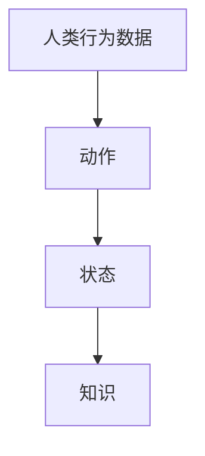
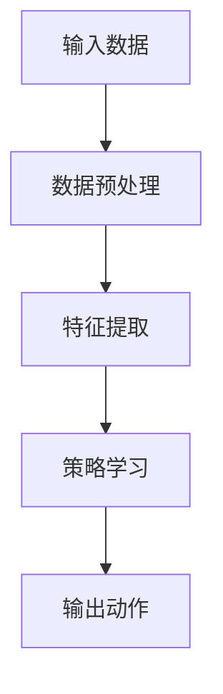
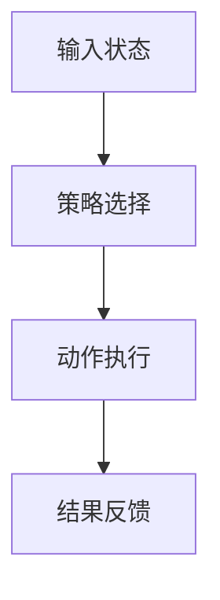
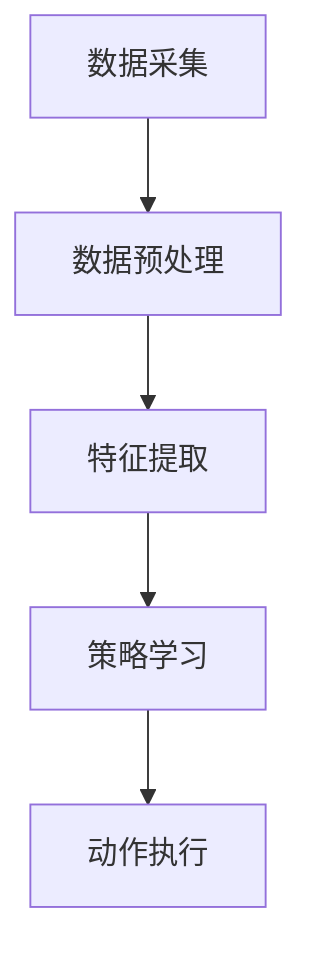
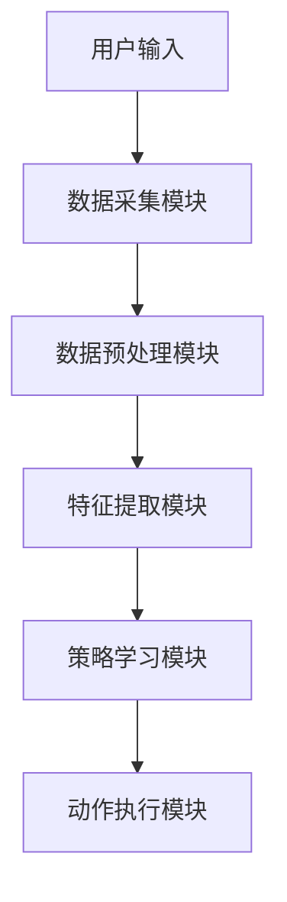

                 


# AI Agent的模仿学习：从人类行为数据中提取知识

**关键词：AI Agent, 模仿学习, 人类行为数据, 知识提取, 机器学习**

**摘要：**  
AI Agent的模仿学习是一种通过从人类行为数据中提取知识，使AI代理能够模仿和执行类似人类的操作任务的方法。本文将从背景介绍、核心概念、算法原理、系统架构、项目实战等方面详细阐述模仿学习的原理、应用及实现方法，帮助读者全面理解AI Agent模仿学习的核心思想和实际应用。

---

# 第一部分: AI Agent模仿学习的背景与核心概念

## 第1章: AI Agent模仿学习的背景介绍

### 1.1 AI Agent的基本概念

#### 1.1.1 什么是AI Agent
AI Agent（人工智能代理）是指能够感知环境、自主决策并执行任务的智能体。它可以是一个软件程序、机器人或其他形式的智能系统，通过传感器和执行器与环境交互。

#### 1.1.2 AI Agent的分类
AI Agent可以根据智能水平、任务类型和应用场景进行分类：
- **反应式AI Agent**：基于当前感知做出反应，如自动驾驶汽车。
- **认知式AI Agent**：具备复杂推理和规划能力，如智能助手。
- **协作式AI Agent**：能够与其他代理或人类协作完成任务，如多智能体系统。

#### 1.1.3 AI Agent的应用场景
AI Agent广泛应用于多个领域，如自动驾驶、智能助手、机器人、游戏AI等。例如，Siri、Alexa等智能助手就是典型的AI Agent。

---

### 1.2 模仿学习的基本概念

#### 1.2.1 模仿学习的定义
模仿学习（Imitation Learning）是一种机器学习方法，通过观察和模仿人类或其他智能体的行为来学习特定任务。与监督学习和强化学习不同，模仿学习直接从行为数据中提取策略。

#### 1.2.2 模仿学习的特点
- 数据依赖性：需要大量高质量的行为数据。
- 知识提取：从行为中提取可执行的策略或规则。
- 灵活性：能够适应不同任务和环境。

#### 1.2.3 模仿学习的应用领域
- **机器人控制**：通过模仿人类动作实现复杂操作。
- **对话系统**：通过模仿人类对话生成自然语言回复。
- **游戏AI**：通过模仿人类玩家的行为提升游戏水平。

---

### 1.3 AI Agent模仿学习的背景与意义

#### 1.3.1 模仿学习在AI Agent中的作用
模仿学习为AI Agent提供了一种从人类经验中快速学习的方法，能够减少试错成本并加快部署速度。

#### 1.3.2 从人类行为数据中提取知识的重要性
人类行为数据包含丰富的经验、策略和决策逻辑，通过模仿学习可以将这些知识转化为AI代理的能力。

#### 1.3.3 AI Agent模仿学习的现状与未来
目前，模仿学习在许多领域取得了显著进展，但仍然面临数据质量、泛化能力和实时性等挑战。未来，随着深度学习和强化学习的结合，模仿学习将更加高效和智能。

---

## 第2章: AI Agent模仿学习的核心概念与联系

### 2.1 核心概念原理

#### 2.1.1 动作空间与状态空间
- **动作空间**：AI Agent可以执行的所有动作的集合。
- **状态空间**：环境中的所有可能状态的集合。

#### 2.1.2 模仿学习的基本原理
通过观察人类行为数据，提取策略函数，使AI Agent在相似状态下做出与人类相同或类似的动作。

#### 2.1.3 知识提取的关键步骤
1. 数据采集：收集人类行为数据。
2. 特征提取：从数据中提取有用的特征。
3. 策略学习：通过学习算法提取策略。
4. 验证与优化：验证策略并进行优化。

---

### 2.2 核心概念对比分析

#### 2.2.1 不同模仿学习方法的对比
| 方法              | 优点                     | 缺点                     |
|--------------------|--------------------------|--------------------------|
| 行为克隆（BC）     | 数据需求少               | 对策略的泛化能力较弱     |
| 直接模仿学习（DIL） | 策略直接映射             | 需要高质量的标注数据     |
| 最优控制策略       | 策略最优                 | 计算复杂度高             |

#### 2.2.2 不同AI Agent架构的对比
| 架构               | 优点                     | 缺点                     |
|--------------------|--------------------------|--------------------------|
| 反应式架构         | 实时性强                 | 策略简单                 |
| 认知式架构         | 策略复杂                 | 计算资源需求高           |

#### 2.2.3 知识提取与传统机器学习的对比
| 方法              | 数据需求       | 知识表达               | 可解释性               |
|--------------------|----------------|-----------------------|-----------------------|
| 模仿学习           | 行为数据       | 策略直接               | 较低                 |
| 监督学习           | 标签数据       | 模型预测               | 较高                 |

---

### 2.3 实体关系图



---

## 2.4 本章小结

---

# 第三部分: AI Agent模仿学习的算法原理

## 第3章: AI Agent模仿学习的算法原理

### 3.1 模仿学习的基本算法

#### 3.1.1 行为克隆（Behavior Cloning）



数学公式：
$$
\theta = \arg\min_{\theta} \sum_{i=1}^n (y_i - f_\theta(x_i))^2
$$
其中，$\theta$ 是模型参数，$x_i$ 是输入数据，$y_i$ 是目标动作。

#### 3.1.2 直接模仿学习（Direct Imitation Learning）



数学公式：
$$
p(a|s) = \text{softmax}(w^T \phi(s,a))
$$
其中，$w$ 是权重向量，$\phi(s,a)$ 是状态和动作的特征向量。

---

### 3.2 算法流程图

#### 行为克隆流程图


---

## 3.3 数学模型与公式

#### 策略梯度（Policy Gradient）公式

$$
\nabla \theta = \frac{1}{n} \sum_{i=1}^n \nabla \log \pi_\theta(a|s_i) \cdot R(s_i,a)
$$

其中，$\theta$ 是模型参数，$s_i$ 是状态，$a$ 是动作，$R(s_i,a)$ 是奖励函数。

---

## 3.4 本章小结

---

# 第四部分: AI Agent模仿学习的系统分析与架构设计

## 第4章: AI Agent模仿学习的系统分析与架构设计

### 4.1 系统功能设计

#### 4.1.1 系统模块划分
- 数据采集模块
- 数据预处理模块
- 特征提取模块
- 策略学习模块
- 动作执行模块

#### 4.1.2 功能流程图



---

### 4.2 系统架构设计

#### 4.2.1 系统架构图



---

### 4.3 本章小结

---

# 第五部分: AI Agent模仿学习的项目实战

## 第5章: AI Agent模仿学习的项目实战

### 5.1 环境安装与配置

#### 5.1.1 环境要求
- Python 3.6+
- TensorFlow或PyTorch
- 其他依赖库（如numpy, matplotlib等）

---

### 5.2 代码实现

#### 5.2.1 数据准备

```python
import numpy as np

# 示例数据：人类行为数据
data = np.array([...])  # 具体数据根据实际任务调整
```

#### 5.2.2 模型训练

```python
import tensorflow as tf

# 定义策略网络
model = tf.keras.Sequential([
    tf.keras.layers.Dense(64, activation='relu'),
    tf.keras.layers.Dense(action_space, activation='softmax')
])

# 定义损失函数
def loss(y_true, y_pred):
    return tf.keras.losses.sparse_categorical_crossentropy(y_true, y_pred)

model.compile(optimizer='adam', loss=loss)
```

#### 5.2.3 模型应用

```python
# 输入状态
state = ...  # 具体状态数据

# 预测动作
action = model.predict(state)
```

---

### 5.3 实际案例分析

#### 5.3.1 案例介绍
以电商客服对话系统为例，通过模仿学习训练AI Agent生成自然语言回复。

#### 5.3.2 代码解读与分析
- 数据预处理：将对话数据转化为模型可接受的格式。
- 模型训练：使用预处理后的数据训练策略网络。
- 动作执行：根据输入的用户问题，生成回复。

---

### 5.4 本章小结

---

# 第六部分: AI Agent模仿学习的最佳实践与注意事项

## 第6章: AI Agent模仿学习的最佳实践

### 6.1 最佳实践 tips

#### 6.1.1 数据质量
- 数据多样性：确保数据覆盖不同场景和状态。
- 数据标注：对数据进行标注以提高训练效果。

#### 6.1.2 模型优化
- 超参数调整：优化学习率、批量大小等参数。
- 正则化方法：使用Dropout等技术防止过拟合。

#### 6.1.3 系统优化
- 并行计算：利用多GPU加速训练。
- 模型压缩：减少模型大小以提高推理速度。

---

### 6.2 注意事项

#### 6.2.1 数据偏见
- 确保数据的多样性和代表性，避免模型出现偏见。

#### 6.2.2 模型泛化能力
- 在不同环境中测试模型的泛化能力，确保其稳定性。

---

### 6.3 拓展阅读

#### 6.3.1 相关论文
- "Imitation Learning: A Review of Algorithms and Applications"（算法与应用综述）
- "Deep Reinforcement Learning for AI Agents"（深度强化学习在AI代理中的应用）

#### 6.3.2 技术博客
- AI Agent领域的知名技术博客和开源项目。

---

## 6.4 本章小结

---

# 第七部分: 总结与展望

## 第7章: 总结与展望

### 7.1 核心内容回顾
- AI Agent模仿学习的基本概念和核心原理。
- 常用算法及其优缺点。
- 系统架构设计与项目实战经验。

### 7.2 未来展望
- 结合强化学习和深度学习，提升模仿学习的泛化能力。
- 研究实时性和高效性，使其在更多领域得到广泛应用。

---

## 作者简介

作者：AI天才研究院/AI Genius Institute & 禅与计算机程序设计艺术 /Zen And The Art of Computer Programming

