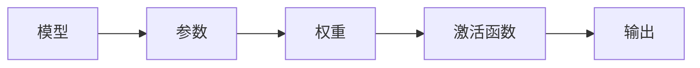
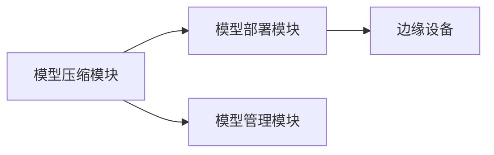

                 


# AI Agent的模型压缩：从云端LLM到边缘计算

> 关键词：AI Agent，模型压缩，边缘计算，LLM，模型优化，深度学习

> 摘要：随着AI Agent技术的快速发展，如何将大型语言模型（LLM）高效地部署到边缘计算环境成为关键挑战。本文系统阐述模型压缩的核心概念、关键技术及其在AI Agent中的应用，详细分析了模型压缩的实现原理、算法优化及系统设计，通过实际案例展示了如何将GPT-2压缩部署到边缘设备，为AI Agent的边缘化应用提供了实践指导。

---

## 引言：AI Agent与模型压缩的结合

AI Agent作为人工智能的核心技术，正在从云端向边缘计算环境扩展。然而，大型语言模型（LLM）的资源消耗问题限制了其在边缘设备上的应用。模型压缩技术通过减少模型参数量，使其能够在资源受限的环境中高效运行。本文将深入探讨模型压缩的技术细节，分析其在AI Agent边缘计算中的应用，并通过案例展示其实现过程。

---

## 第一部分：模型压缩的背景与基础

### 第1章：模型压缩概述

#### 1.1 模型压缩的定义与背景
- 模型压缩是指通过减少模型的参数数量或简化模型结构，降低模型的计算和存储需求，同时保持或提升模型性能的技术。
- 大型语言模型（如GPT-3）在云端运行时需要巨大的计算资源，而边缘设备的资源有限，导致模型难以直接部署。
- 模型压缩的背景包括边缘计算的普及和AI Agent的广泛应用，推动了模型压缩技术的发展。

#### 1.2 AI Agent的核心功能
- AI Agent通过自然语言处理（NLP）技术，提供智能交互、任务执行等服务。
- 边缘计算的低延迟、高实时性需求，使得AI Agent的模型必须在本地设备上高效运行。

#### 1.3 模型压缩的目标与意义
- **目标**：减少模型的参数量和计算复杂度，使其能够在边缘设备上高效运行。
- **意义**：降低资源消耗，提升响应速度，扩展AI Agent的应用场景。

---

### 第2章：模型压缩的核心概念与联系

#### 2.1 模型压缩的核心原理
- 剪枝：移除模型中不重要的参数或神经元。
- 量化：降低模型参数的位数（如从32位浮点数降到8位整数）。
- 知识蒸馏：通过教师模型指导学生模型，提取知识并压缩模型。

#### 2.2 核心概念对比
- **参数量与模型大小**：参数量直接影响模型大小，减少参数量可以显著降低模型文件大小。
- **压缩率与性能损失**：压缩率越高，性能损失可能越大，需权衡两者关系。
- **算法优缺点**：不同压缩算法有不同的优缺点，需根据场景选择合适的方法。

#### 2.3 实体关系图


---

## 第二部分：模型压缩的核心技术

### 第3章：剪枝技术

#### 3.1 剪枝技术的基本原理
- 剪枝通过移除模型中冗余的部分（如权重为零的神经元），降低模型复杂度。
- 常见的剪枝策略包括基于权重重要性的剪枝和基于梯度的剪枝。

#### 3.2 剪枝算法的实现
- **权重剪枝**：根据权重的重要性进行排序，移除不重要的权重。
- **激活剪枝**：通过激活函数的输出判断哪些神经元贡献较小，移除这些神经元。
- **梯度剪枝**：根据梯度的绝对值判断哪些参数对模型贡献较小，进行剪枝。

---

### 第4章：量化技术

#### 4.1 量化技术的基本原理
- 量化通过降低数据的精度（如将32位浮点数降低到8位整数），减少模型的存储和计算需求。
- 常见的量化方法包括均匀量化和非均匀量化。

#### 4.2 量化算法的实现
- **4-bit量化**：将参数映射到4位整数，减少存储空间。
- **8-bit量化**：将参数映射到8位整数，平衡存储和计算效率。
- **动态范围量化**：根据参数的分布动态调整量化范围，提升压缩效果。

---

### 第5章：知识蒸馏技术

#### 5.1 知识蒸馏的基本原理
- 知识蒸馏通过教师模型指导学生模型，提取教师模型的知识并压缩到学生模型中。
- 学生模型通常比教师模型小，但能够继承教师模型的性能。

#### 5.2 知识蒸馏算法的实现
- **教师模型的选择**：选择一个大模型作为教师，提取其知识。
- **学生模型的设计**：设计一个较小的模型，通过蒸馏损失函数优化其性能。
- **蒸馏过程**：通过调整蒸馏温度和损失函数权重，平衡教师和学生模型的损失。

---

## 第三部分：模型压缩的算法实现

### 第6章：剪枝算法的实现

#### 6.1 剪枝算法的步骤
- **参数排序**：根据参数的重要性进行排序。
- **参数移除**：移除不重要的参数。
- **模型重建**：去除参数后，重建模型进行训练和微调。

#### 6.2 剪枝算法的数学模型
- 参数重要性计算：通过LASSO回归（L1正则化）计算参数的重要性。
  $$ L_{1}正则化损失 = \sum_{i=1}^{n} |w_i| $$
- 参数移除：根据重要性排序，移除一定比例的低重要性参数。

---

### 第7章：量化算法的实现

#### 7.1 量化算法的步骤
- **参数归一化**：将参数归一化到0-255范围。
- **量化映射**：将参数映射到目标位数（如8位）。
- **去量化**：将量化后的参数转换回浮点数进行计算。

#### 7.2 量化算法的数学模型
- 4位量化：将32位浮点数参数映射到4位整数。
  $$ quantized\_value = \lfloor \frac{value}{range} \rfloor $$
- 8位量化：将32位浮点数参数映射到8位整数。
  $$ quantized\_value = \text{round}(\frac{value}{range} \times 255) $$

---

## 第四部分：系统分析与架构设计

### 第8章：系统架构设计

#### 8.1 系统功能设计
- **模型压缩模块**：实现模型压缩算法（如剪枝、量化、蒸馏）。
- **模型部署模块**：将压缩后的模型部署到边缘设备。
- **模型管理模块**：管理模型的版本和性能监控。

#### 8.2 系统架构图


---

## 第五部分：项目实战

### 第9章：AI Agent模型压缩项目实战

#### 9.1 项目背景
- 将GPT-2压缩到边缘设备，使其在本地运行。

#### 9.2 项目实现步骤
- **环境配置**：安装必要的库（如TensorFlow、Keras）。
- **模型压缩**：使用剪枝和量化技术压缩GPT-2模型。
- **模型部署**：将压缩后的模型部署到边缘设备。

#### 9.3 代码实现
```python
import tensorflow as tf
from tensorflow.keras import layers

# 压缩模型
def model_compression(model):
    # 剪枝
    session = tf.keras.backend.get_session()
    weights = session.run(model.trainable_weights)
    # 量化
    quantized_weights = [tf.quantize(w, min_val=-128, max_val=127, num_bits=8) for w in weights]
    # 模型重建
    compressed_model = tf.keras.models.clone_model(model)
    compressed_model.build(model.input_shape)
    compressed_model.set_weights(quantized_weights)
    return compressed_model
```

---

## 第六部分：总结与展望

### 第10章：总结与展望

#### 10.1 总结
- 模型压缩技术是AI Agent边缘计算的关键技术。
- 剪枝、量化和知识蒸馏是常用的压缩方法，各有优缺点。

#### 10.2 展望
- 动态压缩：根据设备负载动态调整压缩率。
- 模型自适应：结合边缘设备的资源动态调整模型结构。
- 模型商店：建立模型压缩的标准和共享平台，推动技术普及。

---

## 作者：AI天才研究院/AI Genius Institute & 禅与计算机程序设计艺术 /Zen And The Art of Computer Programming

