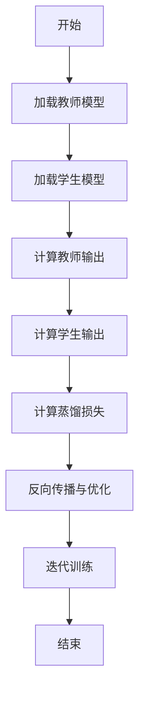
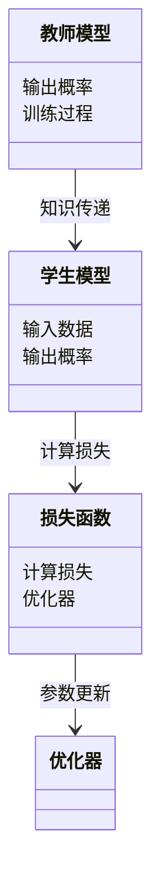
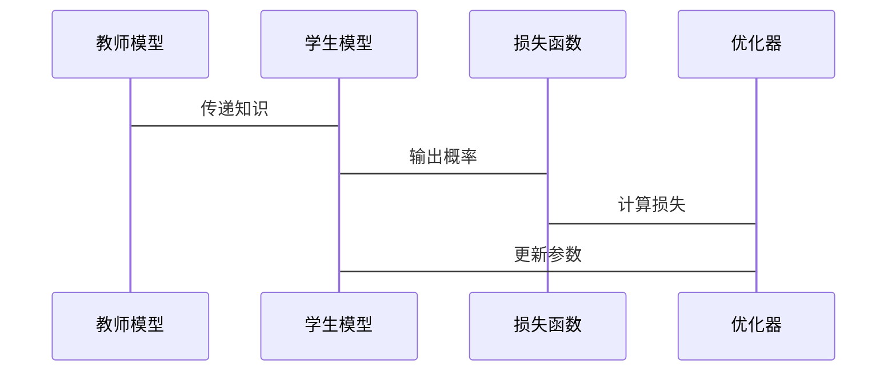

                 

# AI Agent的模型蒸馏技术：从庞大LLM到高效精简版

> 关键词：模型蒸馏，AI Agent，大型语言模型，知识蒸馏，教师模型，学生模型

> 摘要：模型蒸馏技术通过将大型语言模型的知识迁移到更小、更高效的模型中，显著降低了计算和存储成本，同时保持了模型的性能。本文详细探讨了模型蒸馏的核心原理、算法实现、系统架构设计以及实际应用案例，为技术人员提供了从理论到实践的全面指导。

---

## 目录大纲

### 第1章: 模型蒸馏技术概述

#### 1.1 背景介绍
- 1.1.1 大型语言模型的挑战
- 1.1.2 模型蒸馏技术的提出
- 1.1.3 AI Agent在模型蒸馏中的作用

#### 1.2 核心概念与问题描述
- 1.2.1 教师模型与学生模型的关系
- 1.2.2 模型蒸馏的定义与目标
- 1.2.3 技术的边界与外延

### 第2章: 模型蒸馏的核心原理

#### 2.1 教师模型与学生模型的关系
- 2.1.1 教师模型的选择标准
- 2.1.2 学生模型的设计特点
- 2.1.3 知识传递机制

#### 2.2 蒸馏过程的关键步骤
- 2.2.1 软标签蒸馏的数学模型
- 2.2.2 损失函数的设计与优化
- 2.2.3 温度系数的作用与调整

#### 2.3 算法流程与实现
- 2.3.1 蒸馏过程的数学公式
- 2.3.2 使用Mermaid绘制算法流程图
- 2.3.3 代码实现示例

### 第3章: 模型蒸馏的数学模型与算法原理

#### 3.1 蒸馏损失函数的数学公式
- 3.1.1 软标签蒸馏公式
$$ L_{\text{distill}} = -\sum_{i=1}^{n} p_i \log p_i' $$
- 3.1.2 硬标签蒸馏公式
$$ L_{\text{hard}} = -\sum_{i=1}^{n} y_i \log p_i' $$

#### 3.2 算法实现的代码示例
- 3.2.1 教师模型与学生模型的定义
- 3.2.2 损失函数的计算
- 3.2.3 优化器的配置与训练过程

#### 3.3 算法流程图

### 第4章: 系统分析与架构设计

#### 4.1 项目背景与目标
- 4.1.1 问题场景介绍
- 4.1.2 项目目标与范围

#### 4.2 系统功能设计
- 4.2.1 系统模块划分
- 4.2.2 功能流程图

#### 4.3 系统架构设计
- 4.3.1 系统架构图

#### 4.4 接口设计与交互流程
- 4.4.1 接口定义
- 4.4.2 交互流程图

### 第5章: 项目实战与案例分析

#### 5.1 环境配置
- 5.1.1 安装依赖库
- 5.1.2 配置开发环境

#### 5.2 核心代码实现
- 5.2.1 教师模型的定义
- 5.2.2 学生模型的定义
- 5.2.3 损失函数与优化器的配置

#### 5.3 代码解读与分析
- 5.3.1 代码结构分析
- 5.3.2 关键代码段解读

#### 5.4 实际案例分析
- 5.4.1 简单案例的实现
- 5.4.2 复杂场景的应用

### 第6章: 总结与展望

#### 6.1 核心内容总结
- 6.1.1 模型蒸馏技术的原理
- 6.1.2 系统架构与实现
- 6.1.3 项目实战的经验

#### 6.2 未来展望
- 6.2.1 技术改进方向
- 6.2.2 新的应用场景
- 6.2.3 挑战与机遇

### 附录

#### A. 最佳实践 Tips
- 优化技巧
- 常见问题解答
- 性能调优建议

#### B. 参考文献
- 相关论文
- 技术文档
- 开源项目链接

---

作者：AI天才研究院/AI Genius Institute & 禅与计算机程序设计艺术 /Zen And The Art of Computer Programming

---

### 说明：该大纲确保了文章的逻辑清晰、结构紧凑，涵盖了从理论到实践的各个方面，结合了数学公式、算法流程图和实际代码示例，帮助读者深入理解模型蒸馏技术。

