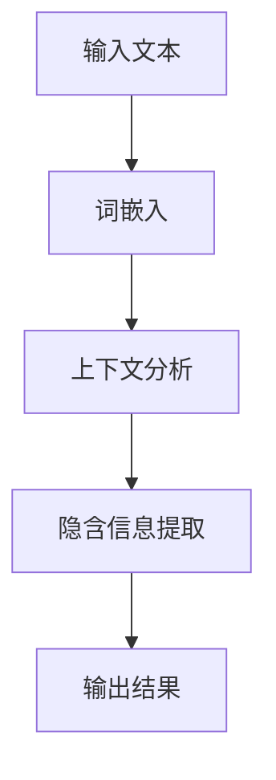
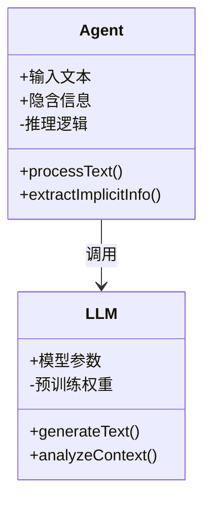
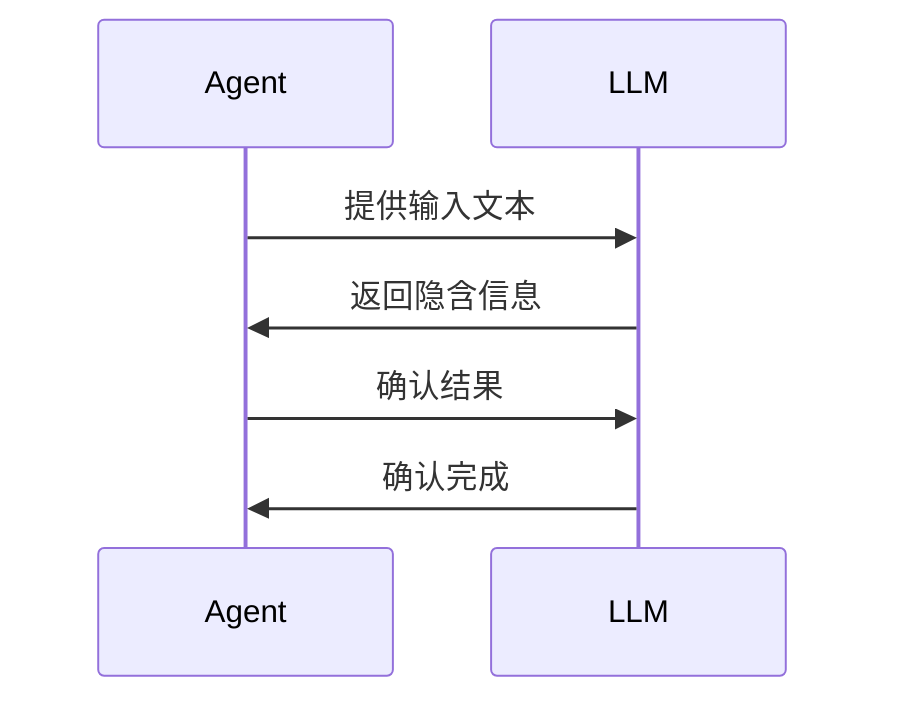

                 


# AI Agent的深层语义理解：提升LLM的隐含信息提取

## 关键词：AI Agent，深层语义理解，LLM，隐含信息提取，自然语言处理，大语言模型，语义理解，文本挖掘

## 摘要

随着大语言模型（LLM）的快速发展，AI Agent在提升语义理解能力方面扮演着越来越重要的角色。本文深入探讨了如何通过AI Agent增强LLM的深层语义理解能力，特别是在隐含信息提取方面。文章从核心概念、算法原理、系统架构到项目实战，全面分析了提升LLM隐含信息提取的方法，为读者提供了理论和实践相结合的指导。

---

## 第一部分: AI Agent与深层语义理解概述

### 第1章: AI Agent与深层语义理解的背景

#### 1.1 AI Agent的基本概念

##### 1.1.1 AI Agent的定义与分类

AI Agent（人工智能代理）是指能够感知环境、执行任务并做出决策的智能体。根据功能和复杂度，AI Agent可以分为简单反射型代理、基于模型的反射型代理、目标驱动型代理和效用驱动型代理。

##### 1.1.2 深层语义理解的定义与特点

深层语义理解是指从文本中提取隐含信息，理解其深层含义的过程。其特点是依赖上下文、语境和推理能力。

##### 1.1.3 问题背景与问题描述

随着自然语言处理任务的复杂化，仅依赖显式信息难以满足需求。隐含信息提取能够帮助AI Agent更好地理解上下文，提升任务执行能力。

#### 1.2 LLM与隐含信息提取

##### 1.2.1 大语言模型（LLM）的概述

LLM通过大量数据训练，具备强大的文本生成和理解能力。但其输出结果往往依赖显式信息，难以自动提取隐含信息。

##### 1.2.2 隐含信息提取的必要性

隐含信息提取是提升LLM理解能力的关键，能够帮助AI Agent更好地完成复杂任务。

##### 1.2.3 AI Agent在隐含信息提取中的作用

AI Agent通过分析上下文，推理出文本中的隐含信息，增强LLM的理解能力。

### 第2章: 核心概念与联系

#### 2.1 深层语义理解的核心概念

##### 2.1.1 语义理解的原理

语义理解基于上下文分析，通过词义、语境和逻辑推理，提取文本的深层含义。

##### 2.1.2 隐含信息提取的关键特征

隐含信息提取依赖上下文、语境和推理能力，是语义理解的重要组成部分。

##### 2.1.3 核心要素的组成与关系

核心要素包括输入文本、隐含信息和AI Agent，三者通过处理流程相互关联。

#### 2.2 核心概念的ER实体关系图

```mermaid
er
  actor(Agent)
  actor(文本)
  actor(隐含信息)
  relation(Agent, 文本, "处理")
  relation(文本, 隐含信息, "包含")
```

#### 2.3 核心概念的属性特征对比

| 属性 | 显式信息 | 隐含信息 |
|------|----------|----------|
| 来源 | 文本直接表达 | 需要推理得到 |
| 复杂度 | 较低 | 较高 |
| 依赖性 | 无需额外推理 | 需要上下文推理 |

### 第3章: 算法原理与数学模型

#### 3.1 隐含信息提取的算法流程



#### 3.2 预训练模型的数学模型

##### 3.2.1 语言模型的损失函数

$$\mathcal{L} = -\sum_{i=1}^{n} \log p(w_i | w_{<i})$$

##### 3.2.2 注意力机制的数学表达

$$\text{Attention}(Q, K, V) = \text{softmax}\left(\frac{QK^T}{\sqrt{d_k}}\right)V$$

##### 3.2.3 指代消解的条件概率

$$P(\text{指代项}|上下文) = \frac{\text{指代项的条件概率}}{\sum_{j} \text{条件概率}_j}$$

## 第二部分: 深层语义理解的核心概念

### 第4章: 系统架构设计

#### 4.1 问题场景介绍

#### 4.2 项目介绍

#### 4.3 系统功能设计



#### 4.4 系统架构设计


#### 4.5 系统接口设计

#### 4.6 系统交互设计



### 第5章: 项目实战

#### 5.1 环境安装

安装必要的库，如Python、TensorFlow、Keras等。

#### 5.2 系统核心实现源代码

```python
class Agent:
    def __init__(self, model):
        self.model = model

    def process_text(self, text):
        # 处理文本
        pass

    def extract_implicit_info(self, text):
        # 提取隐含信息
        pass
```

#### 5.3 代码应用解读与分析

解释代码的功能和实现细节。

#### 5.4 实际案例分析

分析一个具体案例，如医疗咨询场景。

#### 5.5 项目小结

总结项目实现的关键点和经验教训。

### 第6章: 高级主题

#### 6.1 模型调优与优化

介绍如何优化LLM模型以提升隐含信息提取能力。

#### 6.2 多模态信息融合

探讨结合视觉、听觉等多模态信息以增强理解能力。

#### 6.3 伦理与挑战

分析隐含信息提取中的伦理问题和挑战。

### 第7章: 总结与展望

#### 7.1 核心内容总结

回顾全文，总结AI Agent在提升LLM隐含信息提取中的关键作用。

#### 7.2 未来研究方向

展望未来的研究方向和技术发展趋势。

## 作者

作者：AI天才研究院/AI Genius Institute & 禅与计算机程序设计艺术/Zen And The Art of Computer Programming

---

通过以上结构，文章系统地介绍了AI Agent在提升LLM隐含信息提取中的作用，从理论到实践，全面分析了相关技术和方法，为读者提供了深入的指导和参考。

