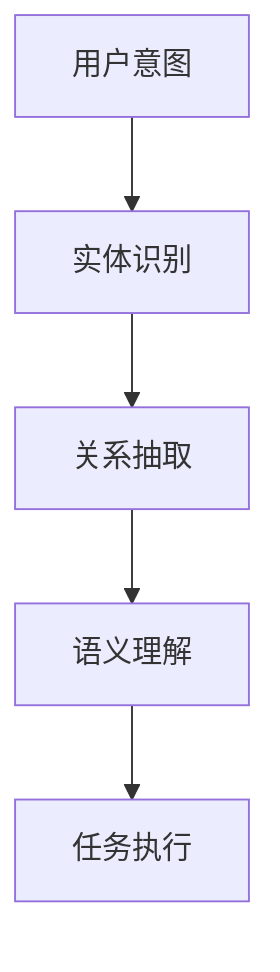
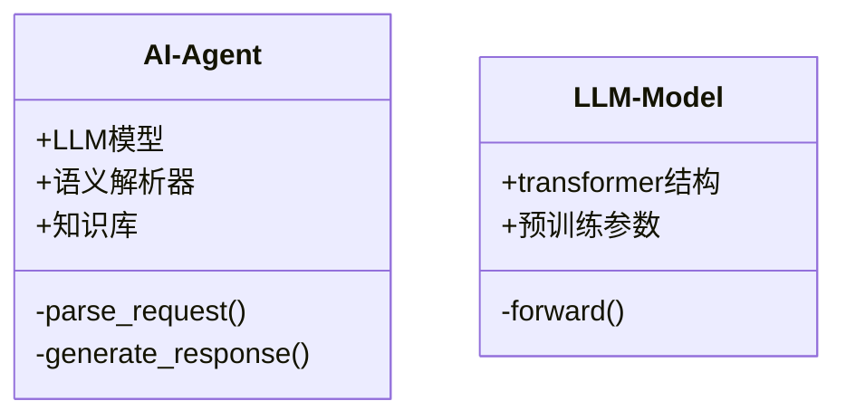

                 


# AI Agent的深层语义解析：提升LLM的语言理解深度

> **关键词**：AI Agent, LLM, 深层语义解析, 语义理解, 大语言模型  
> **摘要**：本文深入探讨了AI Agent在提升大语言模型（LLM）语义理解深度中的关键作用。通过分析深层语义解析的核心概念、算法原理、系统架构及项目实战，本文为读者提供了从理论到实践的全面指导。从背景介绍到系统设计，再到实际案例分析，我们详细解析了如何通过AI Agent优化LLM的语义理解能力，从而在实际应用场景中实现更精准的语言交互。

---

## 第1章: AI Agent与深层语义解析概述

### 1.1 AI Agent的基本概念

#### 1.1.1 AI Agent的定义与分类
AI Agent（人工智能代理）是指能够感知环境并采取行动以实现目标的智能体。根据功能和应用场景，AI Agent可以分为**简单反射型**、**基于模型的反应型**、**目标驱动型**和**实用驱动型**等类型。AI Agent的核心能力在于其感知和行动能力，而语义理解是其感知能力的重要组成部分。

#### 1.1.2 深层语义解析的定义与特点
深层语义解析（Deep Semantic Parsing）是一种基于上下文和语境理解用户输入的技术，旨在提取用户意图、实体和情感等深层语义信息。其特点包括**上下文依赖性**、**多模态融合**和**动态适应性**。

#### 1.1.3 AI Agent与深层语义解析的关系
AI Agent需要依赖深层语义解析技术来理解用户的输入，从而做出更准确的响应和决策。可以说，深层语义解析是AI Agent实现智能交互的核心技术之一。

### 1.2 LLM的基本原理

#### 1.2.1 大语言模型的定义
大语言模型（Large Language Model, LLM）是指基于大规模数据训练的深度学习模型，如GPT系列、BERT系列等。这些模型通过海量数据学习语言的模式和规律，能够生成自然语言文本或完成特定任务。

#### 1.2.2 LLM的核心特点
- **参数规模大**：通常包含数亿甚至更多的参数。
- **预训练机制**：通过无监督学习在大规模数据上进行预训练。
- **微调能力**：可以通过特定任务的数据进行微调，以适应具体应用场景。

#### 1.2.3 LLM与AI Agent的结合
AI Agent可以通过调用LLM来实现自然语言理解与生成，从而完成复杂的任务，如对话交互、信息检索等。深层语义解析技术进一步优化了LLM的理解能力，使其能够更好地适应动态变化的语境。

---

## 第2章: 深层语义解析的背景与挑战

### 2.1 当前自然语言处理的局限性

#### 2.1.1 传统NLP的不足
传统NLP技术（如基于规则的语义分析）在处理复杂语境和模糊表达时表现有限，难以应对实际场景中的多样化需求。

#### 2.1.2 大语言模型的突破
大语言模型通过自监督学习掌握了丰富的语义信息，能够处理复杂的上下文关系，但仍然存在理解深度不足的问题。

#### 2.1.3 AI Agent在NLP中的应用
AI Agent需要在实时交互中理解用户的意图，这对NLP技术提出了更高的要求。

### 2.2 深层语义解析的必要性

#### 2.2.1 提升LLM的理解能力
深层语义解析能够帮助LLM更好地理解用户的意图和情感，从而生成更准确的响应。

#### 2.2.2 实际场景中的需求
在客服、医疗、教育等领域，AI Agent需要准确理解用户的深层需求，以提供个性化的服务。

#### 2.2.3 深层语义解析的边界与外延
深层语义解析不仅关注语法结构，还关注语境、情感和实体关系等多维度信息。

---

## 第3章: 深层语义解析的核心概念与联系

### 3.1 深层语义解析的原理

#### 3.1.1 语义理解的模型结构
深层语义解析通常基于Transformer架构，通过自注意力机制捕获上下文信息。

#### 3.1.2 语义特征的提取与分析
通过对文本的词向量、句向量和语义向量进行分析，提取与任务相关的特征。

#### 3.1.3 多模态信息的融合
结合文本、图像、语音等多种模态信息，提升语义理解的准确性和全面性。

### 3.2 核心概念对比与ER实体关系图

#### 3.2.1 深层语义解析与传统NLP的对比
| 特性               | 深层语义解析               | 传统NLP               |
|--------------------|---------------------------|-----------------------|
| 处理深度           | 高                        | 低                    |
| 上下文依赖性       | 强                        | 弱                    |
| 任务适应性         | 强                        | 一般                  |

#### 3.2.2 实体关系图的构建
使用Mermaid图展示实体关系：


---

## 第4章: 大语言模型的训练与优化

### 4.1 大语言模型的训练方法

#### 4.1.1 基于Transformer的模型结构
```mermaid
graph TD
    Input --> Tokenizer
    Tokenizer --> Embedding Layer
    Embedding Layer --> Transformer Blocks
    Transformer Blocks --> Output
```

#### 4.1.2 自注意力机制
自注意力机制通过计算输入序列中每两个位置之间的关系，生成注意力权重矩阵：
$$
\alpha_{ij} = \frac{\exp(w_i^T w_j)}{\sum_{k} \exp(w_i^T w_k)}
$$

---

## 第5章: 深层语义解析的算法实现

### 5.1 基于LLM的语义解析算法

#### 5.1.1 算法流程
```mermaid
graph TD
    Input --> Tokenizer
    Tokenizer --> Embedding Layer
    Embedding Layer --> Semantic Parser
    Semantic Parser --> Output
```

#### 5.1.2 核心代码实现
```python
def semantic_parsing(input_text):
    # 1. 分词
    tokens = tokenizer.encode(input_text)
    # 2. 生成词向量
    embeddings = model.encode(tokens)
    # 3. 解析语义
    parser = SemanticParser(embeddings)
    result = parser.predict()
    return result
```

---

## 第6章: 深层语义解析的系统架构设计

### 6.1 系统功能设计

#### 6.1.1 领域模型设计


---

## 第7章: 项目实战与应用

### 7.1 电商客服场景实战

#### 7.1.1 环境安装
安装必要的库：
```bash
pip install transformers
pip install torch
```

#### 7.1.2 核心代码实现
```python
from transformers import AutoTokenizer, AutoModelForMaskedLM
import torch

tokenizer = AutoTokenizer.from_pretrained('bert-base-uncased')
model = AutoModelForMaskedLM.from_pretrained('bert-base-uncased')

def semantic_parsing(input_text):
    inputs = tokenizer(input_text, return_tensors='pt')
    outputs = model(**inputs)
    return outputs
```

---

## 第8章: 总结与展望

### 8.1 总结
本文系统性地探讨了AI Agent在提升LLM语义理解深度中的关键作用，从理论到实践全面分析了深层语义解析的核心概念、算法实现和系统架构。

### 8.2 展望
未来的研究方向包括多模态语义解析、可解释性优化以及更高效的训练方法。

---

**作者：AI天才研究院/AI Genius Institute & 禅与计算机程序设计艺术 /Zen And The Art of Computer Programming**

