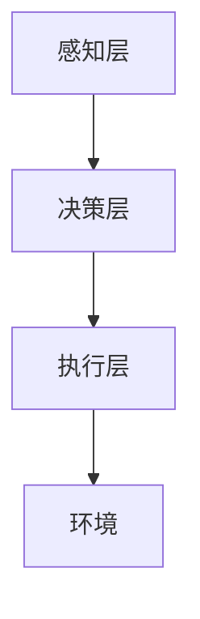

                 


```markdown
# AI Agent的深度强化学习：从模拟到现实世界应用

> 关键词：AI Agent，深度强化学习，强化学习，人工智能，强化学习算法

> 摘要：本文深入探讨了AI Agent在深度强化学习中的应用，从基础理论到实际应用，结合具体案例，分析了深度强化学习的核心算法、系统架构和项目实战，为读者提供系统化的知识体系。

---

# 第1章 AI Agent与深度强化学习概述

## 1.1 AI Agent的基本概念

### 1.1.1 什么是AI Agent
- AI Agent的定义：AI Agent（智能体）是指能够感知环境并采取行动以实现目标的实体。
- AI Agent的核心特征：自主性、反应性、目标导向、社会性。
- AI Agent的分类：简单反射型智能体、基于模型的反应型智能体、目标驱动型智能体、效用驱动型智能体。

### 1.1.2 AI Agent的核心特征
- 自主性：能够在没有外部干预的情况下自主决策。
- 反应性：能够根据环境的变化实时调整行为。
- 目标导向：通过采取行动来实现特定的目标。
- 社会性：能够与其他智能体或人类进行交互和协作。

### 1.1.3 AI Agent的应用场景
- 游戏AI：如棋类游戏、策略游戏中的智能体。
- 机器人控制：如工业机器人、服务机器人。
- 自动驾驶：如自动驾驶汽车中的决策系统。
- 金融投资：如自动交易系统。

## 1.2 深度强化学习的基本概念

### 1.2.1 强化学习的定义与特点
- 强化学习的定义：强化学习是一种通过试错方法，学习策略以最大化累积奖励的机器学习范式。
- 强化学习的特点：基于奖励机制、注重策略优化、适用于复杂环境。

### 1.2.2 深度强化学习的优势
- 处理高维状态空间的能力：通过深度神经网络处理复杂的输入数据。
- 强化学习与深度学习的结合：利用深度神经网络逼近策略或值函数。

### 1.2.3 深度强化学习与传统强化学习的区别
| 特性 | 传统强化学习 | 深度强化学习 |
|------|--------------|--------------|
| 状态空间 | 低维或结构化 | 高维或非结构化 |
| 策略表示 | 表格或简单函数 | 深度神经网络 |
| 应用场景 | 简单环境 | 复杂环境 |

## 1.3 AI Agent与深度强化学习的关系

### 1.3.1 AI Agent的决策机制
- 基于强化学习的决策过程：通过与环境交互，学习最优策略。
- 内部状态与外部环境的交互：智能体根据当前状态和历史经验做出决策。

### 1.3.2 深度强化学习在AI Agent中的作用
- 提供高效的策略优化方法。
- 处理复杂环境下的决策问题。
- 实现从经验中学习的能力。

### 1.3.3 AI Agent与深度强化学习的结合方式
- 策略网络：直接输出最优动作。
- 值函数网络：估计状态或动作状态对的值函数。
- 双重网络：同时估计值函数和策略。

## 1.4 深度强化学习的应用背景

### 1.4.1 游戏AI中的应用
- 游戏智能体的学习与训练：如AlphaGo、OpenAI的Dota AI。
- 多智能体协作：如MOBA游戏中的团队协作。

### 1.4.2 机器人控制中的应用
- 机器人导航与路径规划。
- 机器人抓取与操作：如工业机器人和家庭服务机器人。

### 1.4.3 金融投资中的应用
- 自动交易系统：如股票交易中的策略优化。
- 风险控制：通过强化学习优化投资组合。

## 1.5 本章小结
本章介绍了AI Agent的基本概念、深度强化学习的核心原理以及它们在实际中的应用。AI Agent作为智能体，通过深度强化学习实现复杂环境下的自主决策，具有广泛的应用前景。

---

# 第2章 深度强化学习的数学基础

## 2.1 神经网络基础

### 2.1.1 神经网络的定义与结构
- 神经网络的基本结构：输入层、隐藏层、输出层。
- 激活函数：sigmoid、ReLU、tanh。

### 2.1.2 神经网络的训练过程
- 前向传播：输入数据经过网络计算输出。
- 反向传播：计算损失函数的梯度并更新权重。

### 2.1.3 常见的神经网络模型
- CNN：卷积神经网络。
- RNN：循环神经网络。
- LSTM：长短期记忆网络。

## 2.2 深度强化学习的优化算法

### 2.2.1 梯度下降法
- 梯度下降的原理：通过计算损失函数的梯度，调整参数以最小化损失。
- 学习率的设置：影响收敛速度和结果。

### 2.2.2 动态规划与策略迭代
- 动态规划：通过状态转移方程计算值函数。
- 策略迭代：交替进行策略评估和策略改进。

### 2.2.3 近似值方法
- 值函数近似：使用神经网络逼近值函数。
- 策略梯度：直接优化策略参数。

## 2.3 概率论基础

### 2.3.1 概率分布的基本概念
- 离散分布：伯努利分布、二项分布。
- 连续分布：正态分布、均匀分布。

### 2.3.2 贝叶斯定理与应用
- 贝叶斯定理：用于计算条件概率。
- 应用：垃圾邮件分类、医学诊断。

### 2.3.3 马尔可夫决策过程
- 马尔可夫性质：当前状态只依赖于当前状态，与过去无关。
- 状态转移概率：描述从当前状态转移到下一个状态的概率。

## 2.4 深度强化学习的数学公式

### 2.4.1 状态值函数公式
$$ V(s) = \max_a Q(s,a) $$

### 2.4.2 动作值函数公式
$$ Q(s,a) = r(s,a) + \gamma \max_{a'} Q(s',a') $$

### 2.4.3 策略梯度公式
$$ \nabla \theta Q_\theta(s,a) = (r(s,a) + \gamma V_\theta(s')) \cdot \nabla \log \pi_\theta(a|s) $$

## 2.5 本章小结
本章介绍了深度强化学习所需的数学基础，包括神经网络、优化算法和概率论。这些知识是理解深度强化学习算法的基础。

---

# 第3章 深度强化学习的核心算法

## 3.1 Q-learning算法

### 3.1.1 Q-learning的基本原理
- 动作值函数：$$ Q(s,a) = r(s,a) + \gamma \max Q(s',a') $$
- 更新规则：$$ Q(s,a) = Q(s,a) + \alpha [r(s,a) + \gamma \max Q(s',a') - Q(s,a)] $$

### 3.1.2 Q-learning的数学模型
- 状态空间：离散或连续。
- 动作空间：离散或连续。

### 3.1.3 Q-learning的优缺点
- 优点：简单易实现。
- 缺点：在高维状态下表现不佳。

### 3.1.4 Q-learning的代码实现
```python
class QNetwork:
    def __init__(self, state_space, action_space, hidden_units):
        self.state_space = state_space
        self.action_space = action_space
        self.hidden_units = hidden_units
        self.model = Sequential([
            Dense(hidden_units, input_dim=state_space),
            Activation('relu'),
            Dense(action_space),
            Activation('linear')
        ])
    
    def call(self, state):
        return self.model(state)
    
    def get_action(self, state, epsilon):
        q_values = self.model.predict(state)
        if np.random.random() < epsilon:
            return np.random.randint(self.action_space)
        else:
            return np.argmax(q_values[0])
```

### 3.1.5 Q-learning的应用场景
- 小规模环境：如迷宫导航。
- 离散动作空间：如游戏中的动作选择。

## 3.2 Deep Q-Network (DQN) 算法

### 3.2.1 DQN的基本原理
- 使用深度神经网络逼近Q函数。
- 经验回放：存储历史经验，减少相关样本。
- 网络结构：双网络（主网络和目标网络）。

### 3.2.2 DQN的数学模型
- 状态值函数：$$ Q(s,a) \approx Q_\theta(s,a) $$
- 目标值函数：$$ Q^{target}(s,a) = r(s,a) + \gamma Q_\phi(s',a') $$

### 3.2.3 DQN的代码实现
```python
class DQN:
    def __init__(self, state_space, action_space, hidden_units, gamma=0.99, epsilon=1.0):
        self.state_space = state_space
        self.action_space = action_space
        self.hidden_units = hidden_units
        self.gamma = gamma
        self.epsilon = epsilon
        self.memory = []
        
        self.main_network = QNetwork(state_space, action_space, hidden_units)
        self.target_network = QNetwork(state_space, action_space, hidden_units)
    
    def remember(self, state, action, reward, next_state):
        self.memory.append((state, action, reward, next_state))
    
    def train(self, batch_size):
        if len(self.memory) < batch_size:
            return
        mini_batch = random.sample(self.memory, batch_size)
        states = []
        targets = []
        for state, action, reward, next_state in mini_batch:
            target = self.main_network.call(state)
            target[0][action] = reward + self.gamma * max(self.target_network.call(next_state)[0])
            states.append(state)
            targets.append(target)
        self.main_network.model.fit(np.array(states), np.array(targets), epochs=1, verbose=0)
```

### 3.2.4 DQN的优缺点
- 优点：适用于高维状态空间。
- 缺点：收敛速度较慢，需要经验回放。

### 3.2.5 DQN的应用场景
- 大规模环境：如复杂游戏、机器人控制。

## 3.3 Proximal Policy Optimization (PPO) 算法

### 3.3.1 PPO的基本原理
- 策略优化：直接优化策略参数。
- 约束条件：保持策略的稳定性。
- 使用Actor-Critic结构。

### 3.3.2 PPO的数学模型
- 策略梯度：$$ \nabla J = E[\nabla \log \pi(a|s) Q(s,a)] $$
- 约束条件：$$ E[\pi(a|s)/\pi'(a|s)] \leq 1 + \epsilon $$

### 3.3.3 PPO的代码实现
```python
class PPO:
    def __init__(self, state_space, action_space, hidden_units, gamma=0.99, epsilon=0.1):
        self.state_space = state_space
        self.action_space = action_space
        self.hidden_units = hidden_units
        self.gamma = gamma
        self.epsilon = epsilon
        
        self.actor = PolicyNetwork(state_space, action_space, hidden_units)
        self.critic = ValueNetwork(state_space, action_space, hidden_units)
    
    def get_action(self, state):
        prob = self.actor.call(state)
        action = np.random.choice(self.action_space, p=prob)
        return action
    
    def train(self, states, actions, rewards):
        # 计算V值
        values = self.critic.call(states)
        # 计算优势
        advantages = rewards - values
        # 计算新策略概率
        new_probs = self.actor.call(states)
        # 计算旧策略概率
        old_probs = old_actor.call(states)
        # 计算损失
        entropy_loss = -np.mean(new_probs * np.log(new_probs))
        policy_loss = -np.mean(advantages * np.log(new_probs / old_probs))
        total_loss = entropy_loss + policy_loss
        # 更新网络
        self.actor.model.optimizer.minimize(total_loss)
```

### 3.3.4 PPO的优缺点
- 优点：策略稳定性好，适用于连续动作空间。
- 缺点：实现复杂，收敛速度较慢。

### 3.3.5 PPO的应用场景
- 连续控制：如机器人控制、自动驾驶。

## 3.4 其他算法简述
- REINFORCE算法：基于策略梯度的强化学习。
- A3C算法：异步Actor-Critic算法，适用于分布式训练。
- TD3算法：适用于连续动作空间，结合DQN和PPO的优点。

## 3.5 本章小结
本章详细介绍了Q-learning、DQN和PPO三种深度强化学习的核心算法，包括其原理、数学模型和代码实现。这些算法在实际应用中各有优缺点，适用于不同的场景。

---

# 第4章 AI Agent的系统架构与设计

## 4.1 AI Agent的系统设计

### 4.1.1 系统架构概述
- 分层架构：感知层、决策层、执行层。
- 分布式架构：多个智能体协作完成任务。

### 4.1.2 系统功能设计
- 状态感知：通过传感器获取环境信息。
- 决策制定：基于当前状态和历史经验做出决策。
- 行为执行：根据决策输出动作。

### 4.1.3 系统架构图


### 4.1.4 系统交互设计
```mermaid
sequenceDiagram
    participant 环境
    participant 智能体
    环境 -> 智能体：发送状态
    智能体 -> 环境：发送动作
```

## 4.2 深度强化学习的系统实现

### 4.2.1 系统实现步骤
1. 环境搭建：定义状态空间、动作空间和奖励函数。
2. 网络构建：搭建策略网络或值函数网络。
3. 算法实现：选择合适的强化学习算法。
4. 训练过程：与环境交互，更新网络参数。

### 4.2.2 系统实现案例
- 游戏AI：如训练智能体在迷宫中寻找出口。
- 机器人控制：如训练机器人完成特定任务。

### 4.2.3 系统实现代码
```python
class AI-Agent:
    def __init__(self, state_space, action_space, hidden_units):
        self.state_space = state_space
        self.action_space = action_space
        self.hidden_units = hidden_units
        self.model = self.build_model()
    
    def build_model(self):
        model = Sequential([
            Dense(self.hidden_units, input_dim=self.state_space, activation='relu'),
            Dense(self.action_space, activation='linear')
        ])
        model.compile(optimizer='adam', loss='mse')
        return model
    
    def get_action(self, state, epsilon):
        if np.random.random() < epsilon:
            return np.random.randint(self.action_space)
        q_values = self.model.predict(state)
        return np.argmax(q_values[0])
```

### 4.2.4 系统实现小结
通过构建AI Agent的系统架构，可以更好地理解和实现深度强化学习算法。从环境感知到决策制定，再到行为执行，每一步都需要精确设计和实现。

## 4.3 深度强化学习的系统优化

### 4.3.1 网络结构优化
- 使用更深的网络结构：如更深的卷积层或循环层。
- 使用更复杂的激活函数：如Swish、GELU。

### 4.3.2 算法优化
- 策略优化：使用更先进的算法如PPO、A3C。
- 经验回放优化：增加经验池的大小和多样性。

### 4.3.3 系统优化代码
```python
class Optimized-Agent(AI-Agent):
    def __init__(self, state_space, action_space, hidden_units, gamma=0.99):
        super().__init__(state_space, action_space, hidden_units)
        self.gamma = gamma
        self.memory = []
    
    def remember(self, state, action, reward, next_state):
        self.memory.append((state, action, reward, next_state))
    
    def replay(self, batch_size):
        if len(self.memory) < batch_size:
            return
        mini_batch = random.sample(self.memory, batch_size)
        states = []
        targets = []
        for state, action, reward, next_state in mini_batch:
            target = self.model.predict(state)
            target[0][action] = reward + self.gamma * max(self.model.predict(next_state)[0])
            states.append(state)
            targets.append(target)
        self.model.fit(np.array(states), np.array(targets), epochs=1, verbose=0)
```

### 4.3.4 系统优化小结
通过网络结构优化和算法优化，可以显著提升AI Agent的性能。经验回放和更先进的算法如PPO、A3C可以有效提高训练效率和决策质量。

## 4.4 本章小结
本章介绍了AI Agent的系统架构设计，包括分层架构和分布式架构，并详细讲解了系统实现的步骤和优化方法。通过实际案例和代码实现，帮助读者更好地理解深度强化学习在系统中的应用。

---

# 第5章 深度强化学习的项目实战

## 5.1 项目环境搭建

### 5.1.1 环境选择
- 使用OpenAI Gym库：提供丰富的环境和API。
- 使用TensorFlow或Keras框架：便于构建深度神经网络。

### 5.1.2 环境安装
```bash
pip install gym
pip install tensorflow
```

## 5.2 深度强化学习的核心实现

### 5.2.1 算法实现
- Q-learning的实现：如迷宫导航。
- DQN的实现：如OpenAI Gym中的CartPole问题。
- PPO的实现：如机器人控制。

### 5.2.2 核心代码实现
```python
# DQN实现代码
class DQN-Agent:
    def __init__(self, state_space, action_space, hidden_units, gamma=0.99, epsilon=1.0):
        self.state_space = state_space
        self.action_space = action_space
        self.hidden_units = hidden_units
        self.gamma = gamma
        self.epsilon = epsilon
        self.memory = []
        
        self.main_network = QNetwork(state_space, action_space, hidden_units)
        self.target_network = QNetwork(state_space, action_space, hidden_units)
    
    def remember(self, state, action, reward, next_state):
        self.memory.append((state, action, reward, next_state))
    
    def get_action(self, state):
        if np.random.random() < self.epsilon:
            return np.random.randint(self.action_space)
        q_values = self.main_network.call(state)
        return np.argmax(q_values[0])
    
    def train(self, batch_size):
        if len(self.memory) < batch_size:
            return
        mini_batch = random.sample(self.memory, batch_size)
        states = []
        targets = []
        for state, action, reward, next_state in mini_batch:
            target = self.main_network.call(state)
            next_q = self.target_network.call(next_state)
            target[0][action] = reward + self.gamma * max(next_q[0])
            states.append(state)
            targets.append(target)
        self.main_network.model.fit(np.array(states), np.array(targets), epochs=1, verbose=0)
    
    def decay_epsilon(self):
        self.epsilon = max(0.01, self.epsilon * 0.99)
```

### 5.2.3 算法实现案例
- 迷宫导航：训练智能体找到迷宫的出口。
- CartPole问题：训练智能体平衡杆子。

### 5.2.4 算法实现小结
通过实际项目实战，可以深入理解深度强化学习算法的实现细节。从环境搭建到算法实现，每一步都需要仔细调试和优化。

## 5.3 项目实现与优化

### 5.3.1 环境与算法的结合
- 定义状态空间和动作空间。
- 定义奖励函数。

### 5.3.2 算法优化
- 调整学习率：如使用学习率衰减。
- 调整经验回放池的大小。

### 5.3.3 项目实现代码
```python
# 实现DQN算法解决CartPole问题
env = gym.make('CartPole-v0')
agent = DQN-Agent(env.observation_space.shape[0], env.action_space.n, 64)
episodes = 1000
for episode in range(episodes):
    state = env.reset()
    total_reward = 0
    done = False
    while not done:
        action = agent.get_action(state)
        next_state, reward, done, info = env.step(action)
        agent.remember(state, action, reward, next_state)
        agent.train(32)
        total_reward += reward
        state = next_state
    agent.decay_epsilon()
    print(f'Episode {episode}, Reward: {total_reward}')
```

### 5.3.4 项目实现小结
通过项目实战，读者可以掌握深度强化学习算法的实际应用。从环境搭建到算法实现，再到结果分析，每一步都需要深入理解。

## 5.4 本章小结
本章通过实际项目实战，详细讲解了深度强化学习算法的实现过程。从环境搭建到算法实现，再到结果分析，帮助读者更好地理解和掌握深度强化学习的核心技术。

---

# 第6章 深度强化学习的高级应用与挑战

## 6.1 多智能体协作

### 6.1.1 多智能体协作的基本概念
- 多智能体系统：多个智能体协作完成任务。
- 协作机制：通信、协商、协调。

### 6.1.2 多智能体协作的算法
- 多智能体强化学习：如MADDPG。
- 协作与竞争：如MAAC。

### 6.1.3 多智能体协作的应用
- 多人游戏：如MOBA游戏。
- 机器人协作：如 swarm robotics。

### 6.1.4 多智能体协作的挑战
- 状态空间的复杂性。
- 策略协调的困难性。
- 计算资源的消耗。

## 6.2 深度强化学习在现实世界中的应用

### 6.2.1 机器人控制
- 工业机器人：如ABB、KUKA的机器人。
- 服务机器人：如家庭服务机器人。

### 6.2.2 自动驾驶
- 汽车决策系统：如特斯拉、Waymo的自动驾驶。
- 多车协作：如智能交通系统。

### 6.2.3 金融投资
- 自动交易系统：如高频交易。
- 风险控制：如投资组合优化。

### 6.2.4 深度强化学习在现实世界中的挑战
- 环境的不确定性。
- 数据的稀缺性。
- 算法的实时性。

## 6.3 深度强化学习的挑战与未来趋势

### 6.3.1 当前挑战
- 计算资源的需求：如需要大量GPU算力。
- 算法的泛化能力：如在不同环境下适应能力。
- 伦理与安全：如智能体的决策是否符合伦理。

### 6.3.2 未来趋势
- 多模态学习：结合视觉、听觉等多模态信息。
- 联合学习：多个智能体协作学习。
- 自适应学习：根据环境动态调整策略。

## 6.4 本章小结
本章探讨了深度强化学习的高级应用和未来趋势。多智能体协作和现实世界中的应用展示了深度强化学习的广泛前景，同时也面临诸多挑战。

---

# 第7章 深度强化学习的未来展望与伦理问题

## 7.1 深度强化学习的未来展望

### 7.1.1 技术进步
- 算法的优化：如更高效的策略优化方法。
- 硬件的提升：如更强大的GPU和TPU。

### 7.1.2 应用领域的扩展
- 医疗领域：如疾病诊断和治疗方案优化。
- 教育领域：如自适应教学系统。

### 7.1.3 跨学科融合
- 与认知科学的结合：如模拟人类认知过程。
- 与量子计算的结合：如量子强化学习。

## 7.2 深度强化学习的伦理问题

### 7.2.1 智能体的自主性
- 智能体的决策是否可控。
- 智能体的决策是否符合伦理。

### 7.2.2 数据的隐私与安全
- 训练数据的隐私保护。
- 智能体的行为是否符合数据安全规范。

### 7.2.3 社会影响
- 深度强化学习对就业的影响。
- 深度强化学习对社会不平等的影响。

## 7.3 本章小结
本章展望了深度强化学习的未来发展趋势，并探讨了其在伦理和安全方面的挑战。智能体的自主性和数据隐私是未来需要重点关注的问题。

---

# 作者信息

作者：AI天才研究院/AI Genius Institute & 禅与计算机程序设计艺术 /Zen And The Art of Computer Programming

---

# 结语

通过本文的系统讲解，读者可以深入理解AI Agent的深度强化学习的核心原理和实际应用。从基础理论到高级应用，从算法实现到系统优化，本文为读者提供了一个全面的知识体系。希望本文能为AI Agent的深度强化学习的研究和实践提供有价值的参考。
```

