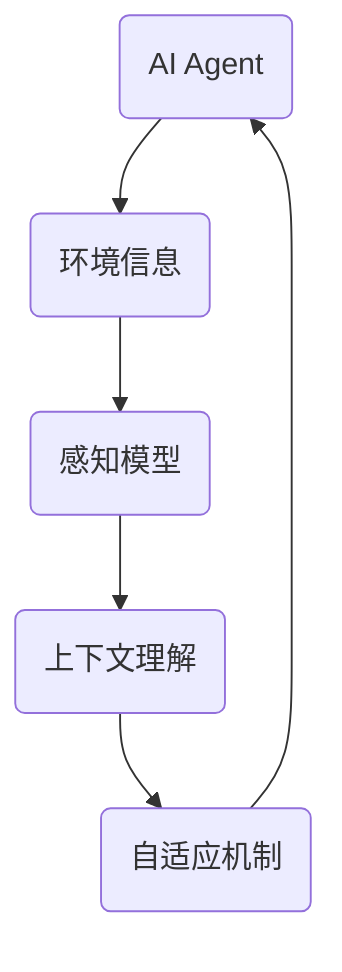
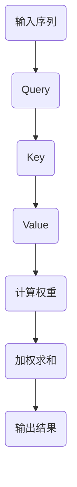
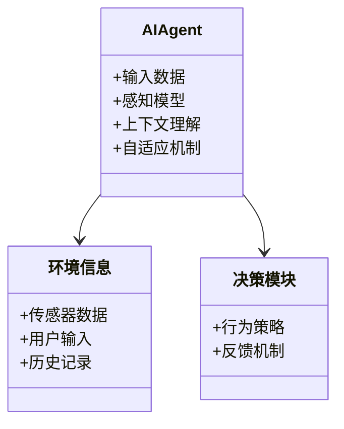
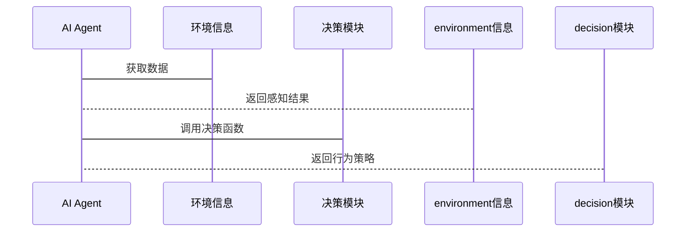
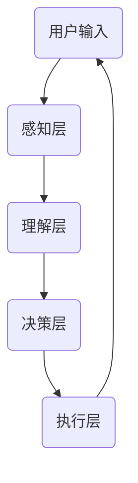
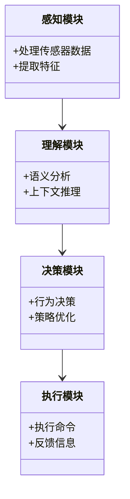
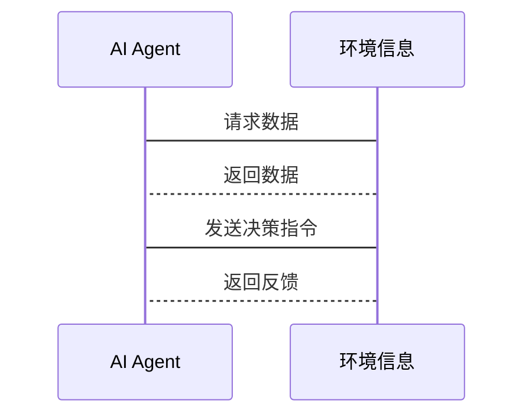
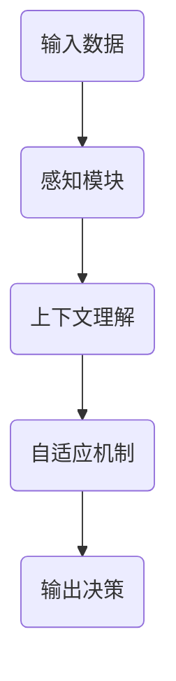

                 


# AI Agent的环境感知：上下文理解与适应

## 关键词：AI Agent, 环境感知, 上下文理解, 自适应机制, 算法原理, 系统架构, 项目实战

## 摘要：本文深入探讨AI Agent的环境感知能力，从核心概念、算法原理到系统设计和项目实战，全面解析AI Agent如何通过上下文理解与自适应机制实现对环境的精准感知与智能交互。

---

# 第1章: AI Agent与环境感知概述

## 1.1 AI Agent的基本概念

### 1.1.1 AI Agent的定义与分类
AI Agent（人工智能代理）是一种智能系统，能够感知环境、自主决策并执行任务。根据功能和应用场景，AI Agent可以分为：
- **简单反射型Agent**：基于规则直接响应输入。
- **基于模型的反射型Agent**：利用内部模型进行决策。
- **目标驱动型Agent**：以特定目标为导向行动。
- **实用驱动型Agent**：通过优化策略实现目标。

### 1.1.2 环境感知在AI Agent中的重要性
环境感知是AI Agent的核心能力，决定了其与外部世界的交互方式。通过感知环境，AI Agent能够：
1. 适应动态变化的场景。
2. 理解上下文信息，做出更智能的决策。
3. 提高系统的鲁棒性和灵活性。

### 1.1.3 环境感知的核心目标与应用场景
- **核心目标**：通过多模态数据（文本、图像、语音等）感知环境，理解上下文，并根据反馈调整行为。
- **应用场景**：智能助手、自动驾驶、机器人、推荐系统等。

## 1.2 环境感知的背景与问题背景

### 1.2.1 环境感知的定义与问题背景
环境感知是指AI Agent通过传感器或数据输入，获取并理解周围环境信息的能力。随着AI技术的发展，环境感知从简单的数据采集逐渐演变为复杂的语义理解和实时反馈。

### 1.2.2 环境感知的关键挑战
- 数据多样性与复杂性：环境数据可能来自多种模态（文本、图像、语音等），且具有噪声和不确定性。
- 上下文理解的难度：需要结合历史信息、场景背景和用户意图进行推理。
- 实时性与效率：在动态环境中，AI Agent需要快速做出决策。

### 1.2.3 环境感知的边界与外延
环境感知的边界包括：
- 数据输入的范围：AI Agent只能感知其传感器或数据源覆盖的环境信息。
- 决策的范围：感知信息仅用于特定任务，超出范围的信息不参与决策。
- 时间范围：感知信息的有效性和时效性。

## 1.3 核心概念与原理

### 1.3.1 环境感知的核心概念
- **感知模型**：用于从输入数据中提取有用信息的模型。
- **上下文理解**：通过语义分析理解环境信息的含义。
- **自适应机制**：根据环境反馈动态调整感知模型和行为策略。

### 1.3.2 环境感知与上下文理解的关系
上下文理解是环境感知的核心，通过上下文信息，AI Agent能够更好地理解用户意图和场景需求，从而做出更精准的决策。

### 1.3.3 环境感知的数学模型与公式
环境感知可以通过概率模型、统计学习模型或深度学习模型实现。例如，基于条件概率的感知模型可以表示为：
$$ P(\text{环境状态} | \text{输入数据}) $$

## 1.4 本章小结
本章介绍了AI Agent的基本概念、环境感知的重要性以及其核心挑战。通过理解这些内容，读者可以为后续章节的学习打下坚实的基础。

---

# 第2章: 环境感知的核心概念与联系

## 2.1 环境感知的核心概念

### 2.1.1 环境感知模型
环境感知模型是AI Agent理解环境信息的关键工具。常见的感知模型包括：
1. **基于规则的模型**：通过预定义的规则进行判断。
2. **统计学习模型**：基于概率和统计方法进行预测。
3. **深度学习模型**：利用神经网络提取特征并进行分类。

### 2.1.2 上下文理解方法
上下文理解是环境感知的核心，主要方法包括：
- **句法分析**：通过语法结构理解文本的含义。
- **语义分析**：通过词嵌入（如Word2Vec、BERT）理解上下文。
- **知识图谱**：利用外部知识库进行语义推理。

### 2.1.3 自适应机制
自适应机制是AI Agent根据环境反馈动态调整感知模型和行为策略的能力。常见的自适应方法包括：
- **在线学习**：实时更新模型参数。
- **强化学习**：通过奖励机制优化决策策略。
- **元学习**：快速适应新任务。

### 2.1.4 核心要素对比表格
| 概念 | 属性特征 | 示例 |
|------|----------|------|
| 感知模型 | 数据输入方式、模型复杂度、适用场景 | 图像识别模型（CNN）、文本分类模型（SVM） |
| 上下文理解 | 方法、推理深度、实时性 | 基于BERT的语义理解、基于知识图谱的推理 |
| 自适应机制 | 调整方式、反馈来源、策略优化 | 在线学习（梯度下降）、强化学习（Q-learning） |

### 2.1.5 ER实体关系图


## 2.2 核心概念之间的联系

### 2.2.1 感知模型与上下文理解的联系
感知模型负责提取环境信息，上下文理解负责解析这些信息的含义。例如，图像识别模型（感知模型）提取图像特征，而基于BERT的模型（上下文理解）解析图像中的文本含义。

### 2.2.2 上下文理解与自适应机制的联系
上下文理解为自适应机制提供反馈信息，帮助AI Agent调整其行为策略。例如，用户反馈可以帮助强化学习模型优化推荐策略。

### 2.2.3 感知模型与自适应机制的联系
感知模型通过自适应机制动态调整，以提高感知精度和效率。例如，实时语音识别模型可以根据用户反馈调整识别模型的参数。

## 2.3 本章小结
本章详细讲解了环境感知的核心概念，包括感知模型、上下文理解方法和自适应机制，并通过对比表格和实体关系图展示了它们之间的联系。

---

# 第3章: 环境感知的算法原理

## 3.1 环境感知的关键算法

### 3.1.1 注意力机制
注意力机制是一种有效的上下文理解方法，广泛应用于自然语言处理领域。其核心思想是通过计算输入数据中每个部分的重要性权重，关注关键信息。

#### 3.1.1.1 注意力机制的数学公式
$$ \text{Attention}(Q, K, V) = \text{softmax}\left( \frac{QK^T}{\sqrt{d_k}} \right)V $$

#### 3.1.1.2 注意力机制的实现流程


#### 3.1.1.3 注意力机制的代码实现
```python
import torch

def attention(query, key, value, d_k):
    scores = (query @ key.transpose(-2, -1)) / torch.sqrt(torch.tensor(d_k, dtype=torch.float))
    scores = torch.softmax(scores, dim=-1)
    output = scores @ value
    return output
```

### 3.1.2 上下文理解的序列模型

#### 3.1.2.1 基于RNN的上下文理解
- **循环神经网络（RNN）**：通过处理序列数据，捕捉上下文信息。
- **长短期记忆网络（LSTM）**：通过记忆单元捕捉长期依赖关系。

#### 3.1.2.2 基于Transformer的上下文理解
- **Transformer模型**：通过自注意力机制捕捉全局上下文信息。

### 3.1.3 基于强化学习的自适应策略
- **Q-learning**：通过状态-动作-奖励机制优化决策策略。
- **Deep Q-Network (DQN)**：将Q-learning与深度学习结合，实现端到端的决策优化。

#### 3.1.3.1 强化学习的基本公式
$$ Q(s, a) = r + \gamma \max_{a'} Q(s', a') $$

---

## 3.2 环境感知算法的实现与优化

### 3.2.1 算法实现的关键步骤
1. 数据预处理：对输入数据进行归一化、降维等处理。
2. 模型训练：使用监督学习或无监督学习方法训练感知模型。
3. 自适应调整：通过反馈机制动态优化模型参数。

### 3.2.2 算法优化的策略
- **模型压缩**：通过知识蒸馏等技术减少模型规模。
- **分布式计算**：利用多GPU并行计算提高训练效率。
- **在线优化**：实时更新模型参数以适应动态环境。

## 3.3 本章小结
本章重点讲解了环境感知的关键算法，包括注意力机制、序列模型和强化学习方法，并通过代码示例和流程图展示了它们的实现细节。

---

# 第4章: 系统分析与架构设计

## 4.1 项目介绍

### 4.1.1 项目背景
以智能助手为例，说明环境感知在实际应用中的重要性。

## 4.2 系统功能设计

### 4.2.1 领域模型设计


### 4.2.2 功能模块交互流程


## 4.3 系统架构设计

### 4.3.1 分层架构设计


### 4.3.2 模块化架构设计


## 4.4 系统接口设计

### 4.4.1 接口定义
- **输入接口**：接收传感器数据和用户输入。
- **输出接口**：发送决策指令和反馈信息。

### 4.4.2 交互流程


## 4.5 本章小结
本章通过实际案例分析，详细讲解了环境感知系统的功能设计、架构设计和接口设计。

---

# 第5章: 项目实战

## 5.1 环境安装与配置

### 5.1.1 安装Python和相关库
```bash
pip install numpy torch transformers
```

### 5.1.2 安装开发环境
```bash
conda create -n ai_agent python=3.8
conda activate ai_agent
```

## 5.2 系统核心实现

### 5.2.1 感知模块实现
```python
import torch
import torch.nn as nn

class PerceptionModule(nn.Module):
    def __init__(self, input_dim, hidden_dim):
        super(PerceptionModule, self).__init__()
        self.fc = nn.Linear(input_dim, hidden_dim)
    def forward(self, x):
        return torch.relu(self.fc(x))
```

### 5.2.2 上下文理解模块实现
```python
from transformers import BertTokenizer, BertModel

class ContextUnderstandingModule:
    def __init__(self):
        self.tokenizer = BertTokenizer.from_pretrained('bert-base-uncased')
        self.model = BertModel.from_pretrained('bert-base-uncased')
    def understand_context(self, text):
        inputs = self.tokenizer(text, return_tensors='pt')
        outputs = self.model(**inputs)
        return outputs.last_hidden_state
```

### 5.2.3 自适应机制实现
```python
import torch
import torch.nn as nn

class AdaptiveMechanism(nn.Module):
    def __init__(self, input_dim, output_dim):
        super(AdaptiveMechanism, self).__init__()
        self.fc = nn.Linear(input_dim, output_dim)
    def forward(self, x):
        return torch.relu(self.fc(x))
```

## 5.3 项目实战代码实现

### 5.3.1 整体实现流程


### 5.3.2 代码实现细节
```python
class AIAssistant:
    def __init__(self):
        self.perception = PerceptionModule(10, 20)
        self.understanding = ContextUnderstandingModule()
        self.adaptive = AdaptiveMechanism(20, 5)
    def process_input(self, input_data):
        features = self.perception(input_data)
        context = self.understanding.understand_context(features)
        decision = self.adaptive(context)
        return decision
```

## 5.4 实际案例分析

### 5.4.1 案例背景
以智能助手为例，分析如何通过环境感知实现智能对话。

### 5.4.2 案例实现步骤
1. 获取用户输入。
2. 通过感知模块提取特征。
3. 利用上下文理解模块分析语义。
4. 通过自适应机制生成决策。

## 5.5 项目总结
通过本章的项目实战，读者可以掌握环境感知系统的核心实现方法，并能够将其应用到实际场景中。

---

# 第6章: 最佳实践与注意事项

## 6.1 最佳实践

### 6.1.1 数据质量的重要性
确保输入数据的准确性和完整性，避免噪声干扰。

### 6.1.2 模型调优的技巧
- 使用交叉验证评估模型性能。
- 通过超参数优化提高模型效果。
- 定期更新模型以适应环境变化。

## 6.2 小结

### 6.2.1 重点回顾
- 环境感知的核心概念。
- 算法原理与实现细节。
- 系统设计与项目实战。

## 6.3 注意事项

### 6.3.1 数据隐私与安全
确保环境感知系统中涉及的用户数据得到妥善保护。

### 6.3.2 系统的可扩展性
设计时考虑未来可能的功能扩展和性能优化。

### 6.3.3 实时性与效率
在动态环境中，确保系统能够实时感知并快速响应。

## 6.4 未来趋势

### 6.4.1 多模态感知的发展
结合多种模态信息（如视觉、听觉、触觉）进行更全面的环境感知。

### 6.4.2 智能决策的优化
通过强化学习和元学习进一步提升AI Agent的决策能力。

---

# 作者：AI天才研究院 & 禅与计算机程序设计艺术

---

通过以上目录大纲，您可以清晰地看到文章的结构和内容安排。每一章都详细讲解了AI Agent环境感知的相关内容，从基础概念到算法实现，再到系统设计和项目实战，层层递进，帮助读者全面理解和掌握AI Agent的环境感知能力。

