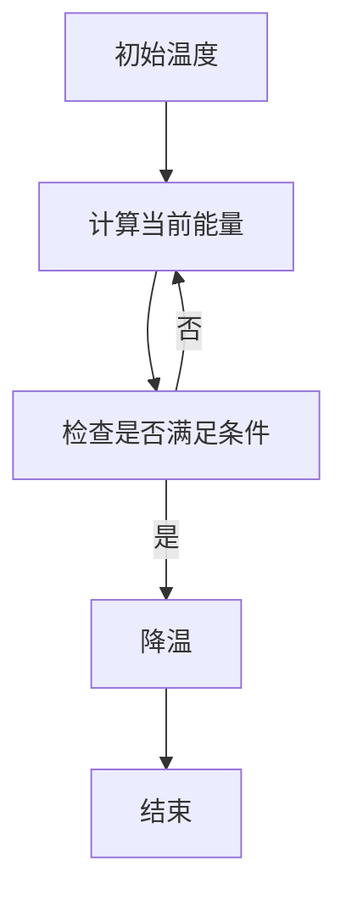
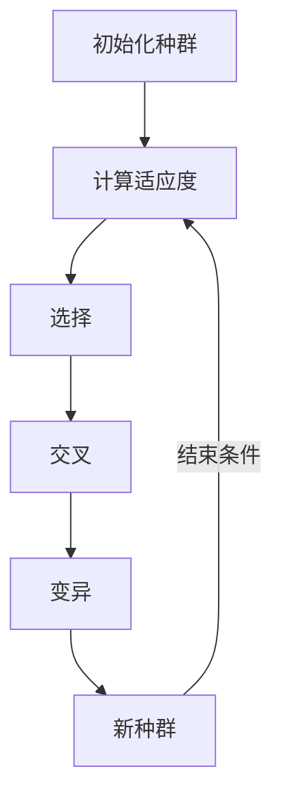
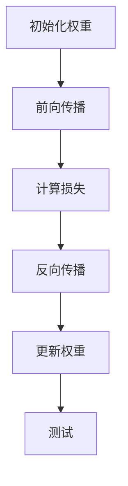
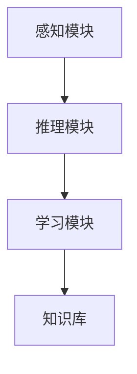
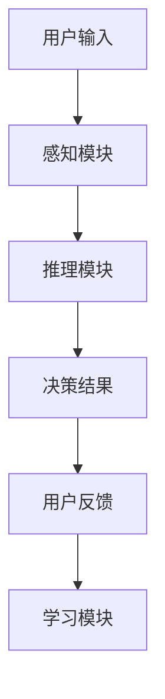

                 


# AI Agent的生物启发式认知架构实现

## 关键词：AI Agent、生物启发式认知架构、神经网络、深度学习、算法优化

## 摘要：  
本文深入探讨了AI Agent的生物启发式认知架构的设计与实现，从生物认知的启发来源到算法实现，再到系统架构设计，结合实际案例，详细分析了如何通过生物启发式方法构建高效、智能的AI Agent系统。

---

# 第一部分: AI Agent的生物启发式认知架构基础

## 第1章: AI Agent与生物启发式认知架构概述

### 1.1 AI Agent的基本概念

#### 1.1.1 AI Agent的定义与特点  
AI Agent（人工智能代理）是一种能够感知环境、自主决策并采取行动以实现目标的智能实体。其特点包括：  
- **自主性**：能够在没有外部干预的情况下运行。  
- **反应性**：能够根据环境变化实时调整行为。  
- **目标导向**：所有行动都以实现特定目标为导向。  
- **社会性**：能够与其他Agent或人类交互协作。  

#### 1.1.2 生物启发式认知架构的起源  
生物启发式认知架构的灵感来源于生物界的认知过程，尤其是人类和动物如何通过感知、学习和推理来适应环境。例如，人类大脑的神经网络结构和记忆存储机制为AI Agent的设计提供了重要启发。  

#### 1.1.3 与传统AI架构的主要区别  
与传统AI架构（如基于规则的专家系统）相比，生物启发式认知架构具有以下优势：  
- 更强的适应性：能够根据环境变化动态调整行为。  
- 更高的容错性：通过生物启发的冗余机制，提高了系统的鲁棒性。  
- 更自然的交互方式：能够像人类一样通过经验学习和自我优化。  

### 1.2 生物启发式认知架构的核心要素  

#### 1.2.1 生物认知的启发来源  
生物启发式认知架构的核心思想来源于以下几个方面：  
- **神经科学**：人类大脑的神经网络结构。  
- **认知科学**：人类如何通过感知、记忆和推理进行决策。  
- **行为科学**：动物如何通过试错学习适应环境。  

#### 1.2.2 架构的核心组成  
生物启发式认知架构通常包含以下几个核心模块：  
- **感知模块**：负责从环境中获取信息。  
- **记忆模块**：存储和管理知识。  
- **推理模块**：基于感知信息和知识进行决策。  
- **学习模块**：通过经验优化认知模型。  

#### 1.2.3 架构的边界与外延  
生物启发式认知架构的边界在于其“生物启发性”，即它并不完全模仿生物认知过程，而是借鉴其核心思想和技术。其外延则包括了基于神经网络、深度学习和生物启发式算法的各种AI技术。  

---

## 第2章: 生物启发式认知架构的算法原理

### 2.1 生物启发式算法基础  

#### 2.1.1 生物启发式算法的定义  
生物启发式算法是一类基于自然生物过程的优化算法，如模拟退火、遗传算法和蚁群算法等。  

#### 2.1.2 算法的核心思想  
生物启发式算法的核心思想是通过模拟生物进化、群体行为或物理过程，找到问题的最优解。例如：  
- **遗传算法**：通过模拟生物进化中的选择、交叉和变异过程，逐步优化解。  
- **蚁群算法**：通过模拟蚂蚁觅食过程，寻找路径的最短路径。  

#### 2.1.3 算法的主要特点  
- **全局优化**：能够找到全局最优解，而非局部最优解。  
- **鲁棒性**：对初始条件和问题规模的变化具有较强的适应性。  
- **并行性**：许多生物启发式算法具有天然的并行性，适合分布式计算。  

### 2.2 常见生物启发式算法介绍  

#### 2.2.1 模拟退火算法  
模拟退火算法是一种全局优化算法，灵感来源于金属的退火过程。  
- **数学模型**：  
  $$ f(x) = E(x) = \sum_{i=1}^{n} (x_i - a)^2 $$
- **算法流程图**（使用mermaid）：



#### 2.2.2 遗传算法  
遗传算法是一种基于生物进化思想的优化算法。  
- **流程图**：



### 2.3 神经网络与生物启发式认知  

#### 2.3.1 神经网络的基本原理  
神经网络是一种模拟人脑神经网络结构的计算模型，包含输入层、隐藏层和输出层。  
- **数学模型**：  
  $$ y = \sigma(wx + b) $$
  其中，$\sigma$ 是激活函数（如Sigmoid）。  

#### 2.3.2 深度学习与生物启发式认知  
深度学习通过多层神经网络模拟生物大脑的多层感知机制。  
- **案例分析**：  
  例如，在图像识别任务中，深度学习模型能够像人类一样通过多层特征提取逐步理解图像内容。  

#### 2.3.3 神经网络的生物启发式优化  
通过生物启发式算法（如遗传算法）优化神经网络的权重和结构。  
- **优化流程图**：



---

## 第3章: 生物启发式认知架构的系统设计

### 3.1 系统需求分析与功能设计  

#### 3.1.1 系统需求分析  
AI Agent系统需要满足以下需求：  
- **实时感知**：能够快速获取环境信息。  
- **自主决策**：能够在复杂环境中做出决策。  
- **自我优化**：能够通过经验优化自身性能。  

#### 3.1.2 系统功能设计  
系统功能模块包括：  
- **感知模块**：负责收集环境数据。  
- **推理模块**：基于感知数据进行决策。  
- **学习模块**：通过经验优化认知模型。  

### 3.2 系统架构设计  

#### 3.2.1 系统架构图  



#### 3.2.2 系统接口设计  
- **感知模块接口**：提供环境数据的输入接口。  
- **推理模块接口**：提供决策结果的输出接口。  
- **学习模块接口**：提供经验数据的存储接口。  

#### 3.2.3 系统交互流程图  



### 3.3 项目实战  

#### 3.3.1 环境搭建  
- **工具安装**：安装Python、TensorFlow和Keras。  
- **代码实现**：实现一个简单的AI Agent系统。  

#### 3.3.2 核心实现代码  

```python
import numpy as np

# 感知模块
def感知环境():
    # 返回环境数据
    return np.random.rand(10)

# 推理模块
def推理(data):
    # 简单的决策逻辑
    if data[0] > 0.5:
        return "行动"
    else:
        return "等待"

# 学习模块
def学习(error):
    # 简单的学习逻辑
    return error < 0.1

# 主函数
def main():
    while True:
        data = 感知环境()
        decision = 推理(data)
        print("决策结果:", decision)
        error = ...  # 根据反馈计算误差
        学习(error)

if __name__ == "__main__":
    main()
```

---

## 第4章: 扩展与总结  

### 4.1 最佳实践 tips  
- **模块化设计**：将系统划分为独立模块，便于维护和优化。  
- **数据预处理**：确保输入数据的质量，提高系统性能。  
- **持续学习**：定期更新模型，适应环境变化。  

### 4.2 小结  
通过生物启发式认知架构，我们可以构建更加智能和高效的AI Agent系统。本文从算法原理到系统设计，再到实际案例，全面介绍了生物启发式认知架构的实现方法。  

### 4.3 注意事项  
- 确保系统的安全性和隐私性。  
- 定期监控系统性能，及时优化。  

### 4.4 拓展阅读  
- 《深度学习》—— Ian Goodfellow  
- 《生物启发式算法》—— Xin-She Yang  

---

# 结语  
AI Agent的生物启发式认知架构是人工智能领域的重要研究方向，通过模拟生物认知过程，我们可以设计出更加智能和高效的AI系统。希望本文能够为读者提供有价值的参考和启发。  

作者：AI天才研究院 & 禅与计算机程序设计艺术

