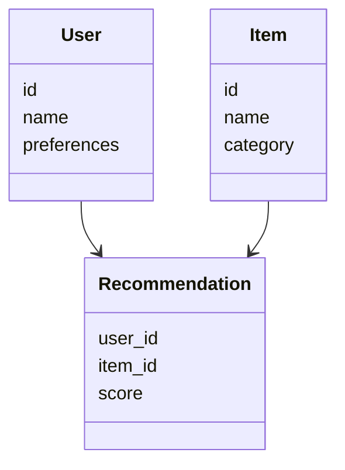

                 


# AI Agent的用户体验优化与个性化

> 关键词：AI Agent, 用户体验优化, 个性化服务, 人工智能, 强化学习, 推荐系统

> 摘要：本文深入探讨了AI Agent在用户体验优化与个性化服务中的应用，从背景、概念、算法到系统架构和项目实战，详细分析了如何利用AI Agent提升用户体验，并通过具体案例展示了其实际应用。

---

# 第1章: AI Agent的基本概念与背景

## 1.1 AI Agent的定义与特点

### 1.1.1 什么是AI Agent
AI Agent（人工智能代理）是一种能够感知环境、做出决策并执行任务的智能体。它可以理解为一个具备自主决策能力的程序或系统，旨在通过学习和适应来满足用户需求。

### 1.1.2 AI Agent的核心特点
- **自主性**：AI Agent能够在没有外部干预的情况下自主运行。
- **反应性**：能够实时感知环境变化并做出响应。
- **目标导向**：具有明确的目标，能够通过决策实现目标。
- **学习能力**：能够通过数据和经验不断优化自身的行为。

### 1.1.3 AI Agent与传统软件的区别
- **智能性**：AI Agent具备学习和推理能力，而传统软件通常是基于规则的。
- **适应性**：能够根据环境变化调整行为，传统软件则固定执行预设功能。
- **交互性**：能够与用户或环境进行动态交互，传统软件通常是单向执行。

## 1.2 AI Agent的发展背景

### 1.2.1 人工智能技术的演进
从早期的专家系统到现在的深度学习模型，人工智能技术的快速发展为AI Agent的实现提供了强大的技术基础。

### 1.2.2 大模型在AI Agent中的应用
大语言模型（如GPT）的引入，使得AI Agent具备了更强的理解和生成能力，能够更自然地与用户交互。

### 1.2.3 当前AI Agent的市场现状
随着AI技术的普及，AI Agent已经在多个领域得到应用，如智能助手、推荐系统、自动化运维等。

## 1.3 用户体验优化与个性化的必要性

### 1.3.1 用户体验优化的重要性
用户体验是产品成功的关键因素之一。通过优化用户体验，可以提高用户满意度和产品粘性。

### 1.3.2 个性化服务的市场需求
用户越来越注重个性化体验，通过AI Agent实现个性化服务是满足市场需求的重要手段。

### 1.3.3 AI Agent在用户体验优化中的角色
AI Agent能够通过数据分析和学习，为用户提供个性化的服务和优化的交互体验。

## 1.4 本章小结
本章介绍了AI Agent的基本概念、特点以及其在用户体验优化中的作用，为后续章节奠定了基础。

---

# 第2章: AI Agent的核心概念与工作原理

## 2.1 AI Agent的核心概念

### 2.1.1 感知层
感知层负责接收和处理来自环境的输入，包括数据采集、解析和预处理。

### 2.1.2 决策层
决策层基于感知层提供的信息，结合目标和约束条件，制定决策策略。

### 2.1.3 执行层
执行层负责根据决策层的指令，通过与环境交互或调用其他服务来完成任务。

## 2.2 AI Agent的工作原理

### 2.2.1 数据输入与处理
AI Agent通过传感器、API或用户输入等方式获取数据，并进行清洗和特征提取。

### 2.2.2 模型推理与决策
基于训练好的模型，AI Agent对输入数据进行推理，生成决策指令。

### 2.2.3 行为输出与反馈
AI Agent通过执行层输出行为，并根据环境反馈调整后续操作。

## 2.3 AI Agent的类型与应用场景

### 2.3.1 基于规则的AI Agent
通过预设规则进行决策，适用于任务简单、规则明确的场景。

### 2.3.2 基于模型的AI Agent
基于机器学习模型进行决策，适用于复杂场景。

### 2.3.3 基于强化学习的AI Agent
通过与环境交互学习，优化决策策略，适用于动态变化的复杂场景。

## 2.4 本章小结
本章详细介绍了AI Agent的核心概念和工作原理，并分析了不同类型AI Agent的应用场景。

---

# 第3章: 用户体验优化的核心要素

## 3.1 用户体验的核心要素

### 3.1.1 易用性
系统是否易于使用，用户是否能够快速上手。

### 3.1.2 一致性
系统在界面、交互和功能上是否保持一致，减少用户的学习成本。

### 3.1.3 反馈机制
系统在用户操作后是否给予及时的反馈，帮助用户了解操作结果。

## 3.2 个性化体验的关键因素

### 3.2.1 用户画像
通过收集用户数据，构建用户的画像，用于个性化推荐和服务。

### 3.2.2 行为分析
分析用户的操作行为，挖掘用户的偏好和习惯。

### 3.2.3 偏好预测
基于用户历史行为和数据，预测用户的偏好，提供个性化的服务。

## 3.3 AI Agent如何优化用户体验

### 3.3.1 通过数据驱动提升体验
利用AI Agent的数据分析能力，优化系统响应速度和准确性。

### 3.3.2 通过智能推荐实现个性化
基于用户画像和行为分析，提供个性化的推荐服务。

### 3.3.3 通过动态调整优化交互
根据用户反馈和环境变化，动态调整交互策略，提升用户体验。

## 3.4 本章小结
本章分析了用户体验优化的核心要素，并探讨了AI Agent在优化过程中的作用。

---

# 第4章: AI Agent的算法原理与数学模型

## 4.1 强化学习算法

### 4.1.1 强化学习的基本原理
强化学习是一种通过试错方式学习策略的算法，通过与环境交互获得奖励，优化决策策略。

### 4.1.2 Q-learning算法
Q-learning是一种经典的强化学习算法，通过更新Q值表来学习最优策略。

### 4.1.3 策略梯度算法
策略梯度算法通过优化策略的参数，直接优化策略的期望奖励。

## 4.2 推荐系统算法

### 4.2.1 协同过滤算法
基于用户相似性或物品相似性，推荐用户可能感兴趣的内容。

### 4.2.2 基于内容的推荐算法
基于物品本身的特征，推荐与用户兴趣相符的内容。

### 4.2.3 深度学习推荐算法
利用深度学习模型（如神经网络）进行推荐，能够捕捉更复杂的特征关系。

## 4.3 聚类算法

### 4.3.1 K-means算法
一种经典的无监督聚类算法，适用于将用户分成不同的群组。

### 4.3.2 层次聚类算法
通过构建层次结构进行聚类，适用于数据结构较为复杂的场景。

### 4.3.3 DBSCAN算法
基于密度的聚类算法，能够发现任意形状的簇。

## 4.4 算法实现与优化

### 4.4.1 算法选择与优化策略
根据具体场景选择合适的算法，并通过参数调优和优化方法提升性能。

### 4.4.2 算法实现的代码示例
以下是一个Q-learning算法的Python实现示例：

```python
class QLearning:
    def __init__(self, state_space, action_space, alpha=0.1, gamma=0.9):
        self.q_table = np.zeros((state_space, action_space))
        self.alpha = alpha
        self.gamma = gamma

    def choose_action(self, state):
        return np.argmax(self.q_table[state])

    def update_q(self, state, action, reward, next_state):
        self.q_table[state][action] = self.q_table[state][action] * (1 - self.alpha) + self.alpha * (reward + self.gamma * np.max(self.q_table[next_state]))
```

### 4.4.3 算法性能的评估
通过准确率、召回率、F1值等指标评估算法的性能，并根据评估结果进行优化。

---

# 第5章: AI Agent的系统分析与架构设计

## 5.1 问题场景介绍

### 5.1.1 电商推荐系统
以电商推荐系统为例，设计一个基于AI Agent的推荐系统。

## 5.2 系统功能设计

### 5.2.1 领域模型类图
以下是电商推荐系统的领域模型类图：



## 5.3 系统架构设计

### 5.3.1 系统架构图
以下是电商推荐系统的架构图：


## 5.4 系统接口设计

### 5.4.1 接口定义
- `/api/recommend/items?user_id=123`：获取推荐商品
- `/api/train-model`：训练推荐模型

## 5.5 系统交互流程图

```mermaid
sequenceDiagram
    user ->+> API Gateway: 请求推荐商品
    API Gateway ->+> 推荐服务: 获取推荐列表
    推荐服务 ->+> 数据存储: 查询用户数据
    推荐服务 ->+> 推荐算法: 执行推荐算法
    推荐算法 ->+> 模型训练: 更新模型
    推荐服务 -->+ API Gateway: 返回推荐列表
    API Gateway --> user: 返回推荐列表
```

---

# 第6章: 项目实战——基于AI Agent的电商推荐系统

## 6.1 环境安装

### 6.1.1 安装Python
```bash
python --version
pip install --upgrade pip
```

### 6.1.2 安装依赖
```bash
pip install numpy pandas scikit-learn
```

## 6.2 系统核心实现

### 6.2.1 数据预处理
```python
import pandas as pd

data = pd.read_csv('user_item.csv')
data.dropna(inplace=True)
```

### 6.2.2 训练推荐模型
```python
from sklearn.neighbors import NearestNeighbors

model = NearestNeighbors(n_neighbors=5)
model.fit(data)
```

### 6.2.3 推荐接口实现
```python
def recommend_items(user_id):
    # 获取用户数据
    user = data[data['user_id'] == user_id]
    # 获取推荐列表
    indices = model.kneighbors(user.values.reshape(1, -1), return_distance=False)
    return data.iloc[indices[0]]
```

## 6.3 实际案例分析

### 6.3.1 用户画像分析
通过分析用户的历史购买记录和浏览行为，构建用户画像。

### 6.3.2 推荐结果展示
展示推荐商品的列表，并根据用户反馈调整推荐策略。

## 6.4 项目总结

### 6.4.1 项目成果
成功实现了一个基于AI Agent的电商推荐系统，能够根据用户行为推荐个性化商品。

### 6.4.2 经验与教训
在实际开发中，需要考虑数据质量和模型的可解释性。

---

# 第7章: 最佳实践与注意事项

## 7.1 最佳实践

### 7.1.1 数据质量管理
确保数据的准确性和完整性，避免噪声数据影响模型性能。

### 7.1.2 模型可解释性
选择可解释性较强的算法，便于调试和优化。

### 7.1.3 系统安全性
确保系统具备良好的安全防护机制，防止数据泄露和攻击。

## 7.2 小结
通过本文的分析和实战，我们可以看到AI Agent在用户体验优化和个性化服务中的巨大潜力。

## 7.3 注意事项

### 7.3.1 数据隐私保护
在处理用户数据时，必须遵守相关法律法规，保护用户隐私。

### 7.3.2 系统性能优化
通过缓存、分片等技术优化系统性能，提升用户体验。

### 7.3.3 持续学习与优化
定期更新模型和优化算法，确保系统能够适应不断变化的用户需求。

## 7.4 拓展阅读
建议读者进一步学习强化学习和推荐系统相关知识，深入理解AI Agent的实现原理。

---

# 作者

作者：AI天才研究院/AI Genius Institute & 禅与计算机程序设计艺术/Zen And The Art of Computer Programming

