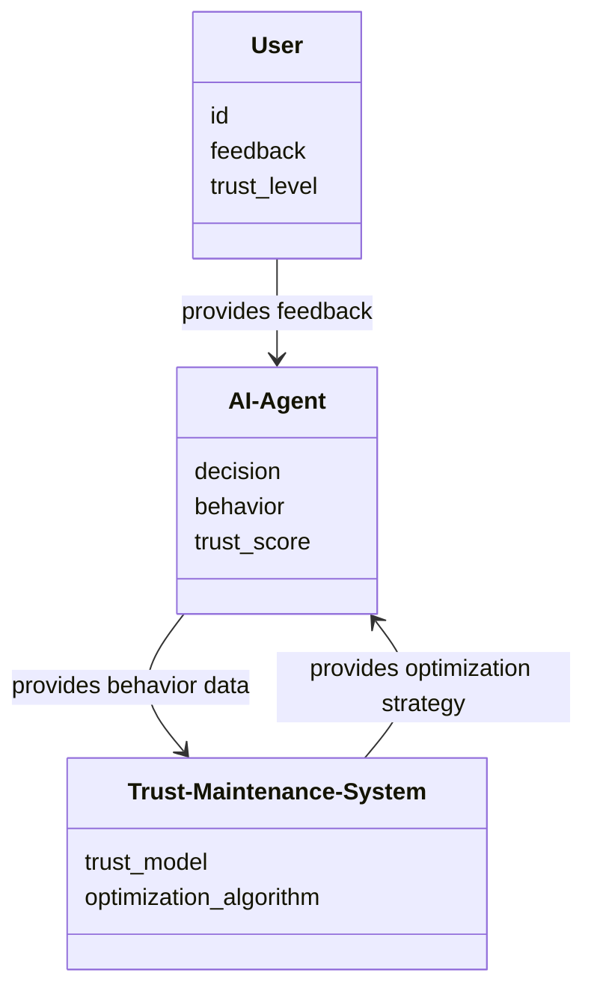
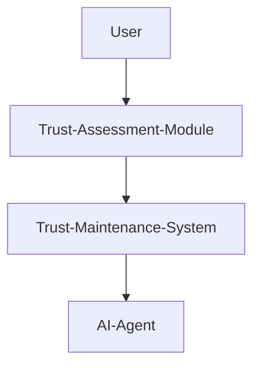
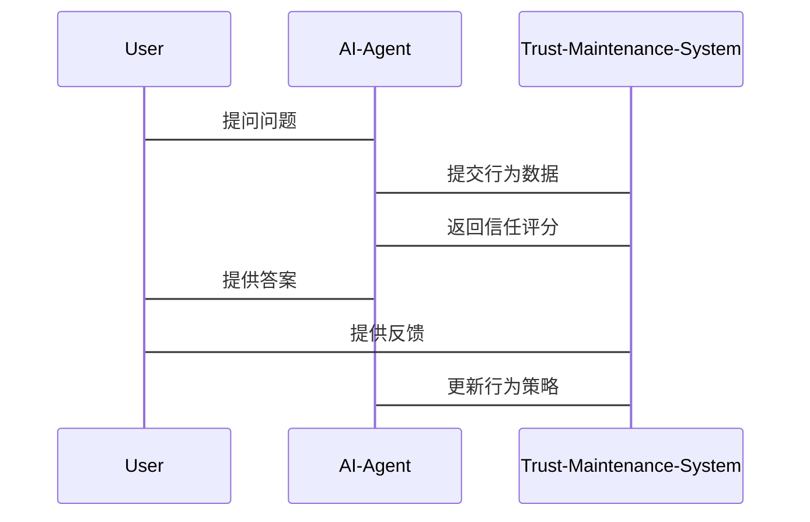

                 


# AI Agent的用户信任建立与维护机制

## 关键词
AI Agent, 用户信任, 信任机制, 信任评估, 信任维护

## 摘要
本文深入探讨了AI Agent用户信任建立与维护机制的核心原理、算法设计、系统架构及实际应用。通过分析信任的定义、维度和模型，结合概率论和贝叶斯网络等数学工具，提出了基于透明性和可解释性的信任评估方法。同时，本文通过实际案例展示了如何在智能客服系统中实现信任维护机制，并总结了最佳实践和未来研究方向。

---

# 第一部分: AI Agent的用户信任建立与维护机制概述

## 第1章: AI Agent与用户信任的基本概念

### 1.1 AI Agent的基本概念

#### 1.1.1 AI Agent的定义
AI Agent（人工智能代理）是指能够感知环境、自主决策并执行任务的智能实体。AI Agent可以是软件程序、机器人或其他智能系统，其核心目标是通过智能算法和数据处理，为用户提供高效、个性化的服务。

#### 1.1.2 AI Agent的核心特征
- **自主性**：AI Agent能够自主决策和行动，无需人工干预。
- **反应性**：能够实时感知环境并做出响应。
- **学习能力**：通过机器学习算法不断优化自身行为。
- **交互性**：能够与用户或其他系统进行有效沟通和协作。

#### 1.1.3 AI Agent的分类与应用场景
AI Agent可以根据功能和应用场景分为以下几类：
1. **简单反射型AI Agent**：基于规则的简单决策，如自动回复机器人。
2. **基于模型的AI Agent**：利用内部模型进行决策，如推荐系统。
3. **学习型AI Agent**：通过机器学习不断优化行为，如智能音箱。

应用场景包括智能客服、智能家居、自动驾驶、医疗辅助诊断等。

### 1.2 用户信任的基本概念

#### 1.2.1 信任的定义与维度
信任是指用户对AI Agent的行为、决策和能力的相信程度。信任可以从以下几个维度进行分类：
1. **认知信任**：基于理性分析的信任，如对系统功能的信任。
2. **情感信任**：基于情感和主观感受的信任，如对AI Agent的亲切感。
3. **技术信任**：基于技术可靠性和透明性的信任。

#### 1.2.2 用户信任在人机交互中的重要性
在人机交互中，信任是用户与AI Agent之间有效协作的基础。缺乏信任会导致用户对AI Agent的不信任，进而影响用户体验和系统的实用性。

#### 1.2.3 AI Agent信任的特殊性
AI Agent的信任具有以下特殊性：
- **技术复杂性**：AI Agent的行为依赖于复杂的算法和数据，用户难以完全理解其决策过程。
- **动态变化性**：随着AI Agent的学习和进化，其行为可能会发生变化，导致信任关系的动态调整。

## 第2章: AI Agent信任建立的背景与挑战

### 2.1 信任建立的背景

#### 2.1.1 数字化时代的人机交互趋势
随着AI技术的快速发展，人机交互逐渐成为人们日常生活的重要组成部分。AI Agent在各个领域的广泛应用，使得用户对AI Agent的信任需求日益增长。

#### 2.1.2 用户对AI Agent信任的需求
用户在使用AI Agent时，不仅需要系统功能的实现，更需要对系统行为的信任。信任是用户与AI Agent建立长期关系的关键因素。

#### 2.1.3 AI Agent在不同领域的应用案例
1. **智能客服**：通过自然语言处理技术为用户提供问题解答。
2. **智能家居**：通过语音控制实现家电的智能化管理。
3. **医疗辅助诊断**：通过AI算法辅助医生进行疾病诊断。

### 2.2 信任建立的主要挑战

#### 2.2.1 技术层面的不确定性
AI Agent的决策过程往往依赖于复杂的算法和数据，用户难以理解其背后的逻辑，这可能导致信任缺失。

#### 2.2.2 用户对AI Agent的可控性担忧
用户担心AI Agent的行为不受控制，可能引发隐私泄露或其他负面影响。

#### 2.2.3 信任的动态变化
AI Agent的行为会随着数据和环境的变化而变化，这可能导致用户信任的动态调整。

---

# 第二部分: AI Agent信任建立的核心机制

## 第3章: 信任评估的算法原理

### 3.1 信任评估的核心算法

#### 3.1.1 基于概率的信任评估
使用概率论和贝叶斯网络进行信任评估，通过计算AI Agent行为的概率分布，评估其可靠性。

$$ P(A|B) = \frac{P(B|A)P(A)}{P(B)} $$

#### 3.1.2 基于规则的信任评估
通过预定义的规则和阈值，对AI Agent的行为进行分类和评估。

### 3.2 信任评估的数学模型

#### 3.2.1 贝叶斯信任模型
构建贝叶斯网络，通过不断更新先验概率和后验概率，评估AI Agent的信任度。

#### 3.2.2 马尔可夫信任模型
利用马尔可夫链模型，分析AI Agent行为的动态变化，预测其未来行为的信任度。

$$ P(t_{n+1}|t_n) = \theta t_n + (1-\theta) t_{n-1} $$

## 第4章: 信任维护的系统架构

### 4.1 系统功能设计

#### 4.1.1 信任数据采集
通过用户反馈、行为日志和系统性能数据，采集信任相关信息。

#### 4.1.2 信任评估与维护
基于采集的数据，实时评估AI Agent的信任度，并动态调整其行为。

#### 4.1.3 信任反馈与优化
根据信任评估结果，优化AI Agent的行为策略，提升用户信任。

### 4.2 系统架构设计

#### 4.2.1 领域模型


#### 4.2.2 系统架构


---

# 第三部分: 项目实战与案例分析

## 第5章: 项目实战: 智能客服系统的信任维护机制

### 5.1 项目背景与需求分析

#### 5.1.1 项目背景
智能客服系统通过自然语言处理技术为用户提供问题解答服务，用户信任是系统成功的关键。

#### 5.1.2 项目需求
- 实现实时信任评估。
- 动态调整客服策略。
- 提供信任反馈机制。

### 5.2 核心代码实现

#### 5.2.1 环境安装
安装必要的库和工具：
```bash
pip install numpy
pip install scikit-learn
pip install matplotlib
```

#### 5.2.2 信任评估算法实现
```python
import numpy as np
from sklearn.naive_bayes import GaussianNB

# 示例数据
X = np.array([[1, 2], [3, 4], [5, 6]])
y = np.array([0, 1, 0])

# 训练模型
model = GaussianNB()
model.fit(X, y)

# 预测信任度
def assess_trustworthiness(agent_behavior):
    predicted = model.predict([agent_behavior])
    return predicted[0]
```

#### 5.2.3 系统交互流程图


### 5.3 案例分析与解读

#### 5.3.1 案例分析
通过实际案例分析，展示如何利用信任评估算法优化智能客服系统的行为。

#### 5.3.2 系统优化
根据用户反馈和行为数据，动态调整AI Agent的行为策略，提升用户信任。

---

# 第四部分: 最佳实践与未来展望

## 第6章: 最佳实践与小结

### 6.1 最佳实践
1. **透明性**：提供清晰的解释和反馈，增强用户对AI Agent的信任。
2. **可解释性**：设计易于理解的算法和决策过程，减少用户的不确定性。
3. **一致性**：保持AI Agent行为的稳定性和一致性，避免用户的不信任感。
4. **隐私保护**：确保用户数据的安全性，避免隐私泄露。
5. **及时反馈**：提供实时反馈和调整，增强用户的信任感。

### 6.2 小结
本文详细探讨了AI Agent用户信任建立与维护机制的核心原理、算法设计、系统架构及实际应用。通过理论分析和实际案例，提出了基于透明性和可解释性的信任评估方法，并总结了最佳实践和未来研究方向。

## 第7章: 注意事项与拓展阅读

### 7.1 注意事项
1. **数据隐私**：在设计信任维护系统时，必须重视用户数据的隐私保护。
2. **算法偏见**：避免算法偏见对用户信任的负面影响。
3. **用户体验**：在技术实现的同时，关注用户体验，确保系统的易用性和友好性。

### 7.2 拓展阅读
- 《Building Trust in Autonomous Systems》
- 《Probabilistic Graphical Models: Principles and Techniques》
- 《Trust in Autonomous Systems: A Survey》

---

# 作者

作者：AI天才研究院/AI Genius Institute & 禅与计算机程序设计艺术 /Zen And The Art of Computer Programming

---

以上是《AI Agent的用户信任建立与维护机制》的技术博客文章的完整目录和内容框架，涵盖了从理论到实践的各个方面，旨在为读者提供全面而深入的指导。

