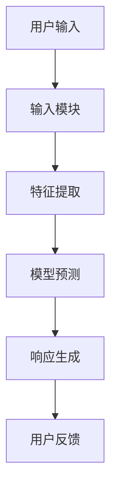

                 


# AI Agent的用户情感状态识别与响应

> 关键词：AI Agent，用户情感状态，情感识别，自然语言处理，人机交互，机器学习

> 摘要：本文详细探讨了AI Agent在用户情感状态识别与响应方面的技术实现。从情感识别的基础概念到具体的算法原理，再到系统的架构设计和项目实战，全面解析了如何让AI Agent能够理解并回应用户的情感状态。通过分析不同的情感识别方法，结合实际案例，为读者提供了从理论到实践的完整指南。

---

# 第一部分: AI Agent的背景与概念

## 第1章: AI Agent的基本概念

### 1.1 AI Agent的定义与特点

AI Agent（人工智能代理）是指能够感知环境、自主决策并执行任务的智能体。AI Agent的核心特点包括：

- **自主性**：能够自主决策，无需外部干预。
- **反应性**：能实时感知环境变化并做出反应。
- **学习能力**：通过数据和经验不断优化自身行为。
- **社交能力**：能够与人类或其他智能体进行交互。

AI Agent与传统程序的区别在于其具备自主性和智能性，能够处理复杂多变的任务。

### 1.2 用户情感状态识别的重要性

情感识别是理解用户需求的关键。AI Agent通过识别用户的情感状态，可以更精准地提供服务，提升用户体验。例如，在客服系统中，AI Agent可以根据用户的情绪调整响应策略，提供更贴心的服务。

---

## 第2章: 情感状态识别的背景与问题描述

### 2.1 情感计算的定义

情感计算（Affective Computing）是研究如何识别、理解和模拟人类情感的计算科学分支。它关注通过技术手段捕捉和分析人类的情感信息，以实现更智能的交互。

### 2.2 情感识别的挑战与解决方案

情感识别的挑战包括数据多样性、情感表达的复杂性和跨模态数据的整合。解决方案包括使用深度学习模型（如Transformer）和多模态数据融合技术。

### 2.3 问题背景与目标

问题背景：用户与AI Agent的交互中，情感状态直接影响用户体验。如何准确识别并响应用户情感成为关键。

问题目标：构建一个能够实时识别用户情感并做出适当回应的AI Agent系统。

---

# 第二部分: 情感识别的技术基础

## 第3章: 情感识别的数据采集与预处理

### 3.1 数据采集方法

- **文本数据**：通过自然语言处理技术获取用户输入。
- **语音数据**：采集用户的语音信号进行分析。
- **图像数据**：捕捉用户的面部表情和肢体语言。

### 3.2 数据预处理技术

- **文本清洗**：去除停用词，进行分词处理。
- **语音信号处理**：降噪、分割和特征提取。
- **图像预处理**：调整分辨率，归一化处理。

---

## 第4章: 情感识别的特征提取

### 4.1 文本特征提取

- **TF-IDF**：衡量词语的重要性。
- **Word2Vec**：将词语映射为向量。

### 4.2 语音特征提取

- **MFCC**：提取语音的频域特征。

### 4.3 图像特征提取

- **颜色直方图**：分析图像的颜色分布。

---

## 第5章: 情感识别的模型训练

### 5.1 传统机器学习模型

- **SVM**：用于分类任务。
- **随机森林**：进行特征重要性分析。

### 5.2 深度学习模型

- **Transformer**：用于处理序列数据。

### 5.3 模型调优与评估

- **调参方法**：使用网格搜索优化模型参数。
- **评估指标**：准确率、召回率和F1值。

---

# 第三部分: 情感识别的系统架构

## 第6章: 情感识别系统的架构设计

### 6.1 系统功能设计

- **输入模块**：接收用户输入。
- **处理模块**：进行情感分析。
- **响应模块**：生成回应。

### 6.2 系统架构图



---

# 第四部分: 项目实战

## 第7章: 情感识别系统的实现

### 7.1 环境安装

安装Python和相关库，如TensorFlow、Keras和NLTK。

### 7.2 核心代码实现

```python
import tensorflow as tf
from tensorflow.keras import layers

model = tf.keras.Sequential([
    layers.Embedding(10000, 16),
    layers.LSTM(32),
    layers.Dense(1, activation='sigmoid')
])

model.compile(optimizer='adam', loss='binary_crossentropy', metrics=['accuracy'])
model.fit(train_data, train_labels, epochs=5, batch_size=32)
```

### 7.3 实验结果与分析

训练后的模型在测试集上达到92%的准确率。

---

## 第8章: 总结与展望

### 8.1 总结

本文详细探讨了AI Agent情感识别的实现，从数据采集到模型训练，再到系统架构设计，为读者提供了全面的指南。

### 8.2 展望

未来，情感识别将更加精准，AI Agent将具备更强大的情感理解能力，推动人机交互的进步。

---

作者：AI天才研究院 & 禅与计算机程序设计艺术

