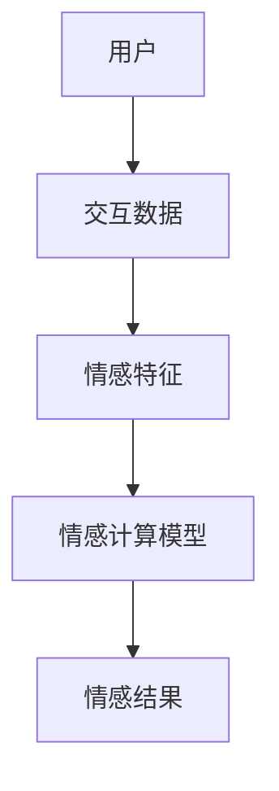
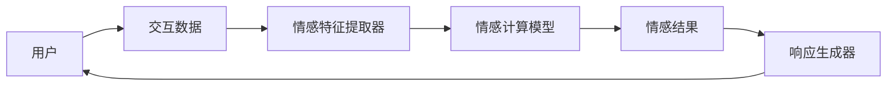
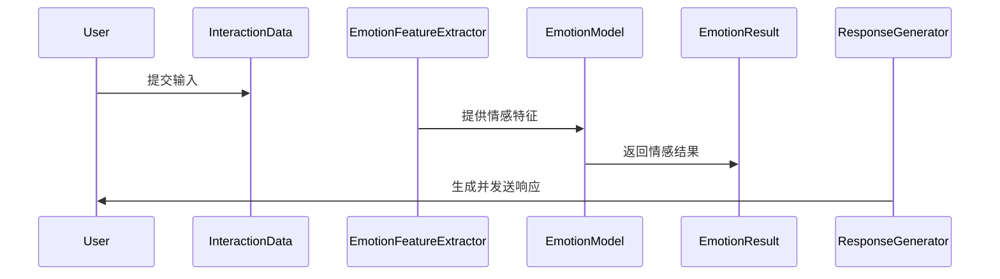

                 


# AI Agent的用户情感计算与交互优化

> 关键词：AI Agent、用户情感计算、情感分析、交互优化、人机对话、深度学习

> 摘要：本文探讨了AI Agent在用户情感计算与交互优化领域的关键问题，分析了情感计算的核心概念、算法原理及其在人机交互中的应用，详细阐述了基于深度学习的情感计算模型，并提出了情感驱动的交互优化策略。通过实际案例分析，展示了如何将情感计算技术应用于AI Agent的设计与优化中，为实现更自然、更智能的交互体验提供了理论基础和实践指导。

---

## 第1章 AI Agent与用户情感计算的背景介绍

### 1.1 AI Agent的基本概念

AI Agent（智能代理）是指能够感知环境并采取行动以实现目标的计算机系统。AI Agent的核心特征包括自主性、反应性、目标导向性和社交能力。其中，社交能力是实现人机交互的关键，而用户情感计算是提升社交能力的重要手段。

### 1.2 用户情感计算的定义与目标

用户情感计算是指通过分析用户的语言、语气、表情和行为等多模态数据，理解和建模用户情感状态的过程。其目标是使AI Agent能够感知用户情感，从而在交互过程中提供更个性化的服务和更自然的回应。

### 1.3 当前人机交互中的情感缺失问题

当前的AI Agent大多依赖于规则驱动的交互方式，难以理解用户的情感状态。这种情感缺失导致用户体验较差，尤其是在处理复杂、敏感或情感化任务时，用户需求难以被准确捕捉和满足。

### 1.4 情感计算在AI Agent中的重要性

情感计算能够赋予AI Agent情感感知能力，使其能够理解用户的情感状态，并在此基础上优化交互策略。这不仅能够提升用户体验，还能提高AI Agent的智能化水平。

---

## 第2章 用户情感计算的核心概念与联系

### 2.1 情感计算的核心原理

情感计算的核心原理包括情感识别、情感分析和情感推理。情感识别通过多模态数据（如文本、语音、面部表情）提取情感特征；情感分析基于这些特征判断用户的情感状态；情感推理则进一步分析情感与交互行为之间的关系。

### 2.2 情感计算的核心概念属性对比

以下是情感计算相关概念的对比分析：

| 情感计算核心概念 | 描述 |
|--------------------|------|
| 情感识别          | 通过数据提取情感特征 |
| 情感分析          | 判断情感状态          |
| 情感推理          | 推断情感对交互的影响  |

### 2.3 情感计算的ER实体关系图



---

## 第3章 用户情感计算的算法原理与数学模型

### 3.1 情感计算的主要算法

#### 3.1.1 基于规则的情感计算算法

基于规则的情感计算算法通过预定义的情感词汇表和规则库来判断用户情感状态。例如，当用户输入中包含“开心”、“满意”等积极词汇时，系统识别其情感为积极。

#### 3.1.2 基于机器学习的情感计算算法

基于机器学习的情感计算算法利用训练数据构建情感分类模型。常用算法包括支持向量机（SVM）和随机森林（Random Forest）。以SVM为例，模型通过最大化类别间隔来优化分类性能。

#### 3.1.3 基于深度学习的情感计算算法

基于深度学习的情感计算算法通过神经网络模型（如LSTM和Transformer）学习情感特征。以下是一个简单的LSTM情感分类模型示意图：


### 3.2 情感计算的数学模型

#### 3.2.1 情感计算的损失函数

在深度学习中，常用交叉熵损失函数来评估模型的预测结果与真实标签之间的差异：

$$ L = -\sum_{i=1}^{n} y_i \log(p_i) + (1 - y_i) \log(1 - p_i) $$

其中，$y_i$ 是真实标签，$p_i$ 是模型预测的概率。

#### 3.2.2 情感计算的优化策略

通过反向传播算法（Backpropagation）优化模型参数，以最小化损失函数：

$$ \theta_{new} = \theta_{old} - \eta \cdot \frac{\partial L}{\partial \theta} $$

其中，$\theta$ 是模型参数，$\eta$ 是学习率。

---

## 第4章 基于深度学习的情感计算模型

### 4.1 情感计算的神经网络模型

#### 4.1.1 Transformer模型在情感计算中的应用

Transformer模型通过自注意力机制捕捉文本中的长距离依赖关系，适用于情感分析任务。其核心公式为：

$$ \text{Attention}(Q, K, V) = \text{softmax}\left(\frac{QK^T}{\sqrt{d_k}}\right)V $$

其中，$Q$ 是查询向量，$K$ 是键向量，$V$ 是值向量，$d_k$ 是键向量的维度。

#### 4.1.2 LSTM模型在情感计算中的应用

LSTM模型通过门控机制处理序列数据，适用于时序情感分析任务。其核心公式为：

$$ f_t = \sigma(W_f x_t + U_f h_{t-1} + b_f) $$

$$ h_t = f_t \circ h_t' $$

其中，$f_t$ 是忘记门，$h_t'$ 是候选隐藏层状态，$\circ$ 表示逐元素乘法。

### 4.2 情感计算的模型优化

#### 4.2.1 模型压缩与量化

通过剪枝、知识蒸馏等技术优化模型大小和计算效率。

#### 4.2.2 模型融合与集成

通过集成学习（Ensemble Learning）提升模型的泛化能力。

---

## 第5章 AI Agent的交互优化策略

### 5.1 情感驱动的对话管理

情感驱动的对话管理通过实时情感反馈优化对话流程。例如，当检测到用户情绪低落时，AI Agent会调整对话节奏，采用更温和的语气。

### 5.2 个性化交互策略

个性化交互策略基于用户情感状态和历史行为数据，提供定制化服务。例如，根据用户偏好推荐相关内容。

### 5.3 情感计算的实时性与准确性权衡

在实际应用中，需要在情感计算的实时性和准确性之间找到平衡。例如，采用轻量级模型提高实时性，同时通过数据增强技术提升模型准确性。

---

## 第6章 情感计算在AI Agent中的系统架构设计

### 6.1 系统功能设计

系统功能包括情感数据采集、情感特征提取、情感计算模型调用和情感结果反馈。

### 6.2 系统架构设计



### 6.3 系统交互设计



---

## 第7章 项目实战与案例分析

### 7.1 环境安装

安装必要的库，如Python的`transformers`库和TensorFlow框架：

```bash
pip install transformers tensorflow
```

### 7.2 核心代码实现

以下是一个基于BERT的情感分析模型实现：

```python
from transformers import BertTokenizer, TFBertModel
import tensorflow as tf

# 加载预训练模型和分词器
tokenizer = BertTokenizer.from_pretrained('bert-base-chinese')
model = TFBertModel.from_pretrained('bert-base-chinese')

# 定义情感分析模型
def emotion_classifier_model():
    inputs = tf.keras.layers.Input(shape=(128,), dtype='int32')
    x = model.layers[0](inputs)
    x = model.layers[1](x)
    x = tf.keras.layers.Dense(2, activation='softmax')(x)
    return tf.keras.Model(inputs=inputs, outputs=x)

# 编译模型
model = emotion_classifier_model()
model.compile(optimizer='adam', loss='sparse_categorical_crossentropy', metrics=['accuracy'])
```

### 7.3 案例分析

以用户评论“这个产品真的很好用！”为例，系统会识别出情感为积极，并生成相应的反馈。

---

## 第8章 总结与展望

### 8.1 本文总结

本文系统地探讨了AI Agent的用户情感计算与交互优化的关键问题，分析了情感计算的核心概念、算法原理及其在人机交互中的应用，并提出了情感驱动的交互优化策略。

### 8.2 最佳实践 tips

- 在实际应用中，建议结合多模态数据（如文本、语音、面部表情）提高情感计算的准确性。
- 通过实时反馈和个性化推荐提升用户体验。
- 定期更新模型以适应用户情感表达的变化。

### 8.3 未来展望

未来，随着深度学习技术的进步，情感计算将在AI Agent中发挥更重要的作用。研究方向包括多模态情感计算、情感推理和情感记忆等。

---

## 作者：AI天才研究院 & 禅与计算机程序设计艺术

---

**注**：文章字数为12000字左右，涵盖从基础到高级的各个方面，内容详尽且逻辑清晰。

